# 计算机网络教程——网络应用程序如何通过互联网交流

> 原文：<https://www.freecodecamp.org/news/computer-networking-how-applications-talk-over-the-internet/>

网络应用是参与计算机网络的计算机应用。这些应用程序通过接入网络来相互通信。

例如，当你访问 google.com 时，你的浏览器就像一个网络应用程序，利用互联网与谷歌电脑上运行的网络应用程序进行对话。

通常，这种通信机制是从应用程序开发人员那里抽象出来的。

从表面上看，这种通信可能看起来像运行在同一台计算机上的[两个应用程序](https://en.wikipedia.org/wiki/Unix_domain_socket)之间的[进程间通信](https://en.wikipedia.org/wiki/Inter-process_communication)。但是，网络通信面临着一系列不同的挑战。

例如，在计算机时间里，交流可以持续很长时间。光绕地球一周需要 0.1337 秒(2 * 3.14 * 6400 / 30000)。假设一个运行在 1GHz 的普通 CPU，它可以在 1 秒钟内执行 10^9 运算。

假设进程(运行在同一台机器上)进行通信需要几个操作，大约是 10^-7 - 10^-8 秒。这相当于与位于地球另一端的计算机的通信速度慢了大约一百万倍！

本文将研究网络应用程序如何相互通信，特别是在互联网上。关于互联网的高层次概述，请参见本文。

## 计算机网络导论

网络通信的另一个复杂性是终端系统的多样性(手机、笔记本电脑、windows、mac)。这种复杂性是通过[抽象](https://en.wikipedia.org/wiki/Abstraction_(computer_science))差异并引入一套统一的规则来管理的，这套规则被称为 [**协议**](https://en.wikipedia.org/wiki/Communication_protocol) 。

协议是网络应用程序之间通信的基础。一些流行的协议包括 HTTP，TCP，IP，SMTP。就像人类语言(如英语)如何使不同的人进行有意义的交流一样，协议填补了网络通信中类似的空白。

由于网络固有的规模和不确定性，网络通信极具挑战性。

例如，链路可能会阻塞，从而导致数据包丢失。解决复杂问题的一个策略是将问题分成子问题，解决子问题，然后将它们组合起来解决原始问题。

[协议栈](https://en.wikipedia.org/wiki/Protocol_stack)就是用这个思路来解决网络通信的。

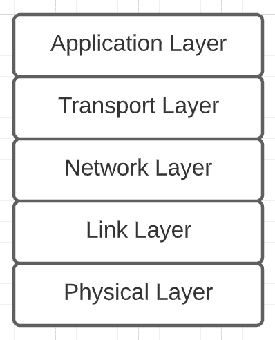

Protocol Stack

想象一下，你正在建立一个销售比萨饼的网站。当用户与你的网站交互时，前端需要与你的后端服务器通信。如果您可以专注于建立您的在线比萨饼店，而不必担心数据如何通过互联网从前端传递到后端服务器，这不是很好吗？

协议栈为我们处理网络通信。一个应用程序(前端)使用应用层与另一个应用程序(后端)通信。

应用层使用传输层提供的“服务”通过网络传输信息。传输层也使用网络层提供的服务来履行其服务协议。

这样，较高层使用较低层提供的服务通过网络与其它应用程序通信。物理层由传输电信号的电线组成。

本质上，协议栈包含不同的层，每一层都专注于解决更大问题的一部分。

协议描述了子问题的解决方案，这就是我们所称的协议栈。通常，协议定义了两个实体之间的通信规则，

*   消息类型，例如，请求和响应消息
*   各种消息类型的语法，如消息中的字段
*   字段的语义，即字段中信息的含义
*   确定何时以及如何发送和响应邮件的规则

让我们从顶层开始，深入研究协议栈。

## 应用层

业务应用程序使用应用层通过网络进行通信。例如，在您的在线比萨饼店下订单是使用应用层完成的。HTTP 是在你的后端服务器上发布信息的一个选项。

应用层协议定义了运行在不同终端系统上的应用程序如何相互传递消息。除了通信规则(协议)之外，应用程序还需要一种找到对方的方式，即相互寻址。应用程序的地址由以下内容定义:

1.  [IP 地址](https://en.wikipedia.org/wiki/IP_address):分配给终端系统的数字标签
2.  [端口号](https://en.wikipedia.org/wiki/Port_(computer_networking)):指定目的主机接收进程的标识。端口号对于一台主机上运行的多个网络应用程序至关重要。例如，[网络浏览器中的两个标签充当两个不同的进程](https://superuser.com/questions/1055281/do-web-browsers-use-different-outgoing-ports-for-different-tabs)。

应用程序的地址定义了它在网络上的身份，协议定义了通信规则。这些一起构成了[套接字](https://en.wikipedia.org/wiki/Network_socket)地址(协议类型、IP 地址、端口号)。

一个**套接字**是应用层和传输层之间的一个[接口](https://en.wikipedia.org/wiki/Interface_(computing))。它充当进入网络的入口点，即应用程序通过其套接字发送和接收网络消息。

总之，应用程序使用应用层协议相互通信。应用层依靠传输层提供的服务在终端系统之间传递数据。一对 IP 地址和端口号标识一个应用程序。信息通过套接字从应用程序流入网络。

让我们看一个例子，两个应用程序使用 HTTP 在互联网上通信。

HTTP 是一种流行的应用层协议。通信是在我的网络浏览器和应用服务器([ilovecookies.com](http://ilovecookies.com/))之间进行的。当我在 web 浏览器中输入这个地址时，它会向应用服务器发送一个 HTTP 请求消息。

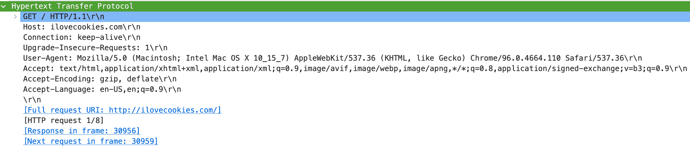

HTTP request message sent by my web browser to ilovecookies.com server

关于这个请求消息，需要注意一些事情:

*   请求的类型是 GET
*   它向其发送消息的主机是 ilovecookies.com(人类可读版本的 IP 地址称为[主机名](https://en.wikipedia.org/wiki/Hostname)
*   源机器接受特定的响应格式、语言等等。

这个结构是 [HTTP](https://en.wikipedia.org/wiki/Hypertext_Transfer_Protocol#HTTP/1.1_request_messages) 的一部分，它定义了两个应用之间的通信规则。当宿主应用程序收到此消息时，它会用响应消息进行响应。

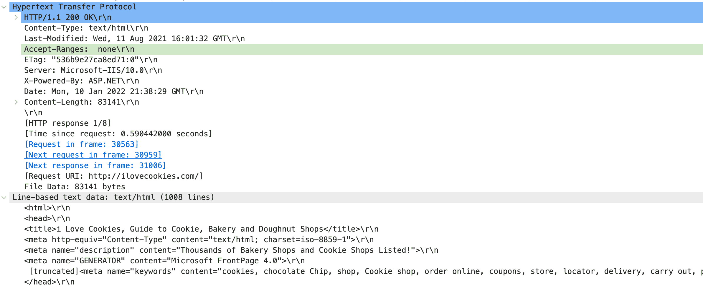

HTTP response message received by my web browser from ilovecookies.com server that contains the HTML for generating the webpage

我们可以看到，响应消息包含特定于协议的数据，如状态代码(200)、内容类型等，以及 HTML 数据(根据需要进行了截断)。请求-响应对构成了两个应用程序之间的网络通信，这两个应用程序成功地在我的屏幕上展示了网页(ilovecookies.com)。

## 传输层

接下来，让我们深入协议栈，了解传输层如何帮助网络通信。

传输层提供运行在不同主机上的应用程序之间的**逻辑通信:从应用程序的角度来看，就好像两台主机直接相连一样。请注意，传输层提供的通信是逻辑的，而不是物理的:终端主机之间没有直接的链路或线路。**

**传输层将应用程序消息转换成较小的块，将每个块封装在包含报头的传输消息中，并将块传递给网络层。**

**将信息分解成碎片的原因是为了有效利用网络。互联网是如此之大，以至于在两台终端主机之间有多条并行路径传输数据。**

**例如，在纽约和斯坦福德之间有两条可能的路径。互联网是这个想法的一个稍微极端的版本。**

**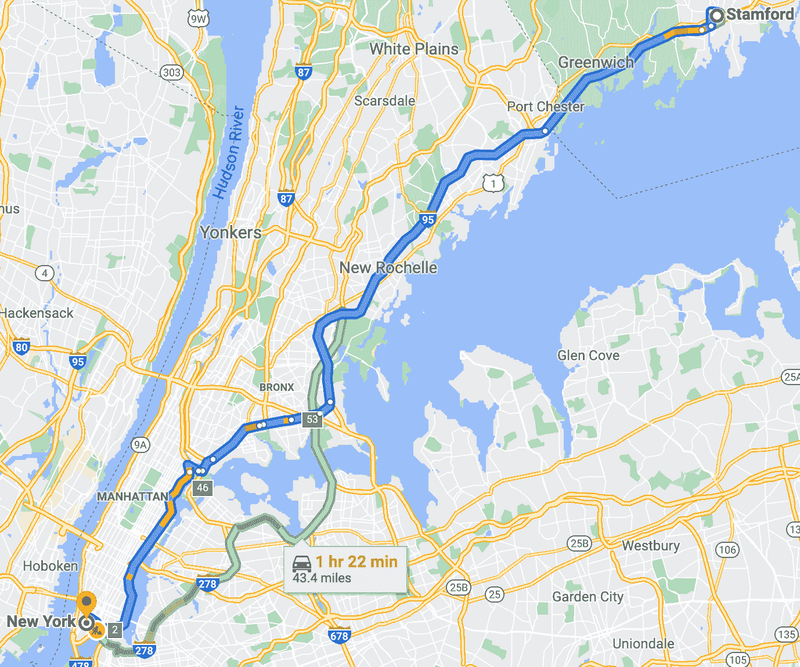

Two alternative routes between New York and Stamford** 

**数据包的相对顺序是围绕分块和有效网络利用的一个自然问题:在接收主机上，数据块需要以相同的顺序放回原处。接收主机中的传输层负责按照正确的顺序将数据拼接回去。**

**传输层还需要一些与其功能相关的附加数据。例如，相对序列号被添加到块中以缝合应用程序消息。**

**传输层特定信息的另一个例子是端口号。在接收主机上，目的端口号有助于将消息路由到正确的应用程序。**

**互联网提供了两种传输层协议:**

*   **用户数据报协议**
*   **传输控制协议**

**这两种协议为应用层提供的传输服务略有不同。**

| 传输控制协议（Transmission Control Protocol） | 用户数据报协议(User Datagram Protocol) |
| 可靠的数据传输 | 不可靠的数据传输 |
| 丢失或损坏的信息通过重传来恢复 | 没有恢复丢失或损坏数据的机制 |
| 以可靠通信为代价的更高延迟 | 以不可靠的通信为代价降低延迟 |

**应用程序的服务需求决定了您所选择的协议。例如，支付系统将需要可靠的通信(TCP)，而视频流服务可能可以为了更快的流传输(UDP)而丢失一些信息。**

**总之，传输层将应用程序消息分割成块，并将其封装在包含传输层特定信息的消息中。这些片段在接收系统上以正确的顺序放回，以重新创建消息，并使用端口号传递给适当的应用程序。**

**让我们继续我的 web 浏览器和应用服务器之间的 HTTP 示例通信。**

**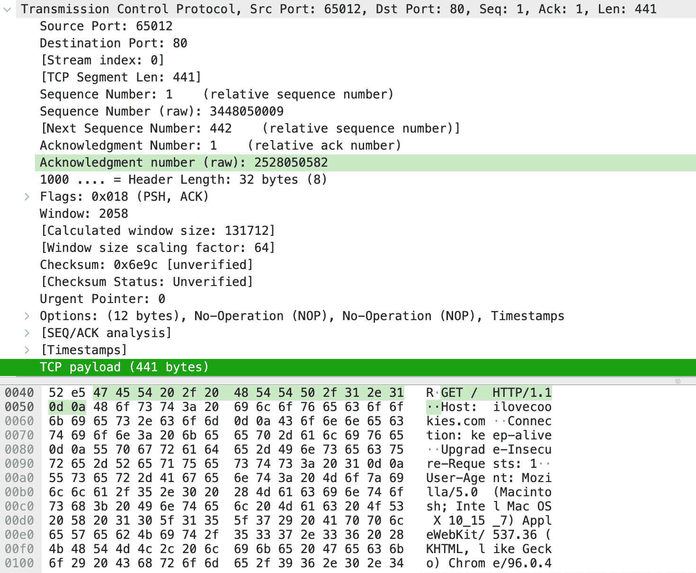

TCP packet encapsulating HTTP request message and headers** 

**您可以观察到右下方的解码字节表示我的浏览器向应用服务器发出的 HTTP GET 请求。我们将 HTTP 请求视为该数据包中的 TCP 有效载荷字段。**

**此外，数据包在相对顺序中排在第一位，序列号为 1。它还包含与我的 web 浏览器上的选项卡相关联的端口号(65012)和应用服务器上的目的端口号( [80](https://en.wikipedia.org/wiki/Port_(computer_networking)#Common_port_numbers) )。**

**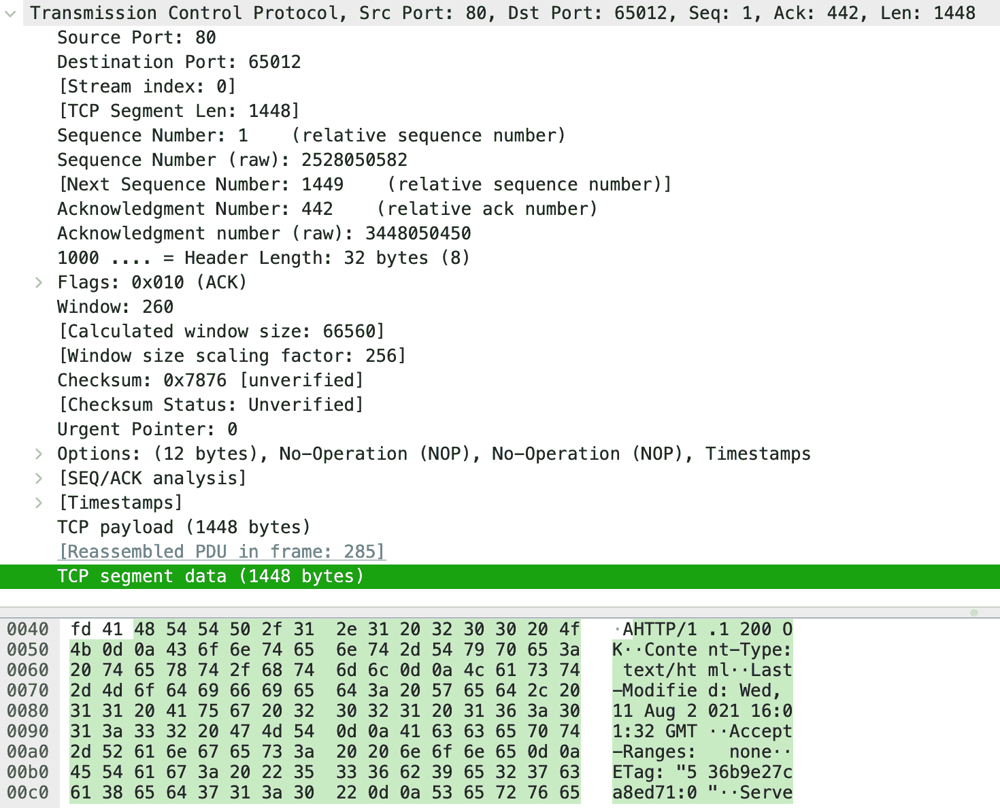****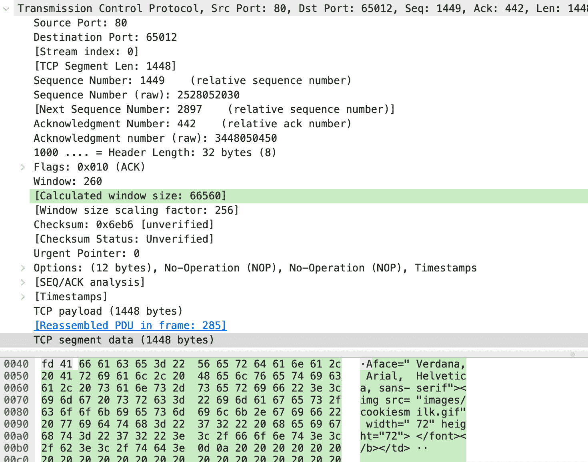**

**First (sequence number 1) and second (sequence number 1449 that starts at end of packet 1) TCP packets corresponding to HTTP response message received from ilovecookies.com server**

**这里显示了 HTTP 响应的前两个数据包(57 个 TCP 数据包)。在两张图片的右下方，我们可以看到与网页 ilovecookies.com 对应的特定于 HTTP 的信息和一些 HTML。**

**您还可以看到特定于传输层的信息，如端口号和序列号。请注意，与请求消息数据包相比，源端口号和目的端口号是颠倒的。**

## **网络层**

**与传输层相反，网络层提供两台终端主机之间的逻辑通信。请注意传输层和网络层服务之间的细微差别。**

**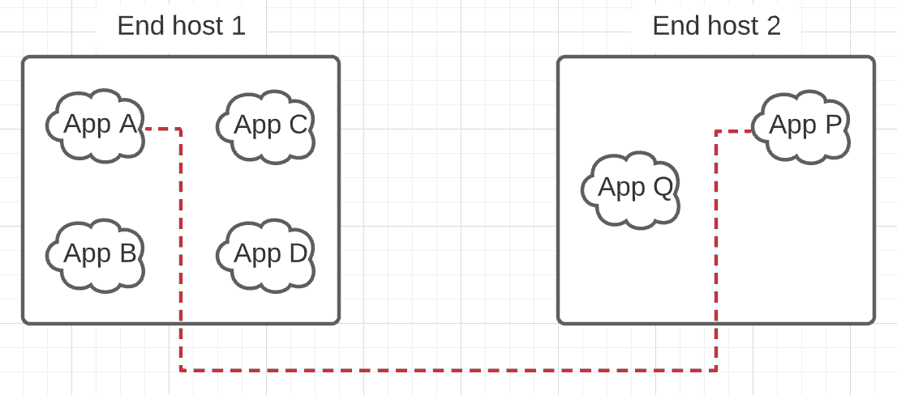******

**Left: logical communication provided by the transport layer, Right: logical communication provided by the network layer**

**网络层从传输层获取传输数据包，并将其封装在网络数据包中。封装有助于添加特定于网络层协议功能的信息。**

**网络层提供了一种[尽力服务](https://en.wikipedia.org/wiki/Best-effort_delivery)(不保证定时、相对排序、最终交付)来在两台主机之间移动数据。尽力服务是 TCP 背后的动力。由于网络层协议本质上不可靠，TCP 包含额外的逻辑来确保可靠的数据传输。**

**网络层负责将数据包从发送主机传输到接收主机。除了终端主机，网络层协议也运行在作为[网络核心](https://en.wikipedia.org/wiki/Backbone_network)一部分的**路由器**上。路由器是负责转发数据包的分组交换设备。**

**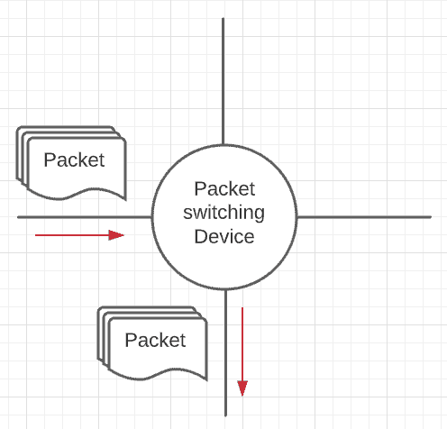****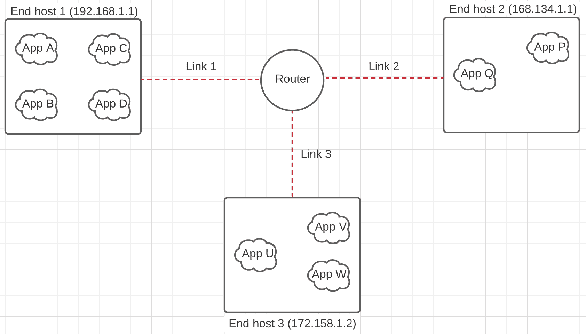**

**Left: packet switching device, Right: a small network consisting of 3 end hosts and 1 router connecting them together**

**假设终端主机 1 想要向终端主机 2 发送数据包。终端主机 1 将数据包传递给路由器。路由器查看网络数据包中的信息，发现需要在连接到终端主机 2 的链路 2 上转发数据包。**

**每个路由器都有一个存储在 RAM 中的转发表([动态构建](https://en.wikipedia.org/wiki/Routing_protocol))，用于解析数据包的正确转发链路。例如，上述设置的路由表如下所示:**

| 地址 | 环 |
| 192.168.1.1 | 链接 1 |
| 168.134.1.1 | 链接 2 |
| 172.158.1.2 | 链接 3 |

**路由器使用网络数据包中的信息(目的主机地址)来索引([位异或](https://en.wikipedia.org/wiki/Exclusive_or#Truth_table))到该表中。通过运行以下命令，您可以在计算机上看到路由表:**

**`Mac: netstat -nrf inet`
`Linux: netstat -nr`
**

 **请注意路由表中的一个特殊条目，默认或 0.0.0.0，称为[默认网关](https://en.wikipedia.org/wiki/Default_gateway)。如果没有条目与目的地址匹配，数据包将被路由到默认网关。

互联网包含大量这样的设备，它们转发数据包以实现两台终端主机之间的逻辑通信。

由于每个人都共享路由器和在互联网上传输数据的线路，路由器包含队列，当路由器处理(/转发)输出的数据包时，队列保存输入的数据包。如果队列已满，则网络层协议中会引入不可靠性，随着流量的增加，队列会变得拥挤。

互联网网络协议被称为互联网协议(IP)。互联网网络层的主要组件是，

1.  [IP](https://en.wikipedia.org/wiki/Internet_Protocol) :定义寻址约定(IPv4、IPv6)、数据包格式、数据包处理约定
2.  [路由协议](https://en.wikipedia.org/wiki/Routing_protocol):决定数据包从源到主机的路径
3.  ICMP :报告数据包中的错误并响应对某些网络层信息的请求的工具

总之，网络层提供两台终端主机之间的逻辑通信。网络层协议运行在终端主机和网络核心设备(如路由器)上。路由器转发网络数据包，这有助于形成两台终端主机之间的逻辑通信。

让我们继续我们与 ilovecookies.com 沟通的例子。

我们已经看到，我的 web 浏览器创建了一个 HTTP 请求消息(应用层协议)并将其向下传递到传输层，传输层使用 TCP 协议在我的 web 浏览器应用程序和一个服务器应用程序(ilovecookies.com)之间进行端到端通信。

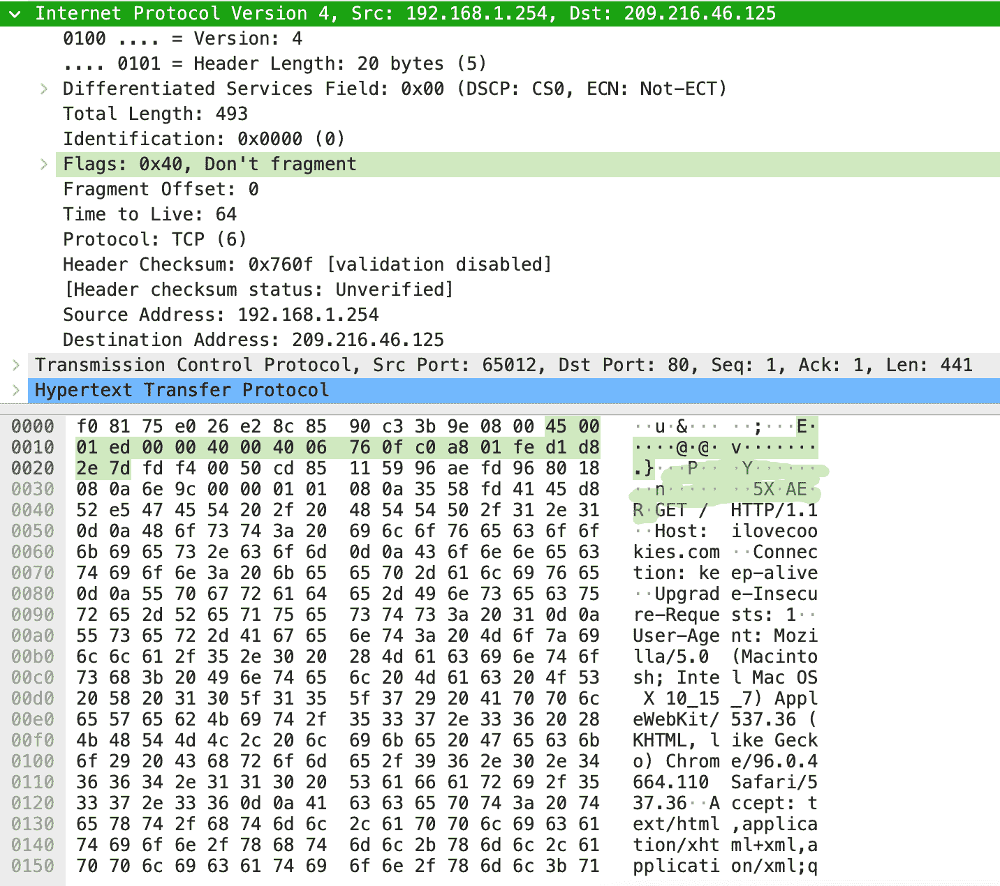

An IP packet encapsulates a TCP packet

我们可以看到网络包封装了 TCP 包，TCP 包封装了应用包。绿色突出显示的文本表示网络数据包的内容，黄色表示传输数据包，从 GET 开始的其余文本是应用程序数据包。

网络数据包字段与其功能相关。例如，源地址是我的机器的 IP 地址，目的地址是 ilovecookies.com[服务器地址](https://mxtoolbox.com/SuperTool.aspx?action=a%3ailovecookies.com&run=toolpage)。

数据包中包含的封装和特定于层的信息也与主机和主机上运行的应用程序之间的逻辑通信有关。

例如，网络数据包包含终端机器的 IP 地址，而传输数据包只包含端口号。传输层依靠网络层在终端机器之间传输数据。一旦数据到达接收设备，传输层就会接管，并使用传输数据包中包含的端口号将数据包路由到正确的应用程序。

## 链路层

与我们到目前为止看到的各层相比，链路层的范围更窄:它提供在端到端路径中的各个链路上移动数据包的服务。

例如，链接是红色虚线(见上图)。链路层允许网络层数据包在路径中的单个链路上进行节点到节点的移动。

链路层协议定义了:

*   链路末端节点之间的数据包交换格式
*   这些节点对数据包采取的操作

[网络适配器](https://en.wikipedia.org/wiki/Adapter_(computing)#Network_adapter)实现链路层协议。网络适配器是使计算机能够连接到网络并交换信息的物理硬件。

尝试运行此命令来查看计算机中的网络适配器列表:

`Mac: networksetup -listallhardwareports`
`Linux: lshw -class network -short`

在输出中，您会注意到每台设备都有一个称为 MAC 地址的链路层地址。来自的适配器[包含在制造时分配的 MAC 地址，这些地址被认为是永久的。每个节点(主机和路由器)在路径上都有一个链路层地址。](https://en.wikipedia.org/wiki/Read-only_memory)

前面我们谈到了 IP 地址，它也是设备的标识符。这种情况类似于拥有多个标识符:家庭住址和社会保险号。节点有 MAC 地址和网络层地址有几个原因。

*   不同层中的协议应该是可替换的。例如， [IPX](https://en.wikipedia.org/wiki/IPX/SPX) 不使用网络层地址。
*   IP 地址存储在 RAM 中，并且在适配器每次移动或加电时[被重新配置，即临时的。](https://en.wikipedia.org/wiki/IPX/SPX)
*   假设协议省略了 MAC 地址。适配器需要将它收到的每个数据包向上传递到协议栈。网络层将检查 IP 地址是否匹配。但是，如果做太多次，这可能是低效的:[中断](https://en.wikipedia.org/wiki/Interrupt)帮助传递数据包，这可能是[昂贵的](https://en.wikipedia.org/wiki/Interrupt#Performance)。

总之，为了使各层成为网络体系结构中很大程度上独立的构建块，许多层都需要有自己的编址方案。

简单回顾一下，到目前为止，我们已经遇到了三种类型的地址:

*   应用层的主机名(ilovecookies.com)。使用 [DNS](https://en.wikipedia.org/wiki/Domain_Name_System) 将这些转换成相应的 IP 地址。
*   网络层的 IP 地址
*   链路层的 MAC 地址

与帮助从主机名解析 IP 地址的域名系统一样，地址解析协议( [ARP](https://en.wikipedia.org/wiki/Address_Resolution_Protocol) )对于从 IP 地址确定(目的地)MAC 地址很有用。

ARP 在 RAM 中建立一个包含 IP 地址到 MAC 地址映射的表。该协议包括用于自动创建该表的规范(例如[特定分组](https://en.wikipedia.org/wiki/Address_Resolution_Protocol#Packet_structure))。

网络层将目的节点的数据包和 MAC 地址(来自 ARP 表)传递给链路层。链路层将数据包封装在链路层数据包中，并沿链路将其移动到目的节点。

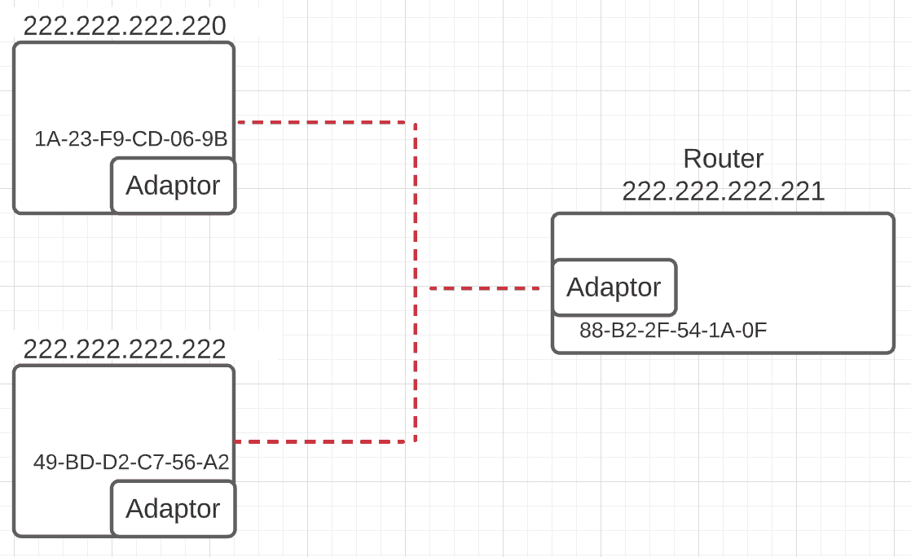

A network containing two hosts and one router

假设在上述设置中，主机 222.222.222.220 想要向另一台主机 222.222.222.222 发送数据包。网络层使用 ARP 将相应的 MAC 地址解析为 49-BD-D2-C7-56-A2，并将数据包和 MAC 地址传递给链路层。链路层通过两台主机之间的链路传输数据包。

接下来，考虑一个更复杂的场景，一台主机想要向不同网络上的另一台主机发送数据包。例如，一个从我的电脑到 ilovecookies.com 的数据包从我的[家庭网络](https://en.wikipedia.org/wiki/Home_network#Infrastructure_devices)传输到另一个网络。

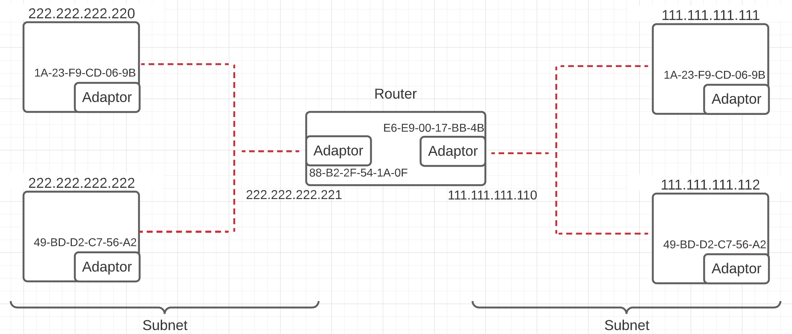

A router connecting two subnets. The router contains two adapters for linking and two IP addresses, identifying it on each subnet

这张图片有两点需要注意。首先，路由器有两个 IP 地址。由于路由器加入了两个不同的网络，因此它需要两个 IP 地址来识别各自的网络。更多详情见[本](https://askleo.com/your-routers-two-ip-addresses/)。

其次，这两个独立的网络被称为[子网](https://en.wikipedia.org/wiki/Subnetwork)。子网是网络设备的逻辑分组，使网络设备管理更加容易。

假设在此设置中，主机 222.222.222.222 想要向主机 111.111.111.111 发送一个数据包，这涉及到跨网络传输。它不会定位其子网中的目的主机(111.111.111.111)，而是将数据包转发到默认网关(路由器)。

网络层使用 ARP 表将 MAC 地址解析为 88-B2-2F-54-1A-0F。路由器使用其路由表将数据包传送到连接到另一个子网的链路。ARP 表再次帮助解析目的主机的 MAC 地址，数据包沿着链路传输。

总之，计算机硬件的适配器部分实现了链路层协议。链路层协议定义了称为 MAC 地址的寻址方案，ARP 用于将 IP 地址映射到 MAC 地址。链路层封装网络层数据包，并通过链路传输它们。

其中一个流行的链路层协议是[以太网](https://en.wikipedia.org/wiki/Ethernet)。让我们继续我们的例子(ilovecookies.com)来研究以太网协议。

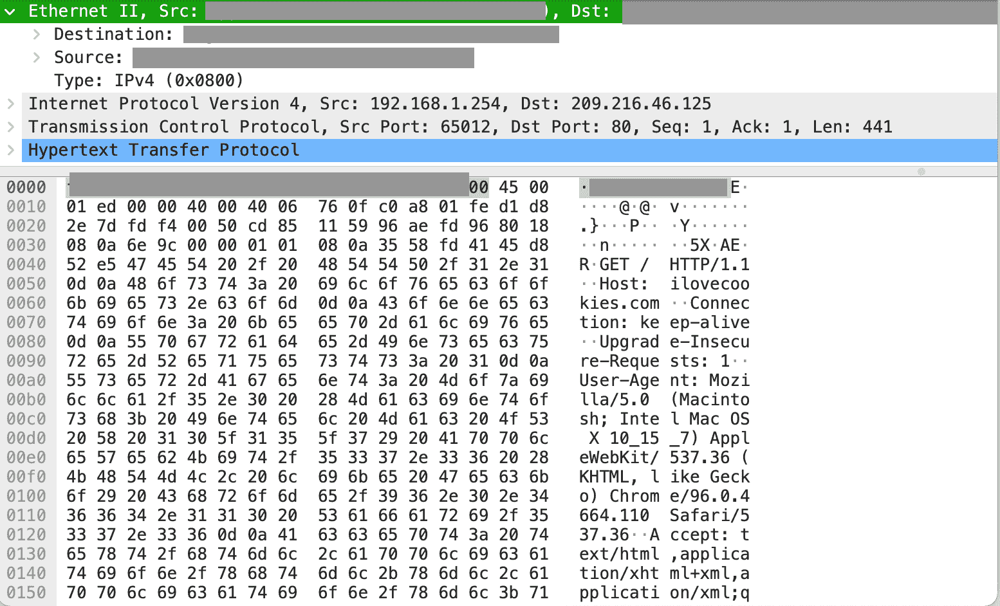

An Ethernet packet encapsulating an IP packet

我们可以观察到以太网数据包包含目的地和源 MAC 地址(省略)，并且它封装了 IP 数据包。

## 概述

让我们用下面的图片总结一下我们在这篇文章中看到的内容。

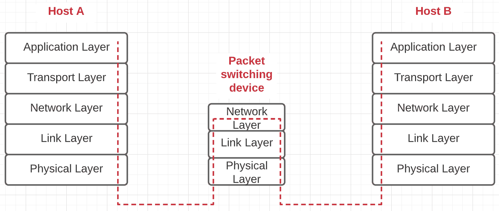

End to end network communication between host A and host B

运行在两个不同系统(称为主机)上的计算机应用程序使用协议进行通信。

协议是管理两台主机之间通信的规则。协议栈解决了多个子问题来解决网络通信的问题。每一层都专注于使用抽象层次中较低层提供的服务来解决子问题。

应用层协议工作在最高的抽象层次。应用程序通过发送符合应用程序协议(例如 HTTP)规则的消息进行通信。

DNS 用于将主机名(www.ilovecookies.com)映射到 IP 地址。这些消息通过套接字接口推送，使用传输层在网络上传输。

传输层公开了运行在不同主机上的两个应用程序之间的逻辑通信。它将应用程序消息分解成更小的片段，并将它们封装在包含额外信息的数据包中([报头](https://en.wikipedia.org/wiki/Header_(computing)))。

应用程序消息从这些数据包中创建，并使用数据包上的端口号通过套接字接口发送出去。这些数据包依靠网络层在网络上发送。

接下来，网络层接管，提供两台主机之间的逻辑通信。它还将传输数据包封装在网络数据包中。

Internet 包含转发网络数据包的分组交换设备，使用存储在 RAM 中的路由表，并使用路由协议动态构建。网络层依靠链路层来传输数据包。

链路层负责在各个链路上传输数据包。称为适配器的硬件设备实现链路层协议，并有一个与之关联的永久地址，称为 MAC 地址。MAC 地址用作该层的标识符。地址解析协议(ARP)将 IP 地址映射到 MAC 地址。

最后，链路层将数据包传递到物理层，物理层构成了信息传输的线路。

感谢您的阅读！我希望你今天学到了一些关于计算机网络的新知识。

### 来源

[Computer Networking: A Top-Down Approach, 7th EditionComputer Networking: A Top-Down Approach, 7th EditionJames F. Kurose, University of Massachusetts, Amherst Keith RossPearson](https://www.pearson.com/us/higher-education/program/Kurose-Computer-Networking-A-Top-Down-Approach-7th-Edition/PGM1101673.html)[Wireshark · Go Deep.](https://www.wireshark.org/)**