# 2020 年的计算机编程技能:来自 116，000 名开发人员和招聘经理的调查结果

> 原文：<https://www.freecodecamp.org/news/computer-programming-skills-2020-survey-developers-hiring-managers-hackerrank/>

在过去的 3 年里，freeCodeCamp 已经调查了 10，000 名开发人员，了解他们是如何学习编码和追求职业生涯的。我们已经[公开了我们的全部数据集](https://www.kaggle.com/fccuser/datasets)。

2020 年，我们决定休学一年。所以这篇文章不是关于我们的新数据集。而是关于我们在 HackerRank 的朋友进行的一项调查。他们调查了 116，000 名开发人员，以获得他们的 2020 年技能报告。在这里，我将对我认为与新开发人员最相关的结果进行分类。

他们调查的许多开发人员也是招聘经理。让我们从这里开始。

## 招聘经理在开发人员招聘中寻找什么？

事实证明，这在很大程度上取决于公司的规模。

小公司更依赖多面手。他们带来了许多可以身兼数职的全栈开发人员。

这通常是以专门的前端和后端开发人员为代价的。

### 较小的公司认为全栈开发者更重要。大公司更可能需要专家。

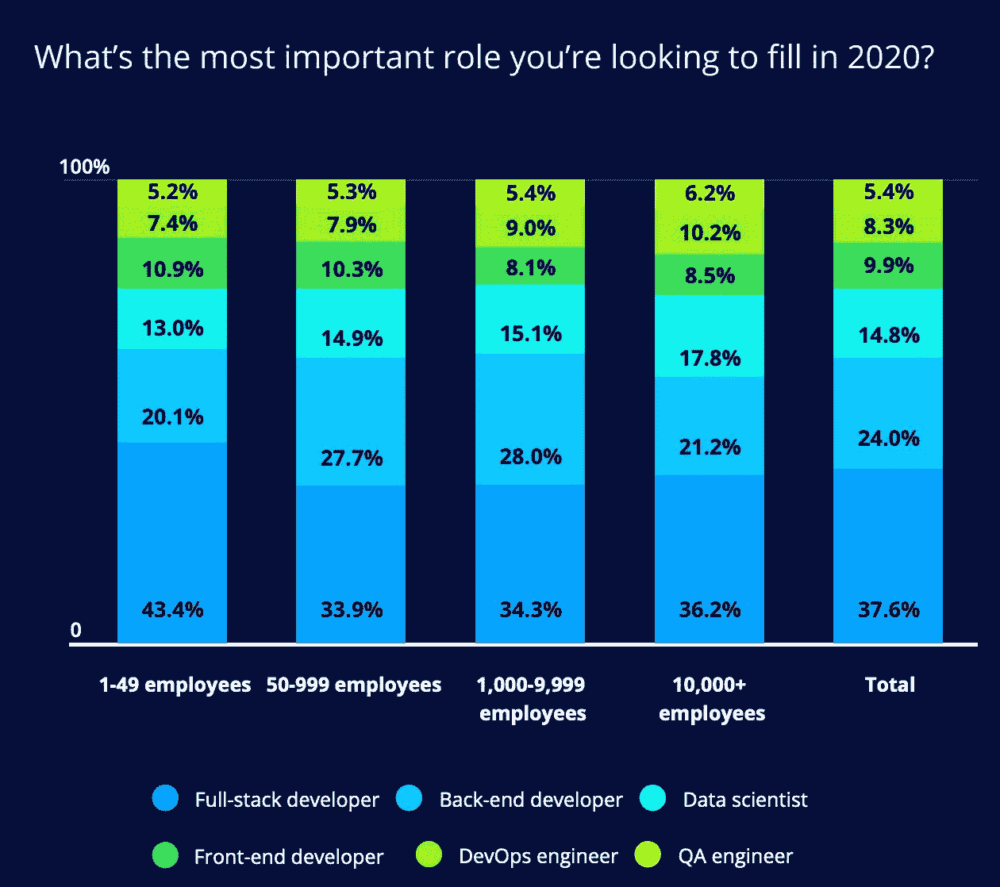

A chart from HackerRank's 2020 Developer Skills report showing that for smaller companies (less than 50 employees) 43% consider Full-stack Developer to be their highest priority hiring role.

如果你想一想，这是有道理的。大公司允许更多的专业化。

这就是说，所有规模的公司的大多数招聘经理都优先考虑前端、后端或全栈开发人员。只有大约 30%的招聘经理认为以下职位更重要:

*   DevOps 工程
*   数据科学家
*   质量保证工程师

就雇主在招聘时寻求的技能而言...

### JavaScript 仍然是最受雇主欢迎的编程语言技能。

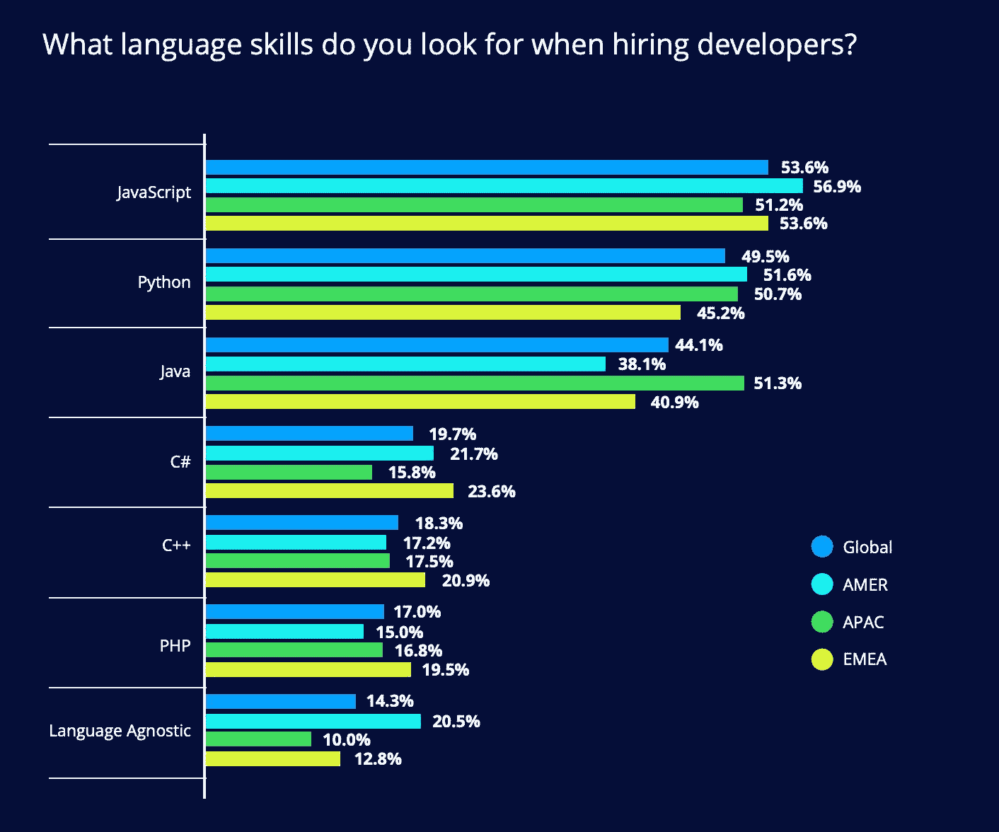

A chart showing language popularity among hiring managers by region, with JavaScript as the most popular language, followed Python and Java.

到目前为止，JavaScript 是全球最流行的，其次是 Python。

在亚太地区，Java 的需求量仍然很大。C#和 C++在非洲-欧洲-中东地区比其他地方更受欢迎。

但最有趣的一点是，越来越多的经理——尤其是在美国——是“语言不可知论者”。他们并不真的关心你知道哪些具体的编程语言。

这又回到了过去几年我一直在宣扬的一件事:**如果你能学好一门编程语言，你就能轻松地在工作中学习第二门语言。**

所以我很高兴越来越多的雇主承认这一现实，而不仅仅是发布“JavaScript 开发人员”或“Python 开发人员”的职位

开发人员过去构建的东西比他们用来构建的特定工具更能反映能力。

### 越来越少的雇主要求大学学位。小公司在这方面更灵活。

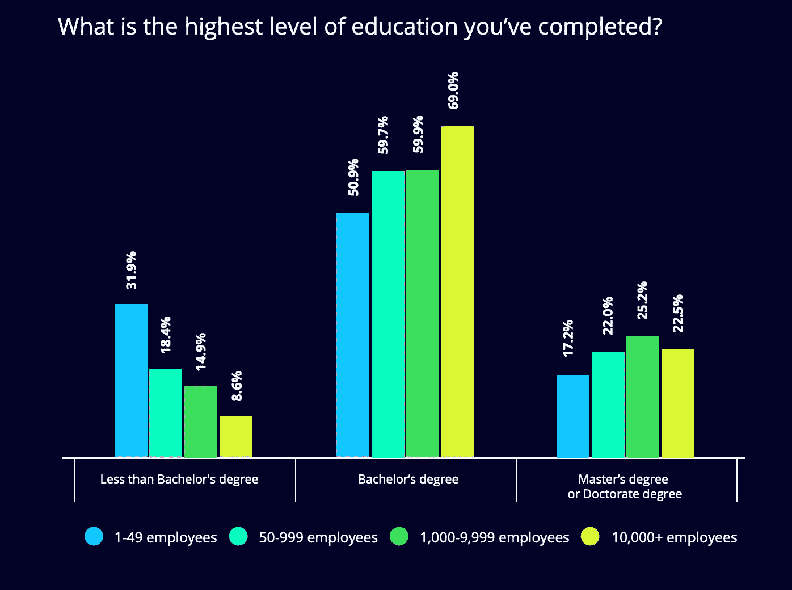

A chart showing the proportion of developers who have no Bachelor's degree, who have a degree, and who have graduate degrees - sorted by employer size. Smaller companies are more likely to hire developers who don't have degrees.

31%在小公司工作的开发人员没有学士学位(在美国也被称为“本科学位”或“4 年制学位”)。

即使在大公司，9%到 18%的开发人员没有学位。

与 20 世纪 90 年代和 21 世纪初相比，这代表了一个相当大的转变，当时大多数开发人员的工作都需要学位。

但是，如果你想一想，这很有道理。

获得大学学位的成本——当然是在美国——在过去 40 年里飙升。

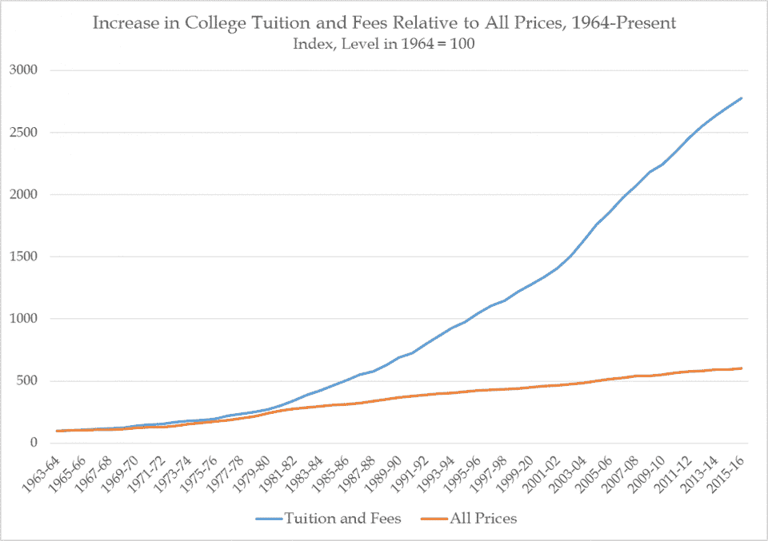

Inflation in US University tuition and fees VS overall inflation (Consumer Price Index). Source: The US National Center for Education Statistics.

越来越多的美国人选择放弃传统的大学学位，转而选择自学。

我的建议一直是:**去一所便宜的社区大学，然后去一所便宜的公立大学。我仍然认为 4 年制学位是值得的，如果你能在不负债的情况下获得学位的话。**

但是我能理解为什么已经过了传统的大学年龄(十八九岁到二十出头)的人可能想完全不上大学。

这 2500%的大学学杂费涨幅也恰逢万维网的诞生，以及丰富的免费学习资源。

如今，如果你愿意坐下来学习，你几乎可以免费学到任何东西。

因此，令人振奋的是，越来越多的雇主除了大学毕业生之外，还雇佣完全自学成才的开发人员。

在上大学和在网上免费学习之间有了一个新的中间地带:编码训练营。

我已经写了很多关于编码训练营的文章，以及它们对那些不想回到学校的人的作用。

大多数人通过一两年的在线资源自学，参加当地的技术活动，在当地的黑客空间闲逛，都能够成功地找到一份开发人员的工作。

但是有些人更喜欢加入编码训练营所能提供的额外的结构和责任。这些费用几乎和去社区大学+州立大学一样贵。但是他们有点快。

好消息是，一些雇主正在雇佣这些编码训练营的毕业生，并分享他们对他们的看法。

## 编码训练营有用吗？这是来自雇主的数据。

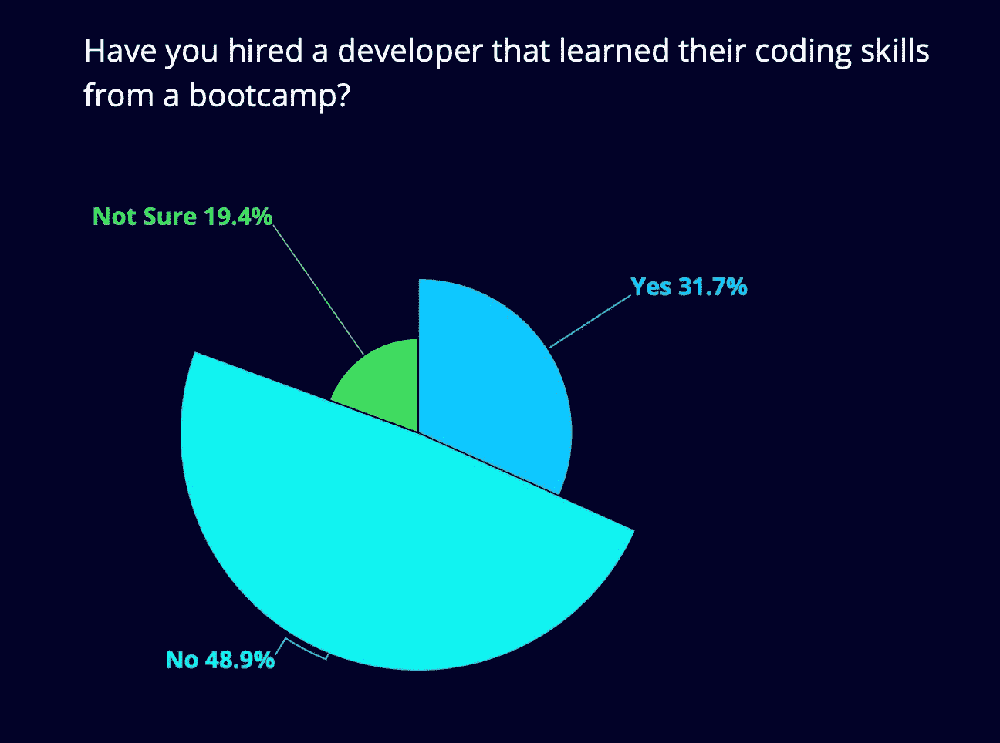

A chart showing that nearly 32% of hiring managers surveyed had hired a developer who went through a coding bootcamp.

约 32%接受调查的招聘经理表示，他们已经雇佣了一名编码训练营的毕业生。

以下是他们对这些训练营毕业生技能的看法:

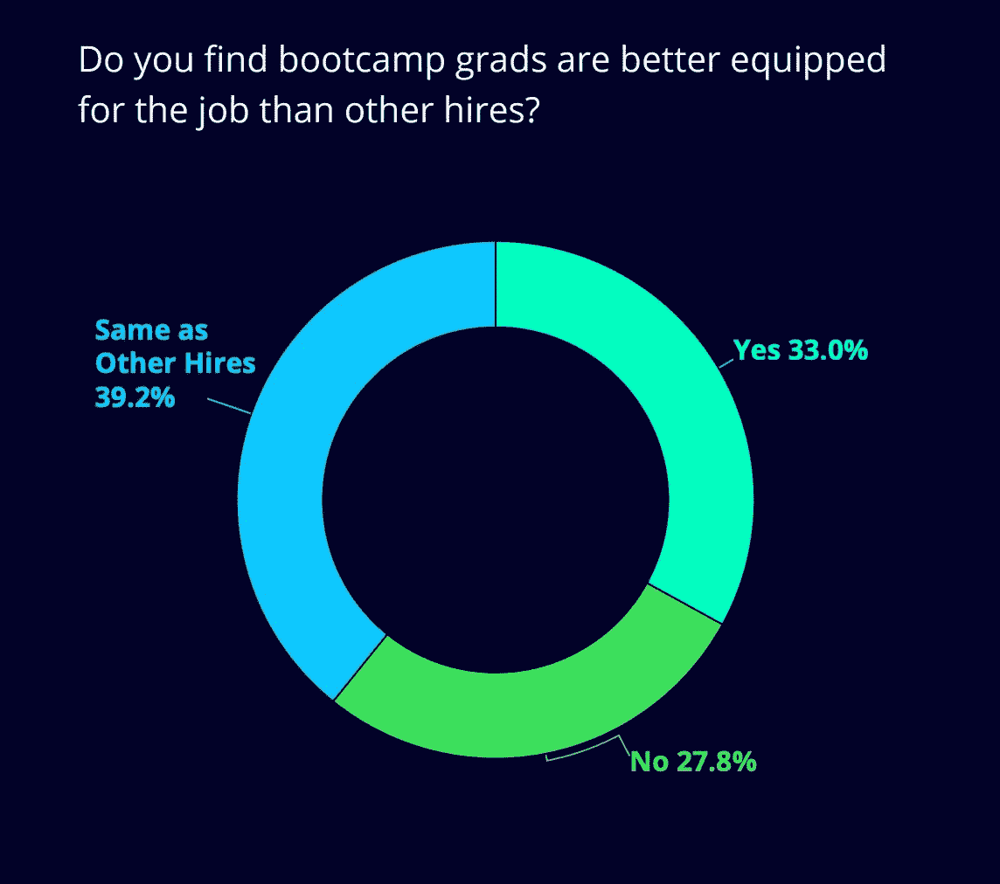

A chart showing most hiring managers consider coding bootcamp graduates to be as well-equipped for the job as non-bootcamp grads.

他们发现这些编码训练营的毕业生和他们其他的雇员一样装备精良。近 1/3 的人表示，编码训练营的毕业生比他们通常雇佣的人要好。

需要注意的一点是，许多编码训练营的毕业生已经获得了学士学位——有些是计算机科学和工程领域的。因此，这些训练营的毕业生比一般的雇员受教育程度更高。

还要注意的是，不同编码训练营的教学质量差别很大。

这项调查没有公布基础数据，所以我们不知道哪些编码训练营在雇主中最受欢迎。我们也不知道其中有多少是传统的现场编码训练营和在线编码训练营。(如果你以前读过我的文章，你会知道我更看重面对面的形式。)

但不管怎样，32%雇佣了编码训练营毕业生的招聘经理对他们的技能评价如此之高，这一事实肯定会让那些在他们所在城市建立了自己的编码训练营的开发人员感到放心。

## 开发人员有兴趣学习哪些技能？

虽然 JavaScript 是当今最广泛使用和最受欢迎的编程语言技能，但接下来会发生什么一直是个问题。

幸运的是，调查也涵盖了这一点。这是图表:

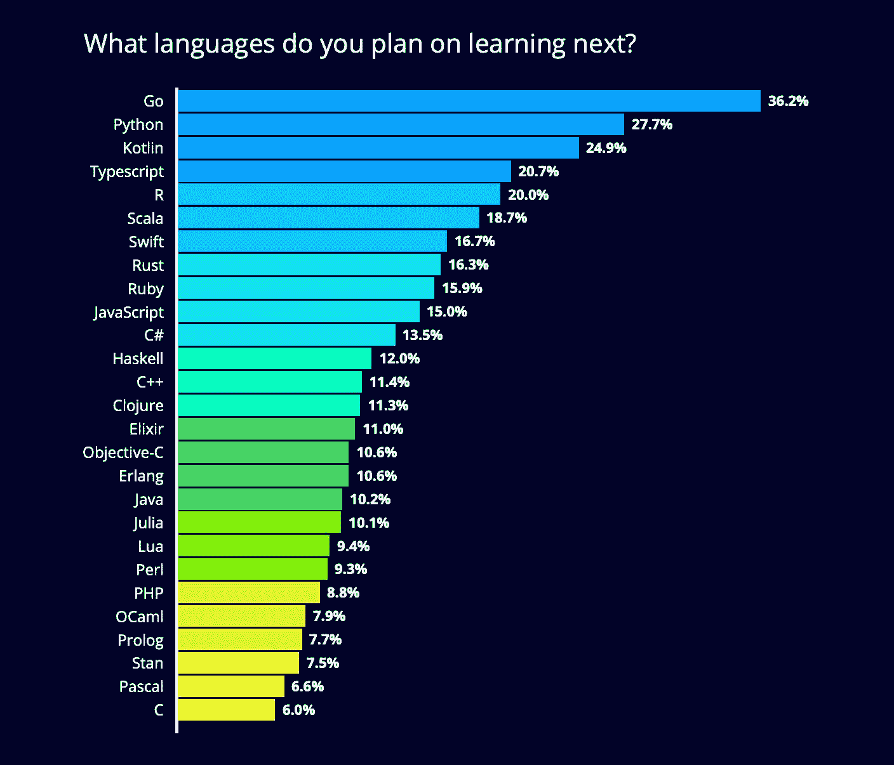

A chart showing that 36% of developers want to learn Go next, followed by Python and Kotlin.

我们可以假设大多数受访者已经知道 JavaScript，因为在 2020 年，如果不知道它，很难成为一名开发人员。因此，开发人员正在将目光转移到一些新的语言上。

如果你还不熟悉这些语言，我现在就来描述一下。

Go 是 Google 在 2007 年创建的一种强大的服务器语言。Go 优惠:

*   碎片帐集
*   内存安全
*   有限结构分型
*   以及大量用于编写高度并行编程的特性。

想学围棋？你很幸运。我们在这里有一个 7 小时的免费 Go 课程:

[Learn the fast and simple Go programming language (Golang) in 7 hoursThe Go programming language (also called Golang) was developed by Google toimprove programming productivity. It has seen explosive growth in usage inrecent years. In this free course from Micheal Van Sickle, you will learn how touse Go step-by-step. Go is designed specifically as a systems progr…Beau CarnesfreeCodeCamp.org](https://www.freecodecamp.org/news/go-golang-course/)

开发人员想学的第二种语言是 Python。

想学 Python？超过 1000 万人参加了在 Python 上发布的 4 小时免费课程 freeCodeCamp:

[Learn Python basics with this in-depth video courseIf you’ve been wanting to learn Python, you’re in luck. Mike Dane created thisin-depth video course for Python. It’s 4 and a half hours, so it will probablytake you at least a weekend to go through. In this video, Mike will walk you through important Python concepts, and helpyou build some basic…Quincy LarsonfreeCodeCamp.org](https://www.freecodecamp.org/news/learn-python-basics-in-depth-video-course/)

我们还有世界著名的 Chuck 博士教授 14 小时的免费课程，名为“面向所有人的 Python”:

[Python for Everybody - Free 14 hour Python course from Dr. ChuckThis course aims to teach everyone the basics of programming computers usingPython 3\. The course has no pre-requisites and anyone with moderate computerexperience should be able to master the materials in this course. The course was created by Dr. Charles Severance (a.k.a. Dr. Chuck). He is aCli…Beau CarnesfreeCodeCamp.org](https://www.freecodecamp.org/news/python-for-everybody/)

我们还在开发基于浏览器的交互式 Python 课程，并提供认证。它将于 2020 年晚些时候问世。

[Build 111 Projects, Earn 10 Certifications – Now With PythonUpdate July 2, 2020: the 4 new Python certifications are now live[/news/python-curriculum-is-live/]. We’ve been working hard on Version 7.0 of the freeCodeCamp curriculum. Here’swhat we’re building. Some of these improvements - including 4 new Python certifications - will golive in early 2020.…Quincy LarsonfreeCodeCamp.org](https://www.freecodecamp.org/news/python-curriculum/)

2020 年开发者想学的第三种语言是科特林语。Kotlin 是由我们在 JetBrains 的朋友(像 InteliJ 和 WebStorm 这样的流行 ide 的创造者)创造的一种很棒的语言。

Kotlin 使创建 Android 应用程序(最初是用 Java 编写的)变得容易得多。

所以——当然——freeCodeCamp 也有一个关于 Kotlin 的 4 小时免费课程:

[Learn how to develop native Android apps with Kotlin - A Full CourseAndroid is the most popular operating system in the world. It is on more devicesand computers than Windows, iOS, and MacOS combined. In this complete videocourse from Ryan Kay, you will learn how to build native apps for Android usingKotlin. This full course explains how to build an entire Andro…Beau CarnesfreeCodeCamp.org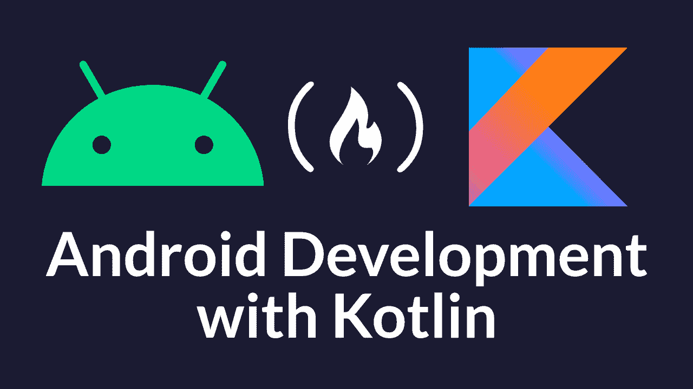](https://www.freecodecamp.org/news/learn-how-to-develop-native-android-apps-with-kotlin-full-tutorial/)

## 职业开发人员在职业发展方面实际上关心的是什么？

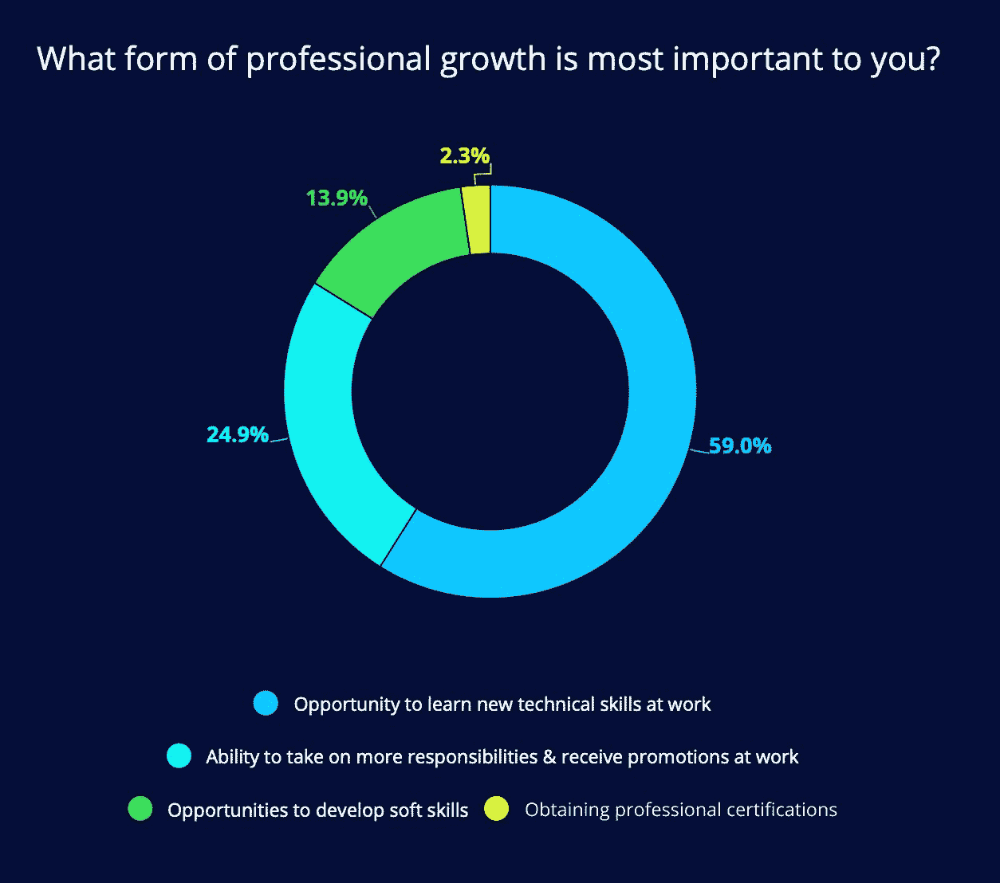

A chart showing that 59% of developers want to learn new technical skills at work. This is significantly more than the developers who primarily want to earn certifications, develop soft skills, or receive promotions.

一句话:**技能**。

大多数开发人员不太关心职业发展的传统标志(晋升)。他们更关心扩展他们的技术技能工具箱。

当你看下面的图表时，这很有意义:

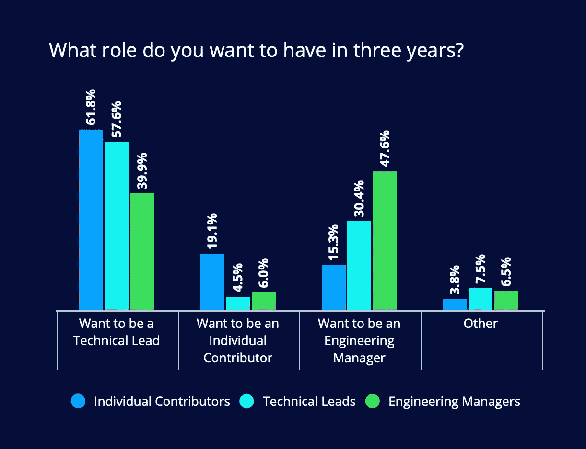

A graph showing developers are much more interested in technical roles than managerial roles.

大多数开发人员宁愿被提升到更技术性的职位，而不是管理职位。

工程经理是经理，个人贡献者是被管理的开发人员。但是什么是技术领先呢？

技术领导的角色因公司而异，但通常包括做出高层次的技术决策(如架构师)和为开发团队设定愿景。技术领导通常向工程经理汇报，工程经理再向首席技术官等高管汇报。

## 截至 2020 年，开发者每年赚多少钱？

根据对 116，000 名开发人员的调查，平均年薪为 54，000 美元。这是面向全球开发者的。

让我们放大来看看美国——开发人员收入最高的国家。(我不太确定这是为什么，但我怀疑这是一个组合:美国是许多全球最大软件公司的总部所在地，再加上限制性的移民政策，限制了开发人员的可用性。)

以下是美国大都市地区开发人员的平均工资:

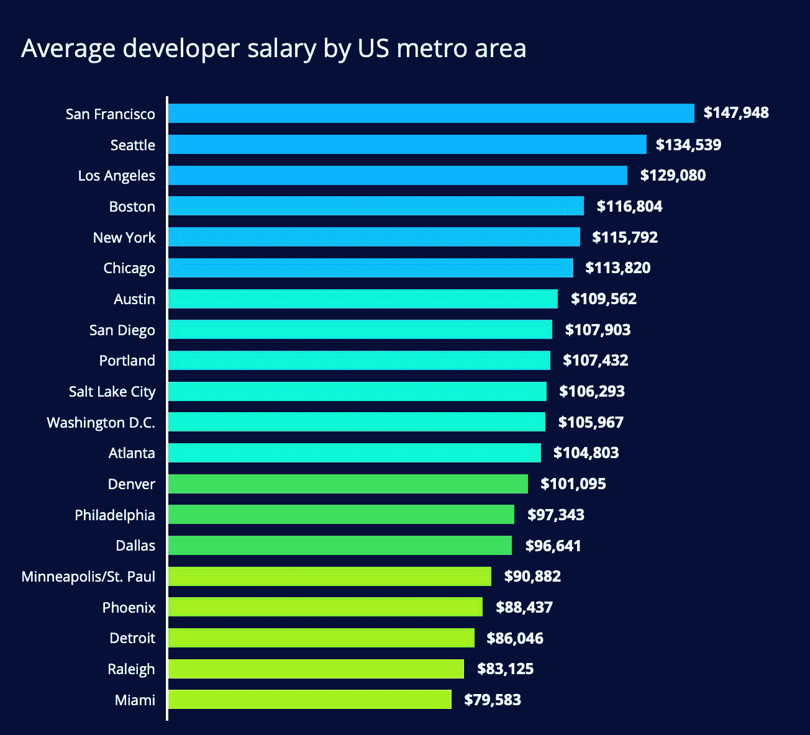

San Francisco leads with an average annual salary of $148,000, followed by Seattle, Los Angeles, and Boston.

客观地看，美国人的平均收入约为 47，000 美元。因此，作为一名开发人员——如果你能找到工作，这并不坏。？

再次感谢 HackerRank 团队进行这项调查并创建这些可视化效果。这些，结合[栈溢出调查](https://www.freecodecamp.org/news/stack-overflow-2018-developer-survey-faac8d3eb357/)和 [freeCodeCamp 自己的调查](https://www.freecodecamp.org/news/the-2018-new-coder-survey-31-000-people-told-us-how-theyre-learning-to-code-and-getting-dev-jobs-e10feb9ed419/)，有助于描绘软件开发作为一个领域的更高分辨率的画面。