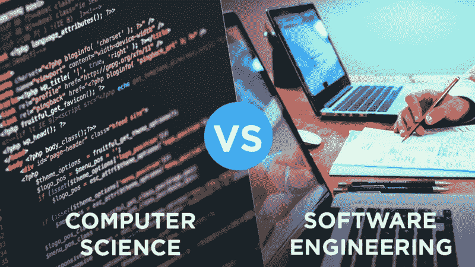

# 计算机科学 VS 软件工程——哪个专业最适合你？

> 原文：<https://www.freecodecamp.org/news/computer-science-vs-software-engineering-which-one-is-a-better-major-88482c38446b/>

作者 YK·杉

# 计算机科学 VS 软件工程— **哪个专业最适合你？**

嘿大家好！我的名字叫 YK，目前我正在运营一个拥有 20 多万订户的编程教育 YouTube 频道 [CS Dojo](https://www.youtube.com/csdojo) 。我也曾是谷歌 T3 的软件开发人员[。](https://medium.freecodecamp.org/why-i-left-my-100-000-job-at-google-60b5cf4ebefe)

我的观众问我的两个最常见的问题是:

> **“计算机科学和软件工程专业有什么区别？”**

还有…

> “如果我想成为一名软件工程师，我应该选择计算机科学还是软件工程？”

在这篇文章中，我将回答这个问题，并给你我自己对这些专业的快速分析。

### 这两个专业的快速概述

*   计算机科学是对计算机如何工作的研究，主要是从理论和数学的角度。
*   如果你喜欢数学、逻辑，或者如果你想进入计算机科学的一个专门领域，如人工智能、机器学习、安全或图形，你应该选择计算机科学。
*   软件工程是对如何构建软件系统的研究，包括项目管理、质量保证和软件测试等主题。
*   如果你对实践的方法更感兴趣，或者如果你想了解软件构建和维护的整个生命周期，你应该选择软件工程。
*   计算机科学和软件工程都教授编程和计算机科学的基础，所以你可以选择任何一个成为软件开发人员。

要了解计算机科学和软件工程专业的区别，我们先来看看加拿大滑铁卢大学各自的课程设置。

我选择滑铁卢大学是因为它有北美最好的计算机科学项目。

### **工作前景**

让我们先来比较一下通过每个项目你能得到的工作和实习的种类。

谢天谢地，滑铁卢大学的网站提供了几个例子。

对于每个专业，以下是一些校友拥有的头衔，以及他们工作的地方:

#### 计算机科学

*   Steele 集团网站开发人员/架构师
*   哈里·罗森公司程序员。
*   Clearbridge Associates Limited 移动/云开发者
*   加拿大通用动力公司软件工程
*   微软软件开发工程
*   Pivotal 实验室的敏捷工程师
*   加拿大轮胎公司商业分析师
*   谷歌开发者代言人
*   Dropbox 产品经理

#### 软件工程

*   软件开发商 Tagged 公司
*   IBM 加拿大公司软件开发人员
*   阿里乌软件公司软件经理
*   美国 VistaPrint 软件工程师
*   哈里斯公司软件工程师
*   埃森哲公司软件开发商。
*   NexJ 系统公司软件设计和开发技术产品经理
*   PureFacts 金融解决方案顾问
*   Desire2Learn 实施顾问

如你所见，你能找到的工作类型之间没有太大的区别。

获得计算机科学或软件工程学位后，毕业生最常见的工作是软件开发员或软件工程师。

还有其他相关选项，如产品经理、QA 分析师和技术顾问。您的选择将取决于您的具体技能。

### **一年级课程:**

现在，我们来看看每个项目的必修课。让我们首先比较一下你第一年需要上的一些课程。

#### **计算机科学**

*   CS 135 —设计功能程序
*   CS 136 —算法设计和数据抽象
*   数学 135 —代数
*   数学 136 —线性代数 1
*   数学 137 —微积分 1
*   数学 138 —微积分 2
*   外加一些选修课

#### **软件工程**

*   CS 137 —编程原则
*   CS 138 —数据抽象和实现
*   数学 115 —工程线性代数
*   数学 117 —工程微积分 1
*   数学 119 —工程微积分 2
*   数学 135——数学荣誉代数
*   ECE 105 —电气工程物理 1
*   ECE 106 —电学和磁学
*   ECE 124 —数字电路和系统
*   ECE 140 —线性电路
*   SE 101 —软件工程方法

如你所见，第一年的课程也相当相似。它们都涵盖了一些基本的计算机科学课程，以及一些线性代数和微积分的数学课程。

唯一的主要区别是，软件工程有额外的物理和电子工程组件，而计算机科学有更多的选修课。

### **第一年后的课程:**

第一年以后的必修课和选修课怎么样？下面我们来看几个例子:

#### **计算机科学:**

*   数学 239 组合学导论
*   统计 230 概率
*   STAT 231 统计
*   CS 240 数据结构和数据管理
*   CS 241 顺序程序的基础
*   CS 245 逻辑与计算
*   CS 246 面向对象软件开发<——软件工程专业不需要
*   CS 251 计算机组织与设计
*   CS 341 算法
*   CS 350 操作系统
*   另外，还有几门计算机科学选修课

#### **软件工程:**

*   CHE 102 工程师化学
*   ECE 222 数字计算机(包括汇编语言)
*   ECE 358 计算机网络
*   数学 213 软件工程师的高等数学
*   数学 239 组合学导论
*   软件工程统计
*   MSCI 261 工程经济学:工程师财务管理
*   CS 241 顺序程序的基础
*   CS 240 数据结构和数据管理
*   **CS 247 软件工程原理**<——计算机专业不需要
*   CS 341 算法
*   CS 349 用户界面<——计算机科学专业不需要
*   **CS 343 并发与并行编程**<——计算机专业不需要
*   CS 348 数据库管理介绍
*   逻辑和计算
*   SE 350 操作系统
*   SE 465 软件测试和质量保证
*   SE 464 软件设计和架构
*   SE 463 软件需求规范和分析
*   SE 490 设计项目
*   另外，还有一些计算机科学和电子工程的选修课

#### 我给了你很多信息让你消化。但这是我的总结:

说到数学和统计学方面的要求，计算机科学和软件工程几乎是一致的。它们涵盖了组合学、概率和统计学。

计算机科学的核心要求也是相似的，包括算法、数据结构和操作系统。

关键区别在于:

*   **软件工程**在电气工程和软件工程基础方面的要求比较多，比如软件测试、设计、软件需求规格说明书等。
*   **计算机科学**允许在更高水平的计算机科学课程中有更多的选修课。你可以从广泛的主题中进行选择，如安全性、软件工程基础、计算机视觉、机器学习和数据库管理。

### **那么，应该选择哪个专业呢？**

我觉得这主要取决于你的喜好。简而言之:

*   如果你喜欢数学、逻辑，或者如果你想进入 CS 的一个专门领域，如人工智能、机器学习、安全或图形，你应该选择计算机科学。
*   如果你对实践的方法更感兴趣，或者如果你想了解软件构建和维护的整个生命周期，你应该选择软件工程。

### 但是等等——到底是哪一个呢？想做软件工程师哪个专业比较好？

以下是我的看法。在这所特殊的大学(滑铁卢大学)，有了这一套特殊的程序要求，如果你想成为一名软件工程师，计算机科学是一个更好的专业。

为了简单起见，让我们假设你希望在北美找到一份薪水最高的工作(大约 100，000 美元/年)，做一名软件工程师。这些工作通常是在大型软件公司(想想微软、谷歌、亚马逊等。)或中等规模、高增长的公司(想想 Dropbox、Lyft、Snapchat、Pinterest 等。).

通常，他们在软件工程师候选人中寻找的是编写可靠代码和构建有趣项目的能力，以及包括数据结构和算法在内的计算机科学基础。

我认为培养这种技能的最好方法是快速学习计算机科学的基础知识，并花自己的时间练习解决问题和编写代码。

基于软件工程的课程和工程学生通常的忙碌程度，我认为软件工程比计算机科学更难做到这一点。

这个特别的计算机科学项目的另一个好处是它允许更多的计算机科学选修课。这也很好，因为根据就业市场的需求，你可以调整你的课程。例如，如果移动应用程序开发有需求，您可以了解这一点。如果需要并行计算，您可以专注于此。

我确信学习软件工程基础知识(项目管理、设计、测试等)会有一些好处。).但是我个人更喜欢灵活性而不是预先定义的技能。这就是为什么我认为计算机科学是成为软件工程师的一个更好的专业。

当然，这只是我的观点，这只是一所特别的大学。我很想听听你的看法，如果你主修计算机科学或软件工程，你的经历是什么样的。请在下面的评论中告诉我。

#### 几个音符

**注意事项 1:** 不同大学对这两个专业的要求不同。这篇文章应该是一个很好的起点，但是你仍然应该看看你感兴趣的大学的项目要求。

**注 2:** 有些大学甚至没有软件工程专业。比如温哥华的不列颠哥伦比亚大学有计算机科学和计算机工程学位，但没有软件工程。但是在他们的计算机科学项目中，除了计算机工程，他们也有软件工程的专业。

如果你想去的大学没有软件工程专业，如果你想成为一名软件开发人员，我会选择计算机科学。与计算机科学或软件工程相比，计算机工程更侧重于硬件，因此它与典型的软件开发人员的工作不太直接相关。

#### 以下是我使用的主要来源:

*   滑铁卢大学的计算机科学
*   滑铁卢大学的软件工程

感谢阅读，祝你选择大学和专业顺利！？