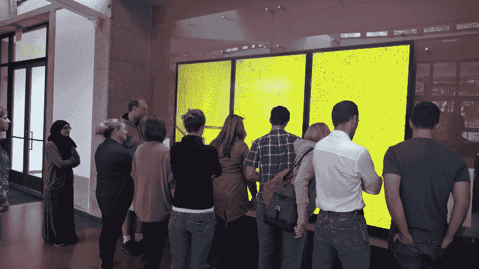
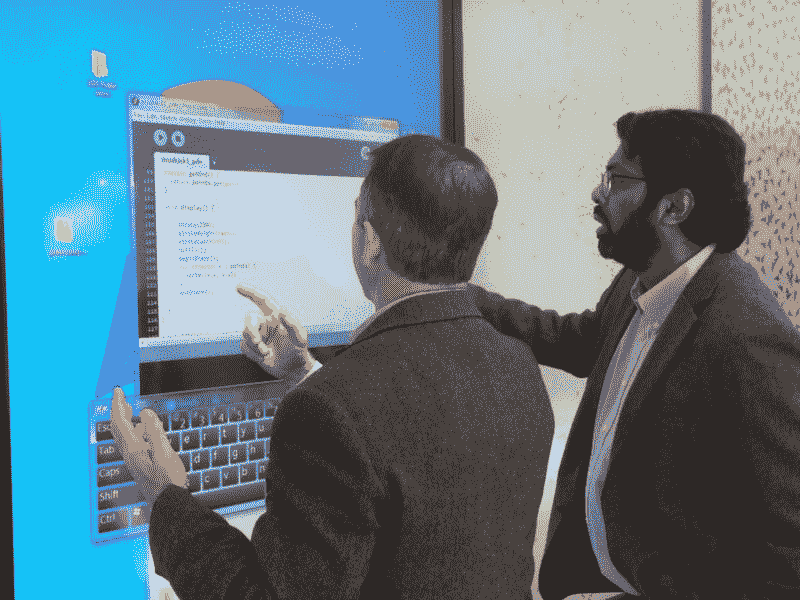
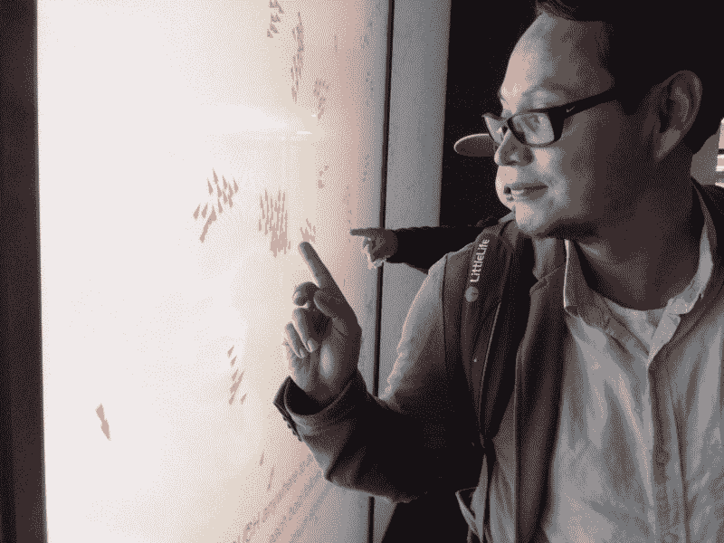

# 公共计算，为公众计算

> 原文：<https://www.freecodecamp.org/news/computing-in-public-computing-for-public-b722f60c9f98/>

普拉蒂姆·森古普塔

# **公共计算，为公众计算**

#### 帮助我们学习的“代码”应该是公共的对象和体验，而不是私人的语言。

欢迎来到 [DigiPlay @ WSE](https://www.facebook.com/UCDigiPlay/) ，这是一个使用开源软件和硬件设计的互动展览的数字游戏空间。这个空间真正对*任何人*开放——不仅仅是它所在的卡尔加里大学 Werklund 教育学院的学生和教师。[它展示了世界上最重要的公立大学之一的承诺，即让*开放计算*成为各级公共教育不可或缺的一部分](http://www.ucalgary.ca/utoday/issue/2016-07-20/werklund-project-takes-learning-about-interactive-visualization-new-level)。

这个空间由三个 80 英寸的触摸屏组成，由相当便宜的台式机驱动。目前，屏幕上显示的是数学上被认为是复杂系统的现象的开源模拟。这些系统的一个关键特征是*涌现*——即更大规模的模式，如成群的鸟和成群的鱼，*从许多个体实体之间相当简单且相对无计划的交互中涌现*。

是什么让这个*开源*数字游戏空间？

DigiPlay 强大的模拟(以及不久的将来的物理计算机器)所需的代码是开源的，任何访问者都可以通过手指触摸来访问。这不是“淡化”的代码——访问者直接与专业人员用于设计这些模拟的相同代码进行交互。

只需一点点帮助**(每周五下午 3- 4 点，我们举办公共黑客时间)**，无论你的编程背景如何，你都可以改变、修改和构建自己的模拟。或者更好的是，在这个领域，在公共场合，与公众一起，为公众发明一些全新的东西。

Dr. David Rock (left), Dean, Univ. of Mississippi’s College of Education hacking DigiPlay code. I only helped him a little bit.

实际上，当访问者花几分钟时间研究代码时，访问者的发明是相当普遍的。通过对代码进行简单但强大的修改，一些访问者已经在模拟中生成了令人惊讶的行为，甚至对代码的原始创建者来说也是如此。

你可以在下面的短视频里看到一个例子。

谁拜访过 *DigiPlay* *@ WSE* ？

我们的第一个也是最小的访客只有 1.5 岁，稳稳地坐在他爸爸的肩膀上。他们只是刚好在我们正式开放 *DigiPlay* 的那一刻路过。他们用西班牙语交谈——主要是父亲——向他的小儿子解释在模拟中羊群是如何形成的，同时他们两人创造了新的羊群。

The first visitors @ DigiPlay

上个月，在加拿大最大的社会科学和人文科学会议期间，来自加拿大各地的院长和教授也创建了他们的羊群。

每天，我还看到一些建筑工程师正在建造主持 *DigiPlay* 的同一座教育塔的部分建筑，他们利用休息时间进行模拟。

昨天，一群 Werklund 的研究生和他们的教授——其中许多人以前从未编程过——决定在 *DigiPlay* 上“举行”他们的常规课。就像在这样的空间里可能发生的那样，在我或他们的教授几乎没有帮助的情况下，他们深入模拟，破解代码，互相挑战(一名学生说，是“一窝蜂”。

在笑声和戏谑声中，学生们参与了一些我很久以来听到的关于复杂系统数学的最复杂的讨论。但我听到的对话也是关于他们的生活，以及他们作为教师和专业人士的经历:成群结队的“boids”不仅代表了成群的鸟和鱼，还代表了“同伴压力”和“影响网络”的模型。

这种学习只有在这样的空间里才有可能——和朋友一起学习，学习未知的，没有脚本的东西——通过思考，合作，最终，发明。

Werklund graduate students leading self-directed class at DigiPlay

那么，为什么选择 DigiPlay 呢？

原因如下。

每当我们使用“封闭源代码”或“专有”软件时，我们可能(并且经常)有意或无意地放弃我们作为个人的许多“权利”。这包括从社交媒体平台到手机和我们使用的文本编辑软件。

这里的关键问题是我们作为民主公民的自由，以及我们作为个人的权利。如果没有这些自由和权利，“公众”将沦为机构和国家的幽灵。

在《民主》&《教育》一书中，约翰·杜威深刻地指出，一个人不可能独自参与公共生活。**如果公众参与和公众声音通过专有代码被控制，我们，公众，必须小心，更重要的是，通过公众教育积极抵制这些力量，为我们提供充分和适当的访问开放计算的机会。**

然而，即使是“自由”和“开放”的公共学习环境也必须“设计”。Digiplay @ WSE 是我们为公众设计的公共空间的一个例子。这份公报邀请*所有人*加入我们，在 *DigiPlay* 塑造空间和对话。

不，这并不是要给我们所有的访问者留下编码很容易的印象。这是为了让他们看到更大的图景:帮助我们学习的“代码”应该是一个公共对象和经验，而不是一种私人语言。Digiplay @ WSE 中的“编码”是一种公共体验，为每个人设计并向每个人开放，而不是少数人的私人体验。