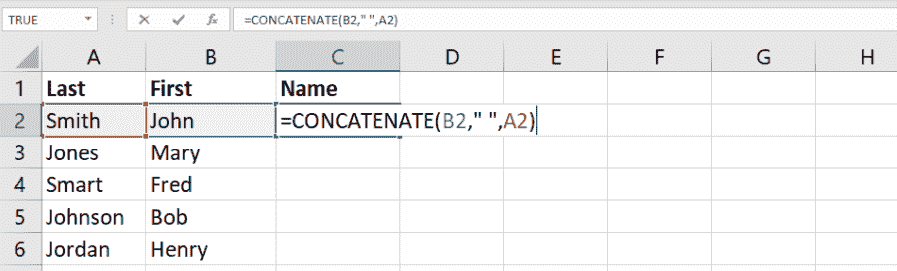
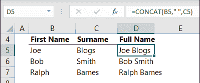
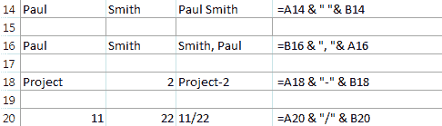

# 在 Excel 中连接–如何组合文本和连接字符串

> 原文：<https://www.freecodecamp.org/news/concatenate-in-excel-how-to-combine-text-and-concat-strings/>

处理 Excel 工作簿时，数据的结构可能不符合您的需求和目标。

有时，您可能需要将一个单元格的内容拆分到不同的单元格中。您可能还需要进行相反的操作，将多列中的数据合并到一列中。

第二个过程称为串联。最常见的情况是，在 Excel 中使用串联来连接姓名和地址、显示时间和日期等数据。

在本指南中，我们将详细介绍连接，并研究您可以在不同情况下使用的技术。

## “串联”是什么意思？

通常，Excel 允许您以两种方式合并数据:您可以合并单元格或连接它们的值。

第一个选项意味着将多个单元变成一个单元。因此，您会得到跨多列或多行显示的单个大单元格。

如果您选择连接单元格，则不会合并单元格本身，而是合并它们的内容。

串联不会影响单元格，但会连接多个值。例如，您可以使用此方法来组合不同单元格中的文本内容。在 Excel 中，这样的内容称为文本字符串。您还可以在文本内容之间插入从公式中获得的数字。

例如，您可能在 B 列中有客户的名字，在 c 列中有他们的姓氏。您可能希望 D 列包含他们的名字和姓氏，但是手动重新键入他们的名字太费时且效率低下。

在这种情况下，您可以使用连接函数，如“CONCATENATE”、“CONCAT”和“&”让我们考虑这些公式中的每一个，并找出它们的区别。

## 如何在 Excel 中连接文本字符串

### 连锁的

Excel 允许您以不同的方式连接文本字符串。首先可以使用 [CONCATENATE 函数](https://support.microsoft.com/en-us/office/concatenate-function-8f8ae884-2ca8-4f7a-b093-75d702bea31d)。在这种情况下，您的公式将如下所示:

=CONCATENATE(X1，X2，X3)

X1、X2 和 X3 是要合并的单元格。

如果您想要用空格分隔单元格的值，您可以将它们加在引号中，用逗号分隔:

=CONCATENATE(X1，" "，X2)

### 串联

CONCATENATE 是这种类型中最古老的函数，也是处理 Excel 2013 时唯一可以用来连接文本字符串的函数。

但是，如果您使用的是较新版本的 Excel，您可能会考虑更新函数。未来版本中可能也不提供串联功能。 [CONCAT](https://support.microsoft.com/en-us/office/concat-function-9b1a9a3f-94ff-41af-9736-694cbd6b4ca2) 函数适用于 Excel 2016 和 Excel Mobile。

您可以像 CONCATENATE 一样使用这个公式，但是 CONCAT 肯定更容易使用，因为它更短。

下面是上面的例子中 CONCAT 函数的样子:

=CONCAT(X1、X2、X3)

### “&”运算符

但是，您也可以选择不使用上面的任何一个公式，而选择一个更简单的选项 and 运算符(&)。这种连接单元格的方法是 Microsoft 推荐的，它比 CONCAT 和 CONCATENATE 函数更容易使用。

下面是一个您可以使用的公式示例:

=X1&X2&X3

如果您想用空格或逗号分隔单元格的值，您的公式看起来会是这样的:

= X1 & " " &

=X1& "，" &X2

使用“&”操作符是更方便的选择。此外，“&”操作符对于可以连接的字符串数量没有限制。

相比之下，CONCATENATE 函数被限制为 8，192 个字符，这意味着您最多只能使用它来连接 255 个字符串。但是，有时您可能希望使用 CONCAT 函数来保持公式的整洁，并使它们更容易阅读。

### 文本连接

组合文本内容时可以使用的另一个函数是 [TEXTJOIN](https://support.microsoft.com/en-us/office/textjoin-function-357b449a-ec91-49d0-80c3-0e8fc845691c) 。此功能仅适用于最新版本的 Microsoft Office，并且它提供了一些不错的功能。

首先，您可以选择如何分隔不同单元格的值，而无需在公式中键入空格、逗号或其他符号。

其次，TEXTJOIN 函数使您能够在包含一组参数时忽略空单元格。

Excel 中的 TEXTJOIN 函数如下所示:

=TEXTJOIN(分隔符，ignore_empty，text1，[text2]，...)

“Delimiter”是您希望在不同文本字符串之间使用的分隔符，“ignore_empty”只能取两个值:TRUE 或 FALSE。

使用 TEXTJOIN 时，您仍然可以手动添加单元格，但在这种情况下，“&”运算符会是更好的选择。TEXTJOIN 使您能够添加整个范围的单元格。

例如，您可以使用以下函数连接 A1:A4 范围内的文本字符串，用逗号分隔，忽略空值:

=TEXTJOIN("，"，TRUE，A1:A4)

如果要用空格分隔文本字符串并包含空值，公式将如下所示:

=TEXTJOIN("，FALSE，A1:A4)

## 如何用换行符连接文本字符串

大多数情况下，Excel 用户需要用空格和标点符号分隔文本字符串。在这种情况下，您可以使用前面章节中的公式，这取决于所选择的函数或运算符。

但是，有时您可能需要用回车符或换行符来分隔文本字符串。例如，您可能需要合并不同列或行中的数据和邮寄地址。

不幸的是，你不能像使用标点符号那样容易地在公式中使用换行符，因为它们不是常规字符。好消息是，通过使用 [ASCII 码](https://www.freecodecamp.org/news/ascii-table-hex-to-ascii-value-character-code-chart-2/)，你几乎可以包含任何你想要的字符。

在这种情况下，你应该使用 [CHAR 函数](https://support.microsoft.com/en-us/office/char-function-bbd249c8-b36e-4a91-8017-1c133f9b837a)。要在 Windows 中包含换行符，应该使用 CHAR(10)，因为 10 是换行的 ASCII 代码。在 Mac 上，应该使用 CHAR(13)，因为 13 是回车的 ASCII 码。

请记住，您还应该启用“文本换行”选项来正确显示结果。按 Ctrl+1，然后选择“格式单元格”菜单中的“对齐”选项卡，然后选中“文本换行”框。

## 如何连接列

要连接多列，您可以在第一个单元格中编写一个常规连接公式，然后拖动填充柄将其复制到其他单元格中。

要快速完成此操作，您可以选择包含必要公式的单元格，然后双击填充柄。Excel 会根据公式中出现的单元格来决定双击后单元格应复制的距离。因此，如果您的表格包含空单元格，您可能需要手动拖动填充柄。

## 如何连接一系列单元格

假设 CONCATENATE 和 CONCAT 函数只接受参数中的单个单元格引用，那么连接多个单元格中的值可能是一个挑战。

要快速选择多个单元格，可以按住 Ctrl 键，然后单击要合并的每个单元格。

然而，如果你处理太多的细胞，这种方法也可能太费时。在这种情况下，您可以使用[转置函数](https://support.microsoft.com/en-us/office/transpose-function-ed039415-ed8a-4a81-93e9-4b6dfac76027)，它看起来像这样:

=转置(X1:Xn)

在要包含串联区域的单元格中键入转置公式，然后单击编辑栏，按 F9 键用串联值替换公式。之后，您应该删除数组值周围的花括号，在第一个值之前键入=CONCAT(并在最后一个值之后添加右括号。

## 关于串联要记住的事情

不要忘记在连接的项目之间使用逗号。比如你想得到短语“[写我的研究论文](https://www.trustmypaper.com/write-my-research-paper)”，你的公式应该是=CONCAT("write "，" my "，" research "，" paper ")。

在此示例中，所有项目也用指定的空格分隔。您还可以在每个文本字符串后包含额外的空格，以避免在公式中单独键入它们。

如果键入=CONCAT("Hi""there ")，不带逗号，结果将如下所示:Hi"there。会出现一个额外的引号，因为参数之间没有逗号。

如果您看到“#NAME？”错误，而不是想要的结果，这可能意味着你忘记了包括一些引号。“#值！”错误意味着某些参数无效。

您还应该记住，concatenate 函数总是返回文本字符串，即使某些单元格包含数值。您还可以通过使用[文本功能](https://support.microsoft.com/en-us/office/text-function-20d5ac4d-7b94-49fd-bb38-93d29371225c)将数字转换为文本，并使用不同的公式来设置您想要与文本或符号组合的数字格式。

例如，如果您的 A2 单元格包含数字 13.6，并且您希望将其显示为美元金额，则您的公式应为=TEXT(A2，" $0.00 ")。因此，您将获得 13.60 美元。

## 包扎

Excel 允许您使用不同的函数来联接文本字符串，如 CONCATENATE、CONCAT 和“&”运算符。

虽然您只能在 Excel 2013 中使用 CONCATENATE 函数，但较新版本的 Excel 支持更易于使用的简单“&”运算符。

当连接不同单元格的值时，请注意引号和逗号，因为它们对于正确显示结果非常重要。

希望这个指南能帮你节省很多时间，让你的工作流程尽可能高效。