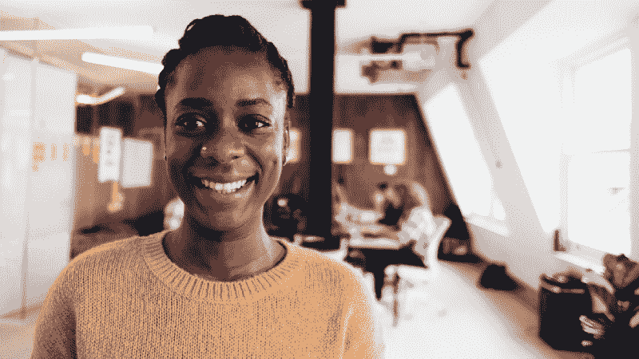
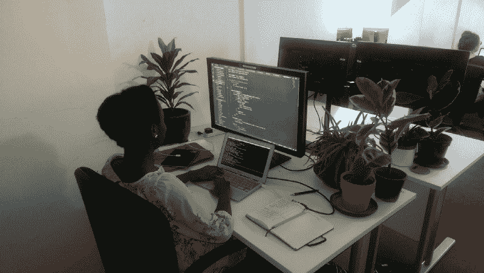
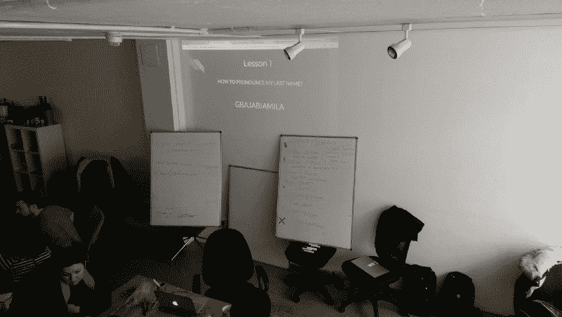
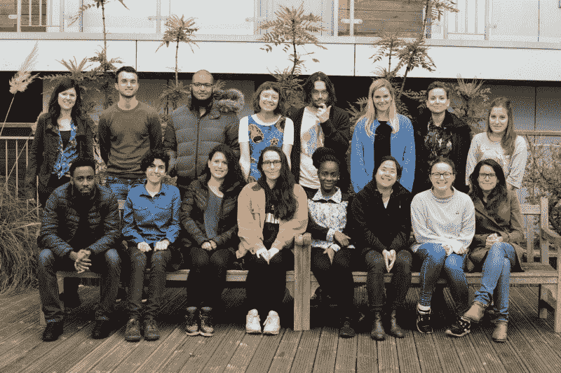

# 将点点滴滴连接起来——一个学习编码和回馈的故事

> 原文：<https://www.freecodecamp.org/news/connecting-the-dots-a-story-of-learning-to-code-and-giving-back-c8867cdffcb1/>

丽贝卡·帕丁

# 将点点滴滴连接起来——一个学习编码和回馈的故事

*Fatimat Gbajabiamila 谈论挑战刻板印象、她对结对编程的热爱，以及她致力于回馈社会的原因*

Fatimat Gbajabiamila 在伦敦的软件开发和咨询公司 27Partners 的第一周结束时，我和她坐在一起。尽管申请创始人和程序员的人平均年龄在 30 多岁，但出生于尼日利亚、童年时来到英国的 Fatimat 在 22 岁时就完成了全栈 JavaScript 的同辈培训课程。

Fatimat during her first week at 27Partners

丽贝卡:法蒂玛，非常感谢你抽出时间和我聊天。你工作的第一周怎么样？

老实说，很难相信我是靠写代码赚钱的。这是一段不平凡的旅程。

丽贝卡:据我所知，你在没有大学学位的情况下开始了一段旅程。

是的，我在完成高级考试后离开了学校，在那里我学习了经济学、商业和数学。

丽贝卡:在你听说创始人和程序员之前，你在做什么？

我在一家名为 [Futureversity](http://www.futureversity.org/) 的慈善机构担任项目协调员，为年轻人组织暑期项目并招募志愿者。我爱我的同事，但我知道这不是我想做的职业。

丽贝卡:你是如何决定要从事软件开发职业的？

嗯，当我年轻的时候，我一心想从事商业和金融方面的职业。我记得在我 10 岁的时候，作为 T2 经纪公司 Citylink 项目的一部分，我去了彭博，当时就决定有一天我要去那里工作。

丽贝卡:真的吗？就在那时，就在那里，作为一个青少年？我很难想象一个十五岁的孩子会爱上金融服务。

老实说，我认为主持人在向我们推销公司和激励我们树立远大目标方面做得非常出色。他们带我们进入新闻编辑室，那里的交易数据排列在墙上，然后来到一间满是小玩意的办公室。那次访问可能影响了我学习数学和经济学的决定，因为我想学习会计，这样我就可以为他们工作。

总之，你长大了，生活发生了变化，梦想改变了，有一天你会像我一样开始问自己一些重要的问题，比如，“我这一生要做什么？”我 21 岁，不知道未来大学毕业后我想做什么。

丽贝卡:那么你是如何从事编码工作的？

这是一个试错的过程。我尝试了一些在线课程，包括[的高管管理](https://cloud.google.com/training/admin)和[的 Salesforce Trailhead](https://trailhead.salesforce.com/) ，但发现这些课程都没有以我想要的方式挑战我。在那种工作中，有很多固定的做事方式，做好工作就是努力遵循这些方式。我几乎没有发挥创造力和独立思考的空间。

我在与年轻人一起工作的时候做了这个实验，这让我思考了很多关于改善尼日利亚受教育机会的问题，这是我的家乡，也是我早年生活的地方。尼日利亚是世界上失学儿童比例最高的国家。我想学习如何建立一个平台，让那些不能亲自到校的孩子能够在线学习课程，同时还能参加考试。

丽贝卡:这些不在学校的孩子有机会接触电脑吗？到网上？

大多数人不会，但我有一个赞助计划来解决这个问题。我从来没有构建过那个应用程序，因为我专注于构建可以解决大问题的东西，比如为非常弱势的人群提供教育，并且如此沉迷于探索构建东西的选项，比如 Wordpress 和其他 CMS，以至于在我知道之前，我痴迷于学习编码。

我想听听业内人士的意见，所以我在谷歌上搜索了一下，发现了 [Codebar](https://codebar.io/) ，这是一个非营利性组织，通过定期举办编程研讨会来促进多元化技术社区的发展。我参加了一个会议，意识到，嘿，我可以以此为职业。

在这一点上我遇到了障碍，因为我没有笔记本电脑，所以我不能在家自学编码。不过，我很幸运，因为穆罕默德(Futureversity 的一位同事)给我找到了一台 Windows 笔记本电脑。

Fatimat at Space4, the Finsbury Park home of Founders and Coders

丽贝卡:说说你对编码的入门。

有了笔记本电脑后，我开始每周去 Codebar。在我参加的第一个会议中，我和一个叫 Ben Scott 的开发人员搭档，他的指导风格很合我意。我们在做 CSS，当我对盒子模型感到困惑时，他用笔和纸把东西画了出来，这立刻为我澄清了事情。实际上，我每次都让 Codebar 给我和他配对，因为我发现和同一个导师在一起比每次向新的人介绍自己更有效率。我从他那里学到了很多基础知识。

丽贝卡:你是如何听说创始人和程序员的？

在用有限的空闲时间自学了几个月后，我决定全力以赴。但是我没有钱，所以付费训练营对我来说不是一个真正的选择。

我是从 Codebar 的一位校友那里了解到创始人和程序员的。她让我相信“这是免费的，而且是合作的。”我去了那个解释申请流程的网站，并决定在走上这条路之前，我应该确保它真的适合我。

于是我拨打了网站上的号码，令我惊讶的是，丹(创始人和编码者的创始人兼执行董事)接起了电话。他真的很鼓励我，并和我深入地谈论了申请过程和课程。我记得我心里想，“他都不认识我，怎么会这么好？”打完那个电话后，我所有的疑虑都消失了，我全身心地投入到申请过程中。

丽贝卡:说说你在这门课上的经历。

**Fatimat:** 从课程内容，到教与学的方法，到环境与人……只是，一切。《创始人与程序员》对我来说是一次非常棒的经历。这是我人生中第一次，早起没有问题，即使我经常熬夜工作，因为我期待着球场上的每一天。

丽贝卡:有什么特别的亮点吗？

**Fatimat:** 老实说，在这样一个环境中，我每天都面临挑战，不会感到压力，不再是我自己，这种感觉真好。

丽贝卡:你是什么意思？

当你来自某个特定的背景时，人们通常会对你应该如何表现有误解或刻板印象。奇曼达·恩戈齐·阿迪奇的 TED 演讲[单一故事的危险](https://www.ted.com/talks/chimamanda_adichie_the_danger_of_a_single_story/transcript?language=en)完美地总结了这一点。对我来说，当我进入一个新的环境，尤其是一个专业的环境，我的行为就像你期望任何年轻专业人士的行为一样，但通常有人会质疑我是否真诚。就像他们期望我是房间里声音最大的人，或者在某些方面表现得很蛮横，因为这是他们听到的关于黑人女性的唯一故事。因此，我常常需要更长的时间来建立关系，这有时会阻碍我的进步。

另外，正如我之前所说的，我没有在 A-levels 之后去上大学。尽管我的大多数同学都上了大学，但我从未因为没有上大学而觉得受到了批评或不如他们。重要的是我们在球场上做了什么，我总是因为我带来的东西而受到同龄人的尊重。

丽贝卡:你认为是创始人和程序员的环境让你成为了你自己？

**Fatimat:** 在创始人和程序员课程的第一天，Dan 做了一个关于这个项目和社区的演讲，从每个人的反应和房间里的氛围来看，我觉得我可以做我自己。我认为我们都在一起，这不是一场比赛…这减轻了我通常感觉到的压力，并帮助我以清晰的头脑专注。

我并不觉得问问题有什么不好意思，因为我知道我们的导师都是刚刚参加过这个项目的人，他们知道困惑是什么感觉。知道我们的导师已经完成了课程，并在这个行业工作，帮助我保持了最终我也会到达那里的信念。

在我的笔记本上，我有一个标签，

> "相信这些点会以某种方式连接起来"

几乎每次有人和我搭档时，他们都会开玩笑，

> "这些点联系起来了吗？"

Fatimat’s laptop, with her note-to-self about connecting the dots on the top right-hand corner

Rebecca: 告诉我更多关于你在创始人和程序员中同伴引导学习的经历。

我有在 Codebar 进行结对编程的经验，但是在 Founders and Coders，大部分时间都是从早上十点到晚上六点结对。在一个人身边度过的时间太多了！在第一个项目之后，当我们作为一个四人团队建立一个[单页网站](https://fac-12.github.io/webify/)时，我无法想象以任何其他方式工作。

我想你可以说我在创始人和程序员的经历宠坏了我！

丽贝卡:怎么会这样？

嗯，当我面试工作的时候，我很清楚我不想总是一个人写代码。我真的相信在这个领域，两个人的智慧胜过一个人。

此外，在创始人和程序员那里，你的团队就像一个家庭。这不是那些声称是一个家庭，但他们的行动证明不是这样的地方之一。我们一起为组织做决定，我们一起编码，最棒的是我们一起聚会。我不再担心独自去参加聚会/科技活动，因为我知道当我到达那里时，我很可能会遇到创始人和程序员的校友，尽管他们可能不是我的同事，但我们会是好朋友。

所以当我开始面试的时候，我知道我想去一个真正有社区感觉的地方工作。

丽贝卡:在课程的后半部分，你做了两个更长的项目。我很想听听你开发的应用程序。

在第一个项目中，我们互相推荐应用程序的想法。我的想法是开发一个名为 HomeSafe 的网络应用程序，如果除了常规监护人之外的其他人来接孩子，它将允许父母通知他们孩子的学校，我的三个同学选择了与我合作。

我们一开始进展缓慢，因为我们花了很多时间讨论如何利用分配的两周时间来构建我们想要的所有功能。最后，我对团队非常自信，从一些小的东西开始，从那里开始，一次增加一个特性到 MVP。最后，我们构建了一个漂亮的 web 应用程序，对于一个两周的构建来说，它具有令人印象深刻的大量特性。

Fatimat explaining how to pronounce her last name before a presentation

丽贝卡:你的客户项目怎么样了？告诉我你和谁一起工作以及开发过程。

**Fatimat:** 在课程的最后一个月，我们为 [Courtauld 艺术学院](https://courtauld.ac.uk/)开发了一个应用程序，该学院是世界领先的艺术和建筑历史研究和保护中心。他们一直在与志愿者合作，对他们的 Courtauld Connects 倡议的大量照片和艺术藏品进行编目和数字化，当时他们正准备将目前的志愿者人数增加两倍以上，以加快这个多年期项目。

最初他们希望我们帮助数字化，但在我们与他们一起设计了一天后，我们意识到这是一个太大的项目，我们无法在三周内完成。相反，我们决定专注于改善志愿者体验。我们与志愿者交谈，了解到他们希望感觉像一个社区，并定期获得进展更新，以了解他们对整个组织的影响。

丽贝卡:结果怎么样？志愿者一直在用吗？

**Fatimat:** 最后，我们在[开发了一个应用](https://courtauld.herokuapp.com/login)，它有一个志愿者目录，志愿者可以互相分享有趣的图片，工作人员/志愿者可以定期发布项目更新，这个应用一直沿用至今。

丽贝卡:当你完成课程后，你花了一周时间指导下一批学员。我很想听听你作为导师的经历。这些点最终联系起来了吗？

事实上，我选择在第二周指导测试驱动开发，我最初发现这真的很难，因为我想在材料上花更多的时间。我希望通过向新生解释这些内容，我可能会喜欢。老实说，我有点害怕。在指导新学员之前，我见过他们中的一些人，看过他们的个人网站，在我看来，他们在开始课程之前知道的比我在完成课程之后知道的更多。我不确定我是否能教会他们任何东西。

我们结对成为导师，我发现和搭档一起准备的整个过程非常有价值——事实上，当我们完成计划时，我已经觉得自己更有能力和信心，可以和新同学分享一些有用的东西。最后，我真的很喜欢指导，让我欣慰的是，这些点最终为我连接到了测试的主题上！

Rebecca :在创始人和程序员中，你以幽默感著称。你有什么特别傻的时刻想分享吗？

**Fatimat:** 我是“创始人和程序员的终结”派对的 DJ。我得到了很好的反馈；所以谁知道呢，如果编码不成功，DJ Fatz 可能是另一个选择。我现在应该开始上课了。

Fatimat with her cohort at Founders and Coders

Rebecca: 你之前开玩笑说创始人和程序员在面试时宠坏了你。你能告诉我更多关于你找工作的经历吗？

我们的商务经理 Joe 在创始人和程序员期间和之后都给予了支持。每个人的情况都是不同的，乔认识到了这一点，并在给我们建议时考虑到了这一点。完成训练营后，我有一些事情要整理，所以我不能马上找工作，乔经常给我发消息，只是想看看我做得怎么样，问他是否能在任何方面有所帮助。当我准备找工作时，他倾听了我对在这个行业工作的担忧，并关注了我想在什么样的环境中工作，这帮助他将我安置在了我现在的雇主 27Partners。在我们一对一的聊天中，他还给我买了食物，所以这可能是免费的食物聊天。我在开玩笑——乔在他所做的事情上确实很棒。

丽贝卡:你在 27Partners 的角色是什么？你将从事什么样的项目？

**Fatimat:** 是一个初级的 JavaScript 开发者角色。我将负责该公司的客户端产品和它自己的平台 StoryShare。公司希望很快发展壮大，所以加入他们似乎是一个令人兴奋的时刻，希望我能成为其中的一员。到目前为止，我可以自由地继续为他们的项目做贡献，如果需要的话，我可以选择寻求帮助。我们就如何更好地合作进行了讨论，我将向团队传授我从创始人和程序员那里学到的一些东西，当然包括结对编程！

丽贝卡:为我展望未来。你的目标是什么？

现在，我只是专注于度过作为专业开发人员的第一年！但是我仍然热衷于建立我之前告诉你的学习平台。

我也非常相信回馈社会。如果我在生活中勇往直前，却不回报给我这么多的社区，那我就太自私了。在成长过程中，很多人通过慈善组织和授权计划与我一起工作。我参加了[王子信托团队项目](https://www.princes-trust.org.uk/help-for-young-people/programmes)、[起义领袖项目](https://uprising.org.uk/programmes/uprising-leadership-programme)、[职业准备](https://careerready.org.uk)、[艾伦& Overy Smart Start 体验](http://www.allenovery.com/corporate-responsibility/probono-community/education/Pages/smart-start.aspx)和 FutureVersity 暑期课程。我致力于帮助他人成长，尤其是年轻人——从我的兄弟姐妹开始——并成为一个榜样。

学习编码时，我得到了 Codebar、 [Nodegirls](https://nodegirls.com/) 的支持，通过 [Thoughtbot 指导计划](https://thoughtbot.com/london-mentoring)得到了 Thoughtbot 的 Rob 的支持，通过 [Recwork Meet a Mentor 计划](https://recworks.co.uk)得到了来自 YLD 的 Fabio 的支持，以及在创始人和程序员聚会上得到 Peter Rhodes 的支持。

所以今年夏天，我为青少年举办了两次编码入门(HTML 和 CSS)研讨会。我在 WAC 艺术学院做过一次，是通过创始人和程序员，另一次是在 Futureversity。我很有兴趣在未来举办更多的工作坊，以及在 Codebar 和 CodeYourFuture 做导师。

丽贝卡:你承诺为下一代将点点滴滴连接起来，这让我深受鼓舞！

我能说什么呢，对我来说很重要的是，我为别人做了很多人为我做的事，然后你知道，向前回报。

丽贝卡:再次感谢你的聊天，法蒂玛。

**法蒂玛:**天凉了。谢谢大家！

要了解更多关于免费培训项目的信息，请访问[www.foundersandcoders.com](http://www.foundersandcoders.com.)。