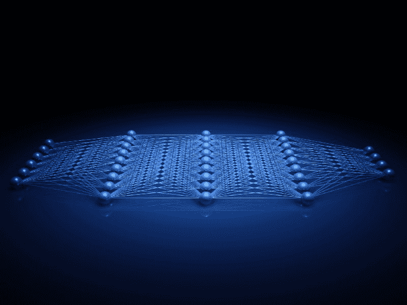
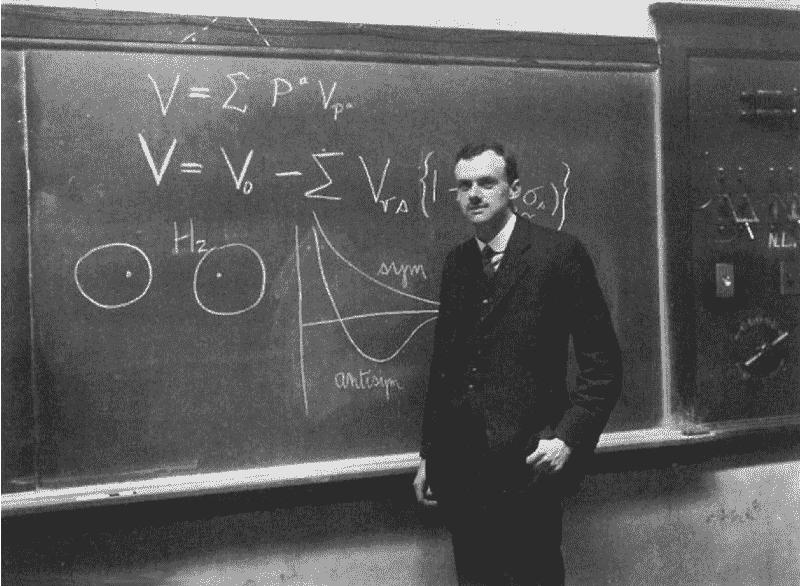
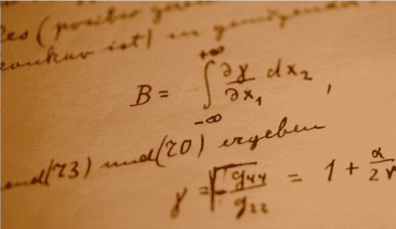
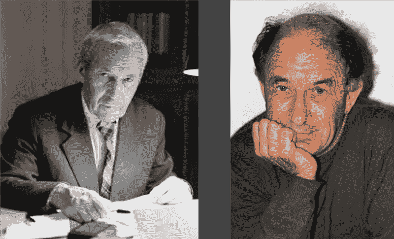
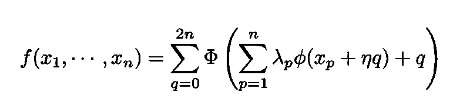
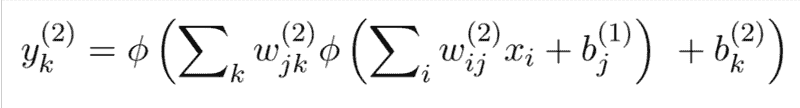
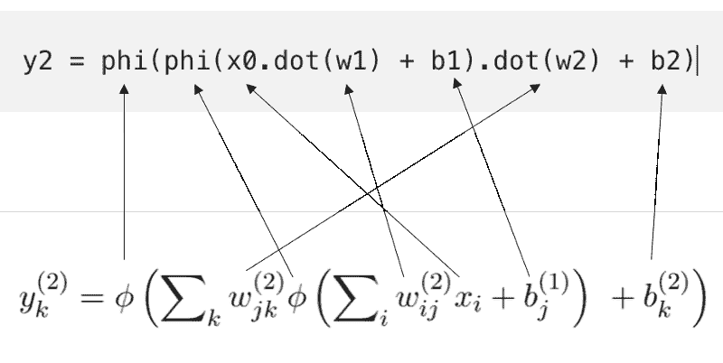

# 神经网络和纯数学之间的联系

> 原文：<https://www.freecodecamp.org/news/connections-between-deep-learning-physics-and-pure-mathematics-part-i-947abeb3a5dd/>

马可·塔沃拉



# 神经网络和纯数学之间的联系

#### 一个深奥的定理如何给出关于人工神经网络能力的重要线索

如今，人工智能几乎存在于我们生活的每一个部分。智能手机、社交媒体、推荐引擎、在线广告网络和导航工具都是基于人工智能的应用程序的例子，这些应用程序每天都在影响着我们。

深度学习一直在系统地改善语音识别、自动驾驶、机器翻译和视觉对象识别等领域的最先进水平。然而，深度学习如此出色的原因尚未完全明了。

### 数学的启示

保罗·狄拉克是量子力学之父之一，可以说是自 T2 爵士艾萨克·牛顿以来最伟大的英国物理学家，他曾经评论说，使用数学推理的 T4 方法会使物理学进步

> “……使人能够推断尚未进行的实验的结果。从逻辑上讲，没有理由认为[…]方法应该是可行的，但人们在实践中发现，这种方法确实有效，并取得了相当大的成功。这必须归因于自然界的某种数学性质，一种自然的偶然观察者不会怀疑的性质，但它仍然在自然界的计划中发挥着重要作用。”

> —保罗·狄拉克，1939 年



Portrait of Paul Dirac is at the peak of his powers (Wikimedia Commons).

历史上有许多这样的例子:纯粹抽象的数学概念最终导致了远远超出其发展背景的强大应用。这篇文章就是其中的一个例子。

虽然我从事机器学习已经有几年了，但我是一名训练有素的理论物理学家，而且我对纯数学情有独钟。最近，我对深度学习、纯数学和物理之间的联系特别感兴趣。

这篇文章提供了数学分支[数学分析](https://en.wikipedia.org/wiki/Real_analysis)中强大技术的例子。我的目标是使用严格的数学结果来尝试“证明”，至少在某些方面，为什么深度学习方法的效果如此令人惊讶。


Abstract representation of a neural network ([source](https://www.shutterstock.com/g/ktsdesign)).

### 一个美丽的定理

在这一节中，我将论证人工神经网络如此强大的原因之一与其神经元输出的数学形式密切相关。



A manuscript by Albert Einstein ([source](http://www.alberteinstein.info/manuscripts.html)).

我将使用一个著名的定理来证明这个大胆的主张，这个定理最初是由两位俄罗斯数学家在 50 年代末证明的，即所谓的 [Kolmogorov-Arnold 表示定理](https://en.wikipedia.org/wiki/Kolmogorov%E2%80%93Arnold_representation_theorem)。



The mathematicians Andrei Kolmogorov (left) and Vladimir Arnold (right).

#### 希尔伯特的第十三个问题

1900 年，[戴维·希尔伯特](https://en.wikipedia.org/wiki/David_Hilbert)，20 世纪最有影响力的数学家之一，提出了著名的[问题集](https://en.wikipedia.org/wiki/Hilbert%27s_problems)，有效地设定了 20 世纪数学研究的进程。

Kolmogorov–Arnold 表示定理与著名的希尔伯特问题之一有关，所有这些问题都极大地影响了 20 世纪的数学。

#### 接近与神经网络的联系

这些问题中的一个问题，即第 13 个问题(具体地说，第 13 个问题(T1))的推广，考虑了将 n 个变量(T2)的函数表示为由φ和ϕ(t5)表示的单个变量的两个函数的和与合成的组合的可能性。

更具体地说:



Kolmogorov-Arnold representation theorem

这里， *η* 和λs 是实数。需要注意的是，这两个一元函数是φ和 *ϕ* 可以有高度复杂的(分形)结构。

Kolmogorov (1957)、Arnold (1958)和 Sprecher (1965)的三篇文章提供了必须存在这种表示的证明。这个结果是相当出乎意料的，因为根据它，多元函数令人困惑的复杂性可以“翻译”成一元函数的琐碎操作，如加法和函数合成。

### 现在怎么办？

如果你已经做到了这一步(如果你做到了，我会很激动)，你可能会想:一个来自 50 年代和 60 年代的深奥定理怎么可能与人工神经网络等前沿算法有丝毫关系？

### 神经网络激活的快速提示

在神经网络的每个节点计算的表达式是其他函数的组合，在这种情况下，是所谓的激活函数。这种组合的复杂程度取决于包含节点的隐藏层的深度。例如，第二个隐藏层中的节点执行以下计算:



Computation performed by the k-th hidden unit in the second hidden layer.

其中 *w* s 是权重， *b* s 是偏差。与上面几段展示的多元函数 *f* 的相似性显而易见！

让我们快速地用 Python 写下一个仅用于前向传播的函数，它输出由神经元执行的计算。下面的函数代码包含以下步骤:

*   **第一行**:第一激活函数 *ϕ* 作用于由下式给出的第一线性步长:

```
x0.dot(w1) + b1
```

其中`x0`是输入向量。

*   第二行:t 第二激活函数作用于第二线性步骤

```
y1.dot(w2) + b2
```

*   **第三行:**一个 [softmax 函数](https://en.wikipedia.org/wiki/Softmax_function#Neural_networks)用于神经网络的最后一层，作用于第三个线性步骤

```
y2.dot(w3) + b3
```

完整的功能是:

```
def forward_propagation(w1, b1, w2, b2, w3, b3, x0):        y1 = phi(x0.dot(w1) + b1)    y2 = phi(y1.dot(w2) + b2)    y3 = softmax(y2.dot(w3) + b3)        return y1, y2, y3
```

为了与上面的表达式进行比较，我们写下:

```
y2 = phi(phi(x0.dot(w1) + b1).dot(w2) + b2)
```

这种对应关系可以说得更清楚:



### 两个世界之间的联系

因此，我们得出结论，由 Kolmogorov、Arnold 和 Sprecher 证明的结果意味着神经网络，其输出仅仅是函数的重复组合，是非常强大的对象，可以表示任何多元函数或等价地几乎自然界中的任何过程。这部分解释了为什么神经网络在如此多的领域工作得如此之好。换句话说，神经网络的泛化能力至少部分是 Kolmogorov-Arnold 表示定理的结果。

正如 Giuseppe Carleo 所指出的，函数的函数的函数的泛化能力*ad**恶心***在某种程度上是“自然也独立发现的”,因为如上所示工作的神经网络正是这样做的，是描述我们大脑如何工作的一种简化方式。

非常感谢你的阅读！建设性的批评和反馈总是受欢迎的！

我的 [Github](https://github.com/marcotav) 和我的网站 [www.marcotavora.me](https://marcotavora.me/) 有一些关于数据科学和物理学的其他有趣的东西。

接下来还有很多，敬请期待！