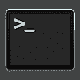
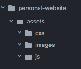
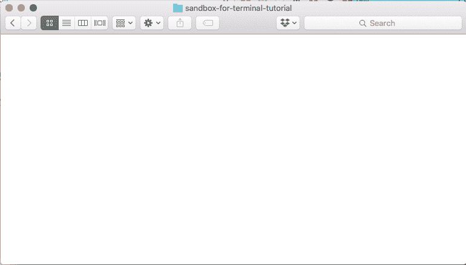
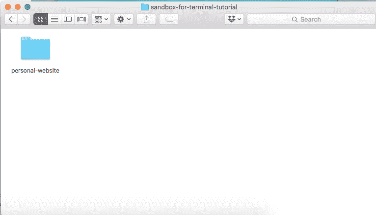
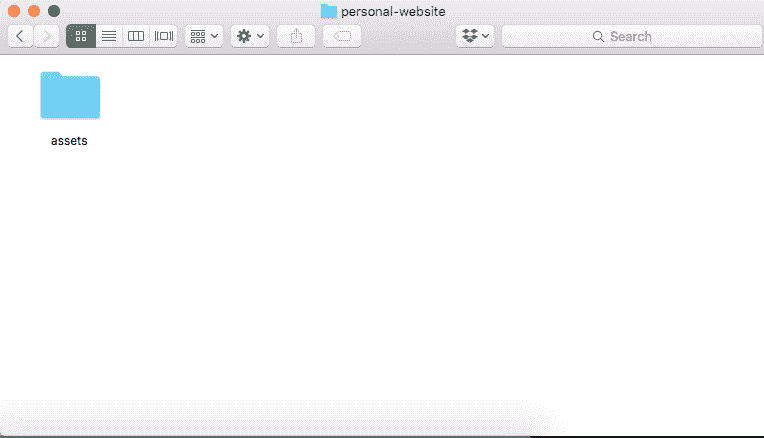
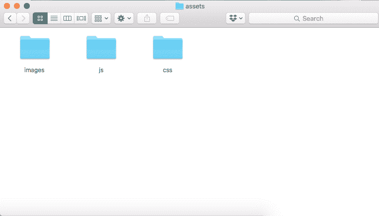
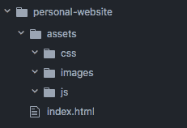

# 征服命令行

> 原文：<https://www.freecodecamp.org/news/conquering-the-command-line-f85f5e46c07c/>

莫妮卡·鲍威尔

#### UNIX/Mac OS 终端入门简要指南

当我第一次接触命令行时，我真的不得不适应在一个只有文本的黑盒中导航我的计算机。所以我尽量避免命令行。我习惯了计算机通常提供的视觉提示和反馈。从很多方面来说，我感觉自己在重新学习如何通过命令行使用电脑。

然而，自从第一次学习如何使用 UNIX 命令来操作我的电脑，我就知道命令行不一定是一件可怕的事情，因为在命令行上键入密码时没有视觉反馈。出于安全考虑，当您键入密码时，不会显示任何内容来表明已经输入了任何字符。

#### 命令行是什么？

命令行是一种软件，它执行命令或指令，供计算机操作其文件系统或与之交互。

### 什么是 UNIX？

#### 为什么使用命令行？

*   更快地修改，在文件间导航
*   能够以超级用户身份安装软件
*   可以看到隐藏的点文件
    点文件是 UNIX 配置文件，它们往往是以`.`开头的文件，对普通用户是隐藏的。
    你可以[在这篇文章](https://medium.com/@webprolific/getting-started-with-dotfiles-43c3602fd789)中了解更多关于 dotfiles 的入门知识。

为了从命令行开始，您应该导航到您的应用程序并打开**终端**应用程序。

Above is the Terminal Icon on Mac.

### 在命令行上创建一个基本的网站文件夹

Folder structure of sample project

通过在空目录中键入命令，可以在命令行上创建具有上述结构的文件夹:

We start inside of an empty directory!

*   制作一个名为个人网站
    `mkdir personal-website`的目录(也称为文件夹)

We’ve created a folder named personal-website

*   导航到名为个人网站
    `cd personal-website`的目录内
*   在名为 assets
    `mkdir assets`的个人网站文件夹中创建一个目录

We’ve created a folder inside of personal-website to contain all of our assets

*   在个人网站文件夹
    `cd assets`内的资产文件夹内导航
*   在名为 images
    `mdkir images`的资产文件夹内创建一个目录
*   在 assets 文件夹中创建一个目录，名为 js
    `mkdir js`
*   在名为 css
    `mkdir css`的 assets 文件夹中创建一个目录

We’ve created folders inside of personal-website/assets to store our project’s assets

哇哦！我们忘记创建一个 index.html 文件:(

我们在资产文件夹，并希望在我们的主要个人网站文件夹 index.html 文件。键入`cd ..`将把我们移出资产文件夹，进入上面是个人网站的目录。现在我们在个人网站文件夹中，如果我们键入`touch index.html`，将会创建一个空白的 index.html 文件。

### 一些常用的终端命令有:

#### 导航/操作文件系统的命令

**ls**
列表目录中的内容

**pwd**
**打印工作目录**让终端显示你当前工作的目录

**触摸**
创建或打开一个文件而不做任何更改
当你想创建空文件而不离开命令行时非常方便

**sudo**
这允许你作为**超级用户**运行命令

**mv**
**移动**一个文件或目录
这可以用来通过更新文件路径来移动或重命名文件

**cd**

**mkdir**
使成为一个新的**目录**(或一个文件夹)

#### **安装软件的命令**

您可以使用以下命令从命令行安装一些软件:

*   在 Python 中`pip install <package nam` e >。
    Pip 是 Python 的软件包管理器。
*   在 JavaScript 中，NPM 是 JavaScript 页面的包经理。

#### 运行软件的命令

为了在命令行上运行脚本，您需要提供命令提示符和文件名。一些例子是:

*   在 java 中`javac filename.java`然后`java filename`编译 Java 项目然后运行它们。
*   在 python 中 `python filename`运行 Python 脚本。

如果您发现您正在重复许多命令，您可以使用向上/向下箭头滚动查看您最近的命令，编辑它们，然后通过导航到它们并按 enter 键来重新运行。

#### 命令行提示符入门的其他资源

*   [MIT Terminus(互动游戏学习命令行)](http://web.mit.edu/mprat/Public/web/Terminus/Web/main.html)
*   [Codecademy 学习命令行](https://www.codecademy.com/learn/learn-the-command-line)
*   [艰难地学习 Python 的命令行速成班](https://learnpythonthehardway.org/book/appendixa.html)

#### 装饰命令行

您可以在命令行上完全自定义颜色和输出，以更好地满足您的视觉和审美需求。

以下是我如何让我的命令行更漂亮的:

如何安装明晚
[https://github . com/chriskempson/明日-主题/blob/master/OS % 20X % 20 终端/明日% 20 终端](https://github.com/chriskempson/tomorrow-theme/blob/master/OS%20X%20Terminal/Tomorrow%20Night.terminal)

[**定制终端**](https://mindthecode.com/customize-the-terminal/)
[*我爱终端。除了让你在使用它的时候看起来很棒之外，它还可以做很多…*mindthecode.com](https://mindthecode.com/customize-the-terminal/)

如果你喜欢阅读这篇文章，可以考虑点击拍手按钮？。想看更多我的作品吗？在 h[TTP://about Monica . com .](http://aboutmonica.com)查看我的代码并了解更多我的开发经验