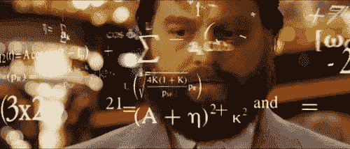

# 不断的困惑:为什么我仍然使用 JavaScript 函数语句

> 原文：<https://www.freecodecamp.org/news/constant-confusion-why-i-still-use-javascript-function-statements-984ece0b72fd/>

早在 90 年代末——当我学习 JavaScript 时——我们被教导使用**函数语句**编写“Hello World”函数。像这样…

```
function helloWorld() {
  return ‘Hello World!’;
}
```

这些天来，似乎所有的酷小孩都是这样写“Hello World”函数的…

```
const helloWorld = () => 'Hello World!';
```

这是 ES2015 JavaScript 中的一个**函数表达式**，非常性感。看着很美。都是一条线。如此简洁。太可爱了。

它使用箭头功能，这是 ES2015 最受欢迎的[功能之一。](http://www.2ality.com/2015/07/favorite-es6-features.html)

当我第一次看到这个的时候，我想:


Even though [Babel](http://babeljs.com) is free.

因此，在使用了近 20 年的 JavaScript 并在许多项目中使用了 ES2015 之后，我今天将如何编写“Hello World”函数:

```
function helloWorld() {
  return ‘Hello World!’;
}
```

现在我已经向你展示了新的方式，我相信你几乎不能忍受看上面的旧学校代码。

一个简单的小函数需要三行代码！所有那些多余的字符！

我知道你在想什么…


Ain’t nobody got time for that!

我喜欢箭头函数，真的。但是当我需要在代码中声明一个顶级函数时，我仍然使用一个很好的老式函数语句。

“鲍勃叔叔”马丁的这句话解释了为什么:

> “……花在阅读和写作上的时间比远远超过 10 比 1。作为编写新代码工作的一部分，我们不断地阅读旧代码。
> 
> 因为这个比例如此之高，所以我们希望代码的阅读变得容易，即使这会让编写变得更加困难。”
> 
> —罗伯特·c·马丁
> 《干净的代码:敏捷软件工艺手册》

与函数表达式相比，函数语句有两个明显的优势:

#### 优势 1:意图清晰

当一天浏览数千行代码时，能够尽可能快速、轻松地理解程序员的意图是很有用的。

看看这个:

```
const maxNumberOfItemsInCart = ...;
```

你读了所有这些字符，但仍然不知道省略号代表的是函数还是其他值。可能是:

```
const maxNumberOfItemsInCart = 100;
```

…或者也可能是:

```
const maxNumberOfItemsInCart = (statusPoints) => statusPoints * 10;
```

如果使用函数语句，就没有这种歧义。

看看:

```
const maxNumberOfItemsInCart = 100;
```

…与:

```
function maxNumberOfItemsInCart(statusPoints) {
  return statusPoints * 10;
}
```

从一开始，意图就非常清楚。

但是也许你使用的代码编辑器有一些颜色编码的线索。也许你是一个速读者。也许你只是觉得这没什么大不了的。

我听到了。简洁仍然看起来很性感。

事实上，如果这是我唯一的理由，我可能会找到一种方法来说服自己这是一个值得的交易。

但这不是我唯一的理由…

#### 优势 2:声明的顺序==执行的顺序

理想情况下，我希望或多或少地按照我期望的代码执行顺序来声明我的代码。

对我来说，这是最重要的:任何使用 const 关键字声明的值在执行到之前都是不可访问的。



Prepare for fancy jargon that proves I kinda know what I am talking about (hopefully).

给你一个合理的警告:我要对你使出浑身解数，“JavaScript 教授”。在下面所有的行话中，你唯一需要明白的是**你不能使用一个常量，直到你声明了它**。

以下代码将引发错误:

```
sayHelloTo(‘Bill’);

const sayHelloTo = (name) => `Hello ${name}`;
```

这是因为，当 JavaScript 引擎读取代码时，它会**绑定**“sayHelloTo”，但不会**初始化**它。

JavaScript 中的所有声明都是早期绑定的，但它们的初始化方式不同。

换句话说，JavaScript **绑定**“say hello to”的声明——首先读取它，并在内存中创建一个空间让**保存它的值**——但它不会**设置**“say hello to”为任何值，直到它在**执行**期间到达该值。

“sayHelloTo”被绑定和“sayHelloTo”被初始化之间的时间称为**时间死区** (TDZ)。

如果你直接在浏览器中使用 ES2015(而不是用 Babel 之类的东西转到 ES5)，下面的代码实际上也会抛出一个错误:

```
if(thing) { 
  console.log(thing);
}
const thing = 'awesome thing';
```

上面的代码是用“var”而不是“const”编写的，它会抛出一个错误，因为 var 在绑定时被初始化为*未定义的*，而 const 在绑定时根本没有初始化。但是我跑题了…

函数语句不会遇到这个 TDZ 问题。以下是完全有效的:

```
sayHelloTo(‘Bill’);

function sayHelloTo(name) {
  return `Hello ${name}`;
}
```

这是因为函数语句一绑定就被初始化——在执行任何代码之前**。**

因此，无论您何时声明该函数，只要代码开始执行，它就可用于其**词法范围**。


Professor JavaScript, out!

我上面描述的迫使我们写看起来颠倒的代码。我们必须从最底层的功能开始，一步步向上。

我的大脑不是那样工作的。我想先了解背景再了解细节。

大多数代码是由人类编写的。因此，大多数人的理解顺序大致遵循大多数代码的执行顺序是有道理的。

事实上，如果我们能在代码的顶部提供一点 API 的总结不是很好吗？有了函数语句，我们完全可以。

看看这个(有点做作的)购物车模块…

```
export {
          createCart,
       addItemToCart,
  removeItemFromCart,
        cartSubTotal,
           cartTotal,
            saveCart,
           clearCart,
}

function createCart(customerId) {...}

function isValidCustomer(customerId) {...}

function addItemToCart(item, cart) {...}

function isValidCart(cart) {...}

function isValidItem(item) {...}

...
```

对于函数表达式，它看起来会像…

```
...

const _isValidCustomer = (customerId) => ...

const _isValidCart = (cart) => ...

const _isValidItem = (item) => ...

const createCart = (customerId) => ...

const addItemToCart = (item, cart) => ...

...
export {
          createCart,
       addItemToCart,
  removeItemFromCart,
        cartSubTotal,
           cartTotal,
            saveCart,
           clearCart,
}
```

想象一下，这是一个更大的模块，有许多小的内部函数。你喜欢哪个？

有些人会争辩说，在你声明某样东西之前就使用它是不自然的，会产生意想不到的后果。甚至有极其聪明的人说过这样的话。

一种方式比另一种方式更好，这绝对是一种观点，而不是事实。

但如果你问我:**代码就是交流。好的代码讲述一个故事。**

我会让编译器和 transpilers，minifiers 和 uglyfiers 为机器处理优化代码。

我想优化我的代码，让**人能够理解**。

### 但是，那些箭头函数呢？

是的。依然性感依然牛逼。

我通常使用箭头函数将一个小函数作为一个值传递给一个更高阶的函数。我用箭头函数来表示承诺、映射、过滤和减少。他们是蜜蜂的膝盖，我的朋友！

一些例子:

```
const goodSingers = singers.filter((singer) => singer.name !== 'Justin Bieber');

function tonyMontana() {
  return getTheMoney()
           .then((money) => money.getThePower())
           .then((power) => power.getTheWomen());
}
```

在本文中，我使用了一些其他新的 JavaScript 特性。如果你想了解更多关于最新的 JavaScript 标准(ES2015)和它提供的所有很酷的特性，**你应该[免费获得我的快速入门指南](https://devmastery.com/signup/es6quickstart/index.html)。**

我的目标是帮助尽可能多的开发者，如果你觉得这篇文章有用，请点击❤(推荐)按钮，这样其他人也会看到它。谢谢！