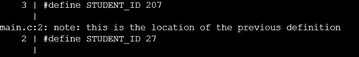
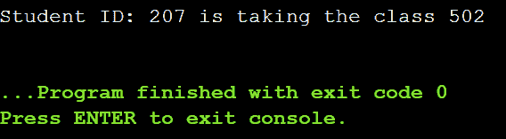
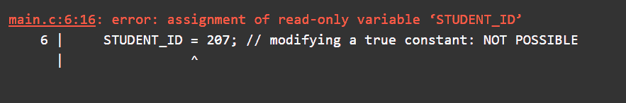

# 解释了 C 语言中的常量——如何使用#define 和 const 限定符来定义常量

> 原文：<https://www.freecodecamp.org/news/constants-in-c-explained-how-to-use-define-and-const-keyword/>

当你编程时，有时你会希望某些变量的值保持不变。在 C 语言中，您可能会将它们定义为常量。

你可以用几种不同的方法在 C 中定义常量。在本教程中，您将学习如何使用`#define`和`const`限定符来定义它们。

让我们开始吧。

## 如何用`#define`在 C 中定义常数

在 C 中定义常量的一种常见方法是使用`#define`预处理指令，如下所示:

```
#define <VAR_NAME> <VALUE>
```

在上面的语法中:

*   `<VAR_NAME>`是常量名称的占位符。
*   建议您用大写字母命名常量，因为这有助于将它们与程序中定义的其他变量区分开来。
*   `<VALUE>`是`<VAR_NAME>`所取值的占位符。
*   `#define`是一个预处理指令。
*   在程序编译之前，预处理器将所有出现的`<VAR_NAME>`替换为`<VALUE>`。

在 C 语言中，预处理器在编译之前处理源代码，以产生扩展的源代码。如下图所示。


C Preprocessor

在程序的头文件后面包含所有*常量*的定义是一个很好的做法，如下所示:

```
#include <stdio.h>

#define CONSTANT_1 VALUE_1
#define CONSTANT_2 VALUE_2
//

int main()
    {
        //statements here
    }
```

在下一节中，您将看到一个使用`#define`声明 C 常量的示例。

### 如何使用`#define`示例声明常量

考虑下面的代码片段，其中有两个常量`STUDENT_ID`和`COURSE_CODE`。

```
#include <stdio.h>
#define STUDENT_ID 27
#define COURSE_CODE 502

int main()
{
    printf("Student ID: %d is taking the class %d\n", STUDENT_ID,COURSE_CODE);

    return 0;
}

# Output
Student ID: 27 is taking the class 502 
```

在本例中:

*   预处理器将`STUDENT_ID`和`COURSE_CODE`分别替换为 27 和 502。所以`main()`的主体功能现在将是:

```
int main()
{
    printf("Student ID: %d is taking the class %d\n", 27, 502);

    return 0;
}
```

*   由于`printf()`函数可以打印出格式化的字符串，两次出现的格式说明符`%d`(用于十进制整数)被替换为 27 和 502。

> 虽然`#define`允许你定义常量，但是你应该小心*不要在程序的其他地方重新定义*。

例如，下面的代码，你已经重新定义了`STUDENT_ID`。它将编译和执行没有错误。

```
#include <stdio.h>
#define STUDENT_ID 27
#define STUDENT_ID 207 //redefinition of a #define constant.
#define COURSE_CODE 502

int main()
{
    printf("Student ID: %d is taking the class %d\n", STUDENT_ID,COURSE_CODE);

    return 0;
} 
```

根据你的编译器，你可能会得到一个警告，提示你试图*重定义*一个已经定义的常量。



并且将使用最新定义中的值。

注意重新定义的值`207`如何被用作`STUDENT_ID`，覆盖了先前定义的值`27`。



所以你现在知道了`#define`常数在某种意义上不是真正的常数，因为你总是可以重新定义它们。

进入下一部分，了解`const`限定符。

## 如何在 C 语言中使用`const`限定符定义常量

在 C 语言中，`<data_type> <var_name> = <value>`是声明一个`<data_type>`类型的变量`<var_name>`，并给它赋值`<value>`的语法。

要使`<var_name>`成为常数，您只需将`const`限定符添加到该语句中，如下所示:

```
const <data_type> <var_name> = <value>;
```

> 在变量的定义中添加`const`关键字可以确保它的值在程序中保持不变。

`const`限定符将变量*设为只读。*试图在程序的其他地方修改它会在编译时抛出错误。

进入下一节，使用`const`修改前面的示例。

### 如何使用`const`限定符示例声明常量

在前一个例子中，您有常数`STUDENT_ID`和`COURSE_CODE`。现在您将使用`const`限定符将它们定义为常量。

*   因为它们都是整数，所以可以将它们定义为`int`数据类型，取预定的值:`27`和`502`。
*   在各自的定义中包含限定词`const`。

这显示在下面的代码片段中:

```
#include <stdio.h>

int main()
{
    const int STUDENT_ID = 27;
    const int COURSE_CODE = 502;
    printf("Student ID: %d is taking the class %d\n", STUDENT_ID, COURSE_CODE);

    return 0;
}

# Output
Student ID: 27 is taking the class 502 
```

您可以看到代码如预期的那样工作。

> 在 C #中，不能重定义现有变量。

例如，如果`int my_var = 2`是第一个定义，那么如果你试图将`my_var`重新定义为`int my_var = 3`，你的程序将无法成功编译。

> 但是，您总是可以重新分配变量值。

这意味着如果定义是`int my_var = 2`，你可以使用一个简单的赋值语句比如`my_var = 3`给`my_var`赋一个不同的值。

现在让我们尝试修改`const`变量`STUDENT_ID`。

```
#include <stdio.h>

int main()
{
    const int STUDENT_ID = 27;
    STUDENT_ID = 207; // modifying a true constant: NOT POSSIBLE
    const int COURSE_CODE = 502;
    printf("Student ID: %d is taking the class %d\n", STUDENT_ID, COURSE_CODE);

    return 0;
} 
```

你会看到程序没有编译成功。

错误消息显示:`error: assignment of read-only variable 'student_id'`意味着您只能读取`STUDENT_ID`的值，而不能给它赋值。



因此,`const`限定符使*真常数* t 不受变化的影响，并且在程序执行期间不能改变。

## 结论

在本教程中，您已经学习了如何定义常数:

*   使用语法为`#define <VAR_NAME> <VALUE>`的`#define`预处理器指令，以及
*   使用`const`限定符将变量呈现为*只读*。

希望这篇教程对你有所帮助。编码快乐！😄