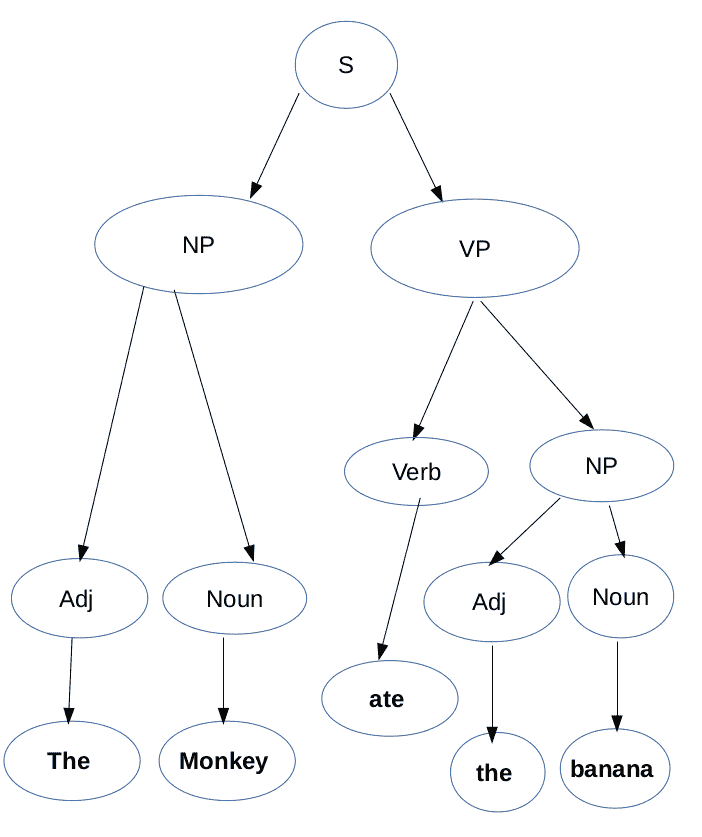
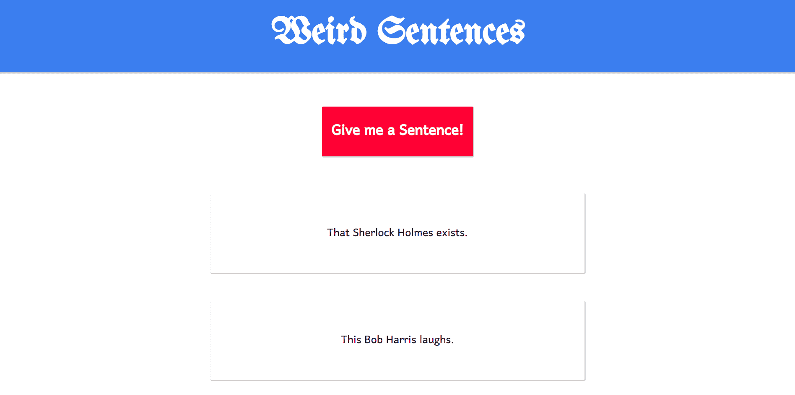

# 什么是上下文无关文法？

> 原文：<https://www.freecodecamp.org/news/context-free-grammar/>

你有没有注意到，当你在像 VS code 这样的文本编辑器中编写代码时，它会识别像不匹配的括号这样的东西？有时它还会警告你，用红色高亮显示你写的不正确的语法？

如果没有，那就好好想想。这毕竟是一段代码。如何为这样的任务编写代码呢？背后的逻辑是什么？

如果你必须为一种编程语言编写一个编译器，你将会面临这些问题。编写编译器不是一件容易的事情。这是一项需要大量时间和精力的繁重工作。

在本文中，我们不打算讨论如何构建编译器。但是我们将讨论一个概念，它是编译器的核心组件:上下文无关文法。

## 介绍

我们之前问的所有问题都代表了一个对编译器设计很重要的问题，叫做语法分析。顾名思义，挑战在于分析语法，看它是否正确。这就是我们使用上下文无关文法的地方。上下文无关语法是定义语言的一组规则。

在这里，我想在上下文无关的语法和像英语这样的自然语言的语法之间做一个区分。

上下文无关文法或 CFG 定义了一种形式语言。正式语言严格按照定义的规则工作，它们的句子不受上下文的影响。这就是它的名字*与上下文无关*的由来。

像英语这样的语言属于非正式语言，因为它们受到语境的影响。他们还有许多 CFG 无法描述的其他特征。

尽管 CFG 不能描述自然语言中的上下文，但它们仍然可以定义这些语言中句子的语法和结构。事实上，这就是最初引入 CFG 的原因。

在这篇文章中，我们将尝试使用 CFG 生成英语句子。我们将学习如何描述句子结构并为其编写规则。为此，我们将使用一个名为 Tracery 的 JavaScript 库，它将根据我们为语法定义的规则生成句子。

在我们深入研究代码并开始编写语法规则之前，让我们先讨论一些将在 CFG 中使用的基本术语。

**终结符**:这些是组成最后一句话实际内容的字符。这些可以包括单词或字母，取决于哪一个被用作句子的基本构件。

在我们的例子中，我们将使用单词作为句子的基本构件。因此，我们的终端将包括诸如“到”、“从”、“的”、“汽车”、“宇宙飞船”、“小猫”等词。

**非终端**:这些也叫变量。它们在语法定义的语言中充当次语言的角色。非端子是端子的占位符。我们可以使用非终结符来生成不同的终结符模式。

在我们的例子中，我们将使用这些非终结符来生成名词短语、动词短语、不同的名词、形容词、动词等等。

**开始符号**:开始符号是一个特殊的非终结符，代表语法将要生成的初始字符串。

现在我们知道了术语，让我们开始学习语法规则。

在编写语法规则时，我们将从定义终端集和起始状态开始。正如我们之前所学的，开始符号是非终结符。这意味着它将属于非终端组。

```
T: ("Monkey", "banana", "ate", "the")
S: Start state. 
```

规则是:

```
S --> nounPhrase verbPhrase
nounPhrase --> adj nounPhrase | adj noun
verbPhrase --> verb nounPhrase
adjective  --> the
noun --> Monkey | banana
verb --> ate
```

上面的语法规则乍一看可能有点神秘。但是如果我们仔细观察，我们可以看到一种模式正在从这些规则中产生。

思考上述规则的一个更好的方法是将它们以树形结构的形式形象化。在那棵树中，我们可以将 *S* 放在根中，并且可以将*发音短语*和*动词短语*添加为根的孩子。我们也可以用同样的方式处理*发音短语*和*动词短语*。该树将终端作为其叶节点，因为这是我们结束这些推导的地方。



在上图中我们可以看到 *S* (一个非终结符)派生出两个非终结符 *NP* ( *nounPhrase* )和 *VP* ( *verbPhrase* )。在 *NP* 的情况下，衍生出了两个非终结符 *Adj* 和*名词*。

如果你看看语法， *NP* 也可以选择 *Adj* 和 *nounPhrase* 。在生成文本时，这些选择是随机做出的。

最后，叶节点具有以粗体文本书写的终端。所以如果你从左向右移动，你可以看到一个句子形成了。

这种树常用的术语是解析树。我们可以用类似的方式为这个语法生成的不同句子创建另一个解析树。

现在让我们进一步研究代码。正如我前面提到的，我们将使用一个名为 Tracery 的 JavaScript 库来使用 CFG 生成文本。我们还会为前端部分写一些 HTML 和 CSS 的代码。

## 代码

让我们先从获得 tracery 库开始。你可以从 GitHub [这里](https://github.com/galaxykate/tracery)克隆这个库。我还在文章末尾留下了 galaxykate 提供的 GitHub 资源库的链接。

在我们使用这个库之前，我们必须导入它。我们可以简单地在这样的 HTML 文件中完成这项工作。

```
<html>
    <head>
        <script src="tracery-master/js/vendor/jquery-1.11.2.min.js"></script>
		<script src="tracery-master/tracery.js"></script>
		<script src="tracery-master/js/grammars.js"></script>
        <script src='app.js'></script>
    </head>

</html>
```

我已经将克隆的 tracery 文件作为脚本添加到我的 HTML 代码中。我们还必须在代码中添加 JQuery，因为 tracery 依赖于 JQuery。最后，我添加了 *app.js* ，这是我将添加语法规则的文件。

完成后，创建一个 JavaScript 文件，我们将在其中定义语法规则。

```
var rules = {
    	"start": ["#NP# #VP#."],
    	"NP": ["#Det# #N#", "#Det# #N# that #VP#", "#Det# #Adj# #N#"],
    	"VP": ["#Vtrans# #NP#", "#Vintr#"],
    	"Det": ["The", "This", "That"],
    	"N": ["John Keating", "Bob Harris", "Bruce Wayne", "John Constantine", "Tony Stark", "John Wick", "Sherlock Holmes", "King Leonidas"],
    	"Adj": ["cool", "lazy", "amazed", "sweet"],
    	"Vtrans": ["computes", "examines", "helps", "prefers", "sends", "plays with", "messes up with"],
    	"Vintr": ["coughs", "daydreams", "whines", "slobbers", "appears", "disappears", "exists", "cries", "laughs"]
    } 
```

这里你会注意到定义规则的语法和我们之前定义语法的方式没有太大的不同。散列符号之间有很小的差异，例如定义非终结符的方式。以及不同推导的写法。这里我们不使用“|”符号来分隔它们，而是将所有不同的派生作为一个数组的不同元素。除此之外，我们将使用分号而不是箭头来表示转换。

这个新语法比我们之前定义的稍微复杂一点。这一个包括许多其他事物，例如限定词、及物动词和不及物动词。我们这样做是为了使生成的文本看起来更自然。

现在让我们调用 tracery 函数“createGrammar”来创建我们刚刚定义的语法。

```
let grammar = tracery.createGrammar(rules);
```

这个函数将接受 rules 对象，并根据这些规则生成一个语法。创建语法之后，我们现在想从中生成一些最终结果。为此，我们将使用一个名为“展平”的功能。

```
let expansion = grammar.flatten('#start#');
```

它会根据我们之前定义的规则生成一个随机的句子。但是我们不要就此止步。让我们也为它建立一个用户界面。没有太多我们将不得不做的部分-我们只需要一个按钮和界面的一些基本样式。

在我们添加库的同一个 HTML 文件中，我们将添加一些元素。

```
<html>
    <head>
        <title>Weird Sentences</title>
        <link rel="stylesheet" href="style.css"/>
        <link href="https://fonts.googleapis.com/css?family=UnifrakturMaguntia&display=swap" rel="stylesheet">
        <link href="https://fonts.googleapis.com/css?family=Harmattan&display=swap" rel="stylesheet">

        <script src="tracery-master/js/vendor/jquery-1.11.2.min.js"></script>
		<script src="tracery-master/tracery.js"></script>
		<script src="tracery-master/js/grammars.js"></script>
        <script src='app.js'></script>
    </head>
    <body>
        <h1 id="h1">Weird Sentences</h1>
        <button id="generate" onclick="generate()">Give me a Sentence!</button>
        <div id="sentences">

        </div>
    </body>
</html>
```

最后，我们将添加一些样式。

```
body {
    text-align: center;
    margin: 0;
    font-family: 'Harmattan', sans-serif;
}

#h1 {
    font-family: 'UnifrakturMaguntia', cursive;
    font-size: 4em;
    background-color: rgb(37, 146, 235);
    color: white;
    padding: .5em;
    box-shadow: 1px 1px 1px 1px rgb(206, 204, 204);
}

#generate {
    font-family: 'Harmattan', sans-serif;
    font-size: 2em;
    font-weight: bold;
    padding: .5em;
    margin: .5em;
    box-shadow: 1px 1px 1px 1px rgb(206, 204, 204);
    background-color: rgb(255, 0, 64);
    color: white;
    border: none;
    border-radius: 2px;
    outline: none;
}

#sentences p {
    box-shadow: 1px 1px 1px 1px rgb(206, 204, 204);
    margin: 2em;
    margin-left: 15em;
    margin-right: 15em;
    padding: 2em;
    border-radius: 2px;
    font-size: 1.5em;
}
```

我们还需要添加一些 JavaScript 来操作界面。

```
let sentences = []
function generate() {
    var data = {
    	"start": ["#NP# #VP#."],
    	"NP": ["#Det# #N#", "#Det# #N# that #VP#", "#Det# #Adj# #N#"],
    	"VP": ["#Vtrans# #NP#", "#Vintr#"],
    	"Det": ["The", "This", "That"],
    	"N": ["John Keating", "Bob Harris", "Bruce Wayne", "John Constantine", "Tony Stark", "John Wick", "Sherlock Holmes", "King Leonidas"],
    	"Adj": ["cool", "lazy", "amazed", "sweet"],
    	"Vtrans": ["computes", "examines", "helps", "prefers", "sends", "plays with", "messes up with"],
    	"Vintr": ["coughs", "daydreams", "whines", "slobbers", "appears", "disappears", "exists", "cries", "laughs"]
    }

    let grammar = tracery.createGrammar(data);
    let expansion = grammar.flatten('#start#');

    sentences.push(expansion);

    printSentences(sentences);
}

function printSentences(sentences) {
    let textBox = document.getElementById("sentences");
    textBox.innerHTML = "";
    for(let i=sentences.length-1; i>=0; i--) {
        textBox.innerHTML += "<p>"+sentences[i]+"</p>"
    }
} 
```

一旦你写完代码，运行你的 HTML 文件。它应该看起来像这样。



每次你点击红色按钮，它就会生成一个句子。其中一些句子可能没有任何意义。这是因为，正如我前面所说的，CFG 不能描述自然语言拥有的上下文和其他一些特征。它仅用于定义句子的语法和结构。

你可以在这里查看这个[的现场版](https://aditya2000.github.io/weird-sentences/)。

## 结论

如果你能走到这一步，我非常欣赏你的韧性。对你们中的一些人来说，这可能是一个新概念，而其他人可能在他们的大学课程中学到了。但是，上下文无关语法仍然有有趣的应用，从计算机科学到语言学。

我已经尽力在这里介绍了 CFG 的主要思想，但是你还可以了解更多。在这里，我留下了一些重要资源的链接:

*   丹尼尔·希夫曼的上下文无关文法。
*   Fullstack Academy 的上下文无关语法示例
*   加拉西凯特设计的窗饰