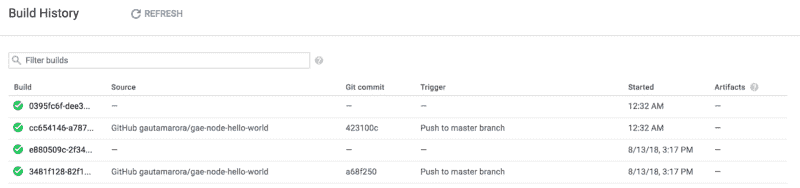
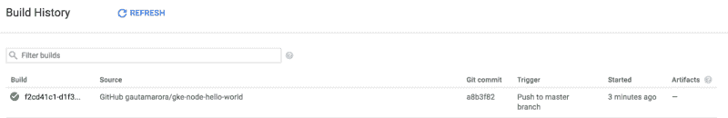
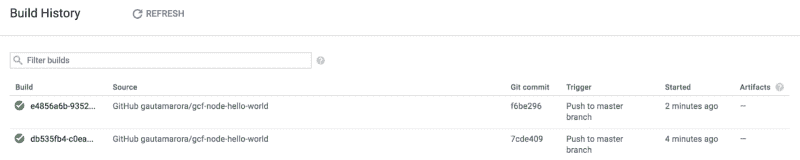

# Google 云平台上 Node.js 的持续部署

> 原文：<https://www.freecodecamp.org/news/continuous-deployment-for-node-js-on-google-cloud-platform-751a035a28d5/>

作者高塔姆·阿罗拉

# Google 云平台上 Node.js 的持续部署


Photo by [Axel Ahoi](https://unsplash.com/photos/hjEesK4KSDs?utm_source=unsplash&utm_medium=referral&utm_content=creditCopyText) on [Unsplash](https://unsplash.com/search/photos/shipping?utm_source=unsplash&utm_medium=referral&utm_content=creditCopyText)

[谷歌云平台(GCP)](https://cloud.google.com/) 为[节点](https://nodejs.org/en/)开发者轻松部署我们的应用提供了大量选项。想要一个类似 Heroku 的托管解决方案吗？ [App 引擎](https://cloud.google.com/appengine/)，检查！想托管一个容器化的 app？ [Kubernetes 发动机](https://cloud.google.com/kubernetes-engine/)，检查！想要部署无服务器应用程序？[云函数](https://cloud.google.com/functions/)，检查！

最近在工作中，我很喜欢使用我们的[内部持续部署服务](https://technology.condenast.com/story/departures-building-a-docker-container-based-deployment-platform-at-conde-nast)，它可以快速构建、测试和部署推送到 GitHub 的新提交。所以当我读到谷歌新的[云构建](https://techcrunch.com/2018/07/24/google-announces-cloud-build-its-new-continuous-integration-continuous-delivery-platform/)服务时，我想尝试一下，看看我是否能为自己创造一个类似的无缝部署体验。此外，在与来自谷歌云团队的[弗兰西兹卡](https://twitter.com/fhinkel)的交谈中，她认为这是一个教程会有所帮助的领域。所以我们开始吧…

### 但是等等，云构建是什么？

Cloud Build 是 GCP 的托管构建服务，它可以从各种来源提取代码，运行一系列构建步骤来为应用程序创建构建映像，然后将该映像部署到一组服务器上。

云构建与谷歌自己的源代码库、Bit Bucket 或 GitHub 配合得很好。它可以使用 Docker 配置文件(`Dockerfile`)或云构建自己的配置文件(`cloudconfig.yaml`)来创建构建映像。它可以将应用程序(和 API)部署到 App Engine、Kubernetes 引擎和云功能。一个非常酷的特性是构建触发器。可以设置这些来监视代码库中的新提交，并触发新的构建和部署。

#### 在我们跳入深水区之前…

这篇文章分享了在 GCP 上设置节点应用程序持续部署的详细步骤和代码。它假设您熟悉开发简单的节点应用程序，使用命令行，并对将应用程序部署到云服务(如 Heroku、AWS、Azure 或 GCP)有一定的了解。

对于每一部分，都提供了一个配套的 GitHub 代码库供您使用。不过不要担心——请随意浏览这篇文章，以了解高层次的想法，如果您计划设置它，您可以将它标记为书签，稍后再来查看。拥有这样的设置的真正乐趣在于您可以快速部署应用程序。

### 应用引擎标准的持续部署

将节点应用程序部署到应用程序引擎非常简单。在 Google Cloud Console 中创建一个新项目，在我们的代码目录中添加一个`app.yaml`配置文件(它描述了我们想要使用的节点运行时——我已经使用了 Node 8)，在我们的终端上运行`gcloud app deploy`——就完成了！

如果您想亲自尝试一下，这里有一些资源:

*   [应用引擎的示例应用](https://github.com/gautamarora/gae-node-hello-world)
*   [应用引擎上节点的快速入门指南](https://cloud.google.com/appengine/docs/standard/nodejs/quickstart)

因此，按照上面的快速入门指南，我们到目前为止已经做到了:

1.  在谷歌云控制台中创建了一个新项目
2.  使用 *gcloud app deploy* 将我们的节点应用部署到应用引擎

….现在，我们如何自动化设置，以便代码更改自动部署到 GitHub？

我们需要做的是:

1.  把我们的代码放到 GitHub 上

*   前往 GitHub 创建一个新的资源库
*   然后按照说明将代码从您的机器推送到 GitHub

2.启用云构建

*   [为我们的项目启用云构建 API](https://console.cloud.google.com/flows/enableapi?apiid=cloudbuild.googleapis.com&redirect=https://cloud.google.com/cloud-build/docs/quickstart-gcloud&_ga=2.113783623.-1976915987.1533866140)
*   [为我们的项目启用应用引擎 API](https://console.cloud.google.com/flows/enableapi?apiid=appengine.googleapis.com&_ga=2.114826311.-1976915987.1533866140) 。
*   通过转到 [IAM 页面](https://console.cloud.google.com/iam-admin/iam)，找到此服务帐户`<project-id>@cloudbuild.gserviceaccou`nt.com，对其进行编辑并赋予其 App Engine 管理员角色，将 App Engine IAM 授予云构建服务帐户。

3.创建一个[云构建配置文件](https://cloud.google.com/cloud-build/docs/build-config)

*   创建一个新文件`cloudbuild.yaml`，如下所示:

```
steps:- name: 'gcr.io/cloud-builders/npm'  args: ['install']- name: 'gcr.io/cloud-builders/npm'  args: ['test']- name: "gcr.io/cloud-builders/gcloud"  args: ["app", "deploy"]timeout: "1600s"
```

该配置有三个构建步骤(以连字符开头的每一行都是一个构建步骤)，将运行`npm install`，然后运行`npm test`，如果一切正常，则将我们的代码部署到 App Engine。

每个构建步骤就像我们在机器上运行的一个命令。但是在这种情况下，由于这个文件在 yaml 中，并且每一步都被分成 2 行名称和参数，所以看起来有点令人费解。

让我们试试这个:对于以“name”开头的行，读取它的最后一个字，然后读取“args”行中的值。希望这个文件现在更有意义！

4.手动运行构建(可选，只是为了验证)

*   我们现在可以使用云构建从我们的机器部署我们的应用程序
*   在您的终端上运行 cloud build 命令:`gcloud builds submit — config cloudbuild.yaml .`这个命令使用我们上面创建的配置文件在 Cloud Build 上开始构建。
*   前往[云构建页面](https://console.cloud.google.com/cloud-build/builds)查看构建开始。
*   等待构建结束，然后使用此应用程序的应用程序引擎 URL 测试您的节点应用程序。
*   如果您愿意，您可以对 Node 应用程序进行更改，并再次调用此命令来启动更多构建。

5.创建生成触发器

*   前往[云构建触发器页面](https://console.cloud.google.com/cloud-build/triggers)并选择创建触发器
*   在构建触发器设置页面上，选择 GitHub 作为源代码库。这将需要你授权 GCP 访问你的 GitHub 库，你需要批准。完成后，为您之前推送到 GitHub 的节点应用程序选择 GitHub 存储库。
*   创建一个名为`continuous deployment`的触发器，并为触发器类型选择 Branch with regex 作为分支名`master`。这将确保构建、测试和部署只针对主分支而不是任何分支运行。
*   对于构建配置文件，选择`cloudbuild.yaml`
*   现在单击“构建触发器”按钮

6.通过向 GitHub 提交来自动运行构建

*   创建了构建触发器后，对节点应用程序进行简单的提交，比如更改“Hello，World！”到“你好，GCP！”并提交和推送这些代码到 GitHub
*   返回[云构建页面](https://console.cloud.google.com/cloud-build/builds)，您会注意到一个构建被自动触发(如果不是，再等几秒钟或点击页面上的刷新按钮)
*   构建完成后，您会看到一个绿色的复选标记，您可以使用应用程序引擎 URL 访问您的应用程序，并看到您的更改现已生效！

下面是通过 GitHub push 为我们的应用程序触发构建的截图:



好得难以置信？？将最后一个步骤运行几次，再测试几次。我们的第一个应用程序现在会在每次提交给 master 时部署到 App Engine？


Photo by [Willian Justen de Vasconcellos](https://unsplash.com/photos/g5FyZvIzUS4?utm_source=unsplash&utm_medium=referral&utm_content=creditCopyText) on [Unsplash](https://unsplash.com/search/photos/shipping?utm_source=unsplash&utm_medium=referral&utm_content=creditCopyText)

### Kubernetes 引擎的持续部署

很好，我们已经将应用程序设置为部署到 GitHub push 上的 App Engine，但是如果我们希望容器化的应用程序也有相同的设置呢？让我们试一试！

在高层次上，将节点应用程序部署到 Kubernetes 引擎有两个主要任务。首先，准备好我们的应用程序:用 Docker 将应用程序容器化，构建它，并将 Docker 映像推送到 Google 容器注册表。然后，在 GCP 端进行设置:创建一个 Kubernetes 集群，用您的应用程序映像创建一个部署，然后创建一个允许访问您正在运行的应用程序的服务。

如果你想自己尝试一下，这里有一些资源:

*   【Kubernetes 引擎示例应用
*   [用 Docker 容器化一个节点 App](https://nodejs.org/en/docs/guides/nodejs-docker-webapp/)
*   [将容器化的 Hello World 应用部署到 Kubernetes 引擎](https://github.com/gautamarora/gke-node-hello-world/blob/master/DEPLOY.md#deploy-a-containerized-hello-world-application-to-kubernetes-engine)

因此，到目前为止，我们通过使用上述指南所做的是:

1.  在谷歌云控制台中创建了另一个新项目
2.  创建了 Kubernetes 集群、部署和服务
3.  使用 *kubectl* 将我们的容器化节点应用部署到 Kubernetes 引擎

…但是我们想要的是一个连续的部署设置，这样新的提交就可以启动构建和部署。

我们需要做的是:

1.  把我们的代码放到 GitHub 上

*   我们将遵循与前面的 App Engine 部分相同的步骤。创建一个新的存储库，并将代码从我们的机器推送到 GitHub。

2.启用云构建

*   [为我们的项目启用云构建 API](https://console.cloud.google.com/flows/enableapi?apiid=cloudbuild.googleapis.com&redirect=https://cloud.google.com/cloud-build/docs/quickstart-gcloud&_ga=2.113783623.-1976915987.1533866140)
*   [为我们的项目启用 Kubernetes 引擎 API](https://console.cloud.google.com/flows/enableapi?apiid=container.googleapis.com&_ga=2.147807223.-1976915987.1533866140)
*   通过转到此服务帐户`<project-id>@cloudbuild.gserviceaccou`nt.com 的 I [AM 页面](https://console.cloud.google.com/iam-admin/iam)，对其进行编辑，并赋予其 Kubernetes Engine Admin 角色，将 Kubernetes Engine IAM 授予云服务帐户

3.创建云构建配置文件

*   创建一个新文件`cloudbuild.yaml`，如下所示:

```
steps:- name: 'gcr.io/cloud-builders/npm'  args: ['install']- name: 'gcr.io/cloud-builders/npm'  args: ['test']- name: 'gcr.io/cloud-builders/docker'  args: ["build", "-t", "gcr.io/$PROJECT_ID/my-image:$REVISION_ID", "."]- name: 'gcr.io/cloud-builders/docker'  args: ["push", "gcr.io/$PROJECT_ID/image:$REVISION_ID"]- name: 'gcr.io/cloud-builders/kubectl' args: - 'set' - 'image' - 'deployment/my-deployment' - 'my-container=gcr.io/$PROJECT_ID/image:$REVISION_ID' env: - 'CLOUDSDK_COMPUTE_ZONE=us-east1-b' - 'CLOUDSDK_CONTAINER_CLUSTER=my-cluster'
```

该配置有五个构建步骤，将运行`npm install`和`npm test`以确保我们的应用程序正常工作，然后它将创建一个 Docker 映像并推送到 GCR，然后将我们的应用程序部署到我们的 Kubernetes 集群。这个文件中的值`*my-cluster, my-deployment and my-container*`指的是我们创建的 Kubernetes 集群中的资源(按照上面的指南)。`*$REVISION_ID*`是一个变量值，Cloud Build 根据触发这个 Build 的 GitHub commit 注入到配置中。

4.手动运行构建(可选，用于验证)

*   我们现在可以使用云构建从我们的机器部署我们的应用程序
*   在您的终端上运行云构建命令:`gcloud builds submit — config cloudbuild.yaml --substitutions=REVISION_ID=1 .`

我们还在这个命令中传递了修订 id，因为我们是手动运行这个版本，而不是由 GitHub 触发。

*   前往[云构建页面](https://console.cloud.google.com/cloud-build/builds)查看运行中的构建。
*   在构建结束时，您可以使用 Kubernetes 服务 URL 测试您的节点应用程序
*   如果愿意，您可以对您的节点应用程序进行更改，并再次调用该命令来启动更多的构建

5.创建生成触发器

*   设置的步骤与上一节中关于 App Engine 的步骤相同。转到这个项目的[云构建触发器页面](https://console.cloud.google.com/cloud-build/triggers)，选择正确的 GitHub 库，为`master`分支创建一个名为`continuous deployment`的触发器，就大功告成了。
*   通过推送至 GitHub 自动运行构建
*   这也与上面的 App Engine 部分相同——进行更改、添加、提交并推送到 GitHub，这将启动一个构建，您可以在您的[云构建](https://console.cloud.google.com/cloud-build/builds)页面上看到。构建完成后，您将能够使用 Kubernetes 服务 URL 查看更新的应用程序。

下面是我们的应用程序通过 GitHub 推送触发构建的截图:



本节中的步骤与 App Engine 部分非常相似。主要的区别是，我们必须用 Docker 封装我们的应用程序，启动我们的 Kubernetes 集群，然后只需几个步骤就可以完成云构建配置。

但就其核心而言，云构建及其构建触发器的工作方式基本相同，并为我们提供了无缝的部署体验。我们的第二个应用程序现在在每次提交给 master 时都会被部署到 Kubernetes 引擎上。？


Photo by [Maximilian Weisbecker](https://unsplash.com/photos/Esq0ovRY-Zs?utm_source=unsplash&utm_medium=referral&utm_content=creditCopyText) on [Unsplash](https://unsplash.com/?utm_source=unsplash&utm_medium=referral&utm_content=creditCopyText)

### 云功能的持续部署

当然，App Engine 和 Kubernetes Engine 很棒，但是我们的无服务器应用程序的自动化部署怎么样呢？我的意思是，根本不用管理服务器是最好的，对吗？我们开始吧！

将节点应用部署到云功能将需要我们创建一个新项目。不需要配置文件，一旦 GCloud 功能部署在我们的终端上，我们的功能就部署好了！

如果你想自己尝试一下，这里有你需要的资源:

*   [云功能示例应用](https://github.com/gautamarora/gae-node-hello-world)
*   [云功能节点快速入门指南](https://cloud.google.com/functions/docs/quickstart)
*   [使用节点仿真器本地测试云功能](https://cloud.google.com/functions/docs/emulator)

如果您一直在跟进，您可能已经想象出我们需要做的步骤:

1.  把我们的代码放到 GitHub 上

*   我们已经知道如何去做

2.启用云构建

*   [为我们的项目启用云构建 API](https://console.cloud.google.com/flows/enableapi?apiid=cloudbuild.googleapis.com&redirect=https://cloud.google.com/cloud-build/docs/quickstart-gcloud&_ga=2.113783623.-1976915987.1533866140)
*   [为我们的项目启用云函数 API](https://console.cloud.google.com/flows/enableapi?apiid=cloudfunctions&_ga=2.84807769.-1976915987.1533866140) 。
*   通过进入 [IAM 页面](https://console.cloud.google.com/iam-admin/iam)，找到这个服务账户`<project-id>@cloudbuild.gserviceaccou`nt.com，对其进行编辑，并赋予其项目编辑角色，将云功能 IAM 授予云构建服务账户。

3.创建云构建配置文件

*   创建一个新文件`cloudbuild.yaml`，如下所示:

```
steps:- name: 'gcr.io/cloud-builders/npm'  args: ['install']- name: 'gcr.io/cloud-builders/npm'  args: ['test']- name: 'gcr.io/cloud-builders/gcloud' args: - beta - functions - deploy - helloWorld - -- source=. - -- runtime=nodejs8 - -- trigger-http
```

与 App Engine 配置类似，此配置有 3 个安装步骤。然后测试构建，如果一切顺利，就将它部署到云功能中。

4.手动运行构建(可选，用于验证)

*   我们现在可以使用云构建从我们的机器部署我们的功能
*   在您的终端中运行这个:`gcloud builds submit — config cloudbuild.yaml .`
*   前往[云构建页面](https://console.cloud.google.com/cloud-build/builds)查看运行中的构建。
*   在构建结束时，您可以使用云函数 URL 测试您的无服务器应用程序

5.创建生成触发器

*   设置的步骤与上一节中关于 App Engine 和 Kubernetes Engine 的步骤相同。进入这个项目的[云构建触发器页面](https://console.cloud.google.com/cloud-build/triggers)，选择正确的 GitHub 库，为`master`分支创建一个名为`continuous deployment`的触发器，就大功告成了。

6.通过推送至 GitHub 自动运行构建

*   这也与上面关于 App Engine & Kubernetes Engine 的部分相同:进行更改、添加、提交并推送到 GitHub，这将启动一个构建，您可以在您的[云构建](https://console.cloud.google.com/cloud-build/builds)页面上看到。构建完成后，您将能够使用云功能 URL 查看更新的应用程序

下面是我们的示例应用程序通过 GitHub 推送触发构建的截图:



云功能非常容易通过自动构建来设置，并使“代码→构建→测试→推送→部署”工作流变得非常非常快！我们的第三个应用程序现在在每次提交给 master 时都被部署到云功能？？？


Photo by [Jassim Vailoces](https://unsplash.com/photos/kAjrml-a8R0?utm_source=unsplash&utm_medium=referral&utm_content=creditCopyText) on [Unsplash](https://unsplash.com/search/photos/shipping?utm_source=unsplash&utm_medium=referral&utm_content=creditCopyText)

### 包扎

唷！在这篇文章中，我们涉及了很多内容。如果这是您第一次为 Node 试用 GCP，希望您能看到尝试各种选项是多么简单和直接。如果你非常渴望了解如何在 GCP 上设置应用程序的持续部署，我希望你也没有失望！

在你离开之前，我只是想确保你没有错过所有部分都有一个示例应用程序的事实:应用程序引擎的[Hello World](https://github.com/gautamarora/gae-node-hello-world)、Kubernetes 引擎的[Hello World](https://github.com/gautamarora/gke-node-hello-world)和云功能的[Hello World](https://github.com/gautamarora/gcf-node-hello-world)。

暂时就这样吧！我们去装些代码吧！？

感谢跟随。如果你有任何问题或者想在这篇文章中报告任何错误，请留下你的评论。

如果你觉得这篇文章很有帮助，不要不好意思。

你可以在推特上关注我。