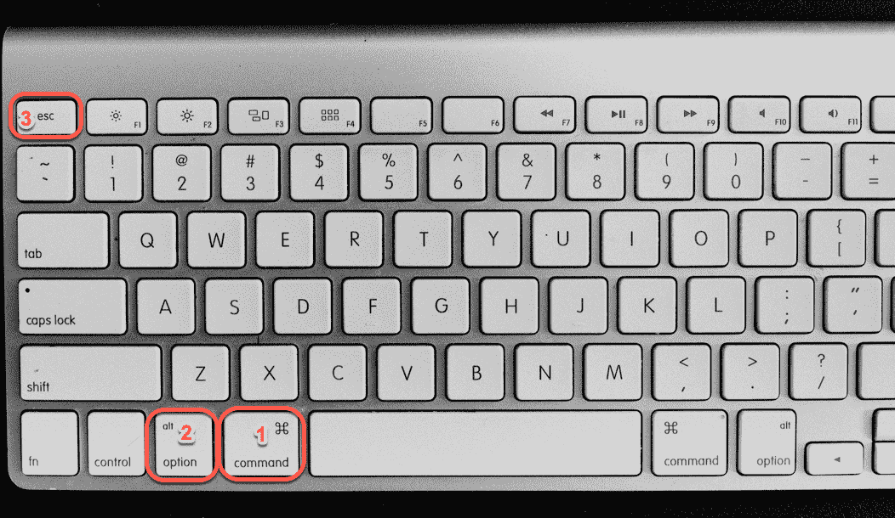
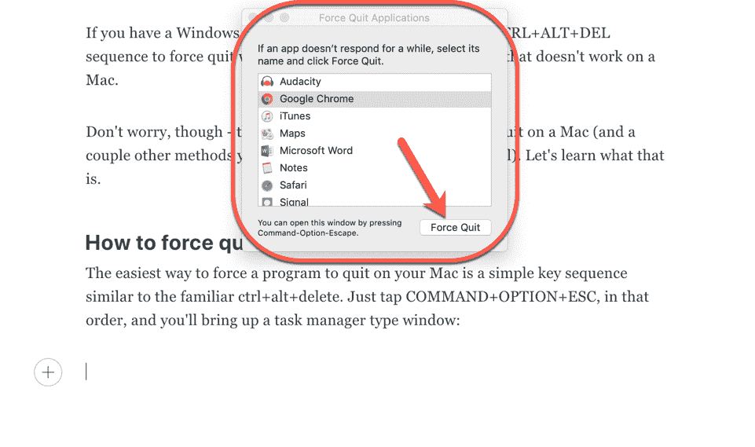
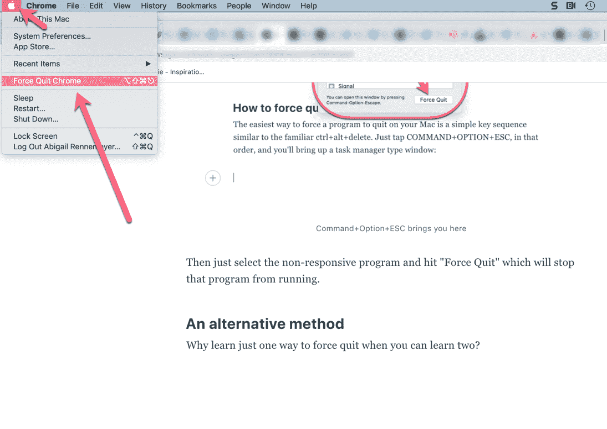

# 如何在你的 Macbook 上打开任务管理器

> 原文：<https://www.freecodecamp.org/news/control-alt-delete-on-mac-how-to-open-task-manager-on-your-macbook/>

它发生在我们当中最优秀的人身上:我们正在进行某个重要的项目，而我们信任的电脑却死机了。或者说，我们所在的程序停止了响应。那你是做什么的？

如果你有一台 Windows 机器，你可以使用熟悉的 CTRL+ALT+DEL 序列来强制退出任何行为不当的程序。但这在苹果电脑上不起作用。

不过，不要担心——有一个超级简单的方法可以在 Mac 上强制退出(还有一些其他方法你也可以放在口袋里)。让我们来看看那是什么。

## 如何在 Mac 上强制退出

在你的 Mac 上强制一个程序退出的最简单的方法是一个类似于 ctrl+alt+delete 的简单按键序列。只需依次轻按 COMMAND+OPTION+ESC。这些键在典型的 Mac 键盘上的位置如下:

这将打开一个任务管理器类型的窗口，如下所示:

Command+Option+ESC brings you here

然后只需选择没有响应的程序，并点击“强制退出”，这将停止该程序运行。

**注意**:因为你将会在你正在做的事情中间强制退出那个程序，任何未保存的数据都可能会丢失。确保您启用了自动保存，经常备份您的项目，并保持您的计算机整洁和最新。

## 另一种方法

当你可以学习两种方法的时候，为什么只学习一种方法来强制戒掉呢？在菜单栏中点按屏幕左上角的 Apple 标志。向下滚动到“强制退出”，它会带来同样的任务管理器。

It'll suggest whatever program you're currently using

就这么简单！

既然你已经处理了崩溃的申请，你可以回去工作了。:)