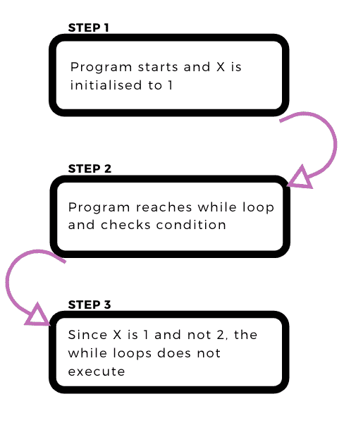
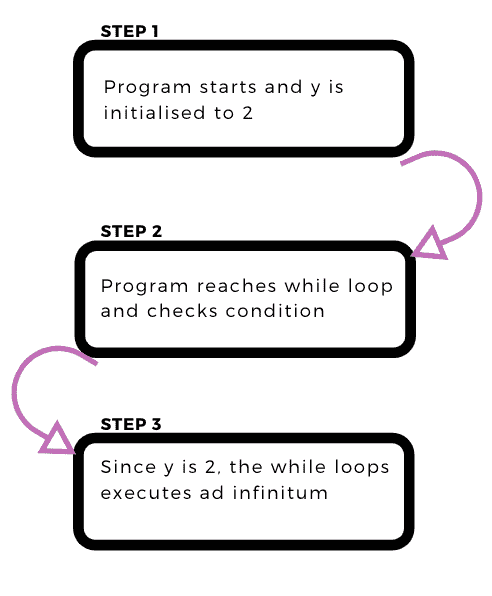
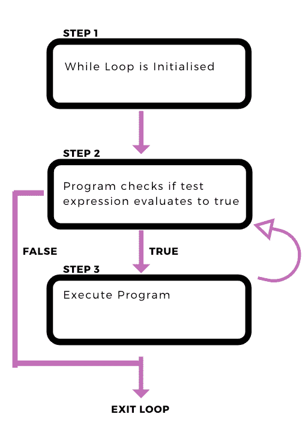
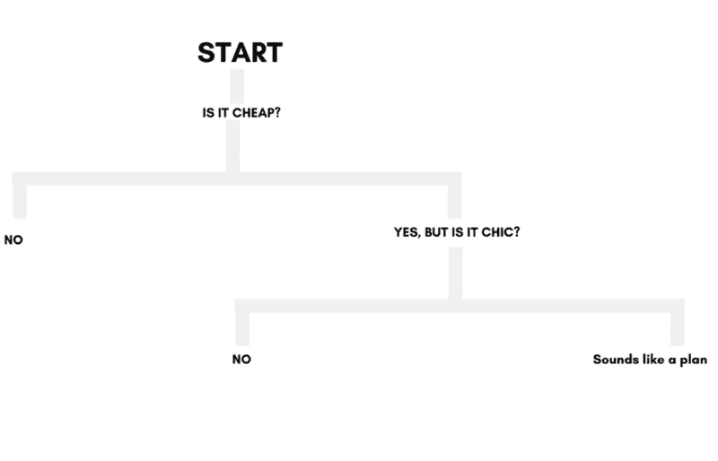
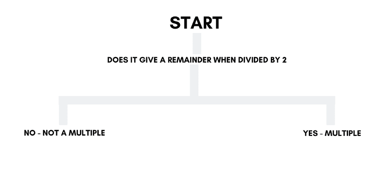

# Python 如何做决策:编程中的控制流介绍

> 原文：<https://www.freecodecamp.org/news/control-flow-in-programming-b9fb4f4539c/>

作者伊万·利奥

# Python 如何做决策:编程中的控制流介绍


什么是控制流？

我发现很容易将控制流分成 3 个不同的类别

1.  循环(While，Do while，for)
2.  决策(如果-否则)
3.  异常处理(继续、尝试例外、通过、中断)

当我们谈论大多数编程语言中的控制流时，这三个类别粗略地总结了我们可用的不同选项。

所以让我们直接开始吧。

### 环

> 循环基本上是一组简单的指令，重复执行直到满足一个条件。

一个很好的循环类比是搅拌蛋糕面糊:

基于这个[配方](https://thecakeblog.com/2014/08/mixing-up-the-perfect-cake.html)，如果我们使用现代搅拌机，3 分钟是搅拌面糊的最佳时间。如果你给某人使用这个食谱的指示，它可能看起来像这样。

1.  混合鸡蛋、面粉和秘方
2.  启动秒表，开始搅拌面糊
3.  搅拌面糊，直到秒表显示 3 分钟

如果我们把它翻译成伪代码，它可能看起来像这样

```
#Start Timer<....code....>time = 0
```

```
While(time != 3 minutes):    time = newvalue    mix batter
```

在这种情况下，我们使用**时间**来决定是否继续搅拌面糊。但这并不能真正帮助我们在使用不同成分时考虑到具体情况。

在这种情况下，我们有几个选择

1.  我们可以监控面糊的浓度
2.  或者我们可以用一大堆配料做实验，记录下每种配料的最佳时间，然后在每次搅拌蛋糕时参考这个记录。

现在停下来想一想，我们什么时候使用第一个选项，什么时候使用第二个选项？

< Intentional Blank Left Here . Do stop and think for a while :) >

第一种选择更适合于我们可能遇到许多不可预测的组合的情况。因此，不仅要检查时间，还要增加额外参数的保护措施，这是有意义的。

第二个选项适合于我们遇到多个组合的重复实例的情况。这就是通常所说的动态编程。

在动态编程中，每个值都计算一次，然后存储在查找表中以备将来访问。这有助于通过减少查找时间来减少未来操作的运行时间，因为不必重新计算值，只需查找并返回即可。

现在让我们将我们所学的转换成代码，并检查我们可以用 python 实现什么:)

### 密码

在 python 中，我们有两个主要工具用于循环

1.  While 循环
2.  对于循环

#### **While 循环**

While Loops 允许我们无限期地运行一个命令。

```
x = 1y = 2
```

```
while(x=2):    print("x is looping")
```

```
while(y=2):    print("Y is looping")
```

在上面的代码中，只有第二个 while 循环会求值，而第一个循环不会。当我们运行代码时，我们将得到以下输出

```
>>>python runapp.pyY is loopingY is loopingY is loopingY is looping....
```

这是第一个变量的情况。



如上所述，while 循环不打印 x，因为它不满足第一个 while 循环中规定的条件。

第二个条件呢？它是这样的:



正如我们所看到的，while 循环不断地检查条件是否为真，并且只在指定的条件为真时才执行。

以下是 python 中的一些常见实现:

```
#Asking for User Inputwhile True:    userinput = input("Please Input Your Name: ")    if userinput.isalpha():       break;
```

```
print("Hello %s"%(userinput))
```

```
#Dealing with dynamic Variables (i.e. Parameters that can change )no = int(input("Please Enter the number of Loops: "))i = 0
```

```
while(i<n):    print(i)
```

让我们看看这两个例子。

#### 示例 1

这个示例代码(如上所述)是我们可以用来获取一些用户输入的示例代码。随着您编写更高级的程序，您将能够编写更高级的程序来检查用户输入或对用户输入做更多的事情，但是现在，我们将打印“Hello <userinput>”:</userinput>

```
While True:
```

由于 true 始终是 True(我知道这有点违反直觉，但请原谅我)，所以这个循环将永远运行下去。**真永远不可能不是真**。

```
userinput = input("Please Input Your Name: ")
```

这允许我们从用户那里获得一些输入，并将其存储为一个字符串。我们创建一个名为 userinput 的变量，并在内存中存储对该存储字符串的引用。(如果你不确定这里发生了什么，我写了一篇关于 python 中变量的文章，一定要看看！)

```
if userinput.isalpha():       break;
```

现在神奇的酱汁来了。的。isalpha()方法允许我们检查一个字符串是否只由字符组成。

```
#Sample Output"12a".isalpha() #This returns False"12".isalpha() #This returns False"abc".isalpha() #This returns True
```

使用该函数，我们可以检查用户是否输入了仅由字母表中的字符组成的正确名称。

如果用户输入了正确的名称，那么 break 函数允许我们退出循环。

```
print("Hello %s"%(userinput))
```

这允许我们执行最后一行代码，打印出字符串“hello <username>”。</username>

#### **例 2:循环多次循环**

```
no = int(input("Please Enter the number of Loops: "))
```

第一行代码允许用户在将某个值转换为整数之前从命令行输入该值。这是使用 int()值完成的。

```
i = 0
```

```
while(i<n):    print(i)
```

接下来，我们将变量 I 初始化为 0，以记录我们想要运行的循环次数，每次打印 I 的值:

```
#Sample OutputPlease Enter the number of Loops: 501234
```

像这样思考 while 循环是很有帮助的

```
while(test_expression):    <code>
```



**用于循环**

For 循环的工作方式与 while 循环略有不同。让我们检查一下语法

```
#Normal For LoopFor i in range(1,6,1):    <code>
```

```
#Iteration Loopfor i in [1,2,3,4,5]:    <code>
```

这里发生了什么事？

在第一种情况下，当您声明一个 For 循环时，您正在调用一个生成器。这将使用您指定的参数生成一个数字列表。

现在把生成器想象成一个调用列表的函数是很有帮助的。虽然这并不完全是它的工作方式，但它非常接近。更多关于这个话题！

```
#This generates a list with values [1,2,3,4,5]For i in range(1,6,1):    <code>
```

然后，可以使用 python 中内置的迭代函数迭代这个生成的列表。这只是意味着我们可以按照存储顺序调用列表中的每一项。

第二个示例以类似的方式运行。然而，在这种情况下，我们显式地指定要迭代的列表，而不是用 range 函数生成它。

```
for i in [1,2,3,4,5]:    <code>
```

**一些有用的案例**

```
#Printing out items in a list
```

```
x = [...values...]for i in x:   print(i)
```

```
#Iterating Over items in a listy = [x**2 for i in x] #This is also known as list comprehension
```

让我们更详细地检查这些案例！

**例 1**

```
x = [....values...]for i in x:
```

在这种情况下，我们用一定数量的变量初始化一个名为 x 的列表。然后我们继续迭代 x 中的每个值。

```
print(i) #This prints out each value of x in its specified order
```

我们调用 x 中的每个值，在这种情况下称为 I，并打印出来。

```
#Sample Outputx  = [1,2,3,4]for i in x:     print(i)
```

```
>>>python app.py1234
```

**例 2**

```
y = [x**2 for i in x]
```

让我们试着用另一种形式重写这个

```
for i in x:    y.append(x**2)
```

```
y = [x**2 for i in x]
```

这两个是一回事！然而，列表理解往往更快。

### 决策

当你在写程序的时候想到决策时，你的脑海中会出现什么？对我来说，绝对是决策树和流程图。

虽然其中的一些(比如下面的)肯定是荒谬的，但我认为它们仍然提供了一个有用的思维框架来可视化你的程序流程:


在继续展示如何使用 if-else 和 break-continue 语法实现这一点之前，我将用一个类比来讨论这一点。

#### 类比时间

想象一下，你正在为约会之夜寻找一家完美的餐馆。你想找一些既实惠又时尚的东西

当你浏览 trip advisor 时，你的思维过程会是这样的。



你只会考虑便宜又时髦的东西。所以每次你看一家餐馆，你会检查它是否符合你的标准，并排除那些不符合的。

类似地，程序中的决策也是如此。你设置了一系列可能的场景，然后你的程序做出相应的反应。

#### 密码

让我们看一个简单的程序来寻找 2 的倍数。

```
import random
```

```
x = random.randint(0,1000)
```

```
if x%2==0:
```

```
 print(str(x)+" is a multiple of 2")
```

```
else:
```

```
 print(str(x)+" is not a multiple of 2")
```

这个程序是如何工作的？

1.  我们首先生成一个从 0 到 1000 的随机数
2.  然后我们将这个随机数 x 除以 2，并检查是否有余数。(%返回除法的余数)
3.  如果没有余数，我们打印语句“X 是 2 的倍数”
4.  如果有余数，我们打印语句“x 不是 2 的倍数”

我们知道，所有 2 的倍数都遵循公式 2i，其中 I 是一个整数。因此，所有 2 的倍数都必须能被 2 整除。因此，我们用它来评估一个数是否是 2 的倍数。

这可以想象成一棵决策树，如下图所示。



正如我们所看到的，if-else 决策循环允许我们考虑变量的值，允许我们的程序根据它们的值返回不同的输出。

我们还可以使用 if-else 循环，通过稍微修改上面的语法来说明变量的类型。

```
def checking(n):
```

```
 if type(n) == str:
```

```
 print("String!")
```

```
 elif type(n) == int:
```

```
 print("Integer!")
```

```
 else:
```

```
 print("we're not sure what n is....")
```

```
x = [1,2,3,'a','bac',2.12]for i in x:    checking(i)
```

要注意的指针:

1.  我们在这个上下文中使用了 elif 语句来添加我们想要考虑的 n 的额外可能情况。
2.  我们还使用类型作为条件来计算变量，而不是最初使用的变量值。

### 异常处理

有时候在 python 中，你会发现你需要考虑异常。这些可能是无效的操作(例如，试图除以 0 或堆栈溢出)或一类您根本不感兴趣的值。

在这些情况下，我们可以使用

1.  继续
2.  及格
3.  尝试-除了
4.  破裂

我将尝试给出这些异常处理操作的用法的一个简要概述。

#### 继续

看看下面的代码，试着猜猜 continue 做了什么:

```
y = [1,2,3,4,5,6,6,7,8]
```

```
x = []
```

```
for i in y:
```

```
 if i in x:
```

```
 continue
```

```
 else:
```

```
 x.append(i)     print(i)
```

```
print(x)
```

如果您认为它基本上跳过了代码块的其余部分，那么您就对了！Continue 就是这么做的。

在上面的代码中，我们试图删除 y 中的重复值

1.  我们检查我们正在评估的变量 I 是否在新列表 x 中。
2.  如果它在新的列表 x 中，我们“继续”并继续计算列表 y 中的下一个变量。
3.  如果它不在新的列表 x 中，我们不“继续”,而是继续将变量添加到列表 x 中。

这最终有助于我们删除 x 中所有重复的变量。

#### 及格

```
y = [1,2,3,4,5,6,6,7,8]
```

```
x = []
```

```
for i in y:
```

```
 if i in x:
```

```
 pass
```

```
 else:
```

```
 x.append(i)    print(i)
```

```
print(x)
```

如果您要运行代码，您还会注意到所有重复的变量都被打印出来了！这是传递和继续之间的关键区别。

如果您试图在非重复变量上运行额外的操作(例如，获得一个和)，这种差异就变得很有用。

#### 破裂

Break 说到做到。当你遇到异常时，它会中断你的程序或子程序。

这里有一个有用的休息例子:

```
x = [1,3,5,7,2,3,5,7]
```

```
count = 0
```

```
for i in range(len(x)):
```

```
if x[i]%2==0:
```

```
 print("There is an even number at index " + str(i))
```

```
 break
```

```
else:
```

```
 continue
```

在这个例子中，我们试图找到列表 x 中第一个偶数的索引。Break 允许我们通过提前退出循环来实现这一点！

#### 尝试-除了

在处理读取文件或评估语法的错误时，Try-Except 语法特别有用。一些常见的异常错误有

1.  IOError:无法打开文件
2.  ImportError: Python 无法找到并打开您想要导入的模块
3.  ValueError:当您将一个值传递给一个类型或值错误的函数时
4.  键盘中断:当你提前终止你的程序时
5.  当你到达文件的末尾时

这里有一个我们试图检查值错误的例子:

```
try:
```

```
 x = int(input("Please input some numbers: "))
```

```
 print(x)
```

```
except ValueError as ve:
```

```
 print("Please input numbers. NUMBERS not letters")
```

这个程序可以工作，因为字符串和字母不能被强制转换成整数。(除非它们是以字符串形式存储的整数，如“2”、“3”等。)

对于那些处理导入文件的人来说，您可能熟悉 ImportErrors。这些可以通过使用以下语法来说明:

```
try:
```

```
 f = open('nofile.txt')
```

```
except FileNotFoundError:
```

```
 print("Erm...there's no such file man")
```

可以这样看待 Try-except 语法。

```
try:    <code to be run in a nice world>except <Most Likely Error Name>:    <code to be run in error case 1>except <Another Likely Error>:    <code to be run in another unlikely error>
```

### 结论

这大概总结了 Python 和许多其他编程语言中的基本决策。虽然确切的语法肯定会有所不同，但基本原理大致相同。

一旦你掌握了控制流的窍门，你就能构建出能产生巨大影响并能以你想要的方式工作的程序！:)

如果你想阅读更多关于 Python 中变量的内容，请查看我写的一篇关于它们的文章[这里](https://medium.com/@ivanleomk/a-crash-course-in-python-variables-cbad43b4efef)！