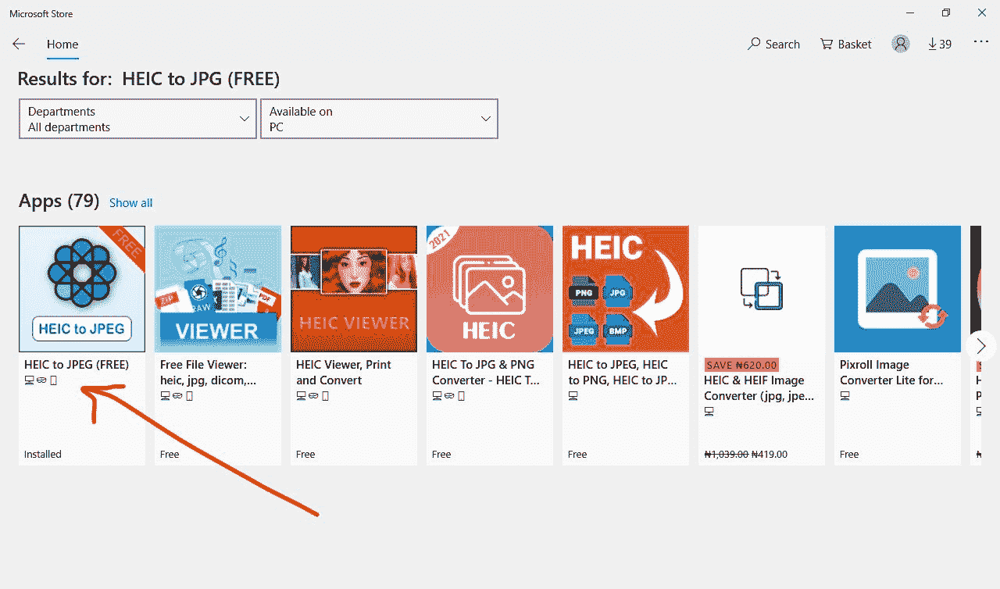
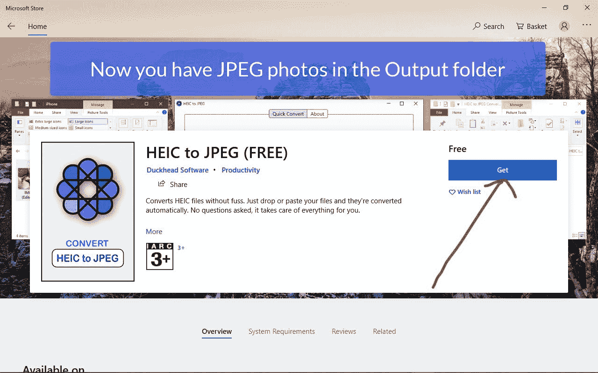
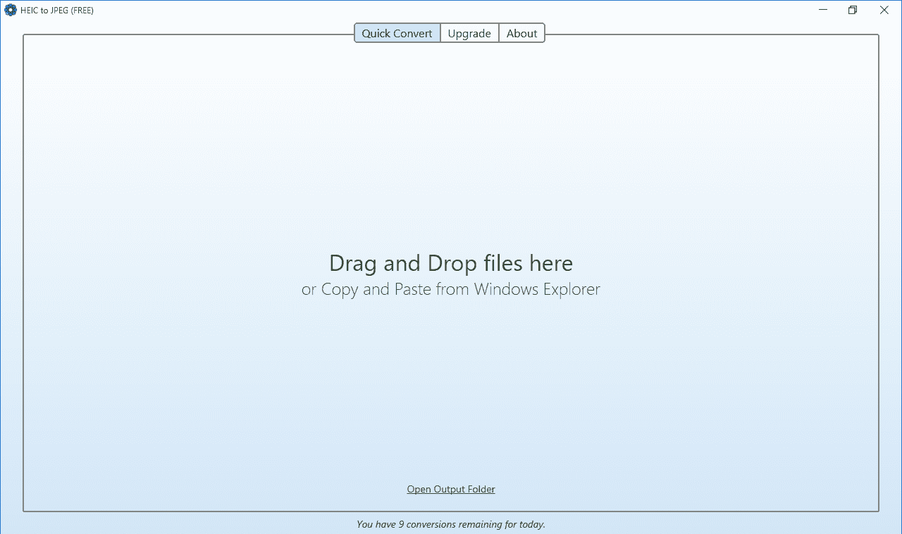
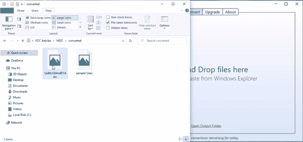
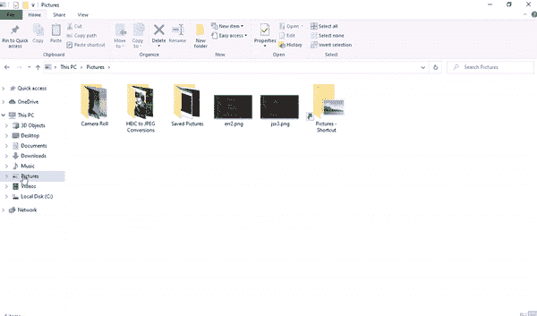

# 在 Windows 上将 HEIC 转换为 JPG 格式–在 PC 上将 HEIC 转换为文件格式

> 原文：<https://www.freecodecamp.org/news/convert-heic-to-jpg-on-windows-heic-file-format-on-pc/>

HEIC 照片格式是 Apple 的 HEIF(高效图像文件)文件格式的专有版本。

这是一种比 JPG 和 JPEG 更好的保存照片的方式，因为有了它，你可以在不损失质量的情况下节省高达 50%的设备磁盘空间。

因为 HEIC 归苹果所有，所以用最新的 macOS 版本和 iOS 11 以上版本拍摄的照片保存在。heic 格式。但它在 Windows 和 Android 等其他设备上并不容易实现。

因此，在本文中，我将向您展示如何在 Windows 机器上将 HEIC 文件转换为 JPG 文件。

## 如何在 Windows 上将 HEIC 转换为 JPG

**第一步**:要在 Windows 上把 HIEC 转换成 JPG，去微软商店搜索“HEIC to JPG(免费)”。它可以让你在一天内将 10 个 HEIC 文件转换成 JPG 文件。

**第二步**:点击搜索结果中出现的第一个 app，然后在下一页“获取”，安装。

安装后启动应用程序，您应该会看到如下所示的界面:

**第三步**:要将任何 HEIC 格式的图像转换为 JPG，只需将图像拖放到应用程序中，或者复制粘贴，图像就会立即转换:

要查看文件转换，头部到图片，你应该看到一个名为“HEIC 到 JPG 转换”的文件夹。在那里，你会看到所有的应用程序转换的图像。

## 结论

在本文中，您学习了如何在 Windows 上将 HEIC 文件转换为 JPG 文件，这样您就可以开始在 Windows 机器上查看这些文件了。

如果你觉得这篇文章有帮助，请与你的朋友和爱人分享。

感谢您的阅读，祝您愉快。