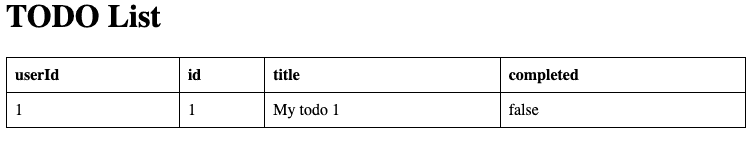
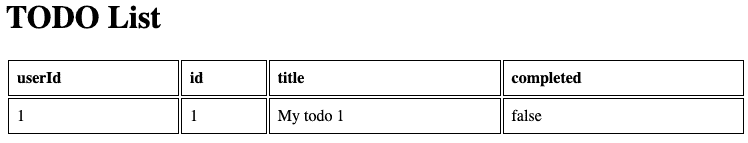
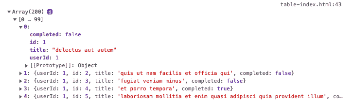
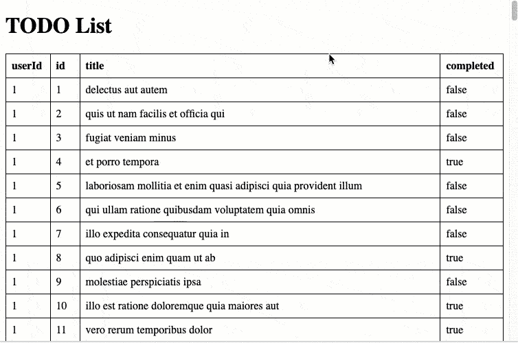
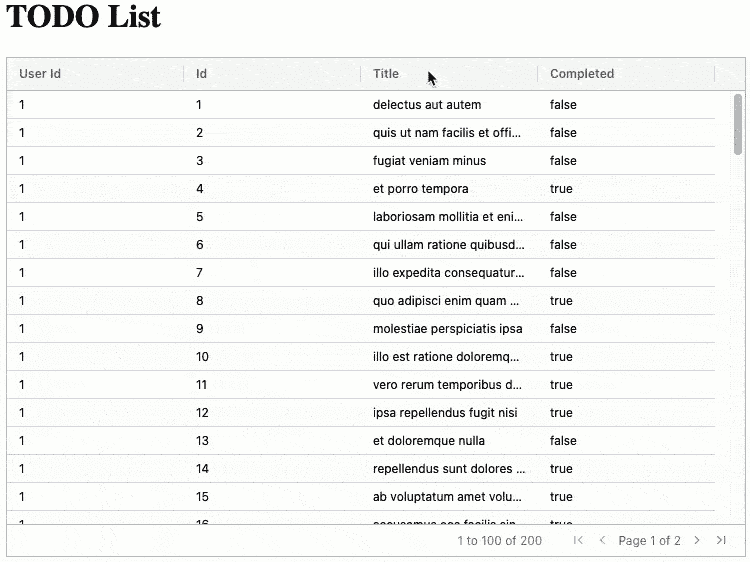

# 如何将静态 HTML 表格转换为动态 JavaScript 数据网格

> 原文：<https://www.freecodecamp.org/news/convert-html-table-to-dynamic-javascript-data-grid/>

HTML 表格很容易用于呈现少量数据。但是当它们显示大量数据时，用户很难使用它们。

排序、过滤和分页等功能使得处理多行数据变得更加容易。我们可以通过从 HTML 表迁移到 JavaScript 数据网格组件来轻松实现这些特性。

在这篇文章中，我们将使用免费的社区版 AG Grid JavaScript Data Grid 来将一个冗长的静态 HTML 表格转换成一个易于使用的交互式数据网格。我们需要的 JavaScript 数量很少，而且非常简单。

我们将分三步构建示例代码:

*   在 HTML 表中呈现待办事项数据的静态列表。
*   从 REST API 加载 Todo 项目列表，并在表中呈现。
*   将 HTML 表格转换为数据网格，以允许排序、过滤和分页。

## 如何用 HTML 表格呈现数据

我们的应用程序的第一个版本将允许我们创建基本的页面结构，并确保我们为用户呈现正确的数据。

我创建了一个简单的`index.html`文件，如下所示:

```
<!DOCTYPE html>
<html>

<head>
    <title>Table Example</title>
</head>

<body>

    <style>
        table {
            border-collapse: collapse;
            width: 100%;
        }

        td,
        th {
            border: 1px solid #000000;
            text-align: left;
            padding: 8px;
        }
    </style>

    <h1>TODO List</h1>

    <div id="data-table">
        <table id="html-data-table">
            <tr>
                <th>userId</th>
                <th>id</th>
                <th>title</th>
                <th>completed</th>
            </tr>
            <tr>
                <td>1</td>
                <td>1</td>
                <td>My todo 1</td>
                <td>false</td>
            </tr>
        </table>    
    </div>

</body>

</html> 
```

这将在表中呈现一个 Todo 项。



Single Todo Item Shown in an HTML Table

下面是示例[静态 HTML 表格页面](https://eviltester.github.io/freecodecampexamples/html-table-to-data-grid/static-html-table.html)。

使用`width:100%`将`table`的宽度设置为页面的 100%,表格中单元格之间的边框线被设置为与`border-collapse: collapse`显示为一条线。

如果没有`border-collapse`值，表格将如下图所示:



Table Styled without border-collapse

## 简短 HTML 表格的好处

HTML 表格是在页面上以表格形式呈现少量数据的一种非常快速的方式。

表格需要样式化，因为`table`的默认样式因浏览器而异，并且经常显示为无边框，使得数据难以阅读。

目前，我们的待办事项列表被静态编码到页面中。下一步，我们将使用 JavaScript 从 REST API 中获取列表。

## 如何从 API 中读取 JSON 以呈现在 HTML 表格中

因为我们将从 API 加载数据，所以我不会对表中的任何数据进行硬编码。为了支持动态加载，我简单地从`table`中删除了数据行，因为我将使用 JavaScript 创建数据行:

```
 <div id="data-table">
        <table id="html-data-table">
            <tr>
                <th>userId</th>
                <th>id</th>
                <th>title</th>
                <th>completed</th>
            </tr>
        </table>    
    </div> 
```

我将在终止的`body`标签之前的`index.html`页面中添加 JavaScript。

```
 <script type="text/javascript" charset="utf-8">
    </script>
</body> 
```

首先，我将编写读取数据的代码。

在这个演示中，我将使用“{ JSON } Placeholder”REST API 应用程序。通过在 URL[https://jsonplaceholder.typicode.com/todos](https://jsonplaceholder.typicode.com/todos)上发出一个`GET`请求，我们将收到一个 JSON 响应，这是一个待办事项列表。

你可以点击上面的链接，不用 JavaScript 自己尝试一下。

在 API 上发出`GET`请求最简单的方法是使用 JavaScript 内置的`fetch`函数。

```
 <script type="text/javascript" charset="utf-8">

        fetch('https://jsonplaceholder.typicode.com/todos')
            .then(function (response) {
                return response.json();
            }).then(function (apiJsonData) {
                console.log(apiJsonData);
            })

    </script>
</body> 
```

为了解释上面的代码，我将在下面的部分中描述它:

*   向`https://jsonplaceholder.typicode.com/todos`发出获取请求

```
fetch('https://jsonplaceholder.typicode.com/todos') 
```

*   然后，当请求完成时，将响应转换为 JavaScript 对象——在我们的例子中，这将是一个包含所有 Todo 项的数组。

```
.then(function (response) {
	return response.json();
}) 
```

*   然后将 JavaScript 对象写入控制台

```
.then(function (apiJsonData) {
	console.log(apiJsonData);
}) 
```

在我们的应用程序中使用这些代码，我们将看不到表中的任何内容，但是我们会看到在浏览器开发工具控制台中呈现的数组，在那里我们可以查看数据。



Data shown when console.log used

API 调用返回 200 个项目，每个项目都是一个 Todo 对象:

```
 {
    "userId": 1,
    "id": 1,
    "title": "delectus aut autem",
    "completed": false
  } 
```

我们的下一步是呈现表中的数据:

```
 <script type="text/javascript" charset="utf-8">

        fetch('https://jsonplaceholder.typicode.com/todos')
            .then(function (response) {
                return response.json();
            }).then(function (apiJsonData) {
                console.log(apiJsonData);
                renderDataInTheTable(apiJsonData);
            })

        function renderDataInTheTable(todos) {
            const mytable = document.getElementById("html-data-table");
            todos.forEach(todo => {
                let newRow = document.createElement("tr");
                Object.values(todo).forEach((value) => {
                    let cell = document.createElement("td");
                    cell.innerText = value;
                    newRow.appendChild(cell);
                })
                mytable.appendChild(newRow);
            });
        }
    </script>
</body> 
```

`renderDataInTheTable`函数在 DOM 中找到表格，这样我们就可以向它添加新行，然后遍历从 API 调用返回的所有 Todo 项。

对于每个 Todo 项，代码创建一个新的`tr`元素，然后将 Todo 项中的每个值作为`td`元素添加到表中。

```
let newRow = document.createElement("tr");
Object.values(todo).forEach((value) => {
    let cell = document.createElement("td");
    cell.innerText = value;
    newRow.appendChild(cell);
})
```

当`fetch`和`renderDataInTheTable`代码被添加到我们的应用程序中，并且页面被加载时，我们将会看到 HTML 表现在已经在表中呈现了所有 200 个 Todo 项。



Dynamically loaded todo list

下面是示例[动态 HTML 表格页面](https://eviltester.github.io/freecodecampexamples/html-table-to-data-grid/table-index.html)。

## 长 HTML 表格的优点和缺点

HTML 表格是在页面上呈现数据的一种简单方式，但对于长数据列表来说不是很有用。

数据项可能很难找到，尽管用户可以使用浏览器内置的“在页面中查找”功能来搜索数据。

通过在 HTML 表中呈现，我们的用户无法对数据进行排序，也无法过滤数据以仅显示已完成的待办事项。我们必须向应用程序添加额外的代码来实现排序和过滤功能。

随着更多的行被添加到表格中，HTML 表格将自动增长。当添加了大量数据时，这会使它们在应用程序中更难使用。

当我们添加大量数据时，我们可能希望分页来限制数据表只显示一定数量的行，并允许用户点击下一页来查看更多的项目。这也是我们必须编写额外代码来处理的功能。

当我们的应用程序需要更多的用户交互时，我们应该考虑使用数据网格组件。

我们可以用它来添加额外的功能，如:

*   整理
*   过滤
*   调整列大小
*   页码

## 数据网格组件和库

有许多免费的数据网格组件可用，但大多数是特定于框架的，因此它们需要使用 React、Angular 或 Vue 进行编码。

我在这个例子中使用了 [AG Grid](https://www.ag-grid.com/) ，因为免费版本可以与 JavaScript、TypeScript、React、Angular 或 Vue 一起使用。“AG”代表不可知论者，意思是可以用于任何框架。

当你学会在一个框架中使用 AG Grid 时，同样的 API 可以用于其他框架，这使得你的知识可以转移到其他项目中。

AG Grid 的免费版本可以在商业应用程序中使用，所以如果您设法将这里展示的演示应用程序扩展为一个商业待办事项管理应用程序，您仍然可以免费使用 AG Grid。许多商业应用程序都是使用 AG Grid 的免费版本构建的。

此外，在求职申请中，AG Grid 经常被当作一项技能，因此值得尝试。

AG Grid 的商业版本有一些额外的功能，比如 Excel 导出和创建图表，但是在这个演示中我们不需要这些功能。

使用数据网格意味着我们配置数据网格，给它数据来呈现，网格处理所有其他功能，如排序、过滤和分页。

我们可以转换我们现有的代码来使用 AG Grid，只需做一些修改。

## 如何添加 AG Grid JavaScript 和 CSS

AG Grid 是一个库，所以我们将包含所需的 JavaScript。

如果你正在使用像`npm`这样的构建工具，那么各种`npm install`命令会在[AG Grid](https://file+.vscode-resource.vscode-webview.net/Users/alan/Documents/GitHub/alan/freecodecampexamples/docs/html-table-to-data-grid/readme.md)文档中列出。

我们使用普通的 JavaScript，所以我们可以在我们的`head`部分包含`script`。

```
<head>
    <title>Data Grid Example</title>
    <script src="https://unpkg.com/ag-grid-community/dist/ag-grid-community.min.noStyle.js"></script>
    <link rel="stylesheet" href="https://unpkg.com/ag-grid-community/dist/styles/ag-grid.css">
    <link rel="stylesheet" href="https://unpkg.com/ag-grid-community/dist/styles/ag-theme-balham.css">
</head> 
```

这包括 AG Grid 的社区版和正确渲染网格所需的 CSS。

我们的`data-table` `div`不再需要任何`table`元素:

```
 <div id="data-table" class="ag-theme-balham">
    </div> 
```

AG Grid 将在我们设置数据网格时为它创建 HTML。我们添加`class`来使用一个 [AG 网格主题](https://www.ag-grid.com/javascript-data-grid/themes/)。在这个例子中，我们使用了主题`ag-theme-balham`。

AG 网格要求设置`div`的宽度和高度。我选择将它添加为代码中的`style`部分:

```
 <style>
        #data-table {
            height: 500px;
            width: 100%;
        }
    </style> 
```

网格将显示为 500 像素高，并填满屏幕的`100%`宽度。这复制了 HTML 表格的基本样式。但是它也展示了使用数据网格的好处之一。呈现的表格的大小可以很容易地控制，滚动条将根据网格本身的需要自动添加。

## 如何配置 AG 网格和渲染数据

代码的`script`部分发生了变化，因为我们需要:

*   配置数据网格。
*   使用配置创建新的数据网格。
*   获取数据并将其添加到网格中。

我将在下面展示最初修改的`script`部分，然后在接下来的段落中解释它。

```
 <script type="text/javascript" charset="utf-8">

        const columnDefs = [
            { field: 'userId' },
            { field: 'id' },
            { field: 'title' },
            { field: 'completed' },
        ];

        const gridOptions = {
            columnDefs: columnDefs,
            onGridReady: (event) =>{renderDataInTheTable(event.api)}
        };

        const eGridDiv = document.getElementById('data-table');
        new agGrid.Grid(eGridDiv, gridOptions);

        function renderDataInTheTable(api) {
            fetch('https://jsonplaceholder.typicode.com/todos')
                .then(function (response) {
                    return response.json();
                }).then(function (data) {
                    api.setRowData(data);
                    api.sizeColumnsToFit();
                })
        }
    </script> 
```

数据网格是数据和配置驱动的——我们不需要写很多代码就可以创建一个功能性的数据网格。

首先，我们创建一个列对象数组，定义数据网格中的列。这些列映射到数据上。

我们从 API 调用接收的数据有四个属性:“userId”、“Id”、“title”和“completed”:

```
 {
    "userId": 1,
    "id": 1,
    "title": "delectus aut autem",
    "completed": false
  } 
```

为了在数据网格中将它们呈现为列，我们创建了一个带有`field`属性的对象，其中的值是数据对象中属性的名称。

```
 const columnDefs = [
            { field: 'userId' },
            { field: 'id' },
            { field: 'title' },
            { field: 'completed' },
        ]; 
```

接下来我们创建`gridOptions`对象。这将配置数据网格:

```
 const gridOptions = {
            columnDefs: columnDefs,
            onGridReady: (event) =>{renderDataInTheTable(event.api)}
        }; 
```

属性被赋予我们之前定义的列对象的数组。

当网格被创建并在 DOM 中呈现时(也就是说，当网格准备好了)，属性`onGridReady`被赋予一个调用`renderDataInTheTable`函数的函数。

为了向页面添加网格，我们找到包含网格的`div`元素，然后用我们配置的选项为该元素实例化一个新的 AG Grid 对象:

```
 const eGridDiv = document.getElementById('data-table');
        new agGrid.Grid(eGridDiv, gridOptions); 
```

获取数据并在网格中呈现数据的函数与我们用于动态 HTML 表的`fetch`代码非常相似。不同之处在于，`renderDataInTheTable`函数接收一个 AG Grid Api 对象作为参数，允许我们调用 AG Grid 功能来设置行数据和调整列的大小以适应网格:

```
 function renderDataInTheTable(api) {
            fetch('https://jsonplaceholder.typicode.com/todos')
                .then(function (response) {
                    return response.json();
                }).then(function (data) {
                    api.setRowData(data);
                    api.sizeColumnsToFit();
                })
        } 
```

当这段代码运行时，我们基本上复制了动态 HTML 表的相同功能，但是现在所有数据都显示在带有滚动条的数据网格中。


为了获得使用数据网格的好处，并允许用户对数据进行排序、过滤和导航，我们只需修改配置。

## 如何实现排序、过滤和分页

以下是我们到目前为止在数据网格中配置的内容:

*   要显示数据中的哪些字段
*   使用什么数据

为了添加排序、过滤、可调整大小的列和分页，我们修改了`gridOptions`配置:

```
 const gridOptions = {

            defaultColDef: {
                sortable: true,
                filter: 'agTextColumnFilter',
                resizable: true
            },

            pagination: true,

            columnDefs: columnDefs,
            onGridReady: (event) =>{renderDataInTheTable(event.api)}
        }; 
```

我们可以通过向`columnDefs`对象添加额外的属性来单独配置 AG Grid 中的列。或者，如果默认情况下所有列都需要相同的功能，我们可以配置`defaultColDef`。

在这里，我们将其配置为可排序、可过滤和可调整大小:

```
 defaultColDef: {
                sortable: true,
                filter: 'agTextColumnFilter',
                resizable: true
            }, 
```

我们为所有列定义的默认过滤器是文本过滤器。

为了给网格添加自动分页，我们添加了`pagination: true`属性，AG Grid 将为我们自动分页数据。



Data Grid with Sorting, Filtering and Pagination

## 用户友好的数据网格

通过上面的代码，我们创建了一个用户友好的数据网格，它可以动态地获取数据并将其添加到支持排序、过滤和分页的数据网格中。

下面是示例[数据网格 HTML 页面](https://eviltester.github.io/freecodecampexamples/html-table-to-data-grid/datagrid-index.html):

```
<!DOCTYPE html>
<html>

<head>
    <title>Data Grid Example</title>
    <script src="https://unpkg.com/ag-grid-community/dist/ag-grid-community.min.noStyle.js"></script>
    <link rel="stylesheet" href="https://unpkg.com/ag-grid-community/dist/styles/ag-grid.css">
    <link rel="stylesheet" href="https://unpkg.com/ag-grid-community/dist/styles/ag-theme-balham.css">
</head>

<body>
    <style>
        #data-table {
            height: 500px;
            width: 100%;
        }
    </style>

    <h1>TODO List</h1>

    <div id="data-table" class="ag-theme-balham">
    </div>

    <script type="text/javascript" charset="utf-8">

        const columnDefs = [
            { field: 'userId' },
            { field: 'id' },
            { field: 'title' },
            { field: 'completed' },
        ];

        const gridOptions = {

            defaultColDef: {
                sortable: true,
                filter: 'agTextColumnFilter',
                resizable: true
            },

            pagination: true,

            columnDefs: columnDefs,
            onGridReady: (event) =>{renderDataInTheTable(event.api)}
        };

        const eGridDiv = document.getElementById('data-table');

        new agGrid.Grid(eGridDiv, gridOptions);

        function renderDataInTheTable(api) {
            fetch('https://jsonplaceholder.typicode.com/todos')
                .then(function (response) {
                    return response.json();
                }).then(function (data) {
                    api.setRowData(data);
                    api.sizeColumnsToFit();
                })
        }
    </script>
</body>
</html> 
```

## 数字过滤器

由于`userId`和`id`列是数字，我们可以通过修改`columnDefs`来使用数字过滤器:

```
 const columnDefs = [
            { field: 'userId', filter: 'agNumberColumnFilter'},
            { field: 'id', filter: 'agNumberColumnFilter'},
            { field: 'title' },
            { field: 'completed' },
        ]; 
```

下面是示例[数据网格编号过滤器 HTML 页面](https://eviltester.github.io/freecodecampexamples/html-table-to-data-grid/datagrid-number-filters-index.html)。

AG Grid 文档中列出的列有许多[配置选项，例如配置宽度、样式以及使单元格可编辑。](https://www.ag-grid.com/javascript-data-grid/column-properties/)

## 数据网格的好处

对于许多网站来说，一个简单的 HTML 表格将是呈现表格数据的一种非常明智的方式。它既快速又容易理解，而且用一点 CSS 就可以让你的用户觉得这个表格很好看。

当您的页面变得更加复杂、呈现更多的数据或者要求用户有更多的交互性时，使用数据网格组件或库就变得更有意义了。

数据网格提供了用户需要的大部分功能，而无需编写大量代码。在本文给出的例子中，我们从从 API 读取数据的动态表转移到从 API 读取数据并进行排序、过滤、分页和调整列大小的数据网格。

这是很多额外的功能，但是我们的 HTML 代码是相同的长度，我们添加的 JavaScript 没有那么复杂，因为数据网格完成了渲染数据的所有工作。

数据网格可以处理成千上万的行并快速更新，因此它们经常用于实时金融交易系统，其中单元格中的价格每隔几毫秒更新一次。

如果你正在使用 React，那么除了 [AG 网格](https://www.ag-grid.com/react-data-grid/)之外，你还可以查看[材质 UI](https://mui.com/components/data-grid/) 或 [React 表格](https://react-table.tanstack.com/)。React Table 是一个“表格”,而不是数据网格，因此最初需要更多的代码来呈现表格。

“材质 UI”和“反应表”仅适用于“反应”。AG Grid 是框架不可知的，将与 JavaScript、TypeScript、React、Angular 和 Vue 一起工作。

这篇文章的源代码可以在文件夹[docs/html-table-to-data-grid](https://github.com/eviltester/freecodecampexamples/tree/main/docs/html-table-to-data-grid)中的 Github repo 中找到。