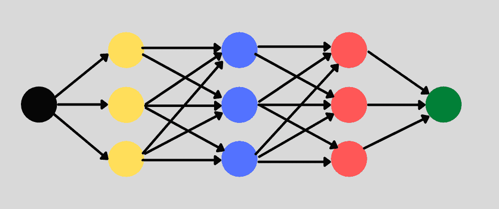
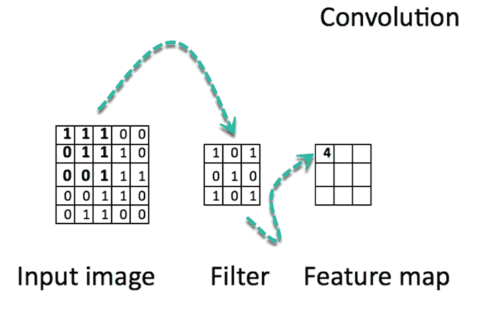

# 什么是卷积神经网络？机器学习和深度学习的初学者教程

> 原文：<https://www.freecodecamp.org/news/convolutional-neural-network-tutorial-for-beginners/>

你可以在机器学习项目中使用许多不同种类的神经网络。有递归神经网络、前馈神经网络、模块化神经网络等等。

卷积神经网络是另一种常用的神经网络。在我们讨论卷积神经网络的细节之前，让我们先来讨论一个常规神经网络。

## 什么是神经网络？

当你听到人们提到称为深度学习的机器学习领域时，他们很可能在谈论神经网络。

神经网络是以我们的大脑为模型的。有单独的节点形成网络中的层，就像我们大脑中的神经元连接不同的区域。



Neural network with multiple hidden layers. Each layer has multiple nodes.

单一图层中节点的输入将被分配一个权重，该权重会改变该参数对整体预测结果的影响。由于权重被分配在节点之间的链路上，每个节点可能受到多个权重的影响。

神经网络接受输入层中的所有训练数据。然后，它通过隐藏层传递数据，根据每个节点的权重转换值。最后，它在输出层返回一个值。

正确调整神经网络以获得一致、可靠的结果可能需要一些时间。测试和训练您的神经网络是一个平衡过程，它决定哪些特征对您的模型最重要。

## **卷积神经网络(CNN)有何不同**

卷积神经网络是一种特殊的多层神经网络。它处理网格状排列的数据，然后提取重要的特征。使用 CNN 的一个巨大优势是，你不需要对图像做大量的预处理。


[Image source](https://www.researchgate.net/figure/A-vanilla-Convolutional-Neural-Network-CNN-representation_fig2_339447623)

对于大多数处理图像处理的算法，过滤器通常由工程师基于试探法创建。CNN 可以了解过滤器中哪些特征是最重要的。这节省了大量的时间和试错工作，因为我们不需要那么多的参数。

除非您处理的是具有数千像素的高分辨率图像，否则这看起来并不像是一笔巨大的节省。卷积神经网络算法的主要目的是将数据转换成更容易处理的形式，而不会丢失对于计算数据所代表的内容很重要的特征。这也使它们成为处理大型数据集的绝佳选择。

CNN 和常规神经网络之间的一个很大区别是，CNN 使用卷积来处理幕后的数学运算。在 CNN 的至少一层中使用卷积代替矩阵乘法。卷积采用两个函数并返回一个函数。

CNN 的工作原理是对你的输入数据进行过滤。让它们如此特别的是 CNN 能够随着训练的进行调整过滤器。这样，即使你有大量的数据集，比如图像，也能实时地对结果进行微调。

由于过滤器可以更新，以更好地训练 CNN，这消除了手动创建过滤器的需要。这让我们在应用于数据集的过滤器数量以及这些过滤器的相关性方面更加灵活。使用这种算法，我们可以处理更复杂的问题，比如人脸识别。

使用 CNN 的一个障碍是缺乏数据。虽然网络可以用相对较少的数据点(~10，000 >)来训练，但是可用的数据越多，CNN 就越好调谐。

请记住，这些数据点必须是干净的和有标签的，以便 CNN 能够使用它们。这就是为什么他们工作起来如此昂贵。

## 卷积神经网络如何工作

卷积神经网络是基于神经科学的发现。它们由被称为节点的人工神经元层组成。这些节点是计算输入的加权和并返回激活图的函数。这是神经网络的卷积部分。

层中的每个节点由其权重值定义。当你给一个层一些数据时，比如一个图像，它获取像素值并挑选出一些视觉特征。

当您在 CNN 中处理数据时，每一层都会返回激活图。这些地图指出了数据集中的重要特征。如果你给 CNN 一张图片，它会根据像素值指出特征，比如颜色，并给你一个激活功能。

通常对于图片，CNN 会先找到图片的边缘。然后这个图像的微小的清晰度将被传递到下一层。然后，该层将开始检测像角落和颜色组的东西。然后，该图像定义将被传递到下一层，并且循环继续，直到做出预测。

随着层变得更加明确，这被称为最大池化。它仅返回激活地图图层中最相关的要素。这是传递到每个连续层的内容，直到得到最后一层。



https://www.guru99.com/convnet-tensorflow-image-classification.html

CNN 的最后一层是分类层，它根据激活图确定预测值。如果你把一个笔迹样本传给 CNN，分类层会告诉你图像里是什么字母。这是自动驾驶汽车用来确定一个物体是另一辆车、一个人还是其他一些障碍物的方法。

训练 CNN 类似于训练许多其他机器学习算法。您将从一些独立于测试数据的训练数据开始，并根据预测值的准确性调整权重。只是要小心，不要过度拟合你的模型。

## 卷积神经网络的用例

根据您的问题，您可以使用多种 CNN。

### 不同类型的 CNN

**1D CNN** :有了这些，CNN 的核心朝一个方向移动。1D CNN 通常用于时间序列数据。

**2D CNN** :这种 CNN 内核朝两个方向运动。你会看到这些用于图像标记和处理。

**3D CNN** :这种 CNN 有一个向三个方向运动的内核。有了这种 CNN，研究人员将它们用于 3D 图像，如 CT 扫描和核磁共振成像。

在大多数情况下，你会看到 2D CNN，因为这些通常与图像数据有关。以下是你可能会看到 CNN 的一些应用。

*   无需预处理即可识别图像
*   识别不同的笔迹
*   计算机视觉应用
*   在银行中用来读取支票上的数字
*   在邮政服务中用来读取信封上的邮政编码

## Python 中 CNN 的一个例子

作为使用 CNN 解决实际问题的一个例子，我们将使用 MNIST 数据集识别一些手写数字。

我们做的第一件事是定义 CNN 模型。接下来，我们分离我们的训练和测试数据。最后，我们使用训练数据来训练模型，并使用测试数据来测试该模型。

```
from keras import layers
from keras import models
from keras.datasets import mnist
from keras.utils import to_categorical

# Define the CNN model
model = models.Sequential()

model.add(layers.Conv2D(32, (5,5), activation='relu', input_shape=(28, 28,1)))
model.add(layers.MaxPooling2D((2, 2)))

model.add(layers.Conv2D(64, (5, 5), activation='relu'))
model.add(layers.MaxPooling2D((2, 2)))

model.add(layers.Flatten())
model.add(layers.Dense(10, activation='softmax'))

model.summary()

# Split the data into training and test sets
(train_images, train_labels), (test_images, test_labels) = mnist.load_data()

train_images = train_images.reshape((60000, 28, 28, 1))
train_images = train_images.astype('float32') / 255

test_images = test_images.reshape((10000, 28, 28, 1))
test_images = test_images.astype('float32') / 255

train_labels = to_categorical(train_labels)
test_labels = to_categorical(test_labels)

# Use the training data to train the model
model.compile(loss='categorical_crossentropy',
              optimizer='sgd',
              metrics=['accuracy'])

model.fit(train_images, train_labels,
          batch_size=100,
          epochs=5,
          verbose=1)

# Test the model's accuracy with the test data
test_loss, test_acc = model.evaluate(test_images, test_labels)

print('Test accuracy:', test_acc)
```

## 结论

卷积神经网络是多层神经网络，非常擅长从数据中提取特征。它们可以很好地处理图像，并且不需要大量的预处理。

使用卷积和池化来减少图像的基本特征，您可以正确地识别图像。

与其他类型的神经网络相比，用较少的初始参数训练 CNN 模型更容易。您不需要大量的隐藏层，因为卷积将能够为您处理大量的隐藏层发现。

CNN 很酷的一点是它可以应用于许多复杂的问题。从自动驾驶汽车到检测糖尿病，CNN 可以处理这类数据，并提供准确的预测。