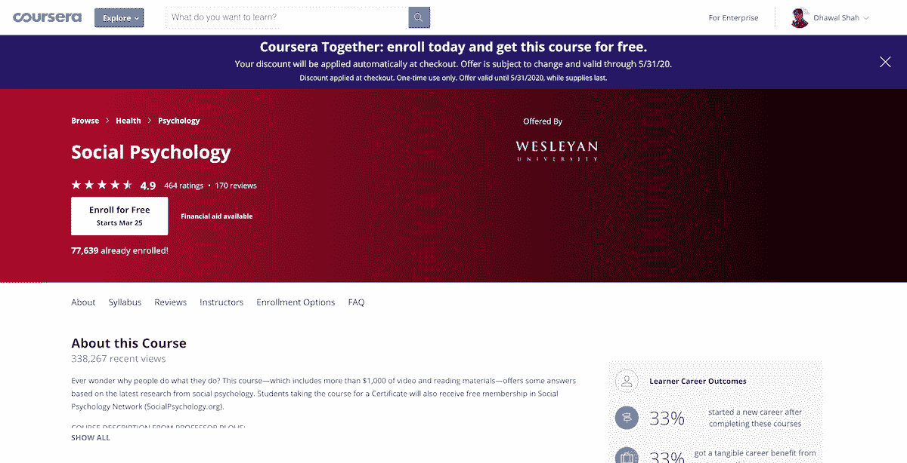

# 以下是你现在可以免费获得的 115 个 Coursera 证书(在疫情冠状病毒期间)

> 原文：<https://www.freecodecamp.org/news/coronavirus-coursera-free-certificate/>

三月底，世界上最大的[大型开放在线课程](https://www.classcentral.com/help/moocs)提供商 Coursera [宣布](https://blog.coursera.org/coursera-together-free-online-learning-during-covid-19/)他们将提供 100 门免费课程以应对新冠肺炎疫情的冲击。

最近，Coursera 增加了来自拉丁美洲大学合作伙伴的 35 门新课程，并延长了截止日期。

我使用 [Class Central](https://www.classcentral.com/) 的数据集分析了这 135 门免费的 Coursera 课程。我发现 115 门课程提供了通常需要付费的证书。其他 20 门课程已经免费，但不提供证书。完整的列表可以在下面找到。

疫情冠状病毒使得人们对在线教育越来越感兴趣。我经营的课程目录网站 Class Central 发现，对在线学习感兴趣的人在 T2 有了巨大的增长。

目前的形势也促使课程提供者发起了许多倡议。对于学习者来说，这意味着新的机会。我们将这些记录在三个列表中，并不断更新:

*   [因冠状病毒免费在线学习](https://www.classcentral.com/report/free-online-learning-coronavirus/)
*   [教授新冠肺炎的免费课程](https://www.classcentral.com/report/covid-19-courses/)
*   [因冠状病毒而虚拟化的数字学习会议列表](https://www.classcentral.com/report/digital-learning-conferences-coronavirus/)

A screenshot of one of these courses on Coursera

事实上，我们之前已经发现了[1400 多门完全免费的课程](https://www.classcentral.com/report/coursera-free-online-courses/)。许多人确实有证书，但你需要付费，但所有课程材料的访问都是免费的——包括评分作业。

这 115 门课程都不属于 Coursera 专业。Coursera 只让它们免费到 2020 年 7 月底。现在这个期限又被延长到了今年年底。

另外，我问 Coursera 为什么有些人看不到折扣。在 Class Central 上点击*进入课程*后，当你到达 Coursera 上的课程页面，**等待推广横幅出现在顶部**，然后点击*免费报名*。如果没有看到横幅，请刷新。这张 [gif 展示了接下来](https://gfycat.com/forkedterribleincatern)的步骤。

如果你已经在旁听这里列出的课程，并想**重新注册以获得免费证书**，这里是如何: **1** 。登录 Coursera。 **2** 。前往*我的课程*。 **3** 。点击课程卡右上角的三点图标。 **4** 。点击*取消注册*。然后，[按照 gif 中的步骤](https://gfycat.com/forkedterribleincatern)使用免费证书重新注册。

这些课程来自大约 50 所大学，包括:

*   宾夕法尼亚大学
*   乔治亚理工学院
*   约翰·霍普金斯大学
*   （美国）加利福尼亚理工学院
*   公爵
*   和伦敦帝国理工学院。

一些课程也直接来自谷歌和亚马逊等公司。

同样值得注意的是，这些新的免费课程中有八门被列为 Class Central[有史以来最好的在线课程](https://www.classcentral.com/collection/top-free-online-courses)。

## 以下是截止到 2020 年底免费认证的免费课程的完整列表，根据其评论进行排名:

*   [思维转变:突破学习障碍，发现自己隐藏的潜力](https://www.classcentral.com/course/mindshift-8289)来自*麦克马斯特大学*★★★★(4845)
*   [快乐充实的生活](https://www.classcentral.com/course/happiness-2860)来自*印度商学院*★★★★(468)
*   [山脉 101](https://www.classcentral.com/course/mountains-101-7455) 来自*阿尔伯塔大学*★★★★(419)
*   [学习如何为青年学习](https://www.classcentral.com/course/learning-how-to-learn-youth-12569)来自*亚利桑那州立大学*★★★★(373)
*   [MATLAB 编程入门](https://www.classcentral.com/course/matlab-3396)来自*范德比尔特大学*★★★★(205)
*   [材料力学 I:应力基础&应变和轴向载荷](https://www.classcentral.com/course/mechanics-1-5031)来自*佐治亚理工学院*★★★★(95)
*   [迪诺 101:恐龙古生物学](https://www.classcentral.com/course/dino101-1057)来自*阿尔伯塔大学*★★★★(85)
*   [社会心理学](https://www.classcentral.com/course/socialpsychology-555)来自*卫斯理大学*★★★★(78)
*   [哲学入门](https://www.classcentral.com/course/introphil-418)来自*爱丁堡大学*★★★☆(72)
*   [去神秘化的正念](https://www.classcentral.com/course/mindfulness-6951)来自*莱顿大学*★★★★(65)
*   [太阳系的科学](https://www.classcentral.com/course/solarsystem-1813)来自*加州理工学院*★★★★(43)
*   [心理急救](https://www.classcentral.com/course/psychfirstaid-2900)来自*约翰·霍普金斯大学*★★★☆(38)
*   [初学汉语](https://www.classcentral.com/course/hy-2353)来自*北大*★★★☆(34)
*   [人体生理学入门](https://www.classcentral.com/course/humanphysio-380)来自*杜克大学*★★★☆(28)
*   [事物如何工作:物理学导论](https://www.classcentral.com/course/how-things-work-431)来自*弗吉尼亚大学*★★★★(27)
*   [成为变革者:社会创新入门](https://www.classcentral.com/course/social-innovation-6655)来自*开普顿大学*★★★★(27)
*   [加州大学圣克鲁斯分校*的 C 程序员 C++，A 部分*](https://www.classcentral.com/course/c-plus-plus-a-671)★★★☆☆(26)
*   [流行病学:公共卫生基础科学](https://www.classcentral.com/course/epidemiology-733)来自*北卡罗来纳大学教堂山分校*★★★☆(23)
*   [通过情商激发领导力](https://www.classcentral.com/course/lead-ei-710)来自*凯斯西储大学*★★★☆(23)
*   [第一步韩语](https://www.classcentral.com/course/learn-korean-5730)来自*延世大学*★★★☆(22)
*   [狗的情感与认知](https://www.classcentral.com/course/coursera-dog-emotion-and-cognition-3627)来自*杜克大学*★★★☆(19)
*   [成功的科学:研究者知道什么你应该知道](https://www.classcentral.com/course/success-8087)来自*密西根大学*★★★★(18)
*   [社会中新的商业模式](https://www.classcentral.com/course/businessinsociety-648)来自*弗吉尼亚大学*★★★☆(18)
*   [设计:社会中的造物](https://www.classcentral.com/course/design-371)来自*宾夕法尼亚大学*★★★☆(17)
*   [可持续性简介](https://www.classcentral.com/course/sustain-434)来自*伊利诺伊大学香槟分校*★★★☆(16)
*   [创造性解决问题](https://www.classcentral.com/course/cps-1636)来自*明尼苏达大学* ★★★☆☆(16)
*   [天文学:探索时空](https://www.classcentral.com/course/astro-3007)来自*亚利桑那大学*★★★☆(16)
*   [少坐，多活动](https://www.classcentral.com/course/get-active-5260)来自*爱丁堡大学*★★★☆(13)
*   [动物行为与福利](https://www.classcentral.com/course/animal-1357)来自*爱丁堡大学*★★★☆(13)
*   [个人品牌介绍](https://www.classcentral.com/course/personal-branding-4865)来自*弗吉尼亚大学*★★★☆(13)
*   [大历史:连接知识](https://www.classcentral.com/course/big-history-4485)来自*麦考瑞大学*★★★★(13)
*   [防灾准备](https://www.classcentral.com/course/disasterprep-481)来自*匹兹堡大学*★★★☆(12)
*   [再想想我:如何理解来自*杜克大学的论点*](https://www.classcentral.com/course/understanding-arguments-6620)★★★☆(10)
*   [全球健康的挑战](https://www.classcentral.com/course/challengesgh-2376)来自*杜克大学*★★★★(10)
*   [自己编码！爱丁堡*大学*★★★★(10)编程入门](https://www.classcentral.com/course/codeyourself-2938)
*   [弗吉尼亚大学*的营销分析*](https://www.classcentral.com/course/market-analytics-4868)★★★☆(10)
*   [个人&家庭理财规划](https://www.classcentral.com/course/uffinancialplanning-1811)来自*佛罗里达大学*★★★☆(10)
*   [流行病、大流行和疫情](https://www.classcentral.com/course/panprevention-3059)来自*匹兹堡大学*★★★☆(10)
*   [刁钻的美式英语发音](https://www.classcentral.com/course/tricky-american-english-pronunciation-8274)来自*加州大学欧文分校*★★★☆(9)
*   [数据科学数学技能](https://www.classcentral.com/course/datasciencemathskills-7745)来自*杜克大学*★★★☆(9)
*   [创造性思维:成功的技巧和工具](https://www.classcentral.com/course/creative-thinking-techniques-and-tools-for-succes-17292)来自*伦敦帝国理工学院*★★★★(9)
*   [云计算基础知识(云 101)](https://www.classcentral.com/course/cloud-computing-basics-18069) 来自*learn quest*★☆☆☆(9)
*   [新冠肺炎:你需要知道的(CME 合格)](https://www.classcentral.com/course/covid-19-what-you-need-to-know-19270)来自*渗透大学*★★★★(9)
*   [微积分:单变量第一部分——函数](https://www.classcentral.com/course/single-variable-calculus-5066)来自*宾夕法尼亚大学*★★★★(8)
*   [化学入门:反应和配比](https://www.classcentral.com/course/chem991-2375)来自*杜克大学*★★★★(8)
*   [疗养院的感染预防](https://www.classcentral.com/course/infection-prevention-5062)来自*北卡罗来纳大学教堂山分校*★★★★(7)
*   [如何熟练:个人技能管理入门(以项目为中心的课程)](https://www.classcentral.com/course/skills-management-11218)来自*纽约州立大学*★★★☆(6)
*   [内容营销的策略](https://www.classcentral.com/course/content-marketing-7799)来自*加州大学戴维斯分校*★★★☆(6)
*   [团队合作技能:有效的团队沟通](https://www.classcentral.com/course/teamwork-skills-effective-communication-9661)来自*科罗拉多大学博尔德分校*★★★☆(6)
*   [AWS 机器学习入门](https://www.classcentral.com/course/aws-machine-learning-16924)来自*亚马逊 Web 服务*★★★☆(6)
*   [成功的职业发展](https://www.classcentral.com/course/career-advancement-7018)来自佐治亚州*大学系统*★★★★(6)
*   [猫狗的真相](https://www.classcentral.com/course/cats-and-dogs-8318)来自*爱丁堡大学*★★★★(5)
*   [精神控制:在新冠肺炎期间管理你的精神健康](https://www.classcentral.com/course/manage-health-covid-19-19289)来自*多伦多大学*★★★★(5)
*   [虚拟时代的沟通策略](https://www.classcentral.com/course/communication-strategies-virtual-age-11654)来自*多伦多大学*★★★★(5)
*   [如何撰写和发表科技论文(以项目为中心的课程)](https://www.classcentral.com/course/how-to-write-a-scientific-paper-5816)来自*理工学院*★★★★(5)
*   [生态学:生态系统动力学与保护](https://www.classcentral.com/course/ecology-conservation-10618)来自*美国自然历史博物馆*★★★★(5)
*   [新冠肺炎联系追查](https://www.classcentral.com/course/covid-19-contact-tracing-19669)来自*约翰·霍普金斯大学*★★★★(4)
*   [关系的艺术与科学:理解人类需求](https://www.classcentral.com/course/human-needs-8253)来自*多伦多大学*★★★★(4)
*   [运动科学](https://www.classcentral.com/course/science-exercise-8679)来自*科罗拉多大学博尔德*★★★★(4)
*   [面向商业人士的机器学习](https://www.classcentral.com/course/machine-learning-business-professionals-13415)来自*谷歌云*★★★★(4)
*   [谷歌云平台 AWS 专业人员基础](https://www.classcentral.com/course/gcp-fundamentals-aws-8614)来自*谷歌云* ★★★☆☆(4)
*   [构建你的第一个 Android 应用程序(以项目为中心的课程)](https://www.classcentral.com/course/android-app-5719)来自*巴黎中央学校*★★★☆(4)
*   [在 Azure 上开发 AI 应用](https://www.classcentral.com/course/developing-ai-applications-azure-17329)来自*learn quest*★★★★(4)
*   [化学导论:结构与溶液](https://www.classcentral.com/course/chem992-2665)来自*杜克大学*★★★★(3)
*   [乐理入门](https://www.classcentral.com/course/music-theory-8026)来自*密西根州立大学*★★★☆(3)
*   [公共卫生中的疾病筛查](https://www.classcentral.com/course/screening-4793)来自*日内瓦大学* ★★★☆☆(3)
*   [全球突发事件中的沟通](https://www.classcentral.com/course/communicating-during-global-emergencies-11312)来自*埃默里大学*★★★☆(3)
*   [用艺术治愈](https://www.classcentral.com/course/healing-with-the-arts-8103)来自*弗罗里达大学*★★★★(3)
*   [作为设计的时尚](https://www.classcentral.com/course/fashion-design-9416)来自*现代艺术博物馆*★★★☆(3)
*   [微积分入门](https://www.classcentral.com/course/introduction-to-calculus-12547)来自*悉尼大学*★★★★(3)
*   [全球健康要义](https://www.classcentral.com/course/essentials-global-health-7337)来自*耶鲁大学*★★★☆(2)
*   [化挑战为机遇](https://www.classcentral.com/course/converting-challenges-into-opportunities-9142)来自*加州大学圣地亚哥分校*★★★★(2)
*   [设计的语言:形式与意义](https://www.classcentral.com/course/design-language-16927)来自*加州艺术学院*★★★★(2)
*   [虫子 101:昆虫与人类的互动](https://www.classcentral.com/course/bugs-101-13851)来自*阿尔伯塔大学*★★★★(2)
*   [布法罗*大学的计算机视觉基础*](https://www.classcentral.com/course/computer-vision-basics-13564)★★★★(1)
*   [全球健康:跨学科综述](https://www.classcentral.com/course/globalhealthoverview-685)来自*日内瓦大学* ★★☆☆☆(1)
*   [做建筑](https://www.classcentral.com/course/making-architecture-7153)来自 *IE 商学院*★★★★(1)
*   [职业规划:简历/CV、求职信、面试](https://www.classcentral.com/course/career-planning--20044)来自*托木斯克国立大学*★★★★(1)
*   [AWS 计算机视觉:GluonCV 入门](https://www.classcentral.com/course/aws-computer-vision-gluoncv-17327)来自*亚马逊网络服务*★★★★(1)
*   [云身份介绍](https://www.classcentral.com/course/cloud-identity-10785)来自*谷歌云*★★★★(1)
*   [【新】新冠肺炎医护人员培训](https://www.classcentral.com/course/covid-19-training-healthcare-20907)来自*史丹福大学*
*   [高风险领导力:危机时刻的领导力](https://www.classcentral.com/course/high-stakes-leadership-20287)来自*密执安大学*
*   [疾病集群](https://www.classcentral.com/course/disease-clusters-13166)来自*约翰·霍普金斯大学*
*   [coid-19](https://www.classcentral.com/course/rastreamento-contatos-covid-19-20780)来自*约翰霍普金斯大学*的接触追踪
*   [工程基础考试复习](https://www.classcentral.com/course/fe-exam-4434)来自*佐治亚理工学院*
*   [谷歌云平台上的工业物联网](https://www.classcentral.com/course/iiot-google-cloud-platform-12701)来自*谷歌云*
*   [用 Dialogflow 建立对话体验](https://www.classcentral.com/course/conversational-experiences-dialogflow-12529)来自*谷歌云*
*   [疫情期间的人口健康:接触者追踪及以后](https://www.classcentral.com/course/contact-tracing-for-covid-19-20577)休斯顿*大学*

## 免费西班牙语证书课程

*   [Java 面向对象编程简介](https://www.classcentral.com/course/introduccion-programacion-java-9065)【来自安第斯大学】【18】
*   [从安第斯大学*【5】设计促进福利的项目*](https://www.classcentral.com/course/diseno-proyectos-promocion-bienestar-8225)
*   *[Mindshift:转变你的思想，克服学习障碍，发掘你隐藏的潜力。](https://www.classcentral.com/course/mindshift-transforma-mente-10619)来自*麦克马斯特大学*【3】*
*   *[机器人](https://www.classcentral.com/course/robotica-inicial-4659)来自*墨西哥国立自治大学*【2】*
*   *[新兴市场创新产品的快速开发](https://www.classcentral.com/course/innovacion-734)【来自蒙特雷技术】【2】*
*   *[数字能力。办公工具(微软 Word、Excel、Power Point)](https://www.classcentral.com/course/competencias-digitales-ofimatica-13590) 来自*巴塞罗那自治大学*【2)*
*   *[福利、公平和人权](https://www.classcentral.com/course/bienestar-equidad-derechos-humanos-8487)来自*安第斯大学*【2】*
*   *[编程！来自爱丁堡大学*的*](https://www.classcentral.com/course/aprogramar-2939)编程简介⑴*
*   *[统计与概率](https://www.classcentral.com/course/estadistica-probabilidad-13773)来自*墨西哥国立自治大学*【1)*
*   *[？！在我家？](https://www.classcentral.com/course/quimica-en-mi-casa-4625)来自*墨西哥国立自治大学*⑴*
*   *[预科微积分](https://www.classcentral.com/course/introduccion-al-calculo-4225)来自*巴塞罗那自治大学*★★★☆(1)*
*   *[面对慢性疼痛](https://www.classcentral.com/course/actua-dolor-cronico-12048)来自*巴塞罗那自治大学*【1】*
*   *[工作愉快](https://www.classcentral.com/course/familia-trabajo-sociedad-9572)来自*南方大学*⑴*
*   *[创业](https://www.classcentral.com/course/emprender-6034)来自*巴塞罗那大学*【1)*
*   *[新生儿护理的一般护理和程序](https://www.classcentral.com/course/cuidados-del-recien-nacido-10309)来自*智利大学*【1)*
*   *[coid-19](https://www.classcentral.com/course/rastreo-contactos-covid-19-20781)从*约翰霍普金斯大学*追踪联系人*
*   *来自*杜克大学*的*
*   *从*伯克利音乐学院*引进吉他*
*   *来自*伯克利音乐学院的即兴爵士乐**
*   *[伦理冲突的解决](https://www.classcentral.com/course/etica-4639)来自*墨西哥国立自治大学**
*   *[系统思想](https://www.classcentral.com/course/pensamiento-sistemico-4332)来自*墨西哥国立自治大学**
*   *[医院范围内的伤口护理](https://www.classcentral.com/course/cuidado-heridas-12592)来自*墨西哥国立自治大学**
*   *1 .–计算–线性模型来自*蒙特雷技术**
*   *[4 .–计算–其他型号](https://www.classcentral.com/course/calculo-4-4167)来自*蒙特雷技术**
*   *[2 .–计算–二次模型](https://www.classcentral.com/course/calculo-2-4226)来自*蒙特雷技术**
*   *[写作基础](https://www.classcentral.com/course/escritura-esp-13496)来自*蒙特雷科技**
*   *[3 .–计算–三次模型](https://www.classcentral.com/course/calculo-3-4284)来自*蒙特雷技术**
*   *[cómo hablar bien en public co](https://www.classcentral.com/course/hablar-bien-en-publico-10518)来自*巴塞罗那自治大学**
*   *[平面:选择适合你的最佳职业和大学](https://www.classcentral.com/course/escoger-carrera-y-universidad-12013)来自*安第斯大学**
*   *[性与教育](https://www.classcentral.com/course/sexualidad-y-educacion-7166)来自*安第斯大学**
*   **性…【远远超过性】来自安第斯大学**
*   *[企业战略](https://www.classcentral.com/course/estrategia-empresarial-12505)来自*南方大学**
*   *[教育领导:全球视角与地方实践](https://www.classcentral.com/course/liderazgo-educativo-4349)来自*智利天主教大学**
*   *[IA para todos](https://www.classcentral.com/course/ai-for-everyone-es-13786) 来自 *deeplearning.ai**
*   *[我的第一份工作(MPE)](https://www.classcentral.com/course/mi-primer-empleo-9375) 来自*智利大学**
*   *[coid-19](https://www.classcentral.com/course/seguimiento-de-casos-y-contactos-covid-19-20588)从*智利大学*跟进个案和联系*
*   *[加强我大学一年级的学习](https://www.classcentral.com/course/potenciando-aprendizaje-8368)来自*智利大学**