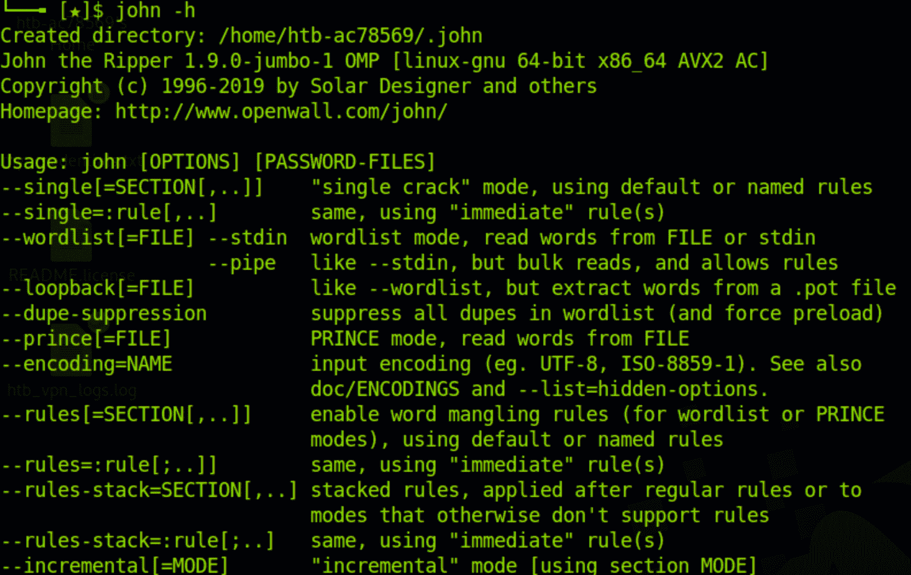
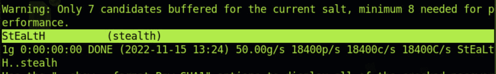

# 如何使用开膛手约翰破解密码–测试教程

> 原文：<https://www.freecodecamp.org/news/crack-passwords-using-john-the-ripper-pentesting-tutorial/>

如果你是一个笔测试者，破解密码是你每天都要做的事情。这可以包括登录密码、文件密码和几乎任何使用密码保护的内容。

开膛手约翰(JtR)是一个流行的密码破解工具。John 支持 Windows 和 Unix 系统(包括 Mac)的许多加密技术。

John 的一个显著特点是它可以自动检测常见格式的加密。这将为您节省大量研究散列格式和找到正确的工具来破解它们的时间。

John 也是一个基于字典的工具。这意味着它使用一个常用密码字典来与手头的哈希进行比较。下面是一个常用的密码列表，名为 [rockyou.txt](https://github.com/praetorian-inc/Hob0Rules/blob/master/wordlists/rockyou.txt.gz) 。

虽然您可以使用 RockYou 等流行的单词表，但 John 也有自己的一套单词表，其中包含数千个常用密码。这使得 John 在破解弱密码系统时非常有效。

默认情况下，John 是这样工作的:

*   识别当前哈希的哈希类型
*   为字典中的所有密码动态生成哈希
*   当生成的哈希与当前哈希匹配时停止。

这不是约翰找到密码的唯一方法。您还可以根据自己的需求定制 John。例如，您可以使用--format 标志指定密码格式。

在本文中，我们将首先安装 John，然后演练您可以使用的不同模式。然后，我们将使用 John 破解三种不同用例的密码——一个 Windows 密码、一个 Linux 密码和一个 zip 文件密码。

在我们开始之前，一个快速声明:不要将这个工具用于邪恶的目的。这是一个教育教程，帮助你保护自己和你的客户或团队免受密码攻击。负责安全地使用这些信息！

让我们开始吧。

## 如何安装开膛手约翰

如果你用的是 Kali Linux，John 是预装的。您可以通过键入以下命令来使用 John:

```
$ john
```

对于 Ubuntu/Debian，可以从 apt 源码中获取 John。下面是在 Ubuntu 中安装 John 的命令:

```
$ apt install John
```

在 Mac 中，你可以在[家酿](https://brew.sh/)中找到约翰:

```
$ brew install john
```

对于 windows 和其他操作系统，你可以在这里找到二进制文件。

一旦您安装了 John，尝试 help 命令以确保您的安装正在运行。在使用 John 时，help 命令也可以用作参考。

```
$ john -h
```

以下是 help 命令的输出:



John help command

## 如何使用开膛手约翰

现在我们知道了 John 是什么，让我们看看它为您提供的三种模式。在大多数用例中，您将使用这三个中的一个。

*   单一裂纹模式
*   Wordlist 模式
*   增量方式

让我们详细看一下其中的每一个。

### 什么是单裂模式？

在单破解模式中，John 获取一个字符串并生成该字符串的变体，以便生成一组密码。

例如，如果我们的用户名是“stealth ”,密码是“STEALTH ”,我们可以使用 John 的单一模式来生成密码变体(Stealth、STealth、StEaLtH 等等)。

我们使用“format”标志来指定哈希类型，使用“single”标志来让 John 知道我们想要使用单破解模式。我们还将创建一个包含用户名和密码哈希值的 crack.txt 文件。

```
stealth:d776dd32d662b8efbdf853837269bd725203c579
```

现在我们可以使用下面的命令来使用约翰的单破解模式:

```
$ john --single --format=raw-sha1 crack.txt
```

这是结果。可以看到约翰已经成功找到了正确的密码“StEaLtH”。



John single crack mode

那很有趣，不是吗？现在我们来看字典模式破解更复杂的密码。

### 什么是字典模式？

在字典模式下，我们将为 John 提供一个密码列表。约翰会为这些动态生成哈希，并与我们的密码哈希进行比较。

对于这个例子，我们将使用 RockYou 单词表。如果你使用的是 Kali，你可以在/usr/share/word lists/rock you . txt 找到它，我们也会有一个只有密码哈希的 crack.txt 文件。

```
edba955d0ea15fdef4f61726ef97e5af507430c0
```

下面是使用单词表在字典模式下运行 John 的命令。

```
$ john --wordlist=/usr/share/wordlists/rockyou.txt --format=raw-sha1 crack.txt
```

约翰很快就找到了密码。


John wordlist mode

密码越弱，约翰就能越快破解。这就是为什么总是建议使用强密码的原因。

### 什么是增量模式？

增量模式是 John 提供的最强大的模式。它尝试所有可能的字符组合作为密码。

这听起来很棒，但是有一个问题。如果密码太长或者是字母数字字符和符号的组合，破解可能会持续很长时间。

除非别无选择，否则很少使用这种模式。在典型情况下，社会工程攻击和单词列表模式的结合将帮助您破解大多数哈希。

如果您想尝试增量模式，下面是语法。

```
$ john -i:digits passwordfile.txt
```

这里-i 标志告诉 John 我们想要使用增量模式。“数字”占位符可用于设置密码的最大位数。

还可以添加“格式”选项，让 John 更容易开始破解。

## 开膛手约翰的用例

现在您已经了解了 John 的不同模式，让我们来看几个用例。

我们将使用 John 来破解三种类型的散列:windows NTLM 密码、Linux 影子密码和 zip 文件的密码。

### 如何破解 Windows 密码

先说 Windows。在 Windows 中，密码散列存储在 [SAM 数据库](https://en.wikipedia.org/wiki/Security_Account_Manager)中。山姆使用 LM/NTLM 哈希格式的密码，所以我们将使用约翰破解一个。

从 SAM 数据库获取密码超出了本文的范围，但是让我们假设您已经获得了一个 Windows 用户的密码散列。

下面是破解它的命令:

```
$ john --format=lm crack.txt
```

crack.txt 将包含密码哈希。如果 John 无法使用默认单词列表破解密码，您可以使用 RockYou 单词列表，并使用--word list 标志。

### 如何破解 Linux 密码

现在，让我们来破解一个 Linux 密码。在 Linux 中，有两个重要的文件保存在/etc 文件夹中:passwd 和 shadow。

*   /etc/passwd ->存储用户名、用户 id、登录 shell 等信息。
*   /etc/shadow ->包含密码哈希、密码到期时间等等。

除了“john”命令之外，John 还附带了一些其他实用程序。其中一个叫“unshadow”。

unshadow 命令将 passwd 和 shadow 文件合并成一个文件。约翰可以用它来破解密码。

下面是我们如何使用 unshadow 命令:

```
$ unshadow /etc/passwd /etc/shadow > output.db
```

该命令将这些文件组合在一起，并创建一个 output.db 文件。我们现在可以使用 John 来破解 output.db 文件。

```
$ john output.db
```

John 尝试在 passwd 文件中查找所有用户的密码，并生成包含破解密码列表的输出。同样，您可以通过--wordlist 标志使用自定义单词列表。

### 如何破解 Zip 文件密码

最后，我们来破解一个 zip 文件密码。为此，我们首先必须获得 zip 文件密码的散列。

像 unshadow 一样，John 也有另一个名为 zip2john 的实用程序。zip2john 帮助我们从 zip 文件中获取哈希值。如果您正在破解一个. rar 文件，您可以使用 rar2john 实用程序。

下面是获取 zip 文件密码哈希的语法:

```
$ zip2john file.zip > zip.hashes
```

上述命令将从 zip 文件中获取散列，并将其存储在 zip.hashes 文件中。然后，您可以使用 John 来破解哈希。

```
$john zip.hashes
```

John 还有其他几个功能可以帮助你破解各种密码。你可以在这里找到 John 的[完整文档。](https://www.openwall.com/john/doc/)

## 如何防御密码攻击

到目前为止，我们已经看到了如何用开膛手约翰破解密码。但是我们如何防御这些类型的暴力攻击呢？

防御密码攻击的最简单方法是设置一个强密码。密码越强，越难破解。

第二步是停止对多个网站使用相同的密码。如果一个网站被黑了，你的密码就会暴露在互联网上。然后，黑客可以使用电子邮件/密码组合在其他网站上测试您的凭证。你可以在这里查看[你的密码是否在网上](https://haveibeenpwned.com/)。

最后一步是生成随机密码，并使用密码管理器。有多种选择，包括 Chrome 内置的[谷歌密码管理器](https://passwords.google.com/)。如果你为你使用的每个站点使用一个强密码，破解你的密码变得非常困难。

## 摘要

约翰是一个流行和强大的密码破解工具。由于其多功能性和易用性，它经常被渗透测试人员和黑帽黑客使用。

从自动哈希发现到基于字典的攻击，John 是您测试工具包中的一个好工具。

希望这篇文章能帮助你详细了解开膛手约翰。你可以[在这里](https://www.linkedin.com/in/manishmshiva/)联系我或者[在这里](https://stealthsecurity.io/)访问我的博客。