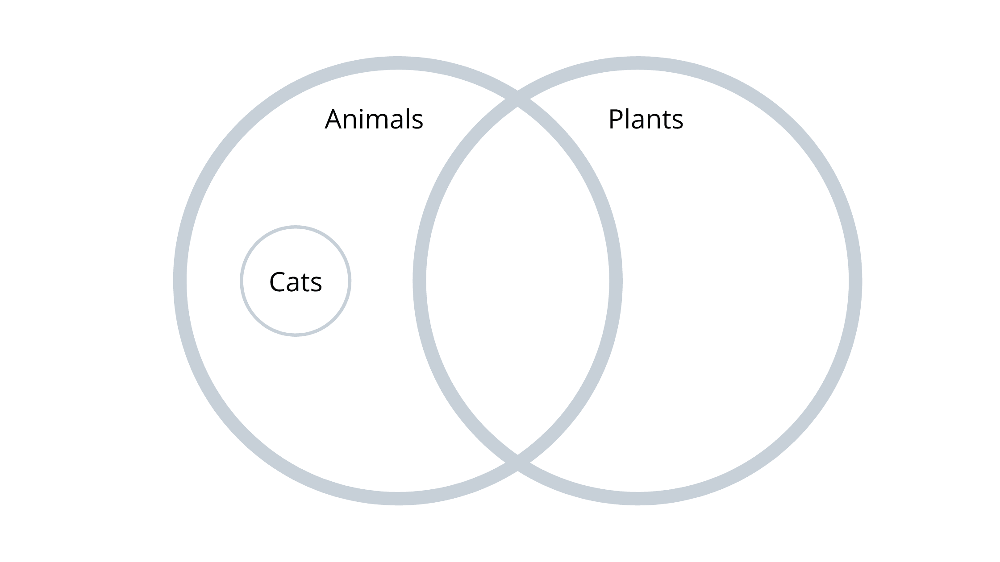

# Python 中的面向对象编程——完整速成班

> 原文：<https://www.freecodecamp.org/news/crash-course-object-oriented-programming-in-python/>

面向对象编程，简称“OOP”，是一种依赖于类和对象概念的代码编写方式。

以面向对象的方式编写代码的主要好处是将程序组织成简单的、可重用的代码片段。

坚持阅读这篇文章，最终你会对 OOP 的核心原则有一个全面的理解。所有的编码例子都将在 [Python](https://boot.dev/learn/learn-python) 中出现，但是这些概念普遍适用于所有的编码语言。

我已经在本文中包含了您需要的所有学习资料。但是如果你想更深入地进行现场编码练习和测验，你可以在 [Boot.dev](https://boot.dev/) 上找到这些[这里](https://boot.dev/learn/learn-object-oriented-programming)。

## 目录

1.  [面向对象编程的目标](#the-goal-of-oop-is-cleaner-code)
2.  [OOP 中的类](#classes-allow-for-even-more-reusability)
3.  [OOP 支柱 1–封装](#oop-pillar-1-encapsulation)
4.  [OOP 支柱# 2——抽象](https://www.freecodecamp.org/news/p/463de7a5-749b-49da-96e9-223a08fc983b/oop-pillar-2-abstraction)
5.  [OOP 支柱 3–继承](#oop-pillar-3-inheritance)
6.  [OOP 支柱 4–多态性](#oop-pillar-4-polymorphism)

## OOP 的目标是更干净的代码

面向对象编程和其他范例如[函数式编程](https://boot.dev/learn/learn-functional-programming)都是为了让代码更容易使用和理解。我们称易于使用的代码为“干净代码”。

> 任何傻瓜都能写出计算机能理解的代码。优秀的程序员编写人类能够理解的代码。马丁·福勒

### 干净代码不是:

*   一种让你的程序运行更快的方法
*   一种让你的程序使用更少内存的方法
*   创建某种程序所必需的
*   严格优于非面向对象代码

### 干净的代码是:

*   旨在使代码在许多情况下更容易使用
*   帮助人类建模和模拟真实世界的东西
*   一种让查找和修复 bug 变得更容易的方法
*   加快新功能开发的方法
*   作为一名软件工程师，保持理智的最好方法

“干净代码”实践的几个例子包括[写好注释](https://blog.boot.dev/clean-code/code-comments/)，使用[干代码](https://blog.boot.dev/clean-code/dry-code/)，以及[很好地命名变量](https://blog.boot.dev/clean-code/naming-variables/)，这里仅举几个例子。

## 面向对象是编写枯燥代码的一种方式

让我们假设我们有这样的代码:

```
soldier_one_dps = soldier_one["damage"] * soldier_one["attacks_per_second"]

soldier_two_dps = soldier_two["damage"] * soldier_two["attacks_per_second"]
```

我们可以使用一个函数对代码进行一点重构:

```
def get_soldier_dps(soldier):
    return soldier["damage"] * soldier["attacks_per_second"]

soldier_one_dps = get_soldier_dps(soldier_one)
soldier_two_dps = get_soldier_dps(soldier_two)
```

我们不希望太多的代码做完全相同的事情。当代码被复制时，会导致许多潜在的问题。在我们的例子中，让我们假设`soldier`字典发生了变化，现在存储“损害”值的键被称为`dmg`。

在第一个例子中，我们需要更新两行代码。在第二个例子中，我们只需要在一个地方进行修改。

当两条线相同并且紧挨着存在时，没什么大不了的。然而，想象一下，如果我们在十个或二十个不同的代码文件中这样做了数百次！突然间，停止重复自己并编写更多可重用的函数变得很有意义。我们称之为[干(不要重复自己)代码](https://blog.boot.dev/clean-code/dry-code/)。

## 类允许更多的可重用性

在像 Python 这样的面向对象编程语言中，[类](https://boot.dev/course/f9a48bbc-d1ff-4388-bf0c-23c6e3c60ae0/46f1f86f-9b7c-4a8b-8883-4b407c0e675b)是一种特殊类型的值。就像字符串、整数或浮点一样，类是一个具有一些特殊属性的*自定义*类型。

一个对象只是一个类类型的实例。“实例”只是“一个事物”的一个大词。例如，在这里，`health`是一个整数类型的实例。

```
health = 50
```

### 我如何创建一个类？

在 Python 中你只需要使用`class`关键字，你可以用下面的方法设置自定义属性。

```
class Soldier:
    health = 5
```

然后为了创建一个`Soldier`的实例，我们简单地调用这个类。注意，类不是函数，它不直接接受输入参数。

```
first_soldier = Soldier()
print(first_soldier.health)
# prints "5"
```

### 类上的方法

你可能想知道为什么类是有用的——它们看起来像普通的 Python 字典，但更糟！

让类变得真正酷的是，它们允许我们在类上定义定制的[方法](https://en.wikipedia.org/wiki/Method_(computer_programming))。方法是与类相关联的函数，它可以访问对象的所有属性。

```
class Soldier:
    health = 5

    def take_damage(self, damage):
        self.health -= damage

soldier_one = Soldier()
soldier_one.take_damage(2)
print(soldier_one.health)
# prints "3"
```

### 特殊的“自我”价值

如您所见，方法嵌套在`class`声明中。方法总是将一个名为`self`的特殊参数作为它们的第一个参数。`self`变量是对对象本身的引用，所以通过使用它你可以读取和更新对象的属性。

请注意，方法是使用点运算符直接在对象上调用的。

```
object.method()
```

### 如何从方法返回值

如果一个常规函数不返回任何东西，它通常不是一个非常有用的函数。但是方法通常不会显式地返回任何东西，因为它们通常会改变对象的属性。

然而，它们*也可以*返回值！

```
class Soldier:
    armor = 2
    num_weapons = 2

    def get_speed(self):
        speed = 10
        speed -= self.armor
        speed -= self.num_weapons
        return speed

soldier_one = Soldier()
print(soldier_one.get_speed())
# prints "6"
```

### 方法与函数

函数是由名字调用的一段代码。您可以通过参数传递数据给它进行操作，它也可以选择返回数据。传递给函数的所有数据都通过参数显式传递。

方法是一段代码，由与对象相关联的名称*调用。方法和功能是相似的，但是有两个关键的区别。*

1.  一个方法被*隐式地*传递给被调用的对象。换句话说，您不会在参数列表中看到所有的输入
2.  方法能够对包含在类中的数据进行操作。换句话说，你不会在`return`语句中看到所有的输出。

## 面向对象的辩论

因为函数更加明确，一些开发者认为[函数式编程](https://blog.boot.dev/clean-code/benefits-of-functional-programming/)比面向对象编程更好。实际上，没有一种范式是“更好的”，最好的开发人员学习并理解这两种风格，并在他们认为合适的时候使用它们。

例如，虽然方法更加隐式，通常会使代码更加难以阅读，但它们也使将程序的数据和行为集中在一个地方变得更加容易。这可以产生更有条理的代码库。这是文件级可读性和项目级可读性之间的权衡。

## Python 中的构造函数

迄今为止，在现实世界中很少看到一个类像我们这样定义属性。

```
class Soldier:
    armor = 2
    num_weapons = 2
```

使用一个[构造函数](https://en.wikipedia.org/wiki/Constructor_(object-oriented_programming))要实用得多。在 Python 中，用 [__init__()方法](https://docs.python.org/3/reference/datamodel.html#object.__init__)构造一个构造函数，当一个新的对象被创建时，它被自动调用。因此，对于构造函数，代码看起来像这样。

```
class Soldier:
    def __init__(self):
        self.armor = 2
        self.num_weapons = 2
```

然而，因为构造器是一个方法，我们现在可以用一些参数来配置起始护甲和武器数量。

```
class Soldier:
    def __init__(self, armor, num_weapons):
        self.armor = armor
        self.num_weapons = num_weapons

soldier = Soldier(5, 10)
print(soldier.armor)
# prints "5"
print(soldier.num_weapons)
# prints "10"
```

## 类变量与实例变量

到目前为止，我们已经处理了类变量和实例变量，但是我们还没有真正讨论它们的区别。

### 实例变量

实例变量因对象而异，并在构造函数中声明。

```
class Wall():
    def __init__(self):
        self.height = 10

south_wall = Wall()
south_wall.height = 20 # only updates this instance of a wall
print(south_wall.height)
# prints "20"

north_wall = Wall()
print(north_wall.height)
# prints "10"
```

### 类别变量

类变量在同一个类的实例之间保持不变，并在类的顶级声明。

```
class Wall():
    height = 10

south_wall = Wall()
print(south_wall.height)
# prints "10"

Wall.height = 20 # updates all instances of a Wall

print(south_wall.height)
# prints "20"
```

### 类与实例变量——我应该使用哪一个？

一般来说，*远离类变量*。就像全局变量一样，类变量通常是个坏主意，因为它们很难跟踪程序的哪些部分正在进行数据更新。

然而，了解它们是如何工作的是很重要的，因为你可能会在野外看到它们。

# 面向对象的四大支柱

## OOP 支柱# 1–封装

作为一名软件工程师，封装是你工具箱中最强有力的工具之一。就像我们在本教程开始时提到的，编写机器理解的代码很容易。但是编写人类能够理解的代码是非常困难的。

封装是将信息隐藏在一个“[黑盒](https://en.wikipedia.org/wiki/Black_box)中的实践，这样其他使用代码的开发人员就不必担心了。

封装的一个基本例子是函数。函数的调用者不需要太担心函数内部发生了什么——他们只需要理解输入和输出。

```
pythonacceleration = calc_acceleration(initial_speed, final_speed, time)
```

在上面的例子中，要使用`calc_acceleration`函数，我们并不真的需要理解里面发生了什么。这就是封装的目标:它使我们作为开发人员的生活更容易，并帮助我们编写更干净的代码。

### OOP 中的封装

在面向对象编程的上下文中，我们可以通过使用私有和公共成员来实践良好的封装。

这个想法是，如果我们想让我们类的用户直接与某个东西交互，我们就把它设为 *public* 。如果他们不需要使用某个特定的方法或属性，我们将那个*设为私有*，以保持我们类的使用说明简单。

### Python 中的封装

为了在 Python 中实施封装，开发人员在他们打算私有的属性和类前面加上双下划线。

```
class Wall():
    def __init__(self, height):
        # this stops us from accessing the __height
        # property directly on an instance of a Wall
        self.__height = height

    def get_height(self):
        return self.__height
```

在上面的例子中，我们不希望`Wall`类的用户能够改变它的高度。我们将`__height`属性设为私有，并公开一个公共的`get_height`方法，这样用户仍然可以读取一堵墙的高度，而不必更新它。

这将阻止开发人员做类似以下的事情:

```
# front_wall is an instance of a Wall
front_wall.__height = 10 # this results in an error
```

### 封装并不能使系统更加安全

就像我们之前谈到的，封装是将一些代码复杂性隐藏在一个“[黑盒](https://en.wikipedia.org/wiki/Black_box)中的实践，这样其他使用代码的开发人员就不必担心了。通过“public”和“private”成员向我们的程序添加封装使得我们的代码更容易使用。它使它更“干净”。

明确地说，封装并没有使代码在[密码](https://boot.dev/learn/learn-cryptography)或网络安全意义上更加安全。这是我个人在学校第一次了解私人和公共班级成员时感到困惑的一点。

像 [SHA-256](https://blog.boot.dev/cryptography/how-sha-2-works-step-by-step-sha-256/) 散列、[用于认证的 JWTs】和](https://blog.boot.dev/cryptography/hmac-and-macs-in-jwts/)[密码](https://blog.boot.dev/cryptography/aes-256-cipher-python-cryptography-examples/)是一个完全独立的主题，与类或封装无关。

封装是一种使代码更容易操作和减少错误的机制。我们阻止*自己*访问私有数据，因为我们认为在类外使用是没有意义的。

## OOP 支柱# 2——抽象

抽象是面向对象编程的关键概念之一。抽象的目标是通过隐藏不必要的细节来处理复杂性。

抽象和封装通常是携手并进的，如果我们不小心对待我们的定义，它们可能看起来是一回事。

### 抽象与封装

虽然定义总是在变化，但我喜欢用下面的方式来思考抽象和封装。

*   抽象是一种帮助我们识别什么信息和行为应该被封装，什么应该被公开的技术。
*   封装是一种组织代码的技术，用于封装应该隐藏的内容，并使应该可见的内容可见。

如果你想对这个话题有更长的了解，可以看看这篇文章。

### 那么，当我们把东西私有时，我们是封装了代码还是抽象了代码呢？

都是。我们几乎总是双管齐下。使用双下划线的过程是一种封装形式。*决定*哪些数据*值得*隐藏在双下划线后面的过程就是抽象。

我们来看一个具体的例子。

```
import random

my_random_number = random.randrange(5)
```

在这个例子中，我们使用`random`库来生成一个随机数。事实证明，[生成随机数](https://blog.boot.dev/cryptography/what-is-entropy-in-cryptography/)是一个**真的很难** 的问题。

操作系统实际上使用计算机的物理硬件状态作为输入来播种随机性。

然而，`random`库的开发者已经*抽象掉了*的复杂性，*封装了*大量的数据和行为，所以我们不需要担心。我们只需说“我想要一个小于或等于 5 的随机数”,库就会为我们处理它。

将一个数字作为函数输入的决定是一个抽象的决定。当编写生产级软件时，获得正确的抽象是至关重要的，因为它们是以后最难改变的东西。

想想`random`包的维护者改变`randrange`函数的输入参数的后果！它会破解全世界的密码。

## OOP 开发人员如何思考

方法实际上也可以是私有的。换句话说，我们可以封装*行为*以及*数据*。

### **分组数据和行为**

面向对象编程中的类都是关于将数据和行为组合在一个地方:一个对象。

面向对象的程序员倾向于将编程视为建模问题。他们认为，“我如何才能编写一个模拟真实人类的数据和行为的`Human`类？”

在本课程中，我们不关注[函数式编程](https://boot.dev/learn/learn-functional-programming)。但是为了提供一些对比，函数式程序员倾向于将他们的代码看作输入和输出。当一个人执行一个动作时，该动作的输入是什么，输出如何影响我的程序状态

### **两种范式都很有价值**

虽然 OOP 不是编程中的唯一范例，但它是一种经过检验的真实范例，在各种情况下都很有用。

在任何情况下，如果你个人理解了思考代码的多种方式，你将会成为一个更好的开发人员。

## OOP 支柱 3——继承

我们已经达到了面向对象编程的圣杯:[继承](https://en.wikipedia.org/wiki/Inheritance_(object-oriented_programming))。继承确实是面向对象语言的定义特征。

像[Go](https://boot.dev/learn/learn-golang)lang[Rust](https://www.freecodecamp.org/news/rust-in-replit/)这样没有类的语言提供了封装和抽象特性。事实上，几乎每一种语言都是如此。另一方面，继承往往是基于类的语言所独有的，如 [Python](https://boot.dev/learn/learn-python) 、 [JavaScript](https://www.freecodecamp.org/news/learn-javascript-by-coding-7-games/) 、 [Java](https://www.freecodecamp.org/news/the-java-handbook/) 和 Ruby。

### 什么是继承？

继承允许一个类(又名“子类”)继承另一个类(又名“父类”)的属性和方法。

这种强大的语言特性帮助我们避免重复编写大量相同的代码。它允许我们[整理(不要重复)](https://blog.boot.dev/clean-code/dry-code/)我们的代码。

### Python 中的继承——语法

在 Python 中，一个类可以使用以下语法从另一个类继承:

```
class Animal:
    # parent "Animal" class

class Cow(Animal):
    # child class "Cow" inherits "Animal"
```

为了使用父类的构造函数，我们可以使用 Python 的内置`super()`方法。

```
class Animal:
    def __init__(self, num_legs):
        self.num_legs = num_legs

class Cow(Animal):
    def __init__(self):
        # call the parent constructor to
        # give the cow some legs
        super().__init__(4)
```

### 什么时候应该使用继承？

继承是一个强大的工具，但是试图过度使用它是一个非常糟糕的主意。只有当子类的每个实例都被认为是与父类相同的类型时，才应该使用继承。

当子类从父类继承时，它会继承*所有的*。如果你只想共享*一些*功能，继承可能不是最好的答案。在这种情况下，您可能只想共享一些函数，或者创建一个两个类都继承的新父类。

### 所有的猫都是动物，但不是所有的动物都是猫



### 继承层次结构

继承树的嵌套深度没有限制。例如，`Cat`可以从`Animal`继承，而`Animal`从`LivingThing`继承。

也就是说，我们应该始终注意，每次从基类继承时，子类都是父类的 **strict** 子集。你永远不应该对自己说“我的子类需要一些父类的方法，但不需要这些其他的方法”，而仍然决定从那个父类继承。

### 多个孩子

到目前为止，我们已经使用了线性类继承。在现实中，继承结构通常形成树，而不是线。一个类可以有任意多的直接子类。

你经常会在生产软件中发现，继承树更有可能是宽而不是深。换句话说，不是像这样的深树:

`Organism -> Animal -> Mammal -> Feline -> Cat`

你会经常看到一棵大树:

```
Dragon -> Drake
       -> Wyvern
       -> Hydra
       -> Druk
```

### 为什么**传承**树往往宽而不深？

就像我们之前讨论的，在好的软件中，子类是其父类的严格子集。

在深树中，这意味着孩子需要成为所有父类“类型”的完美成员。这在现实世界中很少发生。更有可能的是，你会有一个基类，它有许多兄弟类，这些兄弟类是基类的稍微不同的变体。

```
Vehicle -> Truck
        -> Car
        -> Boat
        -> Train
```

## OOP 支柱# 4–多态性

虽然继承是面向对象语言声称的最独特的特征，但多态性可能是最强大的。

多态性是变量、函数或对象采取多种形式的能力。例如，在支持继承的编程语言中，同一层次树中的类可能具有相同名称但*不同*行为的方法。

### 形状的多态性

让我们看一个简单的例子:

```
class Creature():
    def move(self):
        print("the creature moves")

class Dragon(Creature):
    def move(self):
        print("the dragon flies")

class Kraken(Creature):
    def move(self):
        print("the kraken swims")

for creature in [Creature(), Dragon(), Kraken()]:
    creature.move()
# prints:
# the creature moves
# the dragon flies
# the kraken swims
```

在这个例子中，子类`Dragon`和`Kraken`正在**覆盖它们父类的`move()`方法的**行为。

### 多态性根源

看看“多态”的希腊词根。

*   “聚”的意思是“很多”
*   “变形”的意思是“改变”或“形成”

编程中的多态性是为许多不同的底层形式(数据类型)提供相同接口(函数或方法签名)的能力。

一个经典的例子是`Rectangle`、`Circle`和`Triangle`可以继承的`Shape`类。

对于多态，每个类都有不同的底层数据。圆需要圆心和半径。矩形需要左上角和右下角的两个坐标。三角形需要角的坐标。

通过让每个类负责它的数据**和**它的代码，你可以实现多态性。

在这个例子中，每个类都有自己的`Draw()`方法。这使得使用不同形状的代码变得简单易行，更重要的是，它可以将形状视为**相同的**，即使它们**不同**。它将差异的复杂性隐藏在清晰的抽象背后。

```
shapes = [Circle(5, 10), Rectangle(1, 3, 5, 6)]
for shape in shapes:
    print(shape.Draw())
```

这与函数式的做事方式形成了对比，在函数式的做事方式中，你会有不同的**不同的**函数签名，比如`draw_rectangle(x1, y1, x2, y2)`和`draw_circle(center, radius)`。

### 等等，什么是“函数签名”？

函数签名包括函数或方法的名称、输入和输出。例如，这两个类具有相同的方法签名。

```
class Human:
    def hit_by_fire(self):
        self.health -= 5
        return self.health

class Archer:
    def hit_by_fire(self):
        self.health -= 10
        return self.health
```

这两个方法有相同的名字，接受`0`输入，并返回整数。如果这些东西中的任何一个不同，它们就会有不同的函数签名。

以下是不同签名的示例。

```
class Human:
    def hit_by_fire(self):
        self.health -= 5
        return self.health

class Archer:
    def hit_by_fire(self, dmg):
        self.health -= dmg
        return self.health
```

### 当重写方法时，使用相同的函数签名

如果在重写方法时更改父类的函数签名，这可能是一场灾难。

覆盖一个方法的全部意义在于，你的代码调用方*不必担心*在不同对象类型的方法中发生了什么不同的事情。

### 运算符重载

Python 中另一种内置的多态性是能够根据所使用的操作数覆盖 Python 中的操作符。

算术运算符适用于内置类型，如整数和字符串。

```
print(3 + 4)
# prints "7"

print("three " + "four")
# prints "three four"
```

另一方面，自定义类没有对这些操作符的任何内置支持:

```
class Point:
    def __init__(self, x, y):
        self.x = x
        self.y = y

p1 = Point(4, 5)
p2 = Point(2, 3)
p3 = p1 + p2
# TypeError: unsupported operand type(s) for +: 'Point' and 'Point'
```

但是，我们可以添加我们自己的支持！当使用`+`操作符添加一个类的实例时，Python 解释器会使用`__add__`方法。

```
class Point:
    def __init__(self, x, y):
        self.x = x
        self.y = y

    def __add__(self, point):
        x = self.x + point.x
        y = self.y + point.y
        return Point(x, y)

p1 = Point(4, 5)
p2 = Point(2, 3)
p3 = p1 + p2
# p3 is (6, 8)
```

当你在幕后调用`p1 + p2`时，解释器只调用`p1.__add__(p2)`。

下面是操作符如何转换成方法名的列表。如果你不熟悉 Python 中的逻辑和位操作符，你可以看看这个视频。

| 操作 | 操作员 | 方法 |
| --- | --- | --- |
| 添加 | + | **添加** |
| 减法 | - | **子** |
| 增加 | * | **mul** |
| 力量 | ** | **功率** |
| 分开 | / | **真理之父** |
| 楼层划分 | // | **floordiv** |
| 余数(模) | % | **对**的影响 |
| 按位左移 | << | 【T0 抬】T1 |
| 按位右移 | >> | **rshift** |
| 按位 AND | & | **和** |
| 按位或 | &#124; | **或** |
| 按位异或 | ^ | **异或** |
| 按位非 | ~ | **反转** |

### 如何霸王内置方法

最后但同样重要的是，让我们看看 Python 中可以重载的一些内置方法。虽然算术运算符没有默认行为，就像我们刚刚看到的，但是*是**打印**类的默认行为。*

```
class Point:
    def __init__(self, x, y):
        self.x = x
        self.y = y

p1 = Point(4, 5)
print(p1)
# prints "<Point object at 0xa0acf8>"
```

那不是超级有用！让我们教我们的`Point`对象的实例打印它们自己。`__repr__`方法(“表示”的缩写)让我们做到了这一点。它不接受任何输入，但返回一个字符串，当有人将该类的一个实例传递给 Python 的`print()`函数时，该字符串将被打印到控制台。

```
class Point:
    def __init__(self, x, y):
        self.x = x
        self.y = y

    def __repr__(self):
        return f"({self.x},{self.y})"

p1 = Point(4, 5)
print(p1)
# prints "(4,5)"
```

## 干得好，坚持到了最后！

感谢你和我一起参加这个关于面向对象编程的书面课程。

如果你有兴趣做这门课的实时编码作业和测验，你可以在 [Boot.dev](https://boot.dev/) 的 [Learn OOP 课程](https://boot.dev/learn/learn-object-oriented-programming)上做。

或者，如果你想查看[后端开发人员职业道路](https://boot.dev/tracks/computer-science)的下一个课程，你可以在这里开始 [学习算法](https://boot.dev/learn/learn-algorithms)课程。