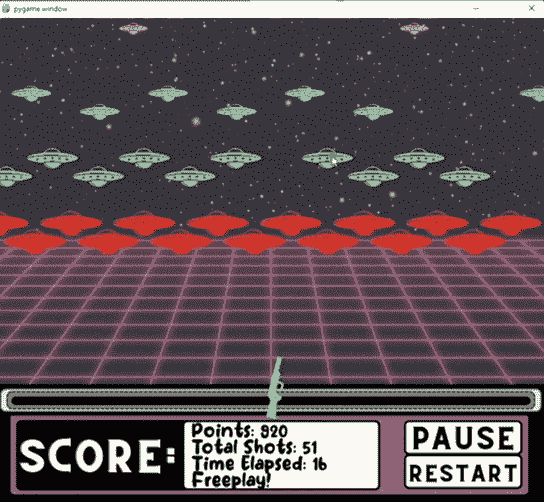

# 用 Python 和 PyGame 创建一个街机风格的射击游戏

> 原文：<https://www.freecodecamp.org/news/create-a-arcade-style-shooting/>

创建街机风格的射击游戏是一个有趣的项目，可以帮助您提高 Python 和 PyGame 编程技能。

我们刚刚在 freeCodeCamp.org YouTube 频道上发布了一门课程，将教你如何使用 Python 和 PyGame 创建一个有趣的游戏。

皮特·勒马斯特开设了这门课程。Pete 是一名控制系统工程师，也是 LeMaster Tech YouTube 频道的创建者。

这个项目的灵感来自于经典的嘉年华/街机风格的射击游戏！您将学习使用 Python 和 PyGame 框架从头构建整个项目。

我们首先设置 PyGame，并在屏幕上绘制静态图像。然后，我们将一层层按程序绘制的敌人放在每一层上，让他们移动，然后检查玩家是否击中了他们。一旦玩家清除了一个完整级别的敌人，他们就进入下一个级别。然后我们创建暂停功能、主菜单和游戏结束条件。

我们将高分存储在一个外部文本文件中，当游戏启动时我们从该文件中读取，并在游戏过程中任何时候出现新的高分时写入该文件。

You will create this game.

本课程包括以下几个部分:

*   项目展示
*   设置 Pygame 和导入图像
*   拔枪并随鼠标位置旋转
*   将敌人吸引到屏幕上
*   程序化生成敌人起始坐标
*   让敌人根据等级快速移动
*   检查鼠标与快照上的目标的碰撞
*   显示分数，模式状态，经过的时间和总镜头！
*   菜单控制和设置
*   暂停菜单和从游戏屏幕重启
*   重启时重新初始化敌人坐标
*   游戏结束条件！
*   读写一个. txt 文本文件获得高分！
*   添加背景音乐和音效！
*   结尾部分

观看以下全部课程或在 freeCodeCamp.org YouTube 频道观看[(2 小时观看)。](https://youtu.be/T2pd3KRSoHI)

[https://www.youtube.com/embed/T2pd3KRSoHI?feature=oembed](https://www.youtube.com/embed/T2pd3KRSoHI?feature=oembed)