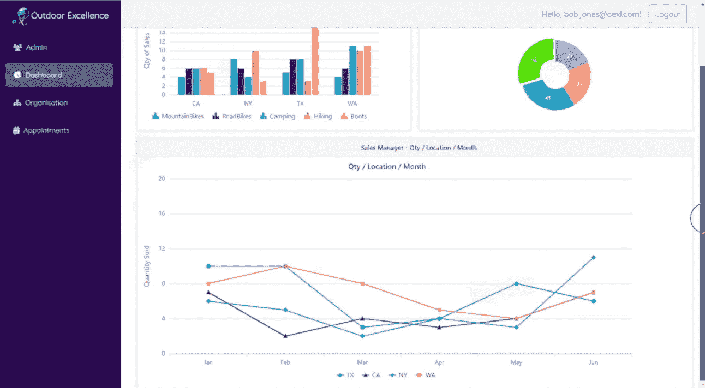

# 使用 Syncfusion UI 组件创建 Blazor 应用程序

> 原文：<https://www.freecodecamp.org/news/create-a-blazor-app-with-syncfusion-ui-components/>

Syncfusion 提供了一个 UI 组件套件，用于构建强大的 web、桌面和移动应用程序。

我们刚刚在 freeCodeCamp.org YouTube 频道上发布了一个完整的课程，将教您如何从 Blazor 服务器应用程序中利用 Syncfusion UI 组件的功能。您还将学习如何将 Microsoft Identity 技术集成到 Blazor 应用程序中，以利用登录、注册、授权和身份验证功能。

加文·朗开发了这个课程。Gavin 是一名经验丰富的开发人员和教师。他在自己的频道和 freeCodeCamp.org YouTube 频道上创建了许多受欢迎的课程。

使用 Syncfusion 组件允许开发人员通过实现简单的声明性代码在应用程序中包含强大的 UI 功能。

您将了解如何将相关的 Syncfusion 组件集成到一个功能齐全的基于 web 的销售管理应用程序中，该应用程序对销售部门非常有用，并且用户操作起来也很愉快。您将使用最少的声明性代码来完成这一切。

销售管理应用程序是跨平台的，当在多种屏幕尺寸上查看时完全响应。

Part of the dashboard you will create.

以下是您将在本课程中学会做的一些事情:

*   通过 Visual Studio 2022 创建 Blazor 项目
*   了解 Syncfusion 数据网格组件
*   使用 Ef 核心代码优先迁移创建数据库
*   将 Syncfusion 数据网格组件集成到应用程序中
*   将 Syncfusion ListView 组件集成到销售管理应用程序中
*   将 Syncfusion 图表集成到销售管理应用程序中，以显示销售订单分析数据
*   为员工创建仪表板
*   将 Syncfusion 图表集成到销售管理应用程序中
*   将 Syncfusion 调度程序集成到销售管理应用程序中
*   将 Microsoft 身份集成到销售管理应用程序中

观看以下全部课程或在 freeCodeCamp.org YouTube 频道观看[(8 小时观看)。](https://youtu.be/xO17P9LVkK0)

[https://www.youtube.com/embed/xO17P9LVkK0?feature=oembed](https://www.youtube.com/embed/xO17P9LVkK0?feature=oembed)