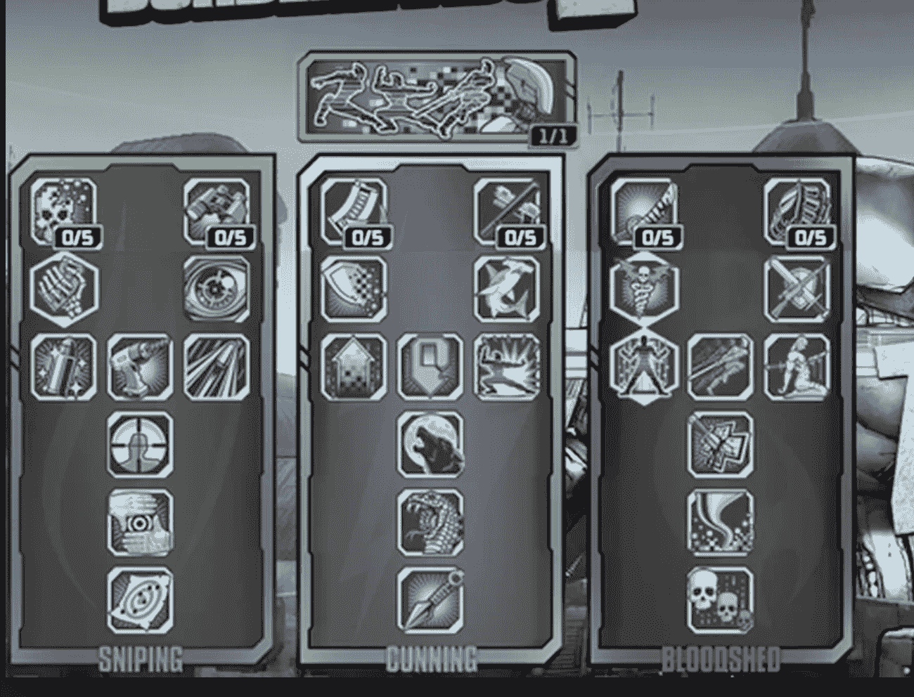
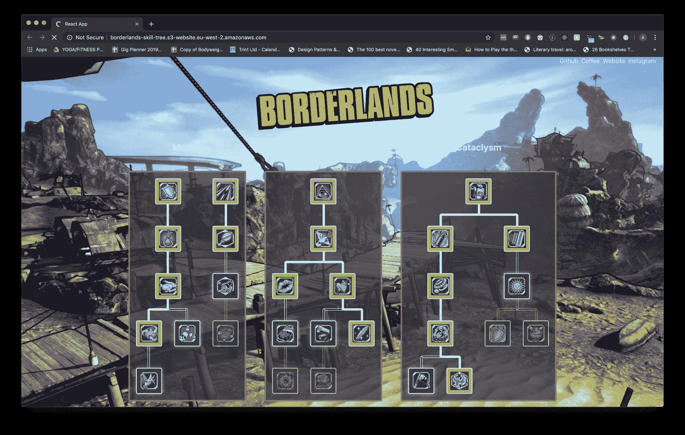

# 如何在 5 分钟内创建一个边境风格的技能树

> 原文：<https://www.freecodecamp.org/news/create-a-borderlands-style-skill-tree-in-5-minutes/>

随着年龄的增长，我在业余时间做着大多数程序员都做的事情:醒着的时候玩视频游戏。我喜欢冒险游戏，它们是多么耗费时间。如果时间是玛丽·罗斯，而我是法国人，我的炮兵就是像《王国之心》、《神探》和《边境》这样的游戏。

为什么我和其他人花了这么多业余时间去探索、生存、死亡和(如此如此)磨砺？成百上千的因素促成了一次引人入胜的经历，但我要关注的一个是进展的概念。

游戏化的想法并不新鲜。许多流行的应用程序(如 [todoist](https://todoist.com/?lang=en) 或[挑战计时器](https://productivitychallengetimer.com/))已经整合了某种进展方案，让我们这些消费者使用他们的应用程序，给他们钱，并交出我们的个人数据。所以我决定走自己的路，通过漂亮的技能树让别人也能做到这一点！注意:我不期望从那些使用我的技能树的人那里得到金钱或数据。

在过去的几个星期里，我辛苦地创建了一个令人愉快的即插即用的 React 包来帮助你创建令人兴奋的技能树。你可以按照教程自己测试。我希望这是一次没有摩擦的经历。

我们希望有类似下面的技能树:



“A dying puppy. A baby in tears. If the previous statements elicited any emotional reaction report to your supervisor for summary destruction.”

# 美丽技能树@0.7.5

使用`git clone git@github.com:andrico1234/borderlands-skill-tree.git`抓取启动器回购

进入目录并运行启动脚本`yarn start`。给网站一个旋转，你会看到除了边界的标志和环境。

`beautiful-skill-tree`公开了三个组件:`SkillProvider`、`SkillTreeGroup`和`SkillTree`组件。

这不需要任何道具，并且为孩子们提供了技能树的背景。这只小狗处理所有与技能树相关的全局数据。

更复杂的是，它可以带一个可选的属性，我们可以传入一些自定义的样式，让我们的技能树感觉很有边界感。`SkillTreeGroup`也使用子功能模式来给我们一些命令式的 api 功能，比如技能树重置，选择技能计数器等等。就本文的范围而言，我们不需要担心这些问题。

这是最令人兴奋的出口产品，除非你是打字迷(这也是出口产品，为了你所有的 ts 粉丝)。`SkillTree`不需要任何小孩，但是需要 3 个道具:`treeId`、`title`和`data`。`treeId`应该是每个技能树的唯一 id，但应该在用户会话中保持不变，因为它被用作获取和设置数据到本地存储的密钥。我不打算解释`title`道具是做什么的，我会让你去实验。`data`是应用的混合罐。你将传入你的技能树数据结构，应用程序将使用它来呈现一个`beautiful-skill-tree`。让我们先有一个真正的基础树，然后再继续我们的多树，多分支边界壮观。

在 App.tsx 中，导入 3 个组件，如下所示:

`import { SkillProvider, SkillTreeGroup, SkillTree } from 'beautiful-skill-tree';`

将它放在您的`img`标签下面，在图像的容器 div 之外，但是在外部 div 之内。加上`SkillProvider`，路过小时候的`SkillTreeGroup`。在您对`SkillTree`做同样的事情之前，请记住，由于`SkillTreeGroup`使用子功能模式，您需要呈现一个返回子组件的功能。返回单个`SkillTree`，给它一个`treeId`和一个`title`道具。将一个空数组传递到`data`道具中，这样您的`App.tsx`看起来就像这样:

```
function App() {
  return (
    <div>
    // <div headercontent />
      <SkillProvider>
        <SkillTreeGroup>
          {() => {
            return (
              <SkillTree treeId="basic-birch" title="First Skill Tree" data={[]} />
            )
          }}
        </SkillTreeGroup>
      </SkillProvider>
    </div>
  );
}
```

转到 [localhost:3000](http://localhost:3000/) 查看应用程序的运行情况。您应该会看到徽标、背景和一个灰色矩形。如果您遇到任何错误，请再次浏览简介，查看是否有任何语法错误或不正确的导入。

接下来，让我们创建一个真正的基本树。只有三个直线运动的物体。`data`的数据结构如下所示:

```
type Skill = {
  id: string;
  icon?: string;
  title: string;
  tooltip: {
    description : string;
  },
  children: Skill[];
}
```

每个技能需要四个属性，其中一个是可选的。您还应该注意到,`children`属性是一个递归类型，这意味着它接受一个相同数据结构的数组，用于呈现技能的子元素。这可以无限延续下去，形成一些真正复杂、蜿蜒的树木。我会为你创造第一个技能，我会信任你继续进行下两个项目。

```
const data = [{
  id: 'first-skill',
  title: 'The root node',
  tooltip: {
    description : "The parent node, all of the descendants will be locked until it's selected",
  },
  children: [
  // rinse and repeat; always repeat.
]}
```

将上面的代码片段添加到`App.tsx`文件中，并用我们的`data`定义替换`SkillTree`的`data`属性中的空数组。加载您的页面，您应该有一个交互式节点。给它一个悬停和点击，它应该对你的行动作出反应。如果一切正常，那么我将让您创建两个(或更多)子节点。尝试孩子和兄弟姐妹的长度，看看你能想出什么。(如果你碰巧弄坏了我珍贵的包，给我留一期 GitHub，我可以补上)。

一旦你习惯了创建技能树，让我们继续创建我们的边境技能树。幸运的是，我已经为您完成了所有繁琐的工作，并且已经创建了数据结构并积累了图像。

您需要从`data`文件中导入三棵树，这可以通过

`import { motion, harmony, cataclysm } from "./data/data";`

下一步是在当前的`SkillTrees`旁边创建另外两个`SkillTrees`。你需要将它们包装在一个`React.Fragment`中，因为你的`SkillTreeGroup`现在将试图渲染 3 个顶级组件。相应地传入数据，如果你不确定，我在下面贴了代码片段。

```
<React.Fragment>
  <SkillTree treeId="motion" title="Motion" data={motion} />
  <SkillTree treeId="harmony" title="Harmony" data={harmony} />
  <SkillTree treeId="cataclysm" title="Cataclysm" data={cataclysm} />
</React.Fragment>
```

继续检查你的网络浏览器，它应该是 ****aaallmoost**** 准备好了。我们已经渲染了技能，但是样式感觉有点暗淡。感觉不是很边疆。对你来说幸运的是，我是一个普通的[尼尔·布坎南](https://www.youtube.com/watch?v=0evlWSY8kTc)并且准备了一个定制主题。导入主题并将其传递给`SkillTreeGroup`的`theme`道具。主题对象通过`import theme from './data/theme';`导出。轻松点。



“I HAVE ONE QUESTION FOR YOU. EXPLOSIONS?”

一旦你完成了以上工作，检查一下成品。如果你仍然对样式不满意，检查主题对象并自己定制它，有一堆附加属性的样式可以调整，所以只需查看包的类型。

我之前提到过，有一些额外的属性和值可以用来调整技能树，所以把你自己弄得乱七八糟，把我链接到你创建的任何酷树。我很想把它添加到生长中的树木列表中。[这里有一个](https://calisthenicsskills.com/)技能树的例子，它引发了这种痴迷。

我希望你喜欢摆弄这个包。我总是在添加新功能和更新，所以在 github 上给它一颗星吧！你可以在这里找到边境技能树[的在线演示](http://borderlands-skill-tree.s3-website.eu-west-2.amazonaws.com/)

想聊代码、音乐、健身都可以在 Instagram 或者 GitHub 上找我！