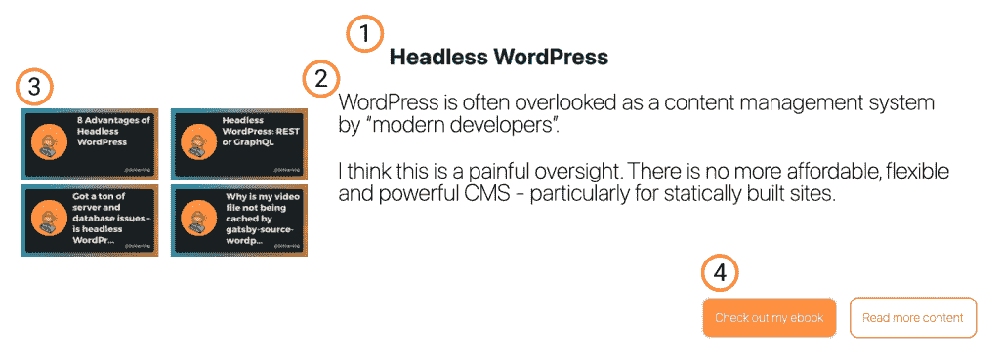
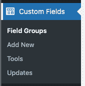
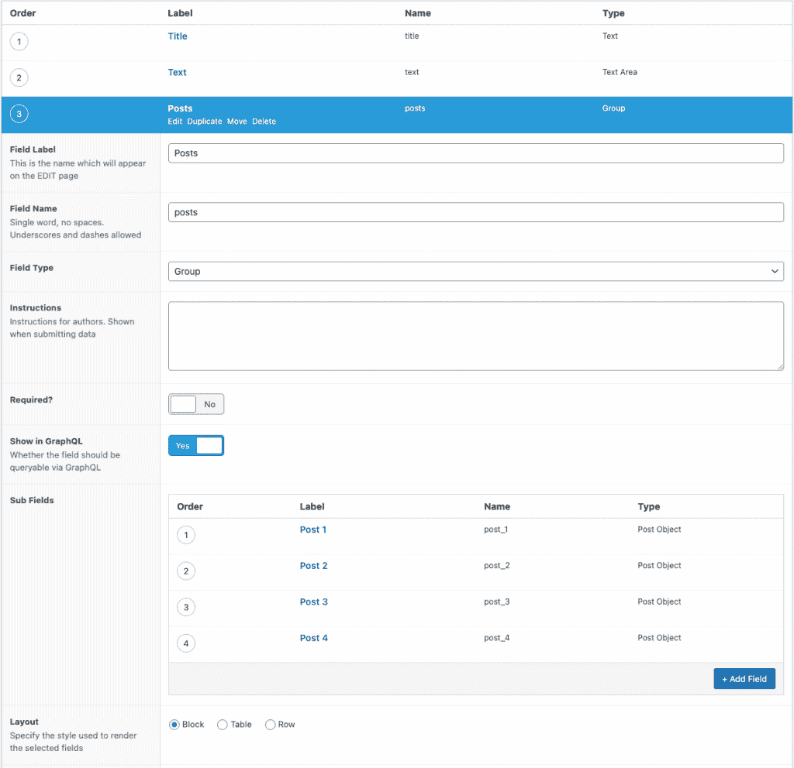
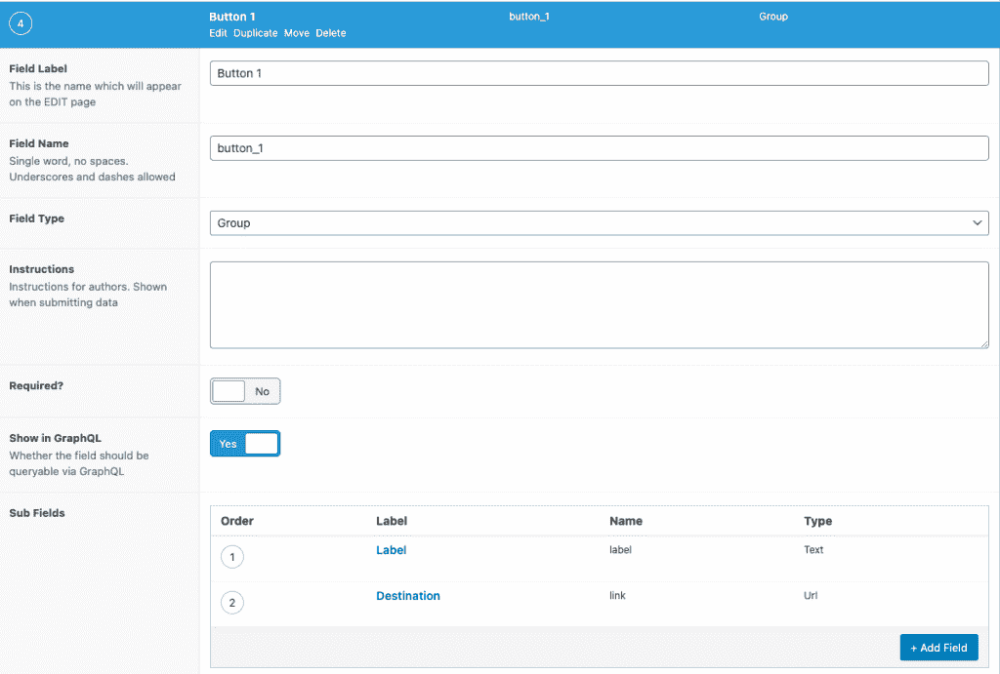
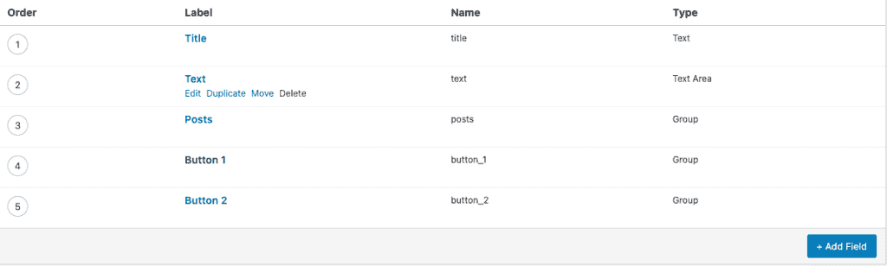
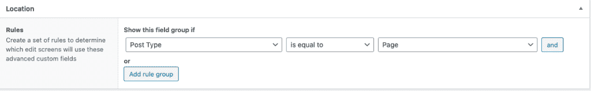
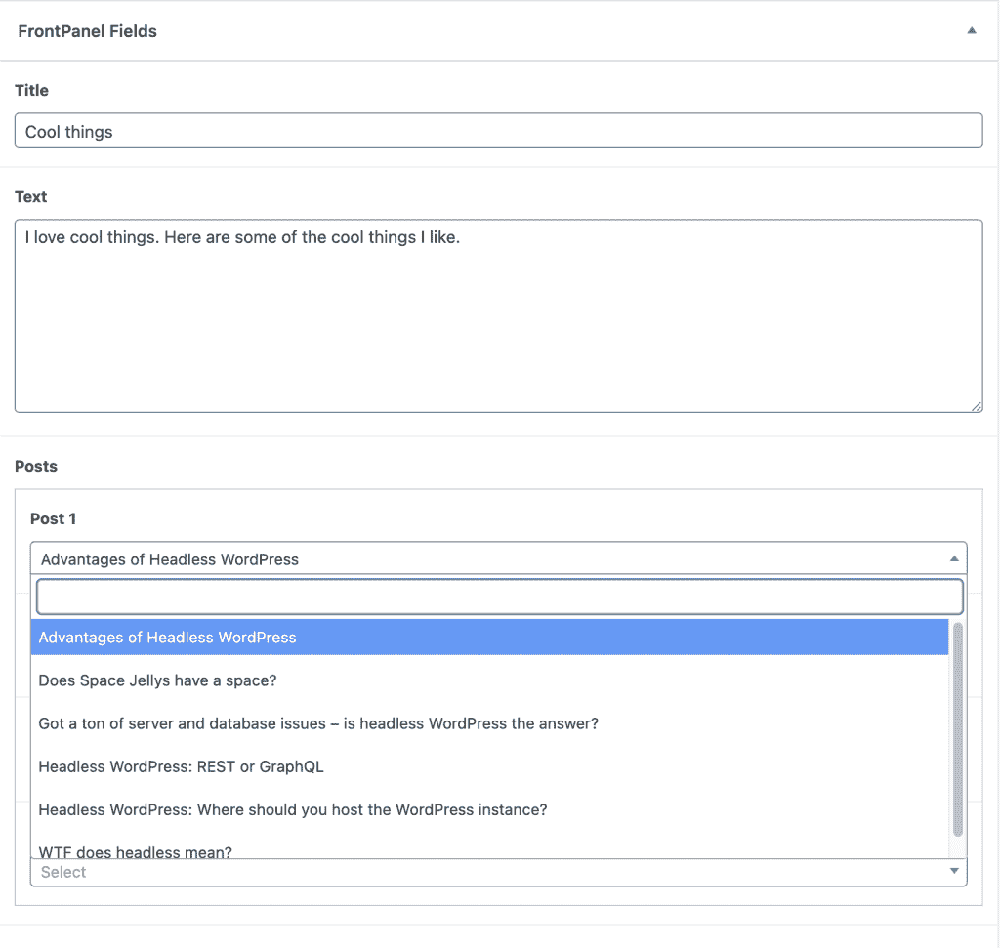
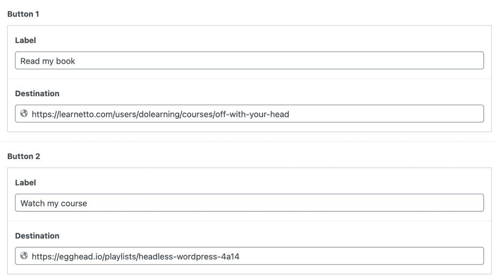
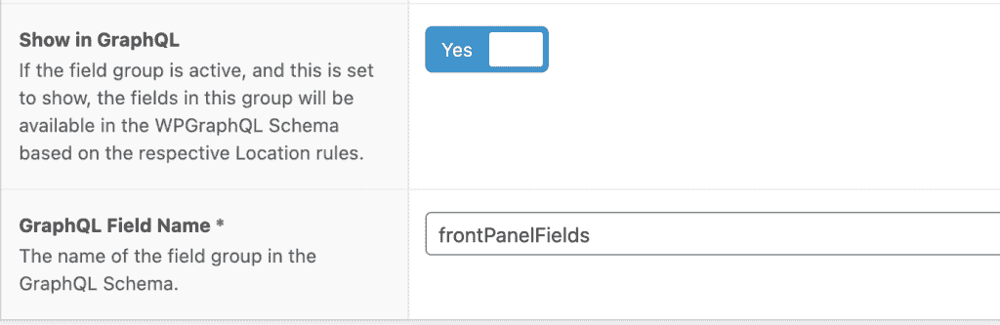
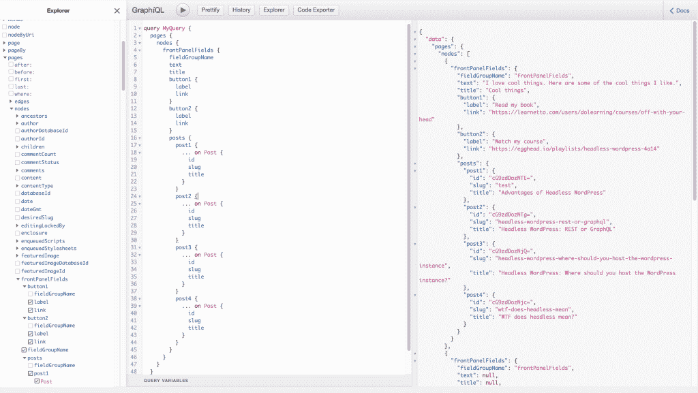

# 如何用 WordPress 和 Next.js 创建数据驱动的组件

> 原文：<https://www.freecodecamp.org/news/create-a-data-driven-component-with-wordpress-and-nextjs/>

当你为客户建立一个内容驱动的网站时，在创造一致的用户体验和增加一些特色之间经常会有一些矛盾。

如果像我一样，您主要是以一种无头方式工作，您可能也希望您的 CMS 在特定的点捕获和提供原始数据。您可以在自己选择的前端框架中处理这一问题。

当我们构建前端时，我们倾向于谈论组件驱动的架构。这篇文章将着眼于从后端到前端构建这样一个组件。

## 我们将要建造的

我将从我的网站建立一个前面板组件。看起来是这样的:



Labelled version of the FrontPanel component

查看组件，我想分解我需要的数据，以便能够最有效地生成它。

1.  标题
2.  一些描述文本
3.  相关帖子的四个链接
4.  链接到更多内容的两个按钮

既然我知道我要构建什么，我需要能够捕获和查询数据。为此，我将使用 WordPress 的[高级定制字段插件](https://www.advancedcustomfields.com/)。这允许我们将字段添加到特定位置，以捕获我们需要的数据。

如果你使用免费插件，你会获得很多优秀的功能。ACF Pro 升级版增加了一些非常有用的字段类型，我在客户工作中经常使用这些类型，并且发现没有它们很难生活。对我来说，亮点是[重复栏](https://www.advancedcustomfields.com/resources/repeater/)、[灵活内容栏](https://www.advancedcustomfields.com/resources/flexible-content/)和[选项页](https://www.advancedcustomfields.com/resources/options-page/)。

但这不是 ACF 的广告！在这篇文章中，我将使用免费插件。请注意，在这个网站的主页上，我使用了同样的策略和一个灵活的内容字段，让我可以将这个组件与其他组件混合和匹配。

## 如何用 ACF 创建自定义字段

一旦你安装并激活了 ACF 插件，你会在你的 WordPress 管理面板中有一个新的侧边栏项目。



单击“Add New”将让您开始填写组件的字段。这里有很多可能的选项，但是对于前两个字段，我们只填写标签、名称和类型。


我们想要的第三部分数据是相关文章的链接。使用 ACF Pro，我会将它设置为 repeater 字段，这将允许我改变帖子的数量。

现在，我将使用一个 group 字段类型，并用四个字段来捕获相关的帖子。该组中的每个字段都是 Post 对象类型。它应该看起来有点像这样:



我们需要捕获的最后一个字段是两个按钮的字段。让我们为每个按钮创建一个有标签和目的地的组。



全部完成！我们的最后一组字段应该如下所示:



## 如何使字段可用

我们可以控制这些字段在我们的管理区显示的位置和方式。我希望这些面板可以在任何页面上。因此，在字段定义下面，我将设置位置规则。



您甚至可以更细化，让这些字段在特定页面或帖子上可用。但是用 ACF 构建一个界面有使编辑体验过于复杂的风险。请确保您只让字段在绝对需要的地方可用。

在定义我们的字段时，我们没有考虑那些与布局相关的选项。这给了你在 WordPress 管理界面中对字段的位置和大小很好的控制。对于您和您的内容创作团队来说，有很大的空间可以让这项工作做得更好。

## 如何使用我们的组件创建页面

目前，我们正在将 ACF 组件添加到现有的 post 类型中。这意味着我们将看到 Gutenberg 编辑器和组件的字段。

有可能我们的 ACF 字段被古腾堡块封装，但是有几个原因我们没有在这篇文章中看到。

1.  它需要 ACF Pro，我想从免费插件的角度来写这个
2.  GraphQL 中还没有对 Gutenberg 块的支持。

现在，我将添加一些内容并填充组件的字段。



当我们选择一篇文章时，我们会得到一个 WordPress 实例上所有文章的下拉列表以供选择。我将选择我想要的文章(在这个例子中是关于 Headless WordPress 的)，最后为我的按钮填充细节。



## 如何准备 GraphQL 查询

我们需要添加两个插件到我们的 WordPress 实例中。WPGraphQL 是由 Jason Bahl 和其他贡献者构建的一个令人惊叹的插件。它可以在 WordPress 插件目录中找到。

为了使 ACF 字段对 GraphQL 可用，我们需要第二个插件。它被称为 WPGraphQL，用于高级自定义字段。这还不在插件目录中，但是你可以从这里的网站下载并安装它。

安装完成后，我们需要返回到我们的自定义字段，进行最后的配置。



在字段块的底部，我们现在可以选择在 GraphQL 中显示这些字段，并给它们命名。这是我们在 GraphQL 查询中引用它们的方式。

在使用 Next.js 实现这个特性之前，让我们先使用 GraphiQL 接口来构建我们的查询。



GraphQL 最棒的一点是我们请求我们需要的确切数据。这里我请求所有的页面节点，特别是前面板字段。我还将包括代码块，以防您想要复制和粘贴。

```
query MyQuery {
  pages {
    nodes {
      frontPanelFields {
        fieldGroupName
        text
        title
        button1 {
          label
          link
        }
        button2 {
          label
          link
        }
        posts {
          post1 {
            ... on Post {
              id
              slug
              title
            }
          }
          post2 {
            ... on Post {
              id
              slug
              title
            }
          }
          post3 {
            ... on Post {
              id
              slug
              title
            }
          }
          post4 {
            ... on Post {
              id
              slug
              title
            }
          }
        }
      }
    }
  }
}
```

## 如何将数据导入 Next.js

如果你还没有开始使用 Next.js 和 WordPress，我强烈推荐我的朋友 [Colby Fayock 的 Next starter](https://github.com/colbyfayock/next-wordpress-starter/) 。我发现 Colby 构建查询和函数的方式非常有用。当我添加新功能时，我把它作为一个模型。

我的一个抱怨是，它没有使用我选择的样式框架 Tailwind(我已经开始使用 Tailwind 样式实现 Colby 的所有史诗功能，并希望尽快完成)。

我将假设你正在使用某种 WordPress/Next.js starter，或者在你的下一个应用程序中安装并运行 Apollo。我们需要使用我们上面构建的查询，并在正确的地方使用它。

继续 Colby 的例子，我给`/data/pages.js`添加了一个新的查询函数。

```
export function getQueryFrontPanelById(id) {
  return gql`query {
    page(id: "${id}") {
      frontPanelFields {
        fieldGroupName
        text
        title
        button1 {
          label
          link
        }
        button2 {
          label
          link
        }
        posts {
          post1 {
            ... on Post {
              id
              slug
              title
            }
          }
          post2 {
            ... on Post {
              id
              slug
              title
            }
          }
          post3 {
            ... on Post {
              id
              slug
              title
            }
          }
          post4 {
            ... on Post {
              id
              slug
              title
            }
          }
        }
      }
    }
  }
  `
}
```

这和以前完全一样，只是我使用页面的 id 来获取正确的数据。WordPress 的页面是分等级的，所以我们不能用 slug 搜索。相反，我们需要获取 id 并使用它来找到正确的页面。

这就是我在`/lib/pages.js`中所做的:

```
export async function getContentAndFields(slug) {
  // Get all of the WordPress pages
  const { pages } = await getAllPages()

  // Find one that has a matching slug
  const filteredPages = pages.filter(page => page.slug === slug)

  // If we don't find one, return null
  if (filteredPages.length === 0) {
    return null
  }

  // Otherwise, get the first one
  const page = filteredPages[0]

  // Get the Front Panel info
  const { frontPanelFields } = await getFrontPanelById(page.id)

  // and return all the data.
  return { ...page, frontPanelFields }
}
```

那里发生了很多事情，但是希望评论能把事情说清楚。

现在，我将在 pages 目录中创建一个`[slug].js`文件，我将用它来访问我的带有前面板的页面。这是我的页面版本。同样，我会用注释进行注释。如果从底部开始查看`getServerSideProps`函数，然后再从顶部开始，会更有意义。

```
import Layout from "components/Layout"
import FrontPanelComponent from "components/FrontPanelComponent"
import { getContentAndFields } from "lib/pages"

import Error from "next/error"

export default function PageWithAcfComponents({ pageData }) {
  // If there is no pageData, then the page didn't exist so serve a 404 error.
  if (!pageData) {
    return <Error statusCode={404} />
  }

  // Destructure the content and panel data from the page data.
  const { content, frontPanelFields } = pageData;

  return <Layout>
    <div className="mx-auto px-4 sm:px-6 lg:px-8 py-8 blog-post max-w-2xl">
      // If there is frontPanelFields, render the component.
      {frontPanelFields && <FrontPanelComponent data={frontPanelFields} />}
      // Render the other content to the DOM.
      <div
        className=""
        dangerouslySetInnerHTML={{
          __html: content,
        }}
      />
    </div>
  </Layout>
}

export async function getServerSideProps({ params = {} } = {}) {
  // Get the slug from the request route.
  const slug = params?.slug;
  // Get the fields and content using the function we defined earlier
  const pageData = await getContentAndFields(slug)
  // Return the pageData to the component above.
  return {
    props: {
      pageData
    }
  }
}
```

唷！这是很多代码。我们快到了。我们要做的最后一件事是构建 FrontPanelComponent。

下面是代码:

```
import Link from "next/link";
import Image from "next/image";
import { getMetaImage } from "lib/image";

export default function FrontPanelComponent({ data: { title, text, button1, button2, posts, ...rest } }) {
  return <div className="bg-white p-4 py-20">
    <h2 className="text-center font-bold text-dlblue text-3xl">{title}</h2>
    <div className="flex flex-col md:flex-row justify-between">
      <div>{mapPosts(posts)}</div>
      <div className="text-xl text-black leading-none px-8 xl:text-2xl lg:text-xl -pt-4">
        <div>{text}</div>
      </div>
    </div>
    <div
      className="flex md:flex-row flex-wrap md:justify-end mt-8"
    >
      <div className="text-normal lg:text-xl mx-2">
        <a className="text-white rounded-xl p-4 text-primary hover:bg-primary hover:text-white border-2 border-primary bg-white" href={button1.link} target="_blank">
          {button1.label}
        </a>
      </div>
      <div className="text-normal md:text-xl mx-2">
        <a className="hover:text-lightPrimary hover:bg-white border-2  hover:border-primary text-white bg-lightPrimary rounded-xl p-4" href={button2.link} target="_blank">
          {button2.label}
        </a>
      </div>
    </div>
  </div>
}

function mapPosts(posts) {
  const { post1, post2, post3, post4 } = posts;
  return <div className="pt-8 grid grid-rows-2 grid-cols-2">

    <div className="mx-2">
      <Link href={`/posts/${post1.slug}`}>
        <a>
          <Image src={getMetaImage(post1.title)} width="380" height="200" />
        </a>
      </Link>
    </div>
    <div className="mx-2">
      <Link href={`/posts/${post2.slug}`}>
        <a>
          <Image src={getMetaImage(post2.title)} width="380" height="200" />
        </a>
      </Link>
    </div>
    <div className="mx-2">
      <Link href={`/posts/${post3.slug}`}>
        <a>
          <Image src={getMetaImage(post3.title)} width="380" height="200" />
        </a>
      </Link>
    </div>
    <div className="mx-2">
      <Link href={`/posts/${post4.slug}`}>
        <a>
          <Image src={getMetaImage(post4.title)} width="380" height="200" />
        </a>
      </Link>
    </div>

  </div>
}
```

大多数情况下，这是渲染和样式化数据。我用顺风做我的造型，所以如果你不知道的话，看起来可能会有点奇怪。这解释了为什么我有这么奇怪的名字！

在这个代码块中，我想提请注意三件不同的事情:

1.  我正在使用下一个链接组件。这告诉 Next 我正在引用应用程序内部的链接，并处理预取和非刷新页面更改。
2.  我还使用了下一个图像组件。这处理图像优化和延迟加载。它像一个普通的图像标签一样工作，但是你必须提供最终图像的尺寸。
3.  我正在使用一个名为`getMetaImage`的函数。这个函数构建了一个 Cloudinary 链接，将文章的标题覆盖在我所有文章使用的基本图片上。

## 我们在那里...

这篇文章中有很多代码，坚持到这一点做得很好。你可以在我的主页(https://kevincunningham.co.uk)上看到 FrontPanels 的最终产品。

由于我使用了免费的 ACF 插件，我还不能处理重复字段或灵活的内容。那将是另一篇文章。现在，您可以看到创建字段、填充它们、向 graphQL 公开它们，然后在前端创建组件的流程。

我希望这是有用的。我将围绕这些主题做更多的直播和视频内容。[如果您想获得关于该内容及更多内容的通知，请注册我的简讯](https://kevincunningham.co.uk/newsletter)。