# Python 不和谐机器人教程——编写一个不和谐机器人并免费托管它

> 原文：<https://www.freecodecamp.org/news/create-a-discord-bot-with-python/>

本教程将向您展示如何完全在云中构建自己的 Discord bot。

你不需要在你的电脑上安装任何东西，你也不需要支付任何费用来托管你的机器人。

我们将使用许多工具，包括 Discord API、Python 库和一个名为 [Repl.it](https://www.repl.it) 的云计算平台。

还有这个书面教程的视频版本。视频嵌在下面，文字版在视频后面。

[https://www.youtube.com/embed/SPTfmiYiuok?feature=oembed](https://www.youtube.com/embed/SPTfmiYiuok?feature=oembed)

## 如何创建一个不和谐机器人帐户

为了使用 Python 库和 Discord API，我们必须首先创建一个 Discord Bot 帐户。

以下是创建不和谐机器人账户的步骤。

1.确保您已登录到 [Discord 网站](https://discord.com)。

2.导航到[应用程序页面](https://discord.com/developers/applications)。

3.单击“新建应用程序”按钮。

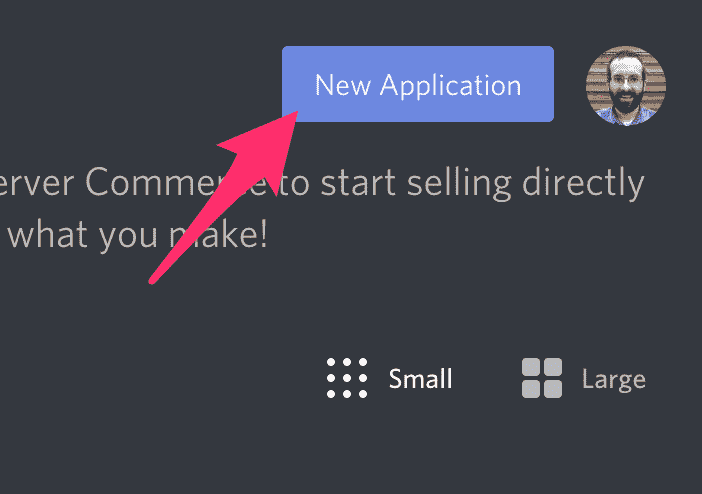

4.为应用程序命名，然后单击“创建”。

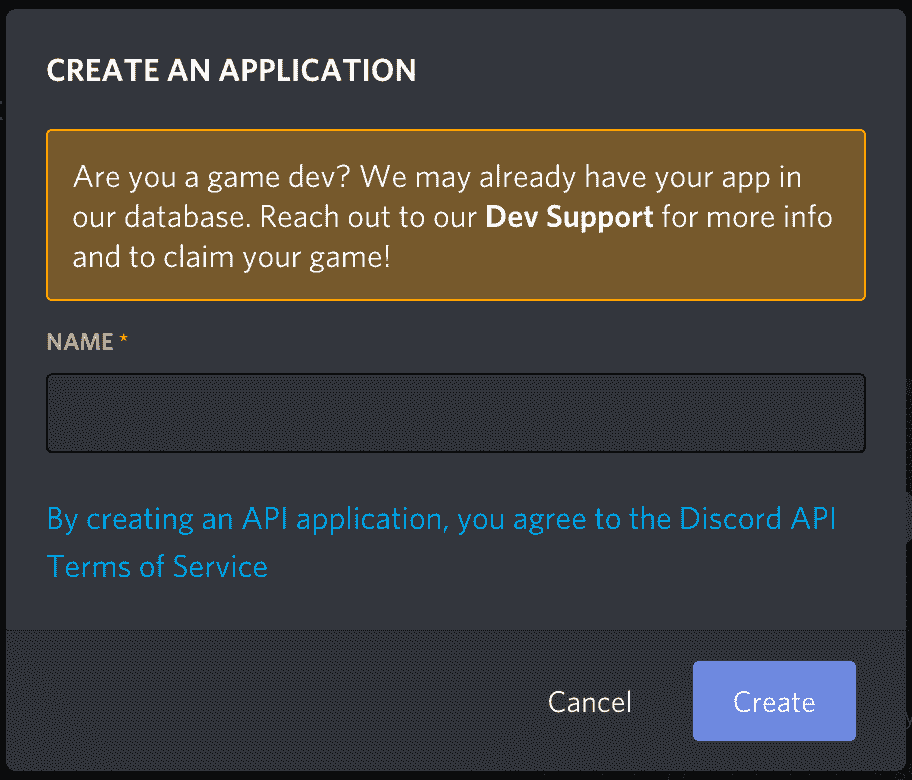

5.转到“机器人”选项卡，然后单击“添加机器人”。你必须通过点击“是，做它！”来确认

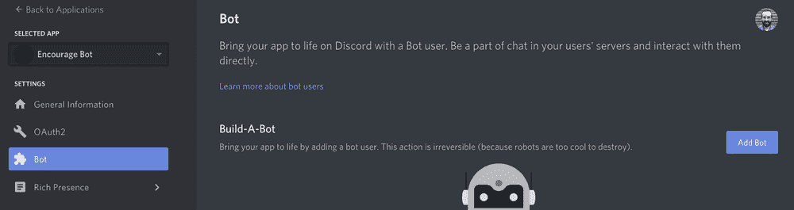

保持**公共机器人**(选中)和**需要 OAuth2 代码授权**(未选中)的默认设置。

您的机器人已经创建。下一步是复制令牌。

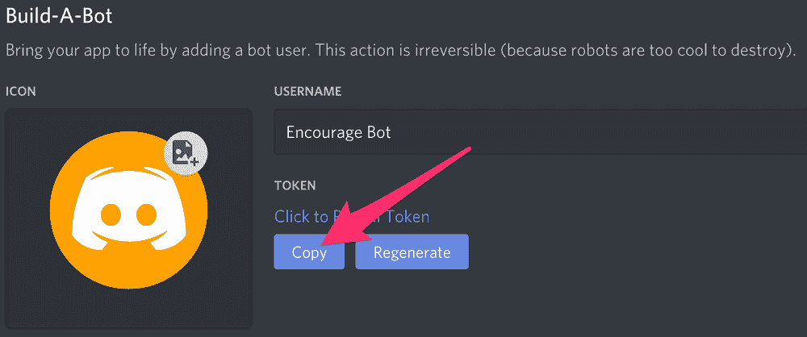

这个令牌是你的机器人的密码，所以不要与任何人分享。它可以让某人登录你的机器人，做各种坏事。

如果令牌意外被共享，您可以重新生成令牌。

## 如何邀请你的机器人加入服务器

现在你必须让你的机器人用户进入服务器。为此，您应该为它创建一个邀请 URL。

转到“OAuth2”选项卡。然后在“scopes”部分选择“bot”。

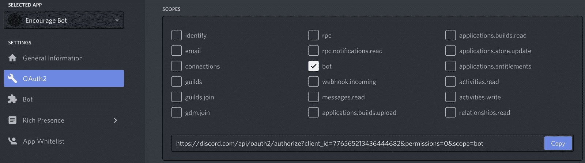

现在选择你想要的权限。我们的机器人将主要使用短信，所以我们不需要太多的权限。你可能需要更多，这取决于你想让你的机器人做什么。小心“管理员”权限。


选择适当的权限后，单击权限上方的“复制”按钮。这将复制一个可用于将机器人添加到服务器的 URL。

将 URL 粘贴到您的浏览器中，选择要邀请机器人的服务器，然后单击“授权”。

要添加 bot，您的帐户需要“管理服务器”权限。

现在您已经创建了机器人用户，我们将开始为机器人编写 Python 代码。

## 如何用 discord.py 库编写一个基本的 Discord 机器人

我们将使用 discord.py Python 库来编写机器人代码。discord.py 是 discord 的 API 包装器，使得用 Python 创建 Discord 机器人更加容易。

### 如何创建 Repl 并安装 discord.py

您可以在本地计算机上使用任何代码编辑器开发 bot。然而，在本教程中，我们将使用 Repl.it，因为它将使任何人都更容易理解。它是一个在线 IDE，你可以在你的网络浏览器中使用。

首先转到 [Repl.it](https://repl.it) 。创建一个新的 Repl 并选择“Python”作为语言。

要使用 discord.py 库，只需在`main.py`的顶部写上`import discord`。当您按下“运行”按钮时，它将自动安装这个依赖项。

如果您喜欢在本地编写 bot 代码，可以在 MacOS 上使用这个命令来安装 discord.py:

`python3 -m pip install -U discord.py`

你可能要用`pip3`而不是`pip`。

如果您使用的是 Windows，那么您应该使用以下代码行:

`py -3 -m pip install -U discord.py`

### 如何为你的机器人设置不和谐事件

discord.py 围绕着事件的概念。一个事件是你听了然后做出反应的事情。例如，当一个消息发生时，您将收到一个关于它的事件，您可以对其进行响应。

让我们制作一个回复特定消息的机器人。这个简单的机器人代码，以及代码解释，摘自[discord . py 文档](https://discordpy.readthedocs.io/en/latest/quickstart.html#a-minimal-bot)。我们将在以后增加更多的功能。

将这段代码添加到 main.py 中。(如果您愿意，可以将该文件命名为其他名称，但不要命名为 discord.py。)我将很快解释所有这些代码的作用。

```
import discord
import os

client = discord.Client()

@client.event
async def on_ready():
    print('We have logged in as {0.user}'.format(client))

@client.event
async def on_message(message):
    if message.author == client.user:
        return

    if message.content.startswith('$hello'):
        await message.channel.send('Hello!')

client.run(os.getenv('TOKEN'))
```

当你在 Discord 上创建你的机器人用户时，你复制了一个令牌。现在我们将创建一个`.env`文件来存储令牌。如果你在本地运行你的代码，你不需要`.env`文件。只要把`os.getenv('TOKEN')`换成令牌就行了。

`.env`文件用于声明环境变量。在 Repl.it 上，你创建的大多数文件对任何人都是可见的，但是`.env`文件只对你可见。其他查看公共回复的人将看不到`.env`文件的内容。

因此，如果您在 Repl.it 上开发，只需在`.env`文件中包含私有信息，如令牌或密钥。

点击“添加文件”按钮，创建一个名为`.env`的文件。

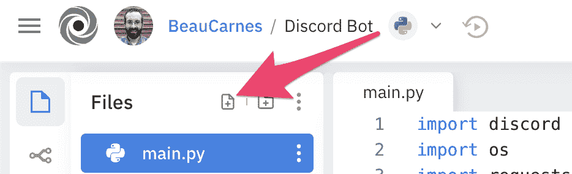

在文件中添加以下行，包括您之前复制的实际令牌:

```
TOKEN=[paste token here]
```

现在让我们来看看每一行代码在你的不和谐机器人代码中做了什么。

1.  第一行导入 discord.py 库。
2.  第二行导入 os 库，但这仅用于从`.env`文件中获取`TOKEN`变量。如果你没有使用`.env`文件，你不需要这一行。
3.  接下来，我们创建一个 [`Client`](https://discordpy.readthedocs.io/en/latest/api.html#discord.Client) 的实例。这是与不和谐的联系。
4.  `[@client.event()](https://discordpy.readthedocs.io/en/latest/api.html#discord.Client.event)`装饰器用于注册一个事件。这是一个异步库，所以事情是通过回调来完成的。回调是在发生其他事情时调用的函数。在这段代码中，当 bot 准备好开始使用时，将调用`[on_ready()](https://discordpy.readthedocs.io/en/latest/api.html#discord.on_ready)`事件。然后，当机器人收到消息时，就会调用`[on_message()](https://discordpy.readthedocs.io/en/latest/api.html#discord.on_message)`事件。
5.  每次收到消息时都会触发`[on_message()](https://discordpy.readthedocs.io/en/latest/api.html#discord.on_message)`事件，但是如果消息来自我们自己，我们不希望它做任何事情。因此，如果`[Message.author](https://discordpy.readthedocs.io/en/latest/api.html#discord.Message.author)`与`[Client.user](https://discordpy.readthedocs.io/en/latest/api.html#discord.Client.user)`相同，代码就返回。
6.  接下来，我们检查 [`Message.content`](https://discordpy.readthedocs.io/en/latest/api.html#discord.Message.content) 是否以`'$hello'`开头。如果是这样，那么机器人用`'Hello!'`回复到它被使用的频道。
7.  现在 bot 已经设置好了，最后一行代码使用登录令牌运行 bot。它从 out `.env`文件中获取令牌。

我们有机器人的代码，所以现在我们只需要运行它。

### 如何运行这个机器人

现在单击顶部的 run 按钮，在 repl.it 中运行您的 bot。

如果您正在本地编写 bot，您可以在终端中使用这些命令来运行 bot:

在 Windows 上:

`py -3 main.py`

在其他系统上:

`python3 main.py`

现在去你的不和谐房间，输入“$hello”。你的机器人应该回复“你好！”。

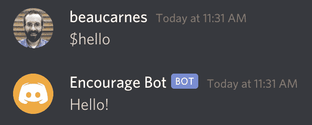

## 如何改进 Bot

现在我们有了一个基本的机器人，我们将改进它。之所以叫“鼓励 Bot”是有原因的。

每当有人发送包含悲伤或沮丧词语的消息时，这个机器人就会回复一条鼓励的消息。

任何人都可以添加鼓励消息供机器人使用，用户提交的消息将存储在 Repl.it 数据库中。

当有人在聊天中键入消息“$inspire”时，该机器人还会从 API 中返回随机的灵感引用。

我们将从添加“$inspire”功能开始。

### 如何给机器人添加励志名言

我们将从一个名为 zenquotes.io 的 API 获得启发性的报价。我们需要导入更多的 Python 模块，添加一个`get_quote()`函数，并更新我们的 bot 代码以调用该函数。

下面是更新后的代码。在代码之后，我将解释新的部分。

```
import discord
import os
import requests
import json

client = discord.Client()

def get_quote():
  response = requests.get("https://zenquotes.io/api/random")
  json_data = json.loads(response.text)
  quote = json_data[0]['q'] + " -" + json_data[0]['a']
  return(quote)

@client.event
async def on_ready():
  print('We have logged in as {0.user}'.format(client))

@client.event
async def on_message(message):
  if message.author == client.user:
    return

  if message.content.startswith('$inspire'):
    quote = get_quote()
    await message.channel.send(quote)

client.run(os.getenv('TOKEN'))
```

我们现在必须导入`requests`模块。这个模块允许我们的代码发出 HTTP 请求，从 API 获取数据。API 返回 JSON，所以`json`模块使得处理返回的数据更加容易。

`get_quote()`函数非常简单。首先，它使用请求模块从 API URL 请求数据。API 会返回一个随机的启发性引用。如果当前的 API 停止工作，可以很容易地重写这个函数，从不同的 API 获取报价。

接下来在函数内部，我们使用`json.loads()`将响应从 API 转换成 JSON。通过反复试验，我知道了如何将 JSON 中的引用转换成我想要的字符串格式。引号作为字符串从函数中返回。

代码中更新的最后一部分接近末尾。以前，它查找以“$hello”开头的消息。现在它在寻找“$inspire”。而不是回“你好！”，它用`quote = get_quote()`获取报价并返回报价。

此时，您可以运行代码并进行测试。

## 如何给机器人添加鼓励信息

现在，我们将实现这样一个功能，当用户发布一条带有悲伤字眼的消息时，机器人会以鼓励性的消息做出响应。

### 如何给机器人加上悲伤的字眼

首先，我们需要创建一个 Python 列表，其中包含机器人将会响应的悲伤词汇。

在`client`变量创建后添加以下行:

`sad_words = ["sad", "depressed", "unhappy", "angry", "miserable"]`

请随意在列表中添加更多的单词。

### 如何给机器人添加鼓励信息

现在，我们将添加一个鼓励信息列表，机器人将对此做出响应。

在您创建的`sad_words`列表后添加以下列表:

```
starter_encouragements = [
  "Cheer up!",
  "Hang in there.",
  "You are a great person / bot!"
]
```

像以前一样，随意添加更多你选择的短语到列表中。我现在只使用三个项目，因为稍后我们将为用户添加更多鼓励机器人使用的短语的能力。

### 如何回复邮件

现在我们需要更新我们的 bot 来使用我们创建的两个列表。首先，导入 random 模块，因为 bot 会随机选择鼓励性消息。将下面一行添加到代码顶部的 import 语句中:`import random`。

现在我们将更新`on_message()`函数来检查所有消息，看它们是否包含来自`sad_words`列表的单词。如果发现一个悲伤的单词，机器人会随机发送一条鼓励的消息。

以下是更新后的代码:

```
async def on_message(message):
  if message.author == client.user:
    return

  msg = message.content

  if msg.startswith('$inspire'):
    quote = get_quote()
    await message.channel.send(quote)

  if any(word in msg for word in sad_words):
    await message.channel.send(random.choice(starter_encouragements))
```

这是测试机器人的好时机。你现在知道的足够多了，可以创建你自己的机器人了。但是接下来您将学习如何实现更高级的特性，以及如何使用 Repl.it 数据库存储数据。

### 如何启用用户提交的邮件

该机器人是完全功能性的，但现在让我们有可能从不和谐的权利更新机器人。当机器人检测到一个悲伤的单词时，用户应该能够添加更多鼓励的消息。

我们将使用 Repl .它的内置数据库来存储用户提交的消息。这个数据库是内置于每个 repl 中的键值存储。

在代码的顶部，在其他导入语句下，添加`from replit import db`。这将允许我们使用 Repl.it 数据库。

用户将能够添加自定义的鼓励消息，让机器人直接从 Discord 聊天中使用。在我们为 bot 添加新命令之前，让我们创建两个助手函数，它们将向数据库添加自定义消息并删除它们。

在`get_quote()`函数后添加以下代码:

```
def update_encouragements(encouraging_message):
  if "encouragements" in db.keys():
    encouragements = db["encouragements"]
    encouragements.append(encouraging_message)
    db["encouragements"] = encouragements
  else:
    db["encouragements"] = [encouraging_message]

def delete_encouragment(index):
  encouragements = db["encouragements"]
  if len(encouragements) > index:
    del encouragements[index]
  db["encouragements"] = encouragements
```

`update_encouragements()`函数接受一条鼓舞人心的消息作为参数。

首先，它检查“鼓励”是否是数据库中的一个关键字。如果是，它获取数据库中已经存在的鼓励列表，将新的列表添加到列表中，并将更新后的列表存储回数据库中的“鼓励”键下。

如果数据库还没有包含“鼓励”，则创建一个具有该名称的新密钥，并将新的鼓励消息添加为列表中的第一个元素。

`delete_encouragement()`函数接受一个索引作为参数。

它从存储在“鼓励”键下的数据库中获取鼓励列表。如果鼓励列表中的项目数大于索引，则删除该索引处的列表项目。

最后，更新后的列表被存储回数据库中的“鼓励”键下。

下面是`on_message()`函数的更新代码。在代码之后，我将解释新的部分。

```
async def on_message(message):
  if message.author == client.user:
    return

  msg = message.content

  if msg.startswith("$inspire"):
    quote = get_quote()
    await message.channel.send(quote)

  options = starter_encouragements
  if "encouragements" in db.keys():
    options = options + db["encouragements"]

  if any(word in msg for word in sad_words):
    await message.channel.send(random.choice(options))

  if msg.startswith("$new"):
    encouraging_message = msg.split("$new ",1)[1]
    update_encouragements(encouraging_message)
    await message.channel.send("New encouraging message added.")

  if msg.startswith("$del"):
    encouragements = []
    if "encouragements" in db.keys():
      index = int(msg.split("$del",1)[1])
      delete_encouragment(index)
      encouragements = db["encouragements"]
    await message.channel.send(encouragements)
```

上面的第一行新代码是`options = starter_encouragements`。我们正在制作一个`starter_encouragements`的副本，因为我们将在选择一个随机消息供机器人发送之前，将用户提交的消息添加到该列表中。

我们检查“鼓励”是否已经在数据库关键字中(意味着用户已经提交了至少一条定制消息)。如果是这样，我们将用户消息添加到起始鼓励中。

然后，机器人现在从`options`发送随机消息，而不是从`starter_encouragements`发送随机消息。

下一段新代码用于向数据库添加新的用户提交的消息。如果不和谐信息以“$new”开头，那么“$new”之后的文本将被用作新的鼓励信息。

代码`msg.split("$new ",1)[1]`从“$new”命令中分离出消息，并将该消息存储在一个变量中。在这一行代码中，注意`"$new "`中的空格。我们想要太空后的一切*。*

我们用新消息调用`update_encouragements`助手函数，然后机器人向 discord chat 发送一条消息，确认消息已被添加。

第三个新的部分(在上面代码的末尾)检查新的 Discord 消息是否以“$del”开头。这是从数据库的“鼓励”列表中删除项目的命令。

首先，名为`encouragements`的新变量被初始化为一个空数组。这样做的原因是，如果数据库不包含“鼓励”键，这部分代码将发送一个包含空数组的消息。

如果“鼓励”键在数据库中，索引将从以“$del”开始的不和谐消息中分离出来。然后，调用`delete_encouragement()`函数传入要删除的索引。更新后的鼓励列表被加载到`encouragements`变量中，然后机器人发送一条消息来改变当前列表。

## 最终 Bot 功能

机器人应该工作，所以这是一个很好的时间来测试它。我们现在将添加一些最后的功能。

我们将增加从 Discord 获取用户提交的消息列表的能力，并且我们将增加关闭和打开机器人是否响应悲伤话语的能力。

我会给你完整的程序最终代码，然后我会讨论代码下面的更新。

```
import discord
import os
import requests
import json
import random
from replit import db

client = discord.Client()

sad_words = ["sad", "depressed", "unhappy", "angry", "miserable"]

starter_encouragements = [
  "Cheer up!",
  "Hang in there.",
  "You are a great person / bot!"
]

if "responding" not in db.keys():
  db["responding"] = True

def get_quote():
  response = requests.get("https://zenquotes.io/api/random")
  json_data = json.loads(response.text)
  quote = json_data[0]["q"] + " -" + json_data[0]["a"]
  return(quote)

def update_encouragements(encouraging_message):
  if "encouragements" in db.keys():
    encouragements = db["encouragements"]
    encouragements.append(encouraging_message)
    db["encouragements"] = encouragements
  else:
    db["encouragements"] = [encouraging_message]

def delete_encouragment(index):
  encouragements = db["encouragements"]
  if len(encouragements) > index:
    del encouragements[index]
  db["encouragements"] = encouragements

@client.event
async def on_ready():
  print("We have logged in as {0.user}".format(client))

@client.event
async def on_message(message):
  if message.author == client.user:
    return

  msg = message.content

  if msg.startswith("$inspire"):
    quote = get_quote()
    await message.channel.send(quote)

  if db["responding"]:
    options = starter_encouragements
    if "encouragements" in db.keys():
      options = options + db["encouragements"]

    if any(word in msg for word in sad_words):
      await message.channel.send(random.choice(options))

  if msg.startswith("$new"):
    encouraging_message = msg.split("$new ",1)[1]
    update_encouragements(encouraging_message)
    await message.channel.send("New encouraging message added.")

  if msg.startswith("$del"):
    encouragements = []
    if "encouragements" in db.keys():
      index = int(msg.split("$del",1)[1])
      delete_encouragment(index)
      encouragements = db["encouragements"]
    await message.channel.send(encouragements)

  if msg.startswith("$list"):
    encouragements = []
    if "encouragements" in db.keys():
      encouragements = db["encouragements"]
    await message.channel.send(encouragements)

  if msg.startswith("$responding"):
    value = msg.split("$responding ",1)[1]

    if value.lower() == "true":
      db["responding"] = True
      await message.channel.send("Responding is on.")
    else:
      db["responding"] = False
      await message.channel.send("Responding is off.")

client.run(os.getenv("TOKEN"))
```

添加到代码中的第一个部分位于`starter_encouragements`列表的正下方:

```
if "responding" not in db.keys():
  db["responding"] = True
```

我们在数据库中创建一个名为“responding”的新键，并将其设置为“True”。我们将用它来决定机器人是否应该回应悲伤的话语。因为即使在程序停止运行后，数据库仍被保存，所以我们只在新键不存在时才创建它。

代码的下一个新部分是响应悲伤单词的部分现在在 if 语句中:`if db["responding"]:`。机器人只会回应悲伤的话，如果`db["responding"] = True`。更新这个值的能力在下一节之后。

接下来，在让机器人响应“$del”命令的代码之后，有新的代码在作为不和谐消息发送时响应“$list”命令。

本节首先创建一个名为`encouragements`的空列表。然后，如果数据库中已经有了鼓励，这些鼓励将替换刚刚创建的空列表。

最后，机器人将鼓励列表作为不和谐消息发送出去。

接下来是最后一个新部分。这段代码让机器人响应“$responding”命令。此命令接受“true”或“false”参数。下面是一个用法示例:“$responding true”。

代码首先使用`value = msg.split("$responding ",1)[1]`完成参数(像以前一样，注意`"$responding "`中的空格)。然后有一个 if/else 语句适当地设置数据库中的“responding”键，并向 Discord 发回一个通知消息。如果参数不为“真”，则代码假定为“假”。

机器人的代码完成了！你现在可以运行这个机器人并进行测试。但是还有一个更重要的步骤，我们将在下面讨论。

## 如何设置 Bot 持续运行

如果您在 repl.it 中运行您的 bot，然后关闭它正在运行的选项卡，您的 bot 将停止运行。

但是有两种方法可以让你的机器人持续运行，即使你关闭了你的网络浏览器。

第一种方法也是最简单的方法是在 Repl.it 中注册付费计划。他们最便宜的付费计划称为黑客计划，它包括五个永远在线的 Repl。

你可以免费使用这个链接三个月(限前 1000 人):https://repl.it/claim?code=tryalwayson2103

一旦您注册了该计划，请打开您的 Repl 并单击顶部的名称。然后选择“始终开启”选项。

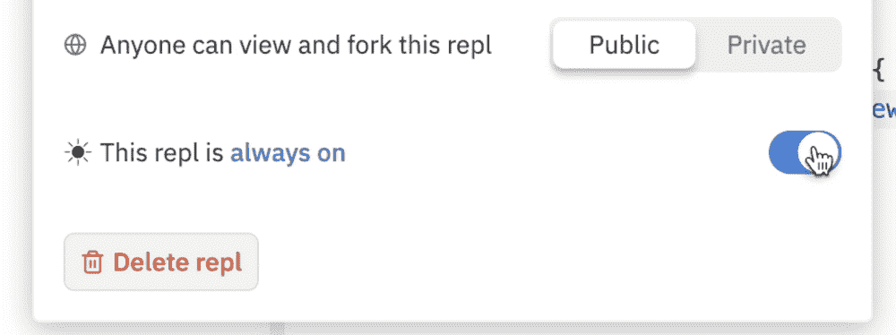

还有另一种方法可以让你的代码运行在自由层，但是有点复杂。Repl.it 将继续运行 web 服务器，即使在选项卡关闭后。但是，即使是网络服务器也只能在没有任何用途的情况下运行一个小时。

以下是回复文件中的内容:

> 部署后，服务器将继续在后台运行，即使在您关闭浏览器选项卡之后。服务器将保持唤醒和活动状态，直到它发出最后一个请求一个小时后，它将进入休眠阶段。休眠的 repls 一收到另一个请求就会被唤醒；不需要重新运行 repl。但是，如果您对服务器进行了更改，您将需要重新启动 repl，以便看到这些更改反映在 live 版本中。

为了保持机器人持续运行，我们将在 https://uptimerobot.com/使用另一项名为 Uptime Robot 的免费服务。

Uptime Robot 可以设置为每 5 分钟 ping repl . it 上的 bot web 服务器。随着不断的 ping，机器人将永远不会进入睡眠阶段，只会继续运行。

因此，我们还需要做两件事来让我们的机器人持续运行:

1.  在 repl.it 中创建一个 web 服务器
2.  设置正常运行时间机器人连续 ping 网络服务器。

### 如何在 repl.it 中创建 Web 服务器

创建一个 web 服务器比你想象的要简单。

为此，在您的项目中创建一个名为`keep_alive.py`的新文件。

然后添加以下代码:

```
from flask import Flask
from threading import Thread

app = Flask('')

@app.route('/')
def home():
    return "Hello. I am alive!"

def run():
  app.run(host='0.0.0.0',port=8080)

def keep_alive():
    t = Thread(target=run)
    t.start() 
```

在这段代码中，我们使用 Flask 启动一个 web 服务器。服务器返回“你好。我活着。”任何参观过它的人。服务器将在一个独立于我们的机器人的线程上运行。我们不会在这里讨论所有的事情，因为其余的都与我们的机器人无关。

现在我们只需要机器人来运行这个网络服务器。

在`main.py`的顶部添加下面一行来导入服务器。

```
from keep_alive import keep_alive
```

要在运行`main.py`时启动 web 服务器，在 bot 运行之前添加下面一行作为倒数第二行。

`keep_alive()`

添加完这段代码后，当您在 repl.it 上运行 bot 时，将会打开一个新的 web 服务器窗口。显示了 web 服务器的 URL。复制 URL，以便在下一节中使用。

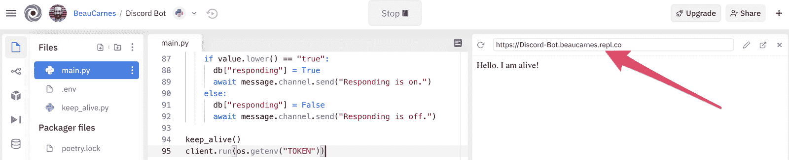

### 如何设置正常运行时间机器人

现在我们需要设置 Uptime Robot 每五分钟 ping 一次 web 服务器。这将导致 bot 持续运行。

在[https://uptimerobot.com/](https://uptimerobot.com/)上创建一个免费账户。

登录到您的帐户后，单击“添加新显示器”。

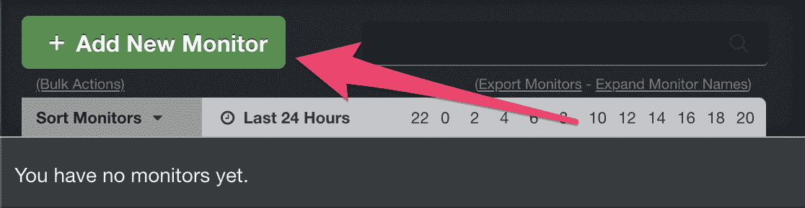

对于新的监视器，选择“HTTP(s)”作为监视器类型，并随意命名。然后，从 repl.it 中粘贴您的 web 服务器的 URL。最后，单击“创建监视器”。

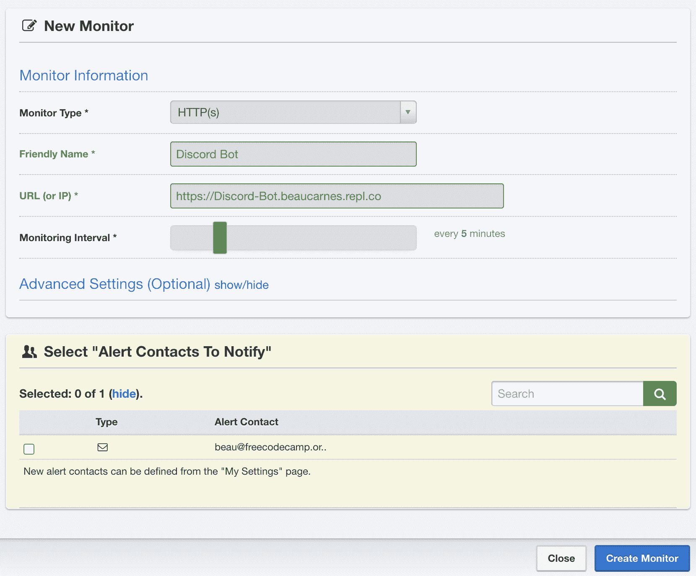

我们完了！现在，机器人将持续运行，因此人们可以随时在 Repl.it 上与它进行交互。

## 结论

您现在知道如何用 Python 创建一个 Discord bot，并在云中持续运行它。

discord.py 库还可以做很多其他的事情。因此，如果你想给 Discord 机器人更多的功能，你的下一步就是查看 discord.py 的文档