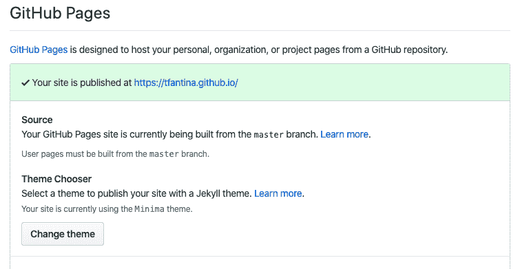
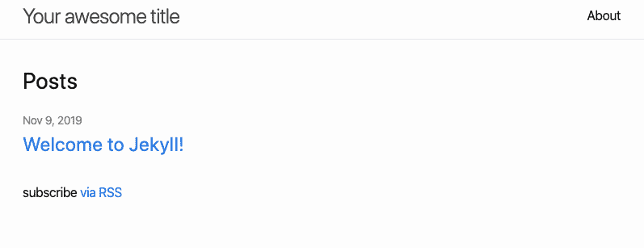
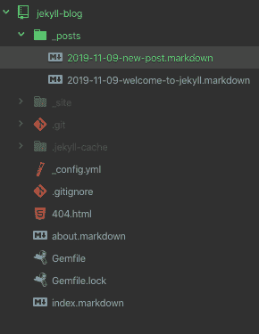

# 如何在 10 分钟内用 GitHub 页面创建一个免费的静态网站

> 原文：<https://www.freecodecamp.org/news/create-a-free-static-site-with-github-pages-in-10-minutes/>

静态网站已经变得非常流行，这是有充分理由的——它们速度惊人，而且随着越来越多的托管服务的支持，建立起来非常容易。

我不打算在这里讨论所有静态站点的名称、内容、时间、地点或原因。我假设你至少对他们有一个模糊的概念*或者*只想创建你自己的网站，而不关心其他细节。不管怎样，这篇文章是给你的。

首先，我想让你知道我写这篇文章是为了尽可能多的读者；您不需要任何编程知识，但是熟悉一下命令行和 Git 会有很大帮助。

## 那么如何用 GitHub 在 10 分钟内创建一个静态站点呢？

我们将使用两个特定的工具:GitHub Pages，它是专门为静态内容设计的，以及一个名为 Jekyll 的静态内容生成器。

Jekyll 是一个 Ruby 宝石，可以轻松创建静态站点，所以如果你想使用 Jekyll，你需要在你的计算机上安装 Ruby。如果你有 OSX，你很可能已经有了一个版本的 Ruby(尽管你可能需要更新它)。如果没有，或者在 Windows 电脑上，可以在这里了解更多关于安装的信息:[安装 Ruby](https://www.ruby-lang.org/en/documentation/installation/) 。

这样一来，打开一个新的终端窗口并输入`gem install bundler jekyll`。这将安装 Bundler(一个 Ruby 包管理工具)和 Jekyll。

一旦这些 gems (Ruby 包)安装完毕，输入`Jekyll new my-static-site`(你想取什么名字都行)，它将运行 Jekyll 的生成器在一个新目录下创建你的项目。在你的网站创建完成后，输入`cd my-static-site`(或者`cd`，无论你如何称呼你的项目)，进入你新创建的网站目录。

在文本编辑器中打开您的项目，您将看到 Jekyll 为您创建的几个文件和文件夹。现在，您只需要关心 Gemfile(而不是 Gemfile.lock)。Gemfile 是一个 Ruby 文件，它管理运行一个项目所需的所有相关的 Ruby 包。

该文件将包含一行 Jekyll 版本，将其注释掉:

```
#gem "jekyll", "~> 4.0.0" 
```

然后添加这一行:

```
gem "github-pages", group: :jekyll_plugins 
```

当你安装 GitHub Pages gem 时，可能会遇到很多问题——有时它所依赖的 gem 已经过时，或者你在本地安装的 gem 对于 GitHub Pages 来说*太现代了。*

我发现这使得在本地构建和测试我的 Jekyll 站点变得很困难。最简单的方法可能是在本地测试您的站点，并在准备部署之前保存构建。然而，在撰写本文时，您可以在 Gemfile 中指定这些依赖版本，Jekyll 将在本地和 GitHub 页面上工作:

```
gem "jekyll", "~> 3.8.5"
gem "github-pages","~> 202" , group: :jekyll_plugins
group :jekyll_plugins do
  gem "jekyll-feed", "~> 0.11.0"
end 
```

感谢 [StackOverflow](https://stackoverflow.com/questions/58598084/how-does-one-downgrade-jekyll-to-work-with-github-pages) 上的 [Alex Waibel](https://stackoverflow.com/users/6885157/alex-waibel) 的最新配置。

要查看站点的运行情况，请在命令行中运行`bundle exec Jekyll serve`。这将启动一个服务器，你可以通过在浏览器的地址栏中键入“localhost:4000”来查看你的站点。

瞧啊。您已经用 Jekyll 创建了一个静态站点，并且位于项目目录中。你大约完成了 50%。

## 让我们把这个放到网上

去 GitHub.com 注册，或者如果你已经有一个帐户，选择“新建”按钮并创建一个存储库。以你的 GitHub Pages 帐户将提供的链接命名你的存储库是很重要的，即 your_username.github.io。例如，我的 GitHub 用户名是 tfantina，我的博客是 [tfantina.github.io](https://tfantina.github.io) ，所以我的 GitHub repo 被命名为:“tfantina.github.io”。

回到您的终端窗口，通过运行以下命令将您的 Jekyll 站点从您的计算机推送到 GitHub:

```
git init
git remote add origin git@github.com:<your_github_username>/<your_github_repo_name>.git
git commit -am “Setting up Jekyll!”
git push -u origin master 
```

(当替换您的用户名和项目名称时，您不需要开始和结束<>)。

一旦您的更改被推送到您的存储库，您应该有一个工作的静态站点。这是因为您正在使用 GitHub Pages gem，并且以 GitHub 理解您想要用 GitHub Pages 来服务它的方式来命名您的存储库。

你可以通过访问你的网站或者进入 GitHub 上的设置选项卡并滚动到页面部分来确认。您应该会看到一个绿色框，显示您的站点发布的位置:



你还会注意到，你可以很容易地从这里改变你的主题。GitHub 为 Jekyll 提供了一些默认主题，当然你也可以自己制作。如果你的网站说它已经发布了，但是看起来是空白的，你可能需要进行一次硬刷新，或者尝试在一个私人窗口中查看你的网站。这似乎是显而易见的，但几乎每次我建立一个新的 Jekyll 实例时都会遇到这种情况。

如果一切按计划进行，你的站点应该是这样的:



* * *

这就对了——在短短几分钟内，您已经创建并部署了一个包含 GitHub 页面的静态网站。但是您可能希望能够在页面上放置一些内容。

我承诺这只需要 10 分钟，所以我不会深入到页面的所有细节，前面的事情，或者液体模板语言。那是以后的事了。但是我会分享如何创建你的第一个帖子。

回到文本编辑器，打开“_posts”文件夹。已经有一个帖子欢迎你加入你的新博客。创建一个新的降价文件，用以下格式的名称保存:年-月-日-标题.降价(见下文):



一篇 Jekyll 帖子包含两个部分:前面的内容和正文。

前面的内容给了 Jekyll 具体的指示，比如文章的标题是什么，使用什么样的布局，以及文章是什么时候写的。

前面的事情是高度可定制的。例如，我希望我的帖子有英雄图像，所以我创建了一个`lead_image`标签，并在我的布局中放置了一些语法，专门检查每个帖子的首页中的主要图像。液体模板语言使得将内容从前台拉进你的主题变得容易。

您可以对 front matter 做更多的事情，但是让我们从一个通用的例子开始。

默认的前台事务如下所示:

```
—
layout: post 
title:  "Welcome to Jekyll!"
date:   2019-11-09 18:07:11 -0600
categories: jekyll update
— 
```

*   Layout 告诉 Jekyll 你希望内容在哪个布局上显示。不同的页面或文章类型可以有多种布局。
*   文章标题
*   发布日期
*   类别，本质上是标签。您可以添加任意数量的内容，用空格分隔。

在前面的内容之后，你的帖子可以写在 [Markdown](https://github.com/adam-p/markdown-here/wiki/Markdown-Cheatsheet) 中，这给了你很多写帖子内容的灵活性。

一旦你的文章完成，保存它并打开你的终端窗口。

```
git commit -am “Publishes first post
git push
```

一分钟后(可能刷新一次)，你就可以看到你的帖子了。

希望您现在已经有了一个用 Jekyll 创建的 GitHub 页面上的工作静态站点！如果你有任何问题或疑问，请发推特 [@tfantina](https://twitter.com/tfantina) ，或者你可以发邮件到 contact@travisfantina.com