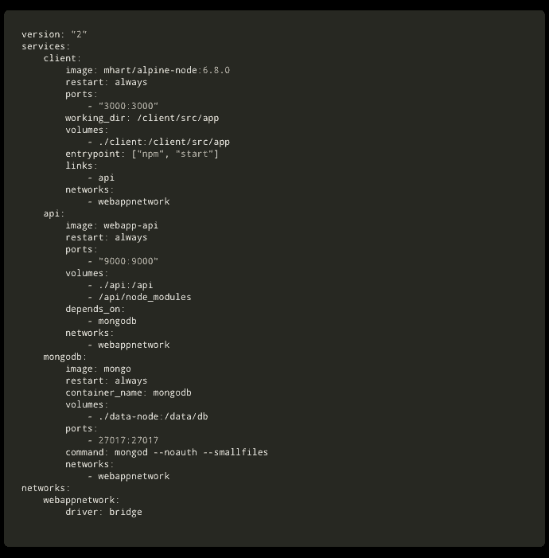
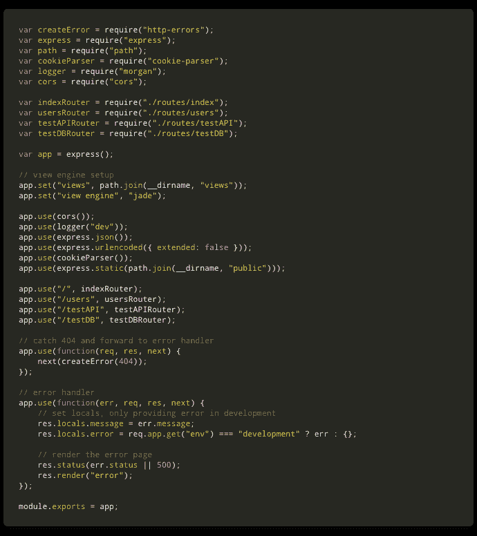
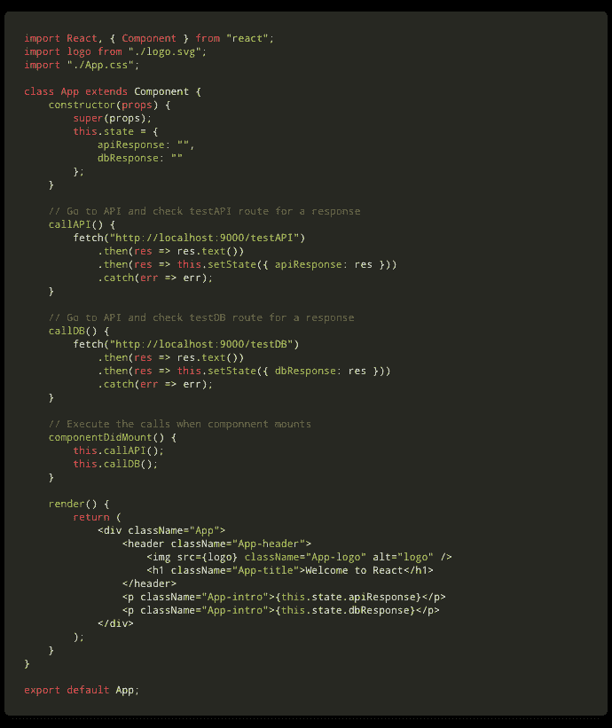
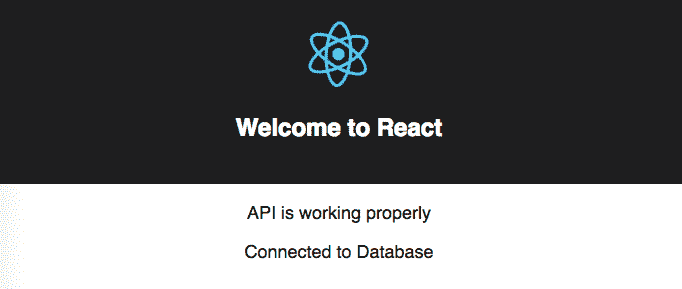

# 如何使用 Docker 创建全栈 React/Express/MongoDB 应用

> 原文：<https://www.freecodecamp.org/news/create-a-fullstack-react-express-mongodb-app-using-docker-c3e3e21c4074/>

约翰亨利克

# 如何使用 Docker 创建全栈 React/Express/MongoDB 应用


“assorted-color filed intermodal containers” by [frank mckenna](https://unsplash.com/@frankiefoto?utm_source=medium&utm_medium=referral) on [Unsplash](https://unsplash.com?utm_source=medium&utm_medium=referral)

在本教程中，我将指导你使用 [Docker](https://www.docker.com/) 容器以一种非常简单的方式，通过容器化一个 [React](https://reactjs.org/) 前端、一个[节点](https://nodejs.org/en/) / [Express](http://expressjs.com/) API 和一个 [MongoDB](https://www.mongodb.com/what-is-mongodb) 数据库的过程。

> 我不会详细讨论如何使用这些技术。相反，我会留下链接，以防你想了解更多。

> 目标是给你一个实用的指南，告诉你如何将这个简单的全栈应用容器化，作为你构建自己的应用的起点。

#### 为什么要关心 [Docker](https://www.docker.com/) ？

Docker 是目前最重要的技术之一。它可以让你在容器中运行应用程序，这些容器与“一切”都是隔离的。

每个容器就像一个单独的虚拟机，去掉了运行应用程序不需要的所有东西。这使得集装箱非常轻，快速和安全。

容器也意味着是一次性的。如果一个变得不听话，你可以毫不费力地杀死它，并制作另一个一模一样的，这要感谢[容器图像系统。](https://docs.docker.com/engine/reference/commandline/images/)

使 [Docker](https://www.docker.com/) 变得伟大的另一件事是，容器内的应用程序将在每个系统(Windows、Mac 或 Linux)中运行相同的程序。如果你在你的机器上开发，然后你想把它部署到一些云提供商，比如 T2 GCP T3 或 T4 AWS T5，这是很棒的。

#### 准备好了！

1.  确保你的机器上有[节点](https://nodejs.org/en/)和 [Docker](https://www.docker.com/get-started) 在运行。
2.  我将使用我们在之前的教程中构建的名为 [**的 React/Express 应用程序创建一个 React 前端，一个 Node/Express 后端并将它们连接在一起**](https://medium.com/@jrshenrique/create-a-react-frontend-a-node-express-backend-and-connect-them-together-c5798926047c) **。**如果你对创建 [React](https://reactjs.org/) 和 [Express](http://expressjs.com/) 应用程序的过程不感兴趣，你可以先遵循那个教程，或者你可以用样板文件[克隆](https://help.github.com/articles/cloning-a-repository/)这个 [**GitHub 库**](https://github.com/Joao-Henrique/React_Express_App_Medium_Tutorial) 。
3.  如果你选择使用回购，不要忘记在**客户端**和 **API** 文件夹中 **npm 安装**来安装所有需要的依赖项。
4.  还有……大概就是这样了。你已经准备好开始装箱了:)

#### Dockerfile

根据文件:

> 一个 [Dockerfile](https://docs.docker.com/engine/reference/builder/#usage) 是一个文本文档，它包含了用户可以在命令行上调用的所有命令来组合一个图像。 [Docker](https://www.docker.com/get-started) 可以通过读取[Docker 文件](https://docs.docker.com/engine/reference/builder/#usage)中的指令自动构建图像。

#### 到处都是码头集装箱！

用 [Docker](https://www.docker.com/get-started) 容器化你的应用程序就像为你的每个应用程序创建一个 [Dockerfile](https://docs.docker.com/engine/reference/builder/#usage) 一样简单，首先构建一个映像，然后运行每个映像来激活你的容器。

#### 集装箱化你的客户

为了建立我们的客户形象，你将需要一个 [Dockerfile](https://docs.docker.com/engine/reference/builder/#usage) 。让我们创建一个:

1.  在你喜欢的代码编辑器中打开 [React/Express App](https://medium.com/@jrshenrique/create-a-react-frontend-a-node-express-backend-and-connect-them-together-c5798926047c) (我用的是 [VS 代码](https://code.visualstudio.com/))。
2.  导航到**客户端**文件夹。
3.  创建一个名为 **Dockerfile** 的新文件。
4.  将以下代码放入其中:

```
# Use a lighter version of Node as a parent imageFROM mhart/alpine-node:8.11.4
```

```
# Set the working directory to /clientWORKDIR /client
```

```
# copy package.json into the container at /clientCOPY package*.json /client/
```

```
# install dependenciesRUN npm install
```

```
# Copy the current directory contents into the container at /clientCOPY . /client/
```

```
# Make port 3000 available to the world outside this containerEXPOSE 3000
```

```
# Run the app when the container launchesCMD ["npm", "start"]
```

这将指示 docker 为我们的客户端构建一个映像(使用这些配置)。你可以在这里阅读所有关于 [Dokerfile 的内容。](https://docs.docker.com/engine/reference/builder/#usage)

#### 将您的 API 容器化

为了构建我们的 API 映像，您将需要另一个[docker 文件](https://docs.docker.com/engine/reference/builder/#usage)。让我们创建它:

1.  导航到 **API** 文件夹。
2.  创建一个名为 **Dockerfile** 的新文件。
3.  将以下代码放入其中:

```
# Use a lighter version of Node as a parent imageFROM mhart/alpine-node:8.11.4
```

```
# Set the working directory to /apiWORKDIR /api
```

```
# copy package.json into the container at /apiCOPY package*.json /api/
```

```
# install dependenciesRUN npm install
```

```
# Copy the current directory contents into the container at /apiCOPY . /api/
```

```
# Make port 80 available to the world outside this containerEXPOSE 80
```

```
# Run the app when the container launchesCMD ["npm", "start"]
```

这将指导 docker 为我们的 API 构建一个映像(使用这些配置)。你可以在这里阅读所有关于 [Dokerfile 的内容。](https://docs.docker.com/engine/reference/builder/#usage)

#### 坞站-合成

您可以使用 Dokerfiles 运行每个单独的容器。在我们的例子中，我们有 3 个容器需要管理，所以我们将使用 docker-compose。Compose 是一个定义和运行多容器 Docker 应用程序的工具。

让我告诉你使用它有多简单:

1.  在你的代码编辑器中打开 [React/Express 应用](https://medium.com/@jrshenrique/create-a-react-frontend-a-node-express-backend-and-connect-them-together-c5798926047c)。
2.  在你的 App 主文件夹中，新建一个文件，命名为[**docker-compose . yml**](https://docs.docker.com/compose/overview/)**。**
3.  把这段代码写到[**docker-compose . yml**](https://docs.docker.com/compose/overview/)文件中:

```
version: "2"
```

```
services:    client:        image: webapp-client        restart: always        ports:            - "3000:3000"        volumes:            - ./client:/client            - /client/node_modules        links:            - api        networks:            webappnetwork
```

```
 api:        image: webapp-api        restart: always        ports:            - "9000:9000"        volumes:            - ./api:/api            - /api/node_modules        depends_on:            - mongodb        networks:            webappnetwork
```

那是什么魔法？

你应该在这里阅读所有关于 [**docker-compose** 的内容](https://docs.docker.com/compose/overview/)。

基本上，我告诉 Docker，我想使用映像 **webapp-client** (这是我们在客户端 Dockerfile 上定义的映像)构建一个名为 **client** 的容器，该容器将侦听端口 3000。然后，我告诉它，我想使用映像 **webapp-api** (这是我们在 API Dockerfile 中定义的映像)构建一个名为 **api** 的容器，它将监听端口 9000。

> 请记住，有许多方法可以编写一个[**docker-compose . yml**](https://docs.docker.com/compose/overview/)文件。您应该研究文档并使用更适合您需要的内容。

#### 添加一个 [MongoDB](https://www.mongodb.com/what-is-mongodb) 数据库

添加一个 [MongoDB](https://www.mongodb.com/what-is-mongodb) 数据库就像将这些代码行添加到您的[**docker-compose . yml**](https://docs.docker.com/compose/overview/)文件中一样简单:

```
 mongodb:        image: mongo        restart: always        container_name: mongodb        volumes:            - ./data-node:/data/db        ports:            - 27017:27017        command: mongod --noauth --smallfiles        networks:            - webappnetwork
```

这将使用官方 MongoDB 映像创建一个容器。

#### 为您的容器创建共享网络

要为您的容器创建共享网络，只需将以下代码添加到您的 **docker-compose.yml** 文件中:

```
networks:    webappnetwork:        driver: bridge
```

请注意，您已经定义了应用程序的每个容器来使用该网络。

最后，你的[**docker-compose . yml**](https://docs.docker.com/compose/overview/)文件应该是这样的:



docker-compose.yml

在 **docker-compose.yml** 文件中，缩进很重要。意识到这一点。

#### 让你的集装箱运转起来

1.  现在您已经有了一个[**docker-compose . yml**](https://docs.docker.com/compose/overview/)**文件，让我们来构建您的图像。转到终端，在应用程序的主目录上运行:**

```
`docker-compose build`
```

**2.现在，要让 Docker 旋转容器，只需运行:**

```
`docker-compose up`
```

**而且……就像魔术一样，您现在有了自己的客户端、API 和数据库，所有这些都在单独的容器中运行，只需要一个命令。多酷啊。**

#### **将您的 API 连接到 MongoDB**

1.  **首先，让我们安装[mongose](https://mongoosejs.com/)来帮助我们连接到 [MongoDB](https://www.mongodb.com/what-is-mongodb) 。在您的终端上键入:**

```
`npm install mongoose`
```

1.  **现在，在 API routes 文件夹中创建一个名为 **testDB.js** 的文件，并插入以下代码:**

```
`const express = require("express");const router = express.Router();const mongoose = require("mongoose");`
```

```
`// Variable to be sent to Frontend with Database statuslet databaseConnection = "Waiting for Database response...";`
```

```
`router.get("/", function(req, res, next) {    res.send(databaseConnection);});`
```

```
`// Connecting to MongoDBmongoose.connect("mongodb://mongodb:27017/test");`
```

```
`// If there is a connection error send an error messagemongoose.connection.on("error", error => {    console.log("Database connection error:", error);    databaseConnection = "Error connecting to Database";});`
```

```
`// If connected to MongoDB send a success messagemongoose.connection.once("open", () => {    console.log("Connected to Database!");    databaseConnection = "Connected to Database";});`
```

```
`module.exports = router;`
```

**好，让我们看看这段代码在做什么。首先，我导入 Express、ExpressRouter 和[mongose](https://mongoosejs.com/)用于我们的/testDB 路由。然后我创建一个变量，它将作为响应发送，告诉请求发生了什么。然后我使用 Mongoose.connect()连接到数据库。然后我检查连接是否工作，并相应地更改变量(我之前创建的)。最后，我使用 module.exports 导出这个路径，以便能够在 app.js 文件中使用它。**

**2.现在，您必须“告诉” [Express](http://expressjs.com/) 使用您刚刚创建路线。在你的 API 文件夹中，打开 **app.js** 文件，插入这两行代码:**

```
`var testDBRouter = require("./routes/testDB");app.use("/testDB", testDBRouter);`
```

**这会“告诉” [Express](http://expressjs.com/) 每次有对端点 **/testDB** 的请求时，都要使用文件 **testDB.js** 上的指令。**

**3.现在让我们测试一下是否一切正常。到你的码头，按下 ***control + C*** 来把你的集装箱放下来。然后运行 ***docker-compose up*** 让它们再次恢复运行。在一切启动并运行之后，如果您导航到[http://localhost:9000/testDB](http://localhost:9000/testDB)，您应该会看到消息 ***连接到数据库。*****

**最后，您的 **app.js** 文件应该是这样的:**

**

api/app.js** 

**是的……这意味着 API 现在已经连接到数据库了。但是你的前端还不知道。我们现在就开始努力吧。**

#### ****从[发出请求](https://reactjs.org/)对数据库做出反应****

**要检查 React 应用程序是否可以访问数据库，让我们向您在上一步中定义的端点发出一个简单的请求。**

1.  **进入你的**客户端**文件夹，打开 **App.js** 文件。**
2.  **现在将这段代码插入到 **callAPI()** 方法的下面:**

```
`callDB() {    fetch("http://localhost:9000/testDB")        .then(res => res.text())        .then(res =>; this.setState({ dbResponse: res }))        .catch(err => err);}`
```

**该方法将获取您之前在 API 上定义的端点，并检索响应。然后，它会将响应存储在组件**的状态中。****

**4.向组件的状态添加一个变量来存储响应:**

```
`dbResponse: ""`
```

**3.在生命周期方法**componentidmount()，**中插入以下代码，以便在组件挂载时执行您刚刚创建的方法:**

```
`this.callDB();`
```

**4.最后再加一个**<**；p >标签后，你已经显示了来自数据库的响应:**

```
`<p className="App-intro">;{this.state.dbResponse}</p>`
```

**最终，您的 App.js 文件应该是这样的:**

**

client/App.js** 

#### **最后，让我们看看是否一切正常**

**在您的浏览器上，转到 [http://localhost:3000/](http://localhost:3000/) ，如果一切正常，您应该会看到以下三条消息:**

1.  **欢迎反应**
2.  **API 工作正常**
3.  **连接到数据库**

**大概是这样的:**

**

[http://localhost:3000/](http://localhost:3000/)** 

#### ****恭喜你！！！****

**现在，您拥有了一个完整的堆栈应用程序，包括一个 React 前端、一个 Node/Express API 和一个 MongoDB 数据库。所有这些都在单独的 Docker 容器中运行，这些容器由一个简单的 docker-compose 文件编排。**

**这个应用程序可以作为样板来构建你更强大的应用程序。**

**你可以在项目资源库中找到我写的所有代码[。](https://github.com/Joao-Henrique/docker_tutorial)**

> **坚强起来，坚持下去！！！**

**…别忘了今天要表现得很棒；)**