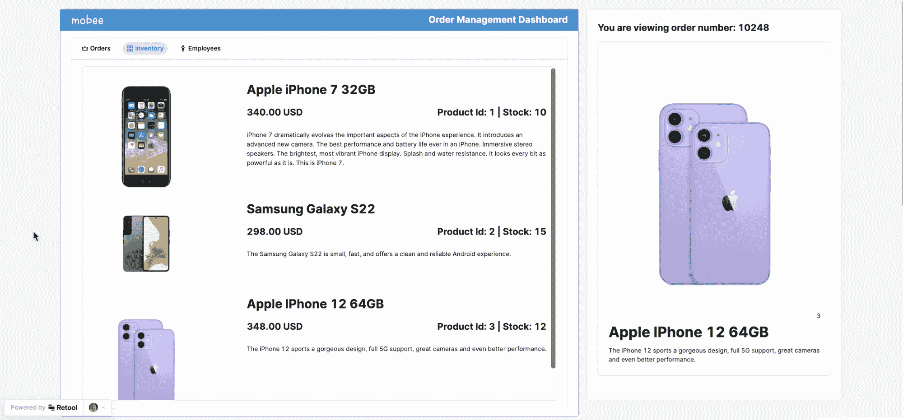

# 用 Stripe、Postgres 和 REST API 后端创建一个低代码电子商务应用程序

> 原文：<https://www.freecodecamp.org/news/create-a-low-code-ecommerce-app-with-stripe-postgres-rest-api-backend/>

使用低代码工具可以更快地构建应用程序。低代码平台可以为您提供预构建的 UI 组件，其中包含表格、按钮和文本输入等功能。这允许您跳过前端模板，快速构建自己的模板。

我们刚刚在 freeCodeCamp.org YouTube 频道上发布了一个教程，教你如何用 Stripe、Postgres 和 REST API 后端构建一个 B2B 电子商务应用。你将会用很少甚至没有代码来完成这一切。

ania ku bow 开发了这个课程。Ania 是一名软件开发人员和受欢迎的讲师。

Ania 将向您展示如何构建订单管理仪表板、员工仪表板和开发人员门户。您还将学习如何将电子邮件集成到应用程序中。

您创建的所有应用程序都将链接到一个数据库。这些应用程序类似于中小型公司中的应用程序。

Ania 将带你一步一步地经历一切。她将从解释器开始，然后在三个单独的教程中教授每个应用程序。本教程结束时，你将知道如何构建自己的内部工具。

One of the apps you will build.

您将使用重组平台来构建业务工具。Retool 是一个拖放式无代码编辑器，带有许多预构建的组件，可以尽快构建内部 CRUD(创建、读取、更新、删除)应用程序。Retool 提供了一笔赠款，使这一课程成为可能。

观看以下全部课程或在 freeCodeCamp.org YouTube 频道观看[(2 小时观看)。](https://youtu.be/WbMUHSL2xpY)

[https://www.youtube.com/embed/WbMUHSL2xpY?feature=oembed](https://www.youtube.com/embed/WbMUHSL2xpY?feature=oembed)