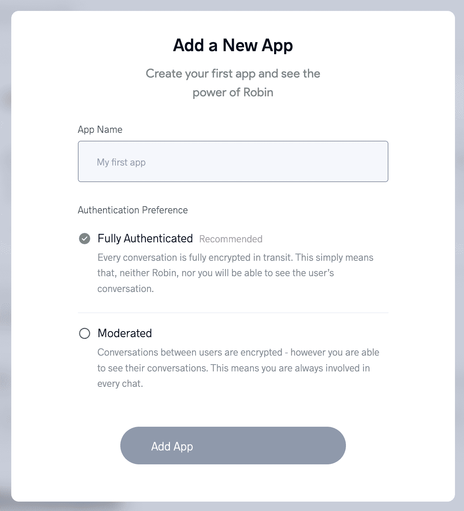
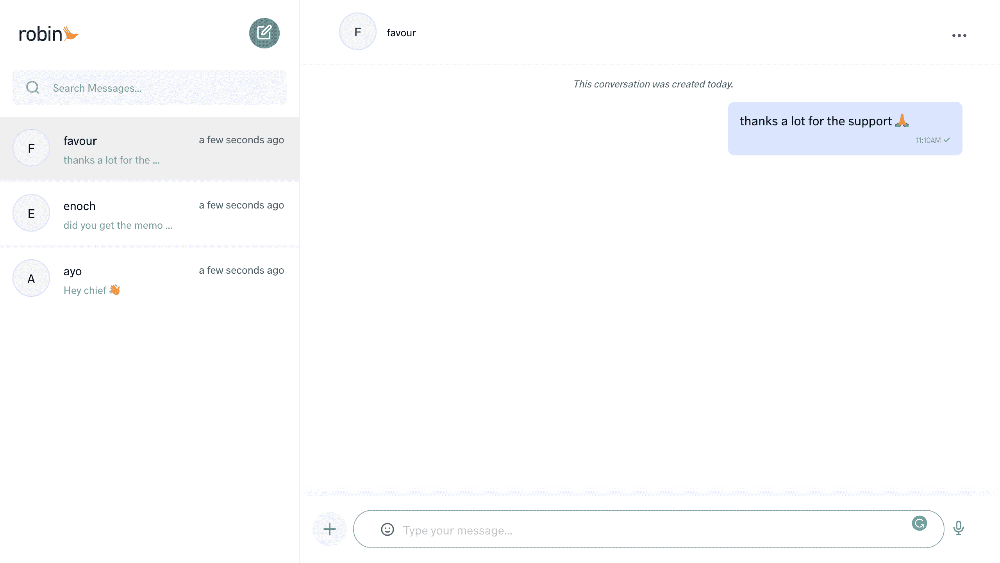

# 如何用 Nuxt 创建实时聊天应用程序

> 原文：<https://www.freecodecamp.org/news/create-a-real-time-chat-application-with-nuxt/>

在实时聊天应用程序中，接收者几乎可以立即查看发送者的消息。这可以是两方之间的一对一对话，也可以是小组对话。

这就是我们在本教程中要构建的内容。对于这个应用，我们将使用直观的 Vue 框架 [Nuxt](https://nuxtjs.org/) 。

现在我们已经知道了我们将要构建的内容和将要使用的技术，让我们来看看将要使用的聊天 API。

在这篇文章中，我们将使用 [Robin](https://robinapp.io/) ,因为它的用户界面很小，而且很容易集成到我们的应用程序中。说完了，让我们开始吧。

# 步骤 1–创建 Nuxt 应用程序

首先，我们需要用以下命令创建 Nuxt 应用程序:

```
yarn create nuxt-app nuxt-chat-app
// OR
npx create-nuxt-app nuxt-chat-app
// OR
npm init nuxt-app nuxt-chat-app
```

# 步骤 2–创建一个 Robin 帐户

现在我们的应用程序已经准备好了，我们需要有一个罗宾帐户，然后才能使用它。前往 [Robin 的注册页面](https://dashboard.robinapp.co/signup)创建一个 30 天的免费试用账户。

Robin 会在您创建帐户后 7 天通知您，您可以在账单日期之前移除您的卡。

填写注册表单后，您将被重定向到一个付费页面，以填写您的卡信息。在它重定向到你的下一个页面上，Robin 请求你想要创建的应用程序的名称及其验证类型。请随意使用您选择的任何名称和任何一个身份验证选项。



# 步骤 3–获取您的 Robin 证书

既然我们已经在 Robin dashboard 上创建了一个应用程序，您应该注意一些事情。在 Nuxt 应用中使用 Robin 时，您需要两个凭证:

*   API 密钥，
*   用户令牌，
*   用户名，
*   用户，以及
*   键

让我们逐个检查一下。

*   API 密匙:当你创建一个应用时，Robin 自动创建 API 密匙。您可以从仪表板上的入门或 API 配置页面中检索它。它对于每个应用都是独一无二的。
*   用户令牌:用户令牌是您的 Robin 应用程序的每个用户的唯一标识符。应该传递给该属性的令牌是您的，因为您是在您的站点上使用该应用程序的人。但是，它是由您(用户)创建的，通常是在服务器上，然后在客户端使用。
*   用户名:用户名是您的 Robin 应用程序的当前用户的名称。在这种情况下，它将是你的名字。如果你想让其他人把你的 Robin 聊天记录放在他们的网站或网络应用上(比如你的 Robin 应用的另一个用户)，那应该是他们的名字。
*   用户:用户是您的 Robin 应用程序上的用户列表。它通常包含他们的用户令牌、配置文件图像和用户名。
*   Keys:这基本上是为了帮助我们灵活地描述用户列表中的用户令牌、配置文件图像和用户名。这里有一个例子。如果我们的 keys 对象看起来像这样:

```
keys: {
  userToken: 'user_token',
  profileImage: 'profile_image',
  userName: 'user_name'
}
```

然后我们的`users`数组应该用`keys`对象中的值来描述用户的令牌、配置文件图像和名称。

不管使用你的 Robin 应用的用户是谁，Robin 都需要他们提供一个`userToken`、`profileImage`和一个`userName`。Robin 需要它作为显示名称，并在平台上唯一地标识每个消息发送者和接收者。

```
users: [
  {
    'user_token': 'ABCDEF098765GH',
    'profile_image': 'https://url-to-image',
    'user_name': 'Article Reader'
  }
]
```

# 步骤 4-在你的 Nuxt 应用中安装 Robin

既然我们已经有了所有需要的东西，我们可以开始安装 Robin 了。

```
npm i robin-vue
// OR
yarn add robin-vue
```

# 步骤 5–设置 Robin 插件

在您的`plugins`目录中，用插件设置创建一个`robin.js`文件:

```
import Vue from 'vue'
import RobinChat from 'robin-vue'
import 'robin-vue/dist/style.css'

Vue.use(RobinChat)
```

注意，我们导入 CSS 是因为`RobinChat`组件本身不包含任何 CSS。

# 步骤 6–注册插件

`nuxt.config.js`文件中的`plugins`属性是为了让我们的 Nuxt 应用程序知道它应该使用的插件。因此，如果我们不包括我们的罗宾插件，它将不会在我们的应用程序中可用。

```
export default {
  // ...
  plugins: [
    { src: '~/plugins/robin.js', mode: 'client' }
  ]
}
```

# 步骤 7–使用插件

现在剩下的就是在我们的应用程序中的任何地方包含`RobinChat`组件，并传递我们之前讨论过的凭证作为道具。

同样，全权证书是:

*   API 密钥，
*   用户令牌，
*   用户名，
*   用户，以及
*   键

在这个列表中，我们目前没有的是我们的用户令牌和我们应用程序上的用户令牌。

回想一下，这些令牌通常是在服务器上创建的。但是我们没有这种奢侈。所以我们可以在 Robin 的 JavaScript SDK 的帮助下创建它们。我们之前安装的 Vue SDK 依赖于这个 JavaScript SDK。所以我们不需要安装它，因为它已经存在于我们的应用程序中。

## 如何创建用户令牌

我们可以继续在我们将要包含聊天 UI 的页面中创建令牌。因为这是出于学习目的，我们可以继续为 5 个用户(包括我们自己)创建令牌。我们需要为他们每个人想出用户名。

```
<template>
  <!-- ... -->
</template>

<script>
export default {
  data () {
    return {
      users: [
        {
          user_token: '',
          profile_image: '',
          user_name: 'idorenyin'
        },
        {
          user_token: '',
          profile_image: '',
          user_name: 'ayo'
        },
        {
          user_token: '',
          profile_image: '',
          user_name: 'elvis'
        },
        {
          user_token: '',
          profile_image: '',
          user_name: 'favour'
        },
        {
          user_token: '',
          profile_image: '',
          user_name: 'enoch'
        }
      ],
    }
  }
}
</script>
```

注意，`users`数组中每个用户对象的键都必须在`keys`对象中定义，我们将把它作为道具传递给 Robin 组件。

```
keys: {
  userToken: 'user_token',
  profileImage: 'profile_image',
  userName: 'user_name'
},
```

接下来，我们使用 SDK 的`createUserToken()`函数在创建一个 Robin 实例后创建令牌，正如在 [Robin 的文档](https://docs.robinapp.co/frontend-sdks/javascript/getting-started)中所说的。

```
<template>
  <!-- ... -->
</template>

<script>
import { Robin } from 'robin.io-js'

export default {
  data () {
    return {
      keys: {
        userToken: 'user_token',
        profileImage: 'profile_image',
        userName: 'user_name'
      },
      users: [
        // ...
      ]
    }
  },
  created () {
    this.createTokens()
  },
  methods: {
    async createTokens () {
      const robin = new Robin('API_KEY', true)
      for (let i = 0; i < this.users.length; i++) {
        await robin.createUserToken({
          meta_data: {
            username: this.users[i].user_name
          }
        }).then((res) => {
          this.users[i].user_token = res.data.user_token
        })
      }
    }
  }
}
</script>
```

## 如何在 RobinChat 组件上使用凭据

现在，我们已经拥有了在应用程序上显示 Robin chat UI 所需的一切。咻！我们现在可以继续使用代币和其他凭证。

```
<template>
  <!-- ... -->
  <RobinChat
    v-if="tokensAreAvailable"
    :api-key="apiKey"
    :user-token="users[0].user_token"
    user-name="Idorenyin Udoh"
    :keys="keys"
    :users="users"
  />
</template>

<script>
import { Robin } from 'robin.io-js'

export default {
  data () {
    return {
      tokensAreAvailable: false,
      apiKey: 'API_KEY',
      keys: {
        userToken: 'user_token',
        profileImage: 'profile_image',
        userName: 'user_name'
      },
      users: [
        {
          user_token: '',
          profile_image: '',
          user_name: 'idorenyin'
        },
        {
          user_token: '',
          profile_image: '',
          user_name: 'ayo'
        },
        {
          user_token: '',
          profile_image: '',
          user_name: 'elvis'
        },
        {
          user_token: '',
          profile_image: '',
          user_name: 'favour'
        },
        {
          user_token: '',
          profile_image: '',
          user_name: 'enoch'
        }
      ]
    }
  },
  created () {
    this.createTokens()
  },
  methods: {
    async createTokens () {
      const robin = new Robin(this.apiKey, true)
      for (let i = 0; i < this.users.length; i++) {
        await robin.createUserToken({
          meta_data: {
            username: this.users[i].user_name
          }
        }).then((res) => {
          this.users[i].user_token = res.data.user_token
        })
      }
      this.tokensAreAvailable = true
    }
  }
}
</script>
```

注意，为了避免错误，我们只在所有用户的令牌都可用时显示`RobinChat`组件。

结果是这样的:



此处有该应用[。](https://nuxt-chat-lmqlbq79p-idorenyinudoh.vercel.app/)

请注意，我为这个应用程序使用了以前创建的用户令牌，因为如果每次加载应用程序时都创建令牌，您将无法查看消息。永久令牌使得 Robin 上的消息持久存在。

另外，我为用户 Ayo 创建了另一个应用程序。你也可以去看看。这样可以测试 Idorenyin 和 Ayo 之间的实时通信。

# 结论

您刚刚学习了如何使用 Robin 在 Nuxt 应用程序上实现实时通信。

集成的便利性使得在你的应用中实现聊天系统并专注于构建/维护它变得非常快。

如果您确保在服务器上创建用户的令牌，那么在前端实现集成不会太难。

快乐大厦！