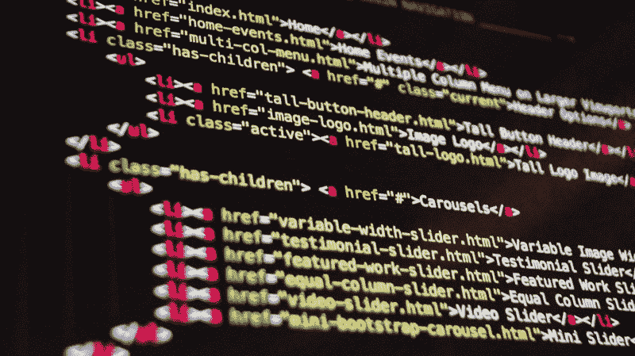

# 使用这些有效的代码评审指南创建一个健康的办公环境

> 原文：<https://www.freecodecamp.org/news/create-a-sane-office-environment-with-these-effective-code-review-guidelines-1d99ae2bdd47/>

作者:桑德尔·达戈

# 使用这些有效的代码评审指南创建一个健康的办公环境

Happy programmers, sane office. ([source](https://www.flickr.com/photos/jesper/252307864))

在我的新团队中，我们正在制定一些指导方针、规则和流程改进。为什么我们认为这些如此重要？如果事情被很好地记录下来，新人就更容易开始传递价值。它降低了每个人出错的可能性。它排除了很多争论的可能性。我们都知道[一个人不可能赢得争论](http://lesswrong.com/lw/j6o/according_to_dale_carnegie_you_cant_win_an)，所以我们应该不惜一切代价避免争论。

关于指南重要性的更多细节，请查看本文。顺便说一句，我很快会重访的。

这一次，我将把重点放在代码审查和相应的指导方针上。

### 代码审查的目的

审查拉取请求是一项重要而敏感的任务。在我看来，这至少和写代码一样重要。此外，审查别人的代码不仅仅是一项技术任务，也是一项人类的任务。这赋予了它大部分的精致。

因此，让我从最重要的规则开始，每当您开始审核拉动式请求或打开您收到的审核时，您都应该牢记这条规则:

任何评论都不应该是个人的。不得对作者或评论者发表任何评论。评审必须总是关于代码的！

代码审查的目的是使代码更好，在合并和交付之前检测错误，并提高给定代码库的可维护性。

Code must be rigorously checked

### 代码审查中要检查的项目

审查代码是困难的，而且是一项非常广泛的任务。据我的老板说，我被认为是一个优秀的代码审查者。但是，我仍然认为我的效率可以提高很多。我认为在大多数情况下，遵循清单会有很大的帮助。

现在，很明显，这些清单和/或任务中的一些将是特定于语言的。然而，多种代码语言中存在的相同概念有助于评审。

这些列表主要是给你一些想法，因为它们还远未完成。随意使用它们，更新它们，个性化它们，或者只是让它们激发你想出全新的。

我认为一个评论者不应该使用所有的，但也许只是一些。但是如果你有单独的清单，就很容易分担任务。

并不是所有的清单都可以用于所有的代码评审。如果拉请求是一个非常小的错误修正，只是纠正一个条件下的一个错误，它不需要检查整个域的设计。

### 检查表的类型

#### 全过程清单

这一个主要关注拉请求的一些基本特征。确保新的提交不会破坏编译或测试。您的持续集成管道应该注意到这一点，但是万一没有——不要忘记这一点。否则，请检查以下内容:

*   是否添加了新的单元/回归测试？
*   有新的编译器警告吗？
*   功能上的改变有意义吗？
*   依赖性大吗？
*   提交消息干净吗？

#### 固体(面向对象设计)原则清单

为了验证设计的合理性，有必要浏览一下坚实的原则。将这些项目展开成子列表是很有用的，这有助于验证每个原则:

*   单一责任原则
*   开/关原则
*   利斯科夫替代原理
*   界面分离原理
*   从属倒置原则

#### 安全清单

您的应用程序可能是也可能不是安全关键的。只要它被黑过一次或者因为一些乱七八糟的输入而失败，它就会变成一个。这个清单应该是非常依赖于语言的(我给你一个 C++)。该列表主要摘自 2018 年 NDC 安全会议上关于安全编程实践的[演讲](https://www.youtube.com/watch?v=Jh0G_A7iRac)

*   外部输入是否处理得当？
*   是否使用了 C 风格的接口？
*   是否多余使用了`new`运算符来代替堆栈分配？
*   有很多(容易出错的)尺寸计算吗？
*   指针用的多吗？
*   shared_ptrs 用的多吗？
*   有线索吗？

#### 测试最佳实践清单

我希望我们都同意测试是开发人员工作的一部分。如果我们讨论测试，那将是关于做测试的不同方式，而不是我们是否应该做测试。

坏消息是没有一种方法适合所有人。尽管如此，我还是建议你遵循测试驱动开发的周期。好消息是，在一个项目中，至少有一个关于应该做什么的共识。

如果没有，介入并提倡测试，收集文章和研究，并说服团队。你会更受尊重。

关于测试部分，有几点需要澄清:

*   有足够的单元测试吗？
*   有足够的非回归测试吗？
*   测试测试一样东西吗？
*   他们有主张吗？(一个测试可能有多个断言，但从逻辑上讲，它们仍然断言一件事)
*   它们可读吗？
*   日期是如何使用的？(固定与生成)

#### 代码可读性清单

我们——开发者——都是作者。如果我们做得无可挑剔，我们的代码读起来会像散文一样。我不是说你应该总是为整个代码库达到这个目标，但是你应该以此为目标。

代码审查者在这里有着巨大的责任。如果您正在阅读拉取请求，请思考以下问题:

*   名字有意义吗？
*   类/函数足够小吗？
*   代码“读起来像散文”吗？
*   代码的格式是否良好？
*   是否存在重复代码？

#### 资源处理清单，又名 [RAII](https://en.wikipedia.org/wiki/Resource_acquisition_is_initialization)

最后一个是特定于语言的。不仅仅是针对 C++，大部分都是。如果你是一名 C++开发人员，并且曾经与悬空指针、内存泄漏和令人讨厌的内核转储进行过斗争，那么你应该知道我的意思。

非专业人士很难发现这些问题。但是，遵循一个有用的清单可以帮助您指出有问题的线路，并开发 RAII 专业知识。

*   对象所有权是否明确？
*   对象是否被正确销毁/内存是否被正确释放？
*   新字段是否处理得当？
*   构造函数中的字段初始化正确吗？
*   是否更新了比较运算符？

The review is for improving quality and educating each other

### 代码审查人员的行为准则

如前所述，评论别人的代码也是一项人工任务，所以要善待你的开发同事。这里有一些建议。遵循它们将显著减少开发人员在办公室里哭泣或互相扔椅子的机会。(但我从未见过后者——迄今为止……)

#### 不要

*   不要提及个人特征，也不要妄加评判(例如，不要说你/你的代码是愚蠢的……)
*   不要提要求(至少写一个“请”字，并解释你为什么要求改变)
*   不要冷嘲热讽，即使是哥们。其他评论者/读者可能会觉得有些评论不合适
*   永远不要说永远，也不要说永远。总会有例外。所以要小心对待这条规则…
*   避免代码的选择性所有权(也就是说，不要使用“我的”、“不是我的”、“你的”…)

#### 两个

*   提问。
*   求澄清。
*   明确一点。记住，人们在网上并不总能理解你的意图。
*   求理解作者视角。
*   如果讨论变得过于哲学或学术，将讨论转移到线下
*   找出在解决问题的同时简化代码的方法。
*   交流哪些想法你有强烈的感受，哪些没有。如果你只是表达你的偏好，就说这只是你的偏好。
*   教育。如果你提出建议，分享为什么它更好的证据(比如文章、研究、书籍等等)。

We developers are all authors

### 作者的规则

*   对提交的代码保持谦逊和诚实。错误每天都在发生，过程就在那里支持你。
*   请记住，你不应该把它当成个人恩怨。审查的是代码，不是你。
*   解释代码存在的原因。
*   遵循指南。
*   寻求理解评论者的观点。
*   感谢替代建议，保持讨论的技术性。试着从不同的角度学习。

### 行动呼吁

*   进行彻底的代码审查。你会学到很多东西，就像你的开发伙伴一样。
*   强调在你的团队中适当的代码审查的重要性，如果有必要，教育你的同事如何审查代码。
*   检查并开始[这个库](https://github.com/sandordargo/code-review-guidelines)，在那里我收集了一些清单和想法。请随意投稿，并添加您认为重要的内容！

*本文最初发表在[我的博客](http://sandordargo.com/blog/2018/03/28/codereview-guidelines)上。*