# 如何在 Deno 和 Oak 中创建 Todo API

> 原文：<https://www.freecodecamp.org/news/create-a-todo-api-in-deno-written-by-a-guy-coming-from-node/>

我是一个 JavaScript/节点开发者，暗恋(其实是热爱和崇拜)Deno。自从 Deno 发布以来，我就是它的超级粉丝，我一直想玩它。

本教程着重于为 Todo 应用程序创建一组 REST APIs。请记住，我在这里并没有触及数据库——我将在另一篇文章中讨论这个问题。

在任何时候，如果你觉得失去了或想检查参考，这里是本教程的完整源代码: **[第一章:橡树](https://github.com/adeelibr/deno-playground/tree/master/chapter_1:oak)。**


Photo by [Bernard de Clerk](https://unsplash.com/@bernardtheclerk?utm_source=ghost&utm_medium=referral&utm_campaign=api-credit) / [Unsplash](https://unsplash.com/?utm_source=ghost&utm_medium=referral&utm_campaign=api-credit)

### 我们将涉及的内容

*   创建基本服务器
*   创建 5 个 API(路由/控制器)
*   创建一个中间件来记录在控制台中发出的 API 请求
*   当用户试图访问未知的 API 时，创建未找到的中间件(404)

### 我们需要什么

*   Deno 的安装版本(不要担心，我会带你通过它)
*   一点点打字知识
*   如果你以前使用过 Node/Express，那就太棒了(如果你没有使用过，不要担心——本教程非常基础)

## 我们开始吧

首先让我们安装 Deno。我用的是 Mac 电脑，所以我用的是 brew。只需打开您的终端并键入:

```
$ brew install deno
```

但如果你使用的是不同的操作系统，只需前往 [**deno.land 安装**](https://deno.land/#installation) **。**他们有很多方法可以让你轻松地把它安装到你的机器上。

安装完成后，关闭终端，打开一个新的终端，并键入:

```
$ deno --version
```

它应该输出类似这样的内容:

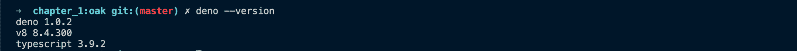

running command "deno --version" to see which version of deno is installed

厉害！至此，我们差不多完成了本教程的 10%。

让我们继续为我们的 Todo 应用程序创建后端 API。

### 设置项目

在你继续之前，这里是本教程的完整源代码: **[第一章:橡树](https://github.com/adeelibr/deno-playground/tree/master/chapter_1:oak)。**

让我们开始吧:

*   创建一个新文件夹，并将其命名为 **chapter_1:oak** (但你可以随意命名)
*   一旦你创建了一个文件夹，只需将`cd`放入你的新项目中。创建一个名为 **server.ts** 的文件，并在其中写入以下代码:

```
import { Application } from "https://deno.land/x/oak/mod.ts";

const app = new Application();
const port: number = 8080;

console.log('running on port ', port);
await app.listen({ port });
```

让我们运行这个文件。打开终端，在项目根文件夹中键入:

```
$ deno run --allow-net server.ts
```

我将谈论国旗的作用，但现在请耐心听我说？。

您应该得到这样的结果:

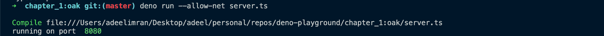

到目前为止，我们已经创建了一个监听端口 8080 的服务器。除了能够在端口 8080 上运行之外，它现在没做什么。

如果你以前使用过 JavaScript，你可能会注意到我们以不同的方式导入包。我们必须做这样的事情:

```
import { Application } from "https://deno.land/x/oak/mod.ts"; 
```

当你在你的终端上运行`deno run ---allow-net <file_name>`时，Deno 会查看你所有的导入，如果没有的话，会把它们安装到你的机器上。

第一次运行时，它会转到这个 URL `https://deno.land/x/oak/mod.ts`并安装`oak`包。Oak 基本上是一个用于编写 API 的 Deno 框架。它会把它放在你缓存的某个地方。

在下一行中，我们这样做:

```
const app = new Application(); 
```

这为我们的应用程序创建了一个新的实例，它将成为您在本教程中进一步学习的基础。您可以向应用程序实例添加路由，附加 API 日志之类的中间件，编写 404 not found，等等。

然后我们写道:

```
const port: number = 8080;
// const port = 8080; // => can also be written like this
```

两者是一样的，做的是一样的事情。唯一的区别是编写`const port: number = 8080`告诉 Typescript】变量是 number 类型的。

如果您要写`const port: number = "8080"`，这将在您的终端中抛出一个错误，因为端口是类型`number`。但是我们试图给它分配一个值为“8080”的`string`。

如果你想了解更多关于不同类型的类型(双关语)，请查阅这个非常简单和基本的指南关于 [**基本类型由 Typescript**](https://www.typescriptlang.org/docs/handbook/basic-types.html) 。只需快速浏览 2-3 分钟，然后返回此处。

最后我们有:

```
console.log('running on port ', port);
await app.listen({ port });
```

我们在这里简单地控制端口号，并告诉 Deno 监听端口，即 8080。

它现在没做什么。让我们让它做一些基本的事情，比如当你访问 http:localhost:8080 *时，在你的浏览器中显示一条 *JSON* 消息。*

将以下内容添加到您的 **server.ts** 文件中:

```
import { Application, Router } from "https://deno.land/x/oak/mod.ts";

const app = new Application();
const port: number = 8080;

const router = new Router();
router.get("/", ({ response }: { response: any }) => {
  response.body = {
    message: "hello world",
  };
});
app.use(router.routes());
app.use(router.allowedMethods());

console.log('running on port ', port);
await app.listen({ port });
```

这里添加的新内容是，我们现在也从第 1 行的`oak`中导入`Router`和`Application`。

接下来我们要做的是:

```
const router = new Router();
router.get("/", ({ response }: { response: any }) => {
  response.body = {
    message: "hello world",
  };
});
app.use(router.routes());
app.use(router.allowedMethods());
```

我们通过执行`const router = new Router()`来创建一个新的路由器实例，然后创建一个名为`/`的新路由，其类型为`get`。

让我们来分解一下:

```
router.get("/", ({ response }: { response: any }) => {
  response.body = {
    message: "hello world",
  };
});
```

`router.get`取 2 个参数。第一个是我们设置为`/`的路由，第二个是功能。函数本身接受一个作为对象的参数。我在这里做的是[析构](https://developer.mozilla.org/en-US/docs/Web/JavaScript/Reference/Operators/Destructuring_assignment)对象，只得到`response`。

接下来，我进行类型检查`response`，类似于我做`const port: number = 8080;`的方式。我所做的就是`{ response }: { response: any }`告诉这里的 TypeScript，我已经析构的`response`可以是`any`类型。

`any`帮助您避免在 TypeScript 中进行类型检查。你可以在这里了解更多信息。

然后我所做的就是获取那个`response`对象并设置`response.body.message = "hello world";`。

```
response.body = {
  message: "hello world",
};
```

最后但同样重要的是，我们只添加这两行:

```
app.use(router.routes());
app.use(router.allowedMethods());
```

这告诉 Deno 包括我们路由器的所有路由(目前我们只有一个),下一行告诉 Deno 允许这个路由的所有方法，如`GET, POST, PUT, DELETE`。

现在我们结束了。✅:让我们运行这个，看看我们有什么:

```
$ deno run --allow-net server.ts
```

`---allow-net`属性告诉 Deno 这个应用程序允许用户通过打开的端口访问它的内容。

现在打开你最喜欢的浏览器，进入`http://localhost:8080`。您将看到类似这样的内容:

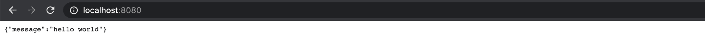

Result of running localhost:8080 on your browser

老实说，最困难的部分已经完成了。从概念上讲，我们有 60%的机会。


Master Yoda approves

太棒了。

在开始使用 Todo API 之前，还有最后一件事。让我们替换:

```
console.log('running on port ', port);
await app.listen({ port });
```

使用:

```
app.addEventListener("listen", ({ secure, hostname, port }) => {
  const protocol = secure ? "https://" : "http://";
  const url = `${protocol}${hostname ?? "localhost"}:${port}`;
  console.log(`Listening on: ${port}`);
});

await app.listen({ port });
```

我们之前的代码不是很准确，因为我们只是在控制台记录一条消息，然后等待应用程序开始监听端口。

在后来的版本中，我们等待应用程序在`port`开始监听，我们可以通过添加一个事件监听器到我们的`app`实例来监听，如下所示:`app*.addEventListener*("listen", ({ secure, hostname, port }) => {}`。

第一个参数是我们想要监听的事件(也就是`listen`？)然后第二个参数是我们销毁到`{ secure, hostname, port }`的对象。Secure 是布尔值，hostname 是字符串，port 是数字。

现在，当我们启动我们的应用程序时，它只会在应用程序实际开始监听端口时控制消息。

我们可以先行一步，让它变得更加丰富多彩。让我们在`server.ts`中的文件顶部添加一个新模块:

```
import { green, yellow } from "https://deno.land/std@0.53.0/fmt/colors.ts"; 
```

然后在我们的事件侦听器方法中，我们可以替换:

```
console.log(`Listening on: ${port}`); 
```

使用:

```
console.log(`${yellow("Listening on:")} ${green(url)}`);
```

现在当我们这样做时:

```
$ deno run --allow-net server.ts
```

它会在我们的控制台中显示:

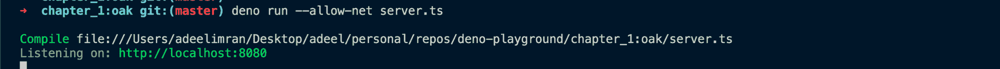

Cool, now we have a colourful console.

如果你在任何地方卡住了，你可以简单地去本教程的源代码 [**这里**](https://github.com/adeelibr/deno-playground/tree/master/chapter_1:oak) 。

接下来让我们创建 Todo API 的路由。

*   在根文件夹中创建一个名为`routes`的新文件夹，并在该文件夹中创建一个名为`todo.ts`的文件
*   同时在你的根文件夹中创建一个名为`controllers`的新文件夹，并在该文件夹中创建一个名为`todo.ts`的文件

先来摸一下`controllers/todo.ts`文件:

```
export default {
  getAllTodos: () => {},
  createTodo: async () => {},
  getTodoById: () => {},
  updateTodoById: async () => {},
  deleteTodoById: () => {},
};
```

我们只是在这里用一些空的命名函数导出一个对象(目前)。

接下来进入你的文件`routes/todo.ts`并输入:

```
import { Router } from "https://deno.land/x/oak/mod.ts";

const router = new Router();
// controller
import todoController from "../controllers/todo.ts";

router
  .get("/todos", todoController.getAllTodos)
  .post("/todos", todoController.createTodo)
  .get("/todos/:id", todoController.getTodoById)
  .put("/todos/:id", todoController.updateTodoById)
  .delete("/todos/:id", todoController.deleteTodoById);

export default router;
```

这对于使用过 Node 和 Express 的人来说可能很熟悉。

我们在这里所做的就是从`oak`导入`Route`，然后通过执行`const router = new Router();`来建立一个新的路由器实例。

接下来，我们通过执行以下操作来导入控制器:

```
import todoController from "../controllers/todo.ts"; 
```

在 Deno 中需要注意的一点是，每次我们在 Deno 项目中导入本地文件时，我们都必须提供文件扩展名。这是因为 Deno 不知道正在导入的文件是`.js`还是`.ts`文件。

接下来，我们只需根据 REST 约定设置所有路线:

```
router
  .get("/todos", todoController.getAllTodos)
  .post("/todos", todoController.createTodo)
  .get("/todos/:id", todoController.getTodoById)
  .put("/todos/:id", todoController.updateTodoById)
  .delete("/todos/:id", todoController.deleteTodoById);
```

上面的代码将转换成我们的 API 定义，如下所示:

| 类型 | API 路线 |  |  |  |
| --- | --- | --- | --- | --- |
| 得到 | /todos |  |  |  |
| 得到 | /todos/:id |  |  |  |
| 邮政 | /todos |  |  |  |
| 放 | /todos/:id |  |  |  |
| 删除 | /todos/:id |  |  |  |

最后，我们通过执行`*export* *default* router;`简单地导出我们的路由器。

我们已经完成了路由结构的创建。(现在，每条路线不做任何事情，因为我们的控制器是空的，我们将在稍后为它们添加功能。)

在我们开始为每个路由控制器添加功能之前，这是最后一块拼图。我们需要将这个`router`附加到我们的`app`实例上。

因此，转到`server.ts`文件并执行以下操作:

*   把这个加到最上面:

```
// routes
import todoRouter from "./routes/todo.ts";
```

*   删除这段代码:

```
const router = new Router();
router.get("/", ({ response }: { response: any }) => {
  response.body = {
    message: "hello world",
  };
});
app.use(router.routes());
app.use(router.allowedMethods());
```

*   替换为:

```
app.use(todoRouter.routes());
app.use(todoRouter.allowedMethods());
```

就这样，我们结束了。您的`server.ts`文件现在应该是这样的:

```
import { Application } from "https://deno.land/x/oak/mod.ts";
import { green, yellow } from "https://deno.land/std@0.53.0/fmt/colors.ts";

// routes
import todoRouter from "./routes/todo.ts";

const app = new Application();
const port: number = 8080;

app.use(todoRouter.routes());
app.use(todoRouter.allowedMethods());

app.addEventListener("listen", ({ secure, hostname, port }) => {
  const protocol = secure ? "https://" : "http://";
  const url = `${protocol}${hostname ?? "localhost"}:${port}`;
  console.log(
    `${yellow("Listening on:")} ${green(url)}`,
  );
});

await app.listen({ port }); 
```

如果你在遵循这一点的过程中遇到了困难，简单的看一下这个教程的源代码 **[这里](https://github.com/adeelibr/deno-playground/tree/master/chapter_1:oak)。**

太棒了，现在我们的路线暂时没有功能。因此，让我们在控制器中添加该功能。

但在此之前，我们必须创建 2 个以上的(小)文件。

*   在您的根文件夹中创建一个名为`interfaces`的新文件夹，并在该文件夹中创建一个名为`Todo.ts`的文件(确保 Todo 是大写的，因为如果您不这样做，它不会给出任何语法错误——这些只是惯例。)
*   同样在你的根文件夹中创建一个名为`stubs`的新文件夹，并在该文件夹中创建一个名为`todos.ts`的文件

让我们在`interfaces/Todo.ts`文件中创建一个接口。只需添加以下代码:

```
export default interface Todo {
  id: string,
  todo: string,
  isCompleted: boolean,
}
```

什么是接口？

TypeScript 的核心内容之一是检查值的形状。类似于`const port: number = 8080`或`{ response }: { response : any }`，我们也可以对一个对象进行类型检查。

在 TypeScript 中，接口扮演了命名这些类型的角色，并且是一种强大的方式来定义代码内的**契约以及项目外**代码的**契约。**

这是界面的另一个例子:

```
// We have an interface
interface LabeledValue {
  label: string;
}

// the arg passed to this function labeledObj is 
// of type LabeledValue (interface)
function printLabel(labeledObj: LabeledValue) {
  console.log(labeledObj.label);
}

let myObj = {label: "Size 10 Object"};
printLabel(myObj);
```

希望这个例子能让你对接口有更多的了解。如果您想了解更多详细信息，请点击查看[界面上的文档。](https://www.typescriptlang.org/docs/handbook/interfaces.html)

现在我们的接口已经准备好了，让我们模拟一些数据(因为对于本教程，我们没有实际的数据库)。

让我们首先在我们的`stubs/todos.ts`文件中创建一个 todos 的模拟列表。只需添加以下内容:

```
import { v4 } from "https://deno.land/std/uuid/mod.ts";
// interface
import Todo from '../interfaces/Todo.ts';

let todos: Todo[] = [
  {
    id: v4.generate(),
    todo: 'walk dog',
    isCompleted: true,
  },
  {
    id: v4.generate(),
    todo: 'eat food',
    isCompleted: false,
  },
];

export default todos;
```

*   这里需要注意两件事:我们添加了一个新包，并通过执行`*import* { v4 } *from* "https://deno.land/std/uuid/mod.ts";`来使用它的方法`v4`。然后每次我们使用`v4.generate()`时，它会创建一个新的随机字符串`id`。

    `id`不能是`number`，只能是`string`，因为在我们的`Todo`接口中我们已经将`id`定义为一个字符串。
*   这里需要重点关注的另一件事是`let *todos*: *Todo*[]=[]`。这基本上告诉 Deno 我们的 todos 数组是类型`Todo`(这太棒了，我们的编译器现在*自动地*知道我们数组中的每一项只能有`{**id**: *string*, **todo**: *string* & **isCompleted**: *boolean*}`，它不接受任何其他键)。

如果你想了解更多关于 TypeScript 中的`interfaces`的知识，请点击这里查看这个关于接口 **[的惊人的详细文档。](https://www.typescriptlang.org/docs/handbook/interfaces.html)**

太棒了。如果你已经走了这么远，给自己一点鼓励。大家干得好。


The Rock appreciates all the effort you are doing

## 让我们研究一下我们的控制器

在您的文件`controllers/todo.ts`中:

```
export default {
  getAllTodos: () => {},
  createTodo: async () => {},
  getTodoById: () => {},
  updateTodoById: async () => {},
  deleteTodoById: () => {},
}; 
```

让我们为`getAllTodos`编写控制器:

```
// stubs
import todos from "../stubs/todos.ts";

export default {
  /**
   * @description Get all todos
   * @route GET /todos
   */
  getAllTodos: ({ response }: { response: any }) => {
    response.status = 200;
    response.body = {
      success: true,
      data: todos,
    };
  },
  createTodo: async () => {},
  getTodoById: () => {},
  updateTodoById: async () => {},
  deleteTodoById: () => {},
}; 
```

在我开始这段代码之前，让我解释一下每个控制器都有一个参数——姑且称之为`context`。

所以我们可以将`*getAllTodos*: (context) => {}`解构为:

```
getAllTodos: ({ request, response, params }) => {}
```

由于我们使用了`typescript`,我们必须给所有这些变量添加类型检查:

```
getAllTodos: (
  { request, response, params }: { 
    request: any, 
    response: any, 
    params: { id: string },
  },
) => {}
```

所以我们给所有 3 个`{ request, response, params }`都增加了类型检查

*   `request`是用户发送给我们的信息(比如头和 JSON 数据)
*   `response`是我们在 API 响应中发送给用户的内容
*   `params`是我们在路由器路由中定义的，即:

```
.get("/todos/:id", ({ params}: { params: { id: string } }) => {})
```

所以`/todos/:id`中的`:id`就是 param。参数是从 URL 获取信息的一种方式。在这个例子中，我们知道我们有一个`/:id`。所以当用户试图访问这个 API(也就是`/todos/756` ) **756** 基本上就是 **:id** param。因为它在 URL 中，我们知道它的类型是`string`。

现在我们已经定义了基本定义，让我们回到 todos 控制器:

```
// stubs
import todos from "../stubs/todos.ts";

export default {
  /**
   * @description Get all todos
   * @route GET /todos
   */
  getAllTodos: ({ response }: { response: any }) => {
    response.status = 200;
    response.body = {
      success: true,
      data: todos,
    };
  },
  createTodo: async () => {},
  getTodoById: () => {},
  updateTodoById: async () => {},
  deleteTodoById: () => {},
}; 
```

对于`getAllTodos`，我们只需要`response`。如果你还记得的话，`response`是将数据发送回用户所需要的。

对于来自节点和 Express 后台的人来说，这里有一个很大的不同就是我们不需要`return`响应对象。Deno 会自动为我们做这件事。

我们所要做的就是设置`response.status`，在这个例子中就是`200`。

更多关于响应状态 [**这里**](https://developer.mozilla.org/en-US/docs/Web/HTTP/Status) **。**

我们设置的另一个东西是`response.body`，在这个例子中它是一个对象:

```
{
  success: true,
  data: todos
}
```

我将继续运行我的服务器:

```
$ deno run --allow-net server.ts
```

> **修订:**`---allow-net`属性告诉 Deno 这个应用程序允许用户通过打开的端口访问它的内容。

一旦您的服务器运行，您就可以访问`GET /todos` API。我用的是谷歌 Chrome 的扩展软件`postman`，可以从这里[下载](https://chrome.google.com/webstore/detail/postman/fhbjgbiflinjbdggehcddcbncdddomop//%40)。

您可以使用任何您喜欢的 rest 客户端。我喜欢用`postman`，因为我觉得它很简单。

在“邮递员”中，打开一个新标签页。将请求设置为类型`GET`，并在`URL`栏中输入`http://localhost:8080/todos`。点击`Send`，这就是你看到的:

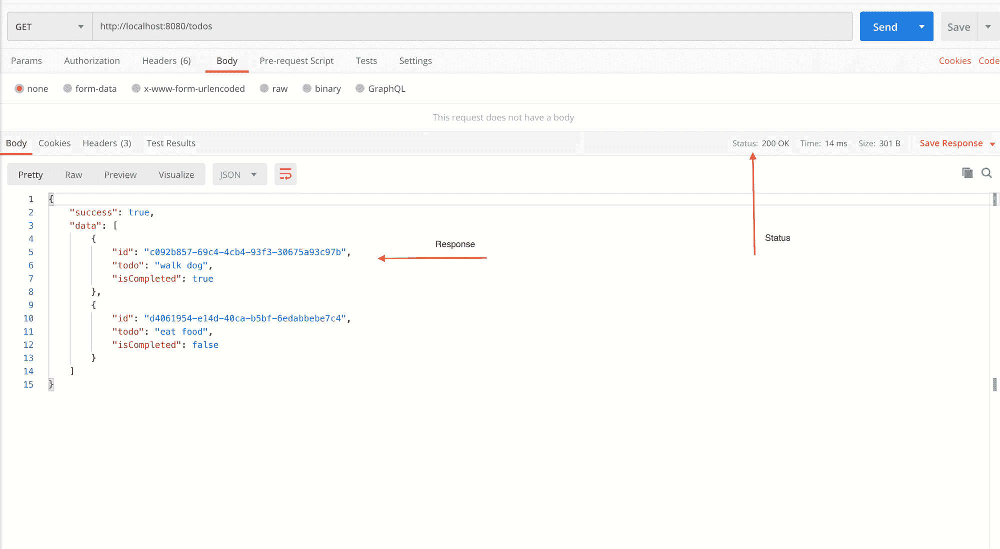

GET /todos API response

酷！1 个 API 完成，还有 4 个。？？

如果你觉得在任何地方都卡住了，就直接在源代码处偷偷摸摸的看 [**这里**](https://github.com/adeelibr/deno-playground/tree/master/chapter_1:oak) **。**

让我们继续下一个控制器:

```
import { v4 } from "https://deno.land/std/uuid/mod.ts";
// interfaces
import Todo from "../interfaces/Todo.ts";
// stubs
import todos from "../stubs/todos.ts";

export default {
  getAllTodos: () => {},
  /**
   * @description Add a new todo
   * @route POST /todos
   */
  createTodo: async (
    { request, response }: { request: any; response: any },
  ) => {
    const body = await request.body();
    if (!request.hasBody) {
      response.status = 400;
      response.body = {
        success: false,
        message: "No data provided",
      };
      return;
    }

    // if everything is fine then perform
    // operation and return todos with the
    // new data added.
    let newTodo: Todo = {
      id: v4.generate(),
      todo: body.value.todo,
      isCompleted: false,
    };
    let data = [...todos, newTodo];
    response.body = {
      success: true,
      data,
    };
  },
  getTodoById: () => {},
  updateTodoById: async () => {},
  deleteTodoById: () => {},
}; 
```

由于我们将向列表中添加一个新的 Todo，我已经在控制器文件中导入了 2 个模块。

*   `import { v4 } from `[https://deno.land/std/uuid/mod.ts](https://deno.land/std/uuid/mod.ts)`;`这将用于为正在创建的待办事项创建一个新的唯一待办事项
*   这将用于确保正在创建的新 todo 遵循相同的结构。

我们的`createTodo`控制器是`async`,意思是控制器内部使用了一些承诺。

让我们把它分成更小的部分:

```
const body = await request.body();
if (!request.hasBody) {
      response.status = 400;
      response.body = {
        success: false,
        message: "No data provided",
      };
      return;
}
```

首先，我们获取用户发送给我们的 JSON 主体的内容。然后我们使用名为`request.hasBody`的`oak's`内置方法来检查用户是否发送了任何内容。如果没有，那么我们可以在这个`if`街区内做`if (!request*.*hasBody) {}`。

我们将状态设置为`400` (400 表示用户做了他们不应该做的事情)，主体设置为`{success: false, message: "no data provided }`。然后我们简单地添加`return;`来确保下面的代码不再被执行。

接下来我们这样做:

```
// if everything is fine then perform
// operation and return todos with the
// new data added.
let newTodo: Todo = {
  id: v4.generate(),
  todo: body.value.todo,
  isCompleted: false,
};
let data = [...todos, newTodo];
response.body = {
  success: true,
  data,
};
```

我们通过这样做来创建一个新的 todo:

```
let newTodo: Todo = {
  id: v4.generate(),
  todo: body.value.todo,
  isCompleted: false,
};
```

`let newTodo: Todo = {}`确保`newTodo`遵循与其余 todos 相同的结构。然后我们使用`v4.generate()`分配一个随机 id，将 todo 设置为`body.value.todo`，将`isCompleted`设置为`false`。

这里要注意的是用户发送给我们的所有数据，我们可以从`oak`中的`body.value`访问。

接下来，我们执行以下操作:

```
let data = [...todos, newTodo];
response.body = {
  success: true,
  data,
};
```

将`newTodo`添加到我们当前的 todos 列表中，并简单地将 body 设置为`{success: true & data: data`。

我们已经用这个控制器完成了✅。

让我们重新启动服务器:

```
$ deno run --allow-net server.ts
```

在我的邮差里，我打开了一个新标签。将请求设置为`POST`类型，并在`URL`栏中输入`http://localhost:8080/todos`。然后点击`Send`，这就是你所看到的:

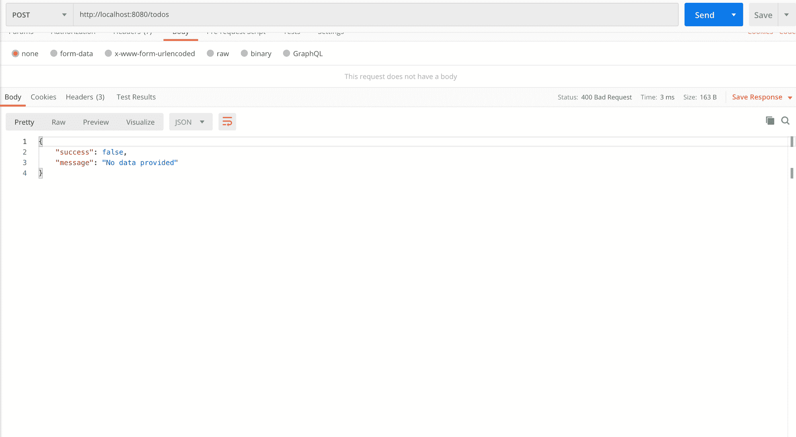

I send an empty request and get a 400 status error code along with an error message

然后，我在请求有效负载的主体中发送一些内容，并再次尝试:

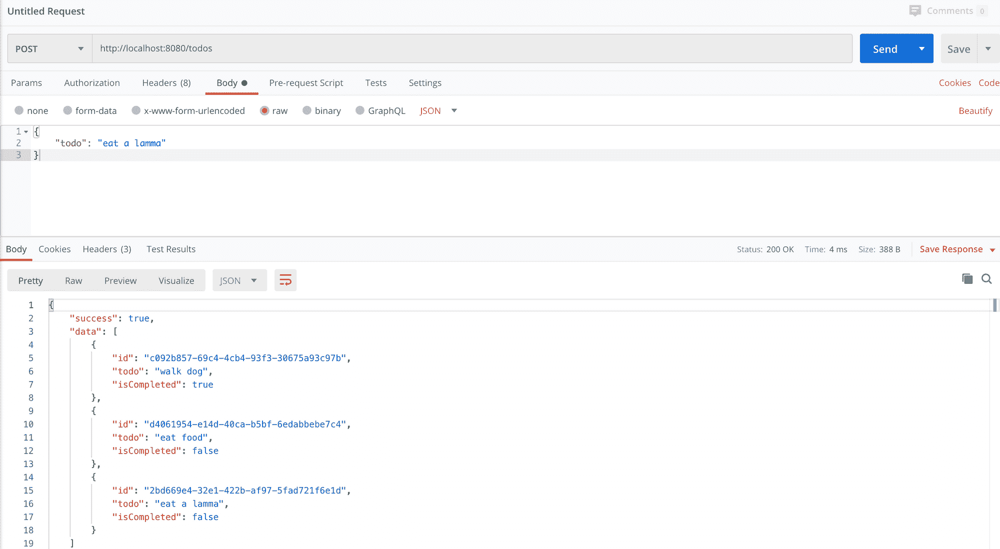

Awesome, POST /todos with body content { todo: "eat a lamma" } is success & we can see content appended to our current todo list 

酷，我们可以看到我们的 API 正在按预期工作。

两个 API 搞定了，还有三个。

我们快到了。大部分艰苦的工作已经完成。☺️ ?？？

让我们来看看第三个 API:

```
import { v4 } from "https://deno.land/std/uuid/mod.ts";
// interfaces
import Todo from "../interfaces/Todo.ts";
// stubs
import todos from "../stubs/todos.ts";

export default {
  getAllTodos: () => {},
  createTodo: async () => {},
  /**
   * @description Get todo by id
   * @route GET todos/:id
   */
  getTodoById: (
    { params, response }: { params: { id: string }; response: any },
  ) => {
    const todo: Todo | undefined = todos.find((t) => {
      return t.id === params.id;
    });
    if (!todo) {
      response.status = 404;
      response.body = {
        success: false,
        message: "No todo found",
      };
      return;
    }

    // If todo is found
    response.status = 200;
    response.body = {
      success: true,
      data: todo,
    };
  },
  updateTodoById: async () => {},
  deleteTodoById: () => {},
}; 
```

下面说说我们对于`GET todos/:id`的控制器。这将得到一个按 ID 的 todo。

让我们把它分解成更小的部分来讨论:

```
const todo: Todo | undefined = todos.find((t) => t.id === params.id);
if (!todo) {
  response.status = 404;
  response.body = {
    success: false,
    message: "No todo found",
  };
  return;
}
```

在第一部分中，我们设置了一个新的`const todo`，并将其类型设置为`Todo`或`undefined`。所以`todo`要么是一个具有`Todo`界面形状的对象，要么是`undefined`——不能是其他任何东西。

然后我们`*todos.find*((*t*)=> *t.id* === *params.id*);`使用 [Array.find()](https://developer.mozilla.org/en-US/docs/Web/JavaScript/Reference/Global_Objects/Array/find) 来查找具有`params.id`中提供的 id 的`todo`。如果匹配，我们得到形状为`todo`的`Todo`，否则得到`undefined`。

如果`todo`未定义，则意味着该`if`块将运行:

```
if (!todo) {
  response.status = 404;
  response.body = {
    success: false,
    message: "No todo found",
  };
  return;
}
```

这里我们简单地将状态设置为`404`，这意味着`not found`以及我们的标准故障响应或`{ status, message }`

很酷，对吧？？

接下来，我们简单地这样做:

```
// If todo is found
response.status = 200;
response.body = {
  success: true,
  data: todo,
};
```

设置一个`200`成功响应，并在我们的响应体中设置`success: true & data: todo`。

让我们在我们的邮递员中运行这个。

让我们重新启动服务器:

```
$ deno run --allow-net server.ts
```

在我的邮差里，我打开了一个新标签。将请求设置为`GET`类型，并在`URL`栏中输入`http://localhost:8080/todos/:id`，然后点击`Send`。

因为我们是随机生成 ID 的，首先通过点击获取所有待办事项 API 获取所有待办事项。然后从任何 todo 中获取一个 ID 来测试这个新创建的 API。
每次重新启动 Deno 应用程序时，都会生成新的 ID。

我们走吧:

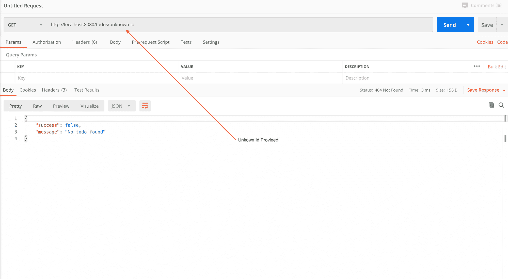

404 status, no record found case

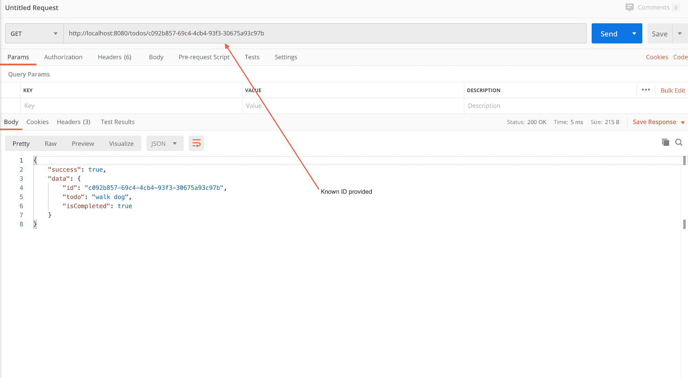

Provided it a known ID and it returned the todo associated with that ID along with status 200

如果你需要参考本教程的原始源代码，请点击 [**这里**](https://github.com/adeelibr/deno-playground/tree/master/chapter_1:oak) 。

很好，3 个 API 完成了，还有 2 个。

```
import { v4 } from "https://deno.land/std/uuid/mod.ts";
// interfaces
import Todo from "../interfaces/Todo.ts";
// stubs
import todos from "../stubs/todos.ts";

export default {
  getAllTodos: () => {},
  createTodo: async () => {},
  getTodoById: () => {},
  /**
   * @description Update todo by id
   * @route PUT todos/:id
   */
  updateTodoById: async (
    { params, request, response }: {
      params: { id: string },
      request: any,
      response: any,
    },
  ) => {
    const todo: Todo | undefined = todos.find((t) => t.id === params.id);
    if (!todo) {
      response.status = 404;
      response.body = {
        success: false,
        message: "No todo found",
      };
      return;
    }

    // if todo found then update todo
    const body = await request.body();
    const updatedData: { todo?: string; isCompleted?: boolean } = body.value;
    let newTodos = todos.map((t) => {
      return t.id === params.id ? { ...t, ...updatedData } : t;
    });
    response.status = 200;
    response.body = {
      success: true,
      data: newTodos,
    };
  },
  deleteTodoById: () => {},
}; 
```

下面说说我们对于`PUT todos/:id`的控制器。这将按 ID 更新 todo。

让我们把它分成更小的部分:

```
const todo: Todo | undefined = todos.find((t) => t.id === params.id);
if (!todo) {
  response.status = 404;
  response.body = {
    success: false,
    message: "No todo found",
  };
  return;
}
```

这也是我们对之前的控制器所做的完全相同的事情，所以我在这里就不赘述了。

专业提示:如果你想让这段代码成为一个通用代码块，然后在两个控制器中使用它，你可以这样做。

接下来我们这样做:

```
// if todo found then update todo
const body = await request.body();
const updatedData: { todo?: string; isCompleted?: boolean } = body.value;
let newTodos = todos.map((t) => {
  return t.id === params.id ? { ...t, ...updatedData } : t;
});
response.status = 200;
response.body = {
  success: true,
  data: newTodos,
};
```

我想在这里谈的这段代码如下:

```
const updatedData: { todo?: string; isCompleted?: boolean } = body.value;
let newTodos = todos.map((t) => {
  return t.id === params.id ? { ...t, ...updatedData } : t;
});
```

首先我们做`const updatedData = body.value`，然后给`updatedData`添加类型检查，如下所示:

```
updatedData: { todo?: string; isCompleted?: boolean }
```

这段代码告诉 TS，`updatedData`是一个可以`have/not have` *todo: string 的对象，*也可以`have/not have` *isCompleted: boolean。*

然后我们像这样简单地映射所有的待办事项:

```
let newTodos = todos.map((t) => {
  return t.id === params.id ? { ...t, ...updatedData } : t;
});
```

当`params.id`与`t.id`匹配时，我们简单地将所有内容添加到从用户处获得对象中。

我们也完成了这个 API。

让我们重新启动服务器:

```
$ deno run --allow-net server.ts
```

在 Postman 中打开一个新标签。将请求设置为`PUT`，并在`URL`栏中输入`http://localhost:8080/todos/:id`，然后点击`Send`:

因为我们是随机生成 ID 的，所以首先通过点击 get all todos API 获取所有 todos。然后从任何 todo 中获取一个 ID 来测试这个新创建的 API。
每次重新启动 Deno 应用程序时，都会生成新的 ID。

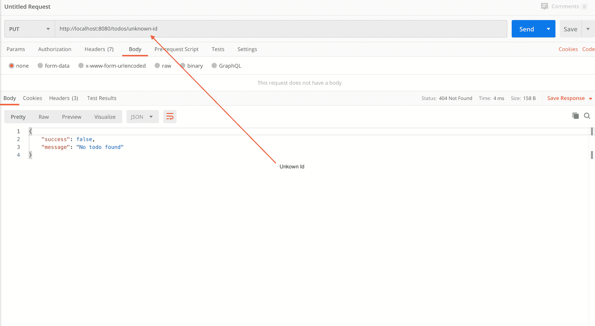

404 status returned and no todo found error message given

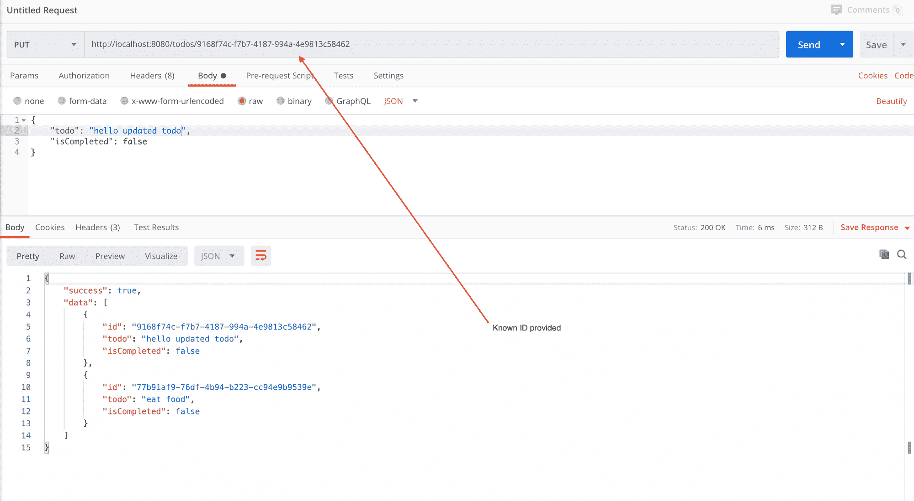

Provided a known ID, updated todo content in body. It returned the updated todo along with all the other todos

这太棒了——完成了四个 API，只剩一个了。

```
import { v4 } from "https://deno.land/std/uuid/mod.ts";
// interfaces
import Todo from "../interfaces/Todo.ts";
// stubs
import todos from "../stubs/todos.ts";

export default {
  getAllTodos: () => {},
  createTodo: async () => {},
  getTodoById: () => {},
  updateTodoById: async () => {},
  /**
   * @description Delete todo by id
   * @route DELETE todos/:id
   */
  deleteTodoById: (
    { params, response }: { params: { id: string }; response: any },
  ) => {
    const allTodos = todos.filter((t) => t.id !== params.id);

    // remove the todo w.r.t id and return
    // remaining todos
    response.status = 200;
    response.body = {
      success: true,
      data: allTodos,
    };
  },
}; 
```

让我们来谈谈我们的控制器`Delete todos/:id`这将删除一个 ID 的待办事项。

我们只需对所有待办事项运行过滤器:

```
const allTodos = todos.filter((t) => t.id !== params.id); 
```

移除与`params.id`匹配的`todo.id`并返回剩余的。

然后我们这样做:

```
// remove the todo w.r.t id and return
// remaining todos
response.status = 200;
response.body = {
  success: true,
  data: allTodos,
};
```

只需返回所有没有相同 todo.id 的 todo。

让我们重新启动服务器:

```
$ deno run --allow-net server.ts
```

在 Postman 中打开一个新标签。这次将请求设置为`DELETE`，并在`URL`栏中键入`http://localhost:8080/todos/:id`并点击`Send`。

因为我们是随机生成 ID 的，所以首先通过点击 get all todos API 获取所有 todos。然后从任何 todo 中获取一个 ID 来测试这个新创建的 API。
每次重新启动 Deno 应用程序时，都会生成新的 ID。

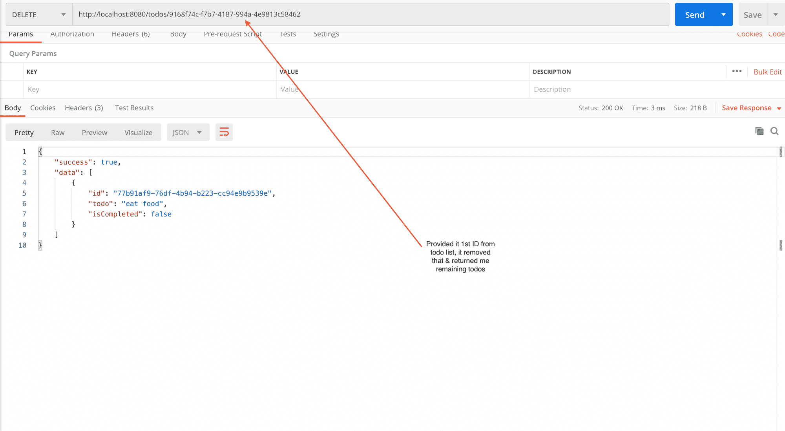

至此，我们完成了所有五个 API。


* * *

现在我们只剩下两件事:

*   添加一个未找到的路由中间件，以便当用户试图访问一个未知的路由时，它会给出一个错误。
*   添加一个 logger API 来控制从一个 API 端点返回数据所花费的响应时间。

## 为找不到的路由创建路由中间件

在您的根文件夹中创建一个名为`middlewares`的新文件夹。在该文件夹中创建一个名为`notFound.ts`的文件，并在该文件中添加以下代码:

```
export default ({ response }: { response: any }) => {
  response.status = 404;
  response.body = {
    success: false,
    message: "404 - Not found.",
  };
}; 
```

在这里，我们没有做任何新的事情——它非常类似于我们的控制器结构。只是返回一个状态`404`(这意味着没有找到)以及一个针对`{ success, message }`的 JSON 对象。

接下来进入您的`server.ts`文件并添加以下内容:

*   在顶部某处添加此导入:

```
// not found
import notFound from './middlewares/notFound.ts';
```

*   然后在你的`app.use(todoRouter.allowedMethods())`下面加上这样一行:

```
app.use(todoRouter.routes());
app.use(todoRouter.allowedMethods());

// 404 page
app.use(notFound);
```

执行的顺序在这里很重要:每次我们试图访问一个 API 端点时，它将首先匹配/检查来自我们的`todoRouter`的路由。如果没有找到，它将执行`app*.use*(notFound);`。

让我们看看这是否有效。

重新启动服务器:

```
$ deno run --allow-net server.ts
```

在 Postman 中打开一个新标签。将请求设置为`GET`，并在`URL`栏中输入`http://localhost:8080/something-unknown`，然后点击`Send`。


所以我们现在有了一个路由中间件，我们把它放在我们在`server.ts`中的路由的末端，作为`app*.use*(notFound);`。如果没有路由匹配这个中间件，它将执行并返回一个`404`状态码(这意味着没有找到)。然后我们像往常一样简单地发送一个响应消息`{success, message}`。

**专业提示:**我们已经决定`{success, message}`是我们在失败场景中返回的，而`{success, data}`是我们在成功场景中返回给用户的。因此，我们甚至可以将它们作为对象/形状的接口，添加到我们的项目中，以确保一致性和安全的类型检查。

好了，现在我们完成了一个中间件——让我们添加另一个中间件，用于在控制台中记录我们的 API。

**提醒:**如果你在任何地方卡住了，你可以在这里使用[源代码](https://github.com/adeelibr/deno-playground/tree/master/chapter_1:oak)。

## 在控制台中记录 API

在您的`middlewares`文件夹中创建一个名为`logger.ts`的新文件，并输入以下代码:

```
import {
  green,
  cyan,
  white,
  bgRed,
} from "https://deno.land/std@0.53.0/fmt/colors.ts";

const X_RESPONSE_TIME: string = "X-Response-Time";

export default {
  logger: async (
    { response, request }: { response: any, request: any },
    next: Function,
  ) => {
    await next();
    const responseTime = response.headers.get(X_RESPONSE_TIME);
    console.log(`${green(request.method)} ${cyan(request.url.pathname)}`);
    console.log(`${bgRed(white(String(responseTime)))}`);
  },
  responseTime: async (
    { response }: { response: any },
    next: Function,
  ) => {
    const start = Date.now();
    await next();
    const ms: number = Date.now() - start;
    response.headers.set(X_RESPONSE_TIME, `${ms}ms`)
  },
}; 
```

在您的`server.ts`文件中添加以下代码:

*   将此导入顶部的某个位置:

```
// logger
import logger from './middlewares/logger.ts';
```

*   就在您的`todoRouter`代码上方，添加这些中间件，如下所示:

```
// order of execution is important;
app.use(logger.logger);
app.use(logger.responseTime);

app.use(todoRouter.routes());
app.use(todoRouter.allowedMethods());
```

现在我们来讨论一下我们刚刚做了什么。

让我们来讨论一下`logger.ts`文件，并把它分成几个部分:

```
import {
  green,
  cyan,
  white,
  bgRed,
} from "https://deno.land/std@0.53.0/fmt/colors.ts";
```

我正在导入一些我想在 API 日志中使用的控制台颜色和控制台背景颜色。

这类似于我们在`server.ts`文件的`eventListener`中所做的。我们将在控制台中使用颜色来记录 API 请求。

接下来我设置了`const X_RESPONSE_TIME: string = "X-Response-Time";`。这是我们将在 API 请求进入服务器时注入的头。我把这个叫做``X_RESPONSE_TIME`` ，它的值是``X-Response-Time`` 。我稍后将演示它的用法。

接下来，我们简单地像这样导出一个对象:

```
export default {
	logger: async ({ response, request }, next) {}
	responseTime: async ({ response }, next) {}
};
```

然后我们简单地在我们的`server.ts`文件中使用它，就像这样:

```
// order of execution is important;
app.use(logger.logger);
app.use(logger.responseTime);
```

现在让我们讨论一下我们的日志中间件代码中发生了什么，并使用`next()`讨论它的执行风格:

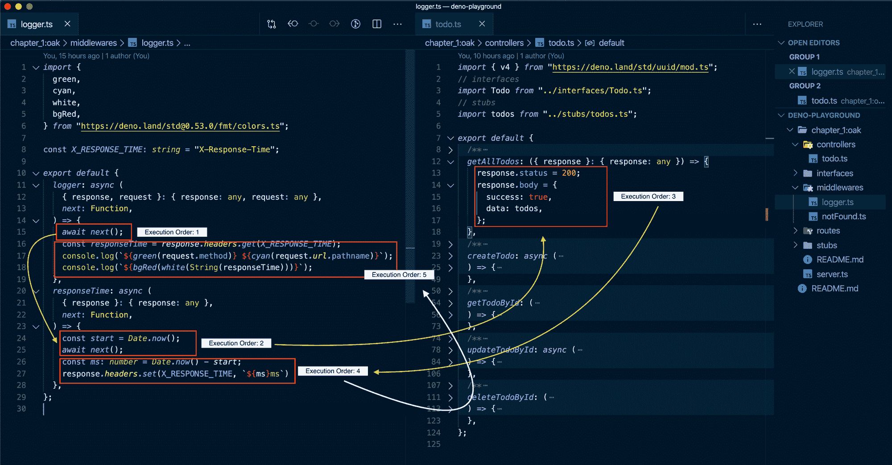

Execution of order of logging middleware when GET /todos API is called.

这里和我们之前的控制器的唯一区别是使用了`next()`功能。该功能帮助我们从一个控制器跳到另一个控制器，如下图所示。

所以在:

```
export default {
  logger: async (
    { response, request }: { response: any, request: any },
    next: Function,
  ) => {
    await next();
    const responseTime = response.headers.get(X_RESPONSE_TIME);
    console.log(`${green(request.method)} ${cyan(request.url.pathname)}`);
    console.log(`${bgRed(white(String(responseTime)))}`);
  },
  responseTime: async (
    { response }: { response: any },
    next: Function,
  ) => {
    const start = Date.now();
    await next();
    const ms: number = Date.now() - start;
    response.headers.set(X_RESPONSE_TIME, `${ms}ms`)
  },
};
```

请记住，这是我们在`server.ts`文件中的内容:

```
// order of execution is important;
app.use(logger.logger);
app.use(logger.responseTime);

app.use(todoRouter.routes());
app.use(todoRouter.allowedMethods());
```

执行顺序如下:

*   logger.logger 中间件
*   logger.responseTime 中间件
*   todosRouter 控制器(无论用户调用什么路径，出于解释的目的，我假设用户调用了`GET /todos` API 来获取所有 todo。)

因此，它将首先执行 logger.logger 中间件，这是:

```
logger: async (
    { response, request }: { response: any, request: any },
    next: Function,
  ) => {
    await next();
    const responseTime = response.headers.get(X_RESPONSE_TIME);
    console.log(`${green(request.method)} ${cyan(request.url.pathname)}`);
    console.log(`${bgRed(white(String(responseTime)))}`);
  },
```

它将进入这个函数，并在读取`await next()`时立即快速跳转到下一个中间件`responseTime`:


Sharing the image above again for revision.

在`responseTime`中，它只执行两行代码(请看上图中的执行顺序 2):

```
const start = Date.now();
await next();
```

在跳到`getAllTodos`控制器之前。一旦它进入`getAllTodos`内部，它将运行控制器内部的全部代码。

因为在那个控制器中我们没有使用`next()`，它将简单地把逻辑流返回到`responseTime`控制器。在那里，它将运行以下内容:

```
const ms: number = Date.now() - start;
response.headers.set(X_RESPONSE_TIME, `${ms}ms`)
```

现在来看看执行的顺序是`2, 3, 4`(看上面的图片)。

事情是这样的:

*   我们通过做`const` *`start`* `=` *`Date.now`*`();`来捕捉`ms`中的数据。然后我们立即调用`next()`,它转到`getAllTodos`控制器并运行整个代码。然后它回到`responseTime`控制器中。
*   然后我们通过做`const *ms*: *number* = *Date.now*()- *start*;` `ms`用那个时刻的日期减去那个`start`日期。这里它将返回一个数字，这个数字基本上是以毫秒为单位的差值，它将告诉我们 Deno 执行我们的`getAllTodos`控制器所花费的所有时间。

再次分享图像以供查看:


*   接下来，我们简单地在我们的`response`中设置标题，如下所示:

```
response.headers.set(X_RESPONSE_TIME, `${ms}ms`)
```

它只是将头值`X-Response-Time`设置为 Deno 执行我们的 API 所用的毫秒数。

*   然后，我们从执行顺序`4`返回到执行顺序`5`(看看上面的图片作为参考)。

这里我们只做:

```
const responseTime = response.headers.get(X_RESPONSE_TIME);
console.log(`${green(request.method)} ${cyan(request.url.pathname)}`);
console.log(`${bgRed(white(String(responseTime)))}`);
```

*   我们在``X-Response-Time`中得到我们经过的时间`
*   然后我们花时间简单地在控制台中用色彩来安慰它。

`request.method`告诉我们调用 API 的方法，即`GET, PUT etc`，而`request.url.pathname`将告诉 API 用户使用的路径，即`/todos`

让我们看看这是否有效。

重新启动服务器:

```
$ deno run --allow-net server.ts
```

在 Postman 中打开一个新标签。将请求设置为`GET`，输入`http://localhost:8080/todos`，然后点击`Send`。

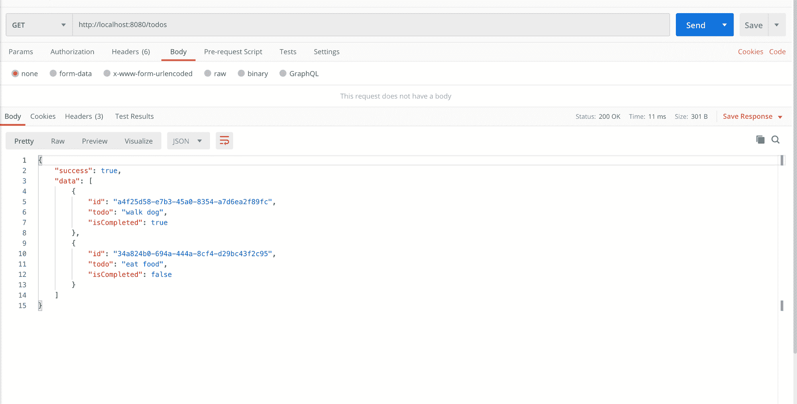

在《邮差》中点击了几次 API。然后，当您返回控制台时，您应该会看到类似这样的内容:

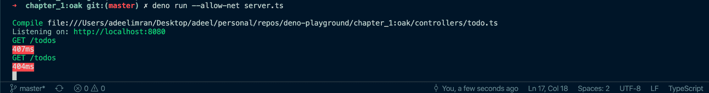

API being logged in our console

就这样，我们结束了。

如果你仍然觉得卡住了，可以在这里看看这个教程的完整源代码:[github . com/adeelibr/deno-playground/tree/master/chapter _ 1:oak](https://github.com/adeelibr/deno-playground/tree/master/chapter_1:oak)

我希望这篇文章对你有用，并能帮助你今天学到一些东西。

如果你喜欢，请在社交媒体上分享。如果你想就此展开讨论，请在 Twitter 上联系我。