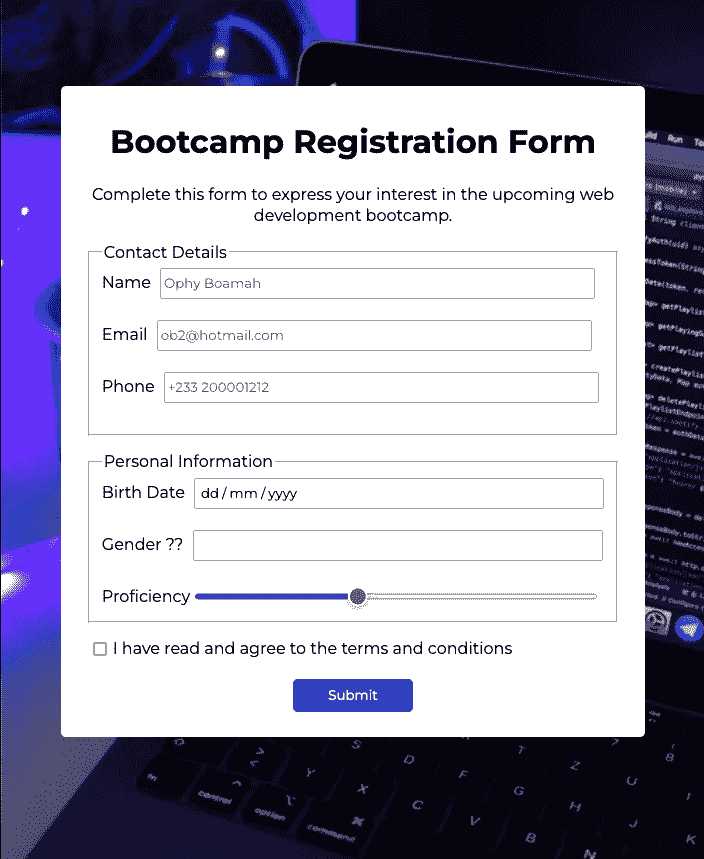
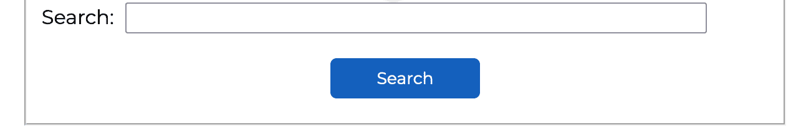
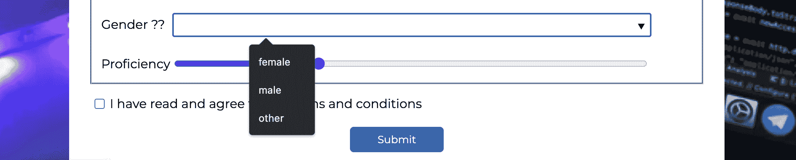
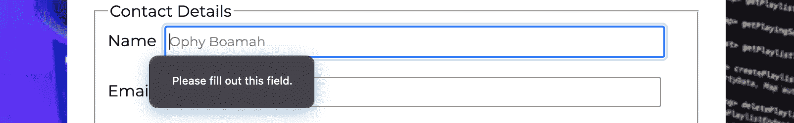
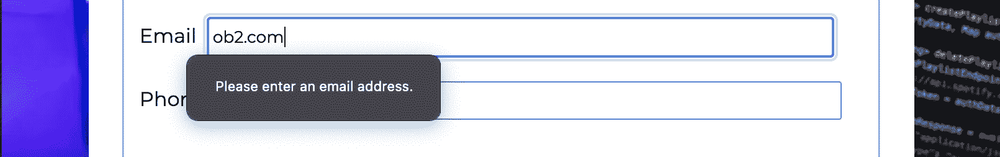
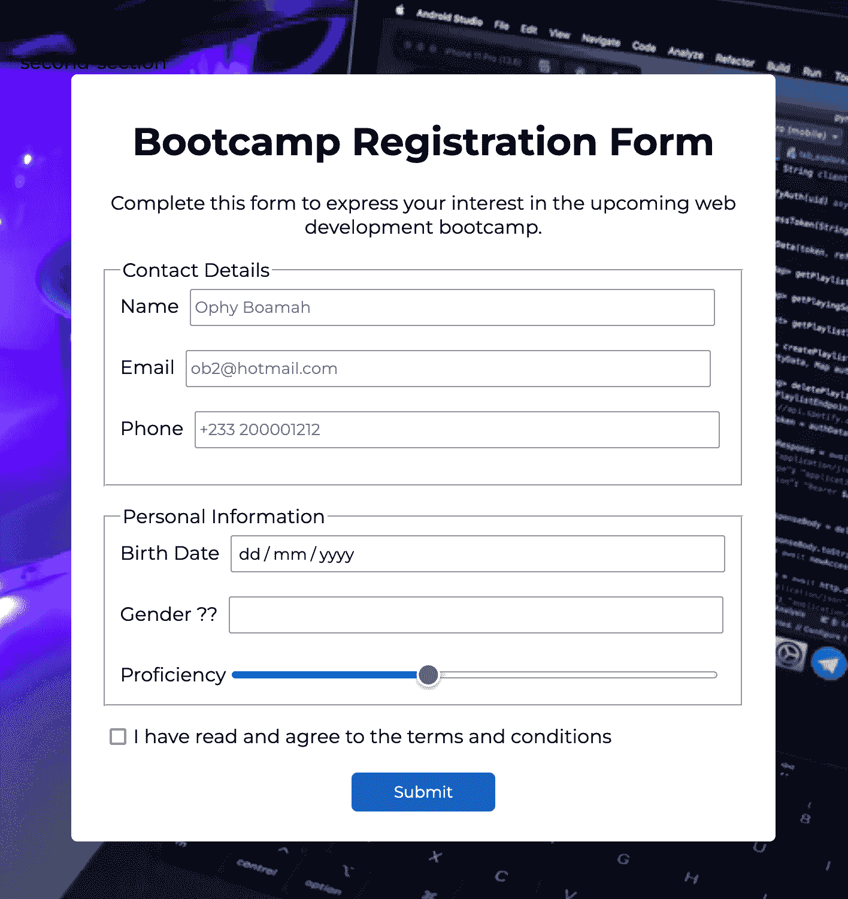

# 如何使用 HTML5 创建和验证现代 Web 表单

> 原文：<https://www.freecodecamp.org/news/create-and-validate-modern-web-forms-html5/>

HTML 表单由文本框、按钮、下拉框和其他选择部件组成。Web 开发人员使用这些元素在网站上接收用户信息。

如果你曾经在谷歌上搜索过，注册过或者登录过一个网站，支付过或者回复过一个问卷，那么你就和一个网络表单有过互动。

为 web 构建时，必须确保所有用户都可以访问您的应用程序。这包括那些需要屏幕阅读器等辅助技术来浏览网站的人。

HTML5 具有语义表单元素，这是实现这一点的最佳方式。令人欣慰的是，好处不仅仅是可及性:

1.  它们使开发变得更容易，因为它们带有一些免费的功能，并且通常更容易理解。
2.  在移动设备上更好——语义 HTML 更容易响应不同的屏幕尺寸。它文件通常比非语义的意大利面条式代码要轻。
3.  对 SEO 有好处——你的网页将有更高的机会被客户找到，因为搜索引擎优先搜索标题、链接等中的关键字，而不是非语义的关键字

在本文中，我们将讨论 HTML5 表单中的最新元素和属性，您可以使用它们来构建和验证您在这里看到的简单而现代的表单:



这里可以看到源代码[。](https://codepen.io/ophyboamah/pen/wvmMagP)

# 如何使用新的 HTML5 表单元素

多年来，web 表单经历了各种变化，直到 HTML5 的出现。

随着新的和改进的 HTML5 元素及其属性的引入，任何人都可以学习构建美观、实用和可访问的表单。

在众多的表单元素中，一些最重要的元素包括:

## 表单大纲–如何使用字段集、图例和标签标记

您可以使用`<fieldset>`标签，通过在相关元素(控件和标签)周围画一个方框来对它们进行分组。它通常包含图例、标签和输入等元素。

使用`<legend>`标签来定义字段集元素的标题。这种方式也可以用作元素分组的方式。并且`<label>`标签给出了几个元素的定义。

您应该始终将`<label>`标签链接到`<input>`元素，因为:

1.  用户可以通过单击标签来关注输入
2.  当输入被聚焦时，屏幕阅读器读出标签来帮助不同能力的用户。
3.  对于复选框，尤其是在移动设备上，不能轻易点击较小项目的用户可以点击标签来打开复选框。

```
<fieldset class="first-section">
      <legend>Contact Details</legend>
      <label for="name">Name</label>
      <input type="text" id="name" name="name" autofocus placeholder="Ophy Boamah" autocomplete="on" required> <br><br>
      <label for="email">Email</label>
      <input type="email" id="email" placeholder="ob2@hotmail.com"> <br><br>
      <label for="tel">Phone</label>
      <input type="tel" id="tel" placeholder="+233 200001212"> <br><br>
</fieldset> 
```

Fieldset, Legend, and Label tags code example

在上面的代码中，我们使用 fieldset 标记来创建一个标记为“first-section”的初始组。legend 标记包含为元素组提供描述的文本。最后，label 标签标识每个输入及其用途。


Fieldset, Legend, and Label

## 如何使用占位符文本

您在输入栏中使用占位符文本，只有当输入栏被聚焦或填充时，占位符文本才会被移除。

通常，与输入标签和值的颜色相比，占位符文本的字体颜色较浅。您通常会使用占位符让用户进一步了解在表单中要填写的内容。这里有一个例子:

```
<input type="email" id="email" placeholder="ob2@hotmail.com"> 
```

Email input placeholder code example

type="email "属性确保输入不接受除 email 之外的任何其他值。id 属性将输入元素链接到它的标签，以允许关联和聚焦。“ob2@hotmail.com”向用户暗示了输入所期望的值的类型。


Email input placeholder

## 如何使用焦点

最初，用户必须在表单的第一个输入框中单击，才能开始填写。但是 HTML5 让 web 开发者把重点放在用户应该首先交互的输入上。

Autofocus 是一个属性，您可以在`<input>`或`<textarea>`元素上添加该属性。这也是一个重要的辅助功能，因为它让使用屏幕阅读器的人的生活变得更容易。

以下是如何使用自动对焦的示例:

```
<input autofocus type="text" id="name" name="name" autofocus placeholder="Ophy Boamah" required> 
```

Input focus code example

如上面的代码所示，您可以将 autofocus 属性放在输入标记中的任何位置。它通常被其他通用属性跟随或包围，如名称、id 等。


Input focus

# 如何使用新的 HTML5 输入

可以肯定地说,`<input>`是 web 表单最流行的属性。实际上，表单中的所有内容都是输入，因为它需要用户提供某种形式的数据。您最常用这个属性来接收文本、数字和电子邮件等等。

使用输入中 type 属性的值来区分各种元素。下面是三个新的有用的例子:

## 如何使用搜索元素

当用户需要搜索某些内容时，可以使用 search 元素让他们输入查询。它非常类似于文本输入。

它们的主要区别在于样式，因为与给文本输入一个类相比，使用类型 input[type=search]访问输入更方便。

```
<input type="search" id="email" placeholder="ob2@hotmail.com"> 
```

Search input code example

在 Chrome 等浏览器上，一旦你开始输入，一个“x”图标就会出现在输入框的末尾。单击此图标会清除输入的值，使用键盘上的 esc 键也会得到相同的结果。



Search input

## 如何使用隐藏元素

Web 开发人员使用隐藏元素来隐藏输入的内容，使与表单交互的用户无法访问这些内容。这种输入类型并不完全呈现在视觉上。用户看不到它的内容，但是在提交表单时，它被发送到服务器。

```
<input type="hidden" id="indexNumber" name="indexNumber" value="00202010">
```

Hidden input code example

## 如何使用进度元素

这是一个可以用来表示任务进度的元素。max 属性用于指示进度条的总值。value 属性主要通过在条形图中着色来显示任务完成的百分比。id 属性一如既往地用于链接到标签。

```
 <label for="days">Proficiency:</label>
<progress id="days" value="27" max="100"> 27% </progress> 
```

Progress bar code example

与具有类型范围的输入不同，progress 元素不允许用户进行更改。相反，它以只读方式进行通信。


Progress bar

## 如何使用数据列表元素

数据列表元素指定元素的预定义选项列表。它通常用于为项目列表提供自动完成功能。这是因为一旦您开始键入，您会得到可用选项列表的预览。

如下所示，为了将一个`<input>`标签与一个`<datalist>`链接起来，您必须确保‘list’属性的值与 datalist 上的‘id’相同。

```
<label for="gender">Gender ??</label>
      <input list="genders" name="gender" id="gender">
      <datalist id="genders">
        <option value="female">
        <option value="male">
        <option value="other">
      </datalist> 
```

Data list code example

该输入在不同的浏览器上呈现不同:

Chrome :当你将鼠标悬停在输入上时，输入的末尾会添加一个下拉图标。当您在输入中或标签上单击时，各种选项的值也会显示在下拉列表中。



Firefox :为了看到选项值，用户必须输入文本的一部分，选项将以自动完成的方式显示。


Data list

# 什么是表单验证？

构建表单是这个过程的第一步。作为开发人员，您必须始终确保您的用户提供准确的响应。这是必要的，因为你不应该假设用户会做正确的事情。

这就是表单验证的概念——防止错误或在错误发生时立即捕捉它们。

## 表单验证的类型

有两种流行的验证 web 表单的方式。它们是:

### 客户端验证

客户端验证可以链接到验证的“防止错误”部分。它涉及到一些策略，比如在提交表单之前在浏览器中做一些检查。

客户端验证的方法包括添加错误弹出窗口，以及在用户填写正确信息之前不让其继续操作。

### 服务器端验证

服务器端验证可以链接到验证的“捕捉错误”部分。

与客户端不同，当用户还在表单上时，这种类型不检查错误。相反，它会检查表单数据何时发送到您的 web 服务器。

在这种情况下，您将显示一个错误页面作为反馈，以表明存在错误。

# 流行的客户端验证方法

## 基本客户端验证

基本客户端验证的一些示例包括“此字段是必填的”、“输入有效的电子邮件”和“密码长度至少应为 8 个字符”。

这些只是当用户没有以表单期望的格式输入数据时，向用户抛出的许多错误消息中的一部分。

这些属性中最常用的包括:



1.  **必填**:指定提交表单前需要填写的输入字段。
2.  **Minlength 和 Maxlength** :指定字符串预期的最小和最大长度。
3.  **最小值和最大值**:指定数字的最小值和最大值。



4. **Type** :指定具体输入字段需要什么样的数据，例如日期、数字、姓名、电子邮件等等。

## 约束验证 API

顾名思义，[约束验证 API](https://developer.mozilla.org/en-US/docs/Web/API/Constraint_validation) 是一个为 Web 表单提供验证特性的 Web API。您可以使用它的新属性和方法来修改表单输入的有效性。

开发人员现在可以轻松地给出自定义功能和错误消息。基本上，这个 API 允许您检测错误，并根据错误类型显示自定义消息。

您可以使用 setCustomValidity 方法和 validationMessage 属性创建自定义验证和错误消息。

## 其他需要了解的有用元素

| 元素 | 描述 |
| --- | --- |
| `autocomplete` | 您可以使用自动完成功能在给定的输入中调用最近键入的值。除了敏感数据和一次性 pin，它还是一个节省时间的功能。您可以打开它的值，为特定的输入字段推荐它，反之亦然。 |
| `autocorrect` | 使用这些属性来控制某些移动设备(即在 iPads 和 iPhones 上运行的 Safari 版本)上的自动更正和大写功能 |
| `spellcheck` | 您可以将此属性设置为 true，以指示用户应该检查某些文本的拼写，尤其是在输入中键入的字符串。由此产生的唯一问题是，并不是所有在输入中键入的文本都应该像实际单词一样有意义。 |

# 把所有的放在一起

下面是将您在本文中学到的各种元素放在一起的结果:



下面是代码:

```
<!DOCTYPE html>
<html lang="en">
<head>
  <meta charset="UTF-8">
  <meta http-equiv="X-UA-Compatible" content="IE=edge">
  <meta name="viewport" content="width=device-width, initial-scale=1.0">
  <title>Bootcamp Registration</title>
  <link rel="preconnect" href="https://fonts.googleapis.com">
<link rel="preconnect" href="https://fonts.googleapis.com">
<link rel="preconnect" href="https://fonts.gstatic.com" crossorigin>
<link href="https://fonts.googleapis.com/css2?family=Montserrat:wght@400;600;700&display=swap" rel="stylesheet"> 
</head>
<body>
  <div class="form">
    <h1>Bootcamp Registration Form</h1>
  <p>Complete this form to express your interest in the upcoming web development bootcamp.</p>
  <form>
<!-- Contact Details -->
    <fieldset class="first-section">
      <legend>Contact Details</legend>
      <label for="name">Name</label>
      <input autofocus type="text" id="name" name="name" autofocus placeholder="Ophy Boamah" autocomplete="on" required> <br><br>
      <label for="email">Email</label>
      <input type="email" id="email" placeholder="ob2@hotmail.com"> <br><br>
      <label for="tel">Phone</label>
      <input type="tel" id="tel" placeholder="+233 200001212"> <br><br>
    </fieldset>
    <!-- Personal Information -->
    <fieldset class="second-section">
      <legend>Personal Information</legend>
      <label for="dob">Birth Date</label>
      <input type="date" id="dob"> <br><br>
        <label for="gender">Gender ??</label>
      <input list="genders" name="gender" id="gender">
      <datalist id="genders">
        <option value="female">
        <option value="male">
        <option value="other">
      </datalist><br><br>
     <div class="proficiency">
        <label for="profeciency">Proficiency</label>
      <input type="range" value="4" max="10" id="profeciency" name="profeciency">
     </div>

    </fieldset>
     <!-- Preferred Language -->
     <div class="terms">
        <input type="checkbox" id="scales" name="scales" class="checkbox">
      <label for="scales">I have read and agree to the terms and conditions</label>
     </div>
    <button>Submit</button>
  </form>
  </div>
</body>
</html>
```

HTML Code

```
* {
  font-family: 'Montserrat', sans-serif;
}

body {
  height: 80vh;
  margin-top: 5rem;
  background-image: url("https://images.unsplash.com/photo-1595675024853-0f3ec9098ac7?ixlib=rb-1.2.1&ixid=MnwxMjA3fDB8MHxzZWFyY2h8Nnx8Y29kaW5nJTIwYm9vdGNhbXB8ZW58MHx8MHx8&auto=format&fit=crop&w=500&q=60");
  background-repeat: no-repeat;
  background-position: center;
  background-size: cover;
  padding: 10px;
}

.form {
  background-color: #fff;
  border-radius: 5px;
  padding: 15px 25px;
  width: 80%;
  margin: 0 auto;
}

.checkbox {
  width: 20px !important;
}

.first-section input {
  width: 85%;
  height: 25px;
  margin-left: 5px;
}

.second-section input{
  width: 80%;
  height: 25px;
  margin-left: 5px;
}

.form h1, p {
  text-align: center;
}
button {
  border: none;
  color: white;
  background: #1560BD;
  padding: 8px 25px;
  border-radius: 5px;
  display: block;
  margin: 20px auto 10px auto;
  width: 120px;
}

.second-section {
  margin-top: 15px;
}

.proficiency {
  display: flex;
  align-items: center;
}

.terms {
  margin-top: 15px;
  display: flex;
  align-items: center;
} 
```

CSS Code

## 结论

新的 HTML5 表单元素和属性使访问某些基本功能变得容易。尤其是那些只有用 CSS 或许多行 JavaScript 才能实现的功能。

现在只用 HTML 创建既现代又实用的 web 表单比以往任何时候都容易。最重要的是，它让 web 开发人员安心。因为您知道您可以轻松地创建跨各种浏览器的统一表单。

感谢阅读👋🏾。我希望这能对你有所帮助。