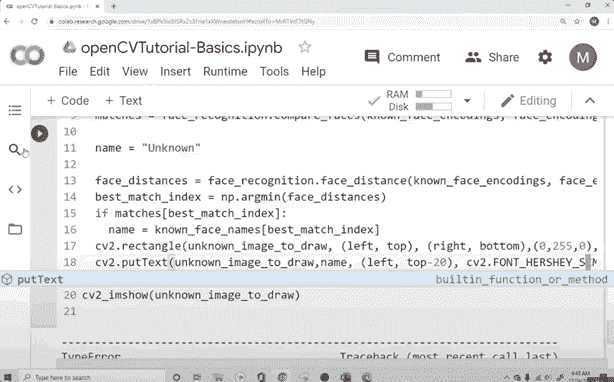

# Python 和 OpenCV 课程–在云中创建计算机视觉应用

> 原文：<https://www.freecodecamp.org/news/create-computer-vision-apps-in-the-cloud-with-opencv-and-python/>

OpenCV 是一个主要针对实时计算机视觉的编程函数库。

我们刚刚在 freeCodeCamp.org YouTube 频道上发布了一门课程，将教你如何在 Python 中使用 OpenCV。

米斯巴·穆罕默德创建了这个球场。他在机器学习方面有丰富的经验，如果你已经了解一些 Python，他会让学习变得简单。

您将在 Google Colab 上学习如何在云中创建计算机视觉应用程序。你会用到 AI 和机器学习。

以下是该视频中的几个部分:

*   第 1 课:更改图像中的颜色配置文件
*   图像属性
*   第 2 课:边缘检测
*   侵蚀和膨胀
*   第 3 课:图像处理-去噪
*   第 4 课:在图像上绘制形状和书写文本
*   中级练习 1:颜色检测
*   中级练习 2:人脸检测
*   中级练习 3:形状检测
*   项目 1:跟踪球
*   项目 2:人脸识别

观看以下全部课程或在 freeCodeCamp.org YouTube 频道观看[(3 小时观看)。](https://youtu.be/iXNsAYOTzgM)

[https://www.youtube.com/embed/iXNsAYOTzgM?feature=oembed](https://www.youtube.com/embed/iXNsAYOTzgM?feature=oembed)