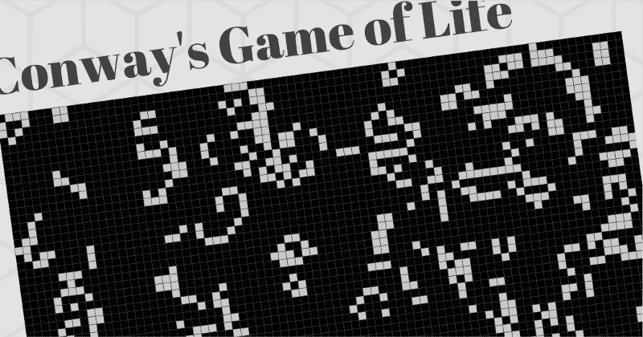
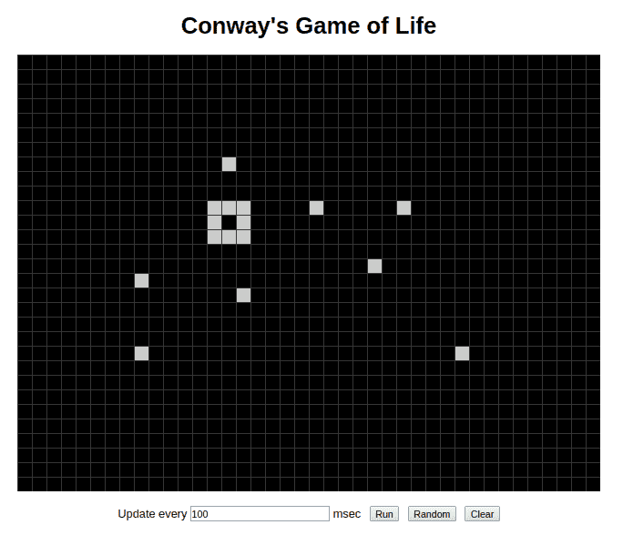
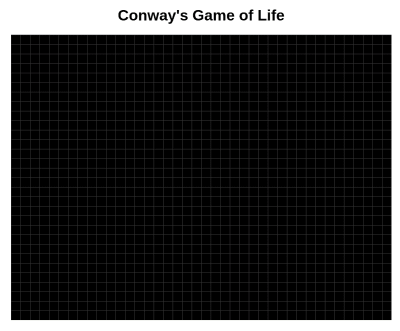
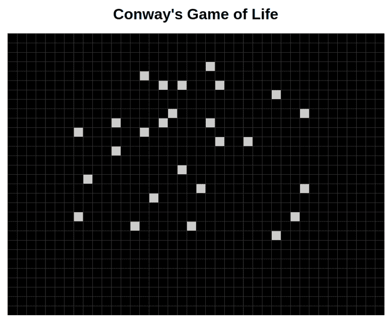
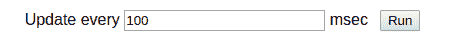
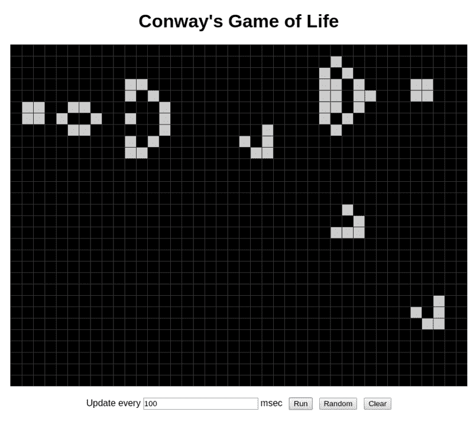

# 如何在一小时内用 React 编写“生活游戏”

> 原文：<https://www.freecodecamp.org/news/create-gameoflife-with-react-in-one-hour-8e686a410174/>

作者查尔斯·李

# 如何在一小时内用 React 编写“生活游戏”



最近我看了一个著名的视频，它在不到 5 分钟的时间里创造了一个贪吃蛇游戏(在 Youtube 上)。做这种类型的快速编码看起来很有趣，所以我决定自己做一个。

小时候开始学编程的时候，学过一个游戏叫“[人生游戏](https://en.wikipedia.org/wiki/Conway's_Game_of_Life)”这是细胞自动化以及简单规则如何导致复杂模式的一个很好的例子。想象某种生命形式生活在一个世界里。在每个回合，他们都遵循一些简单的规则来决定一个生命是生是死。

[**康威的人生游戏——维基百科**](https://en.wikipedia.org/wiki/Conway%27s_Game_of_Life)
[*自从出版以来，康威的人生游戏吸引了很多人的兴趣，因为……*en.wikipedia.org](https://en.wikipedia.org/wiki/Conway%27s_Game_of_Life)

所以我决定给这个游戏编码。由于它不涉及太多的图形——只有一个网格和一些块——我决定 React 将是一个不错的选择，它可以用作 React 的快速教程。开始吧！

### 反应设置

首先，我们需要设置 React。惊人的`[create-react-app](https://github.com/facebook/create-react-app)`工具对于启动一个新的 React 项目非常方便:

```
$ npm install -g create-react-app$ create-react-app react-gameoflife
```

不到一分钟，`react-gameoflife`就准备好了。现在我们需要做的就是启动它:

```
$ cd react-gameoflife$ npm start
```

这将在 [http://localhost:3000](http://localhost:3000) 启动一个 dev 服务器，并在这个地址打开一个浏览器窗口。

### 设计选择

我们想要制作的最终屏幕如下所示:



Conway’s Game of Life

它只是一个带有网格和一些白色瓷砖(“细胞”)的板，可以通过点击网格来放置或移除。“运行”按钮将在给定的时间间隔开始迭代。

看起来很简单，是吧？让我们考虑一下如何在 React 中做到这一点。首先，React 是**不是**一个图形框架，所以我们不会考虑用 canvas。(如果你对使用画布感兴趣，可以看看 [PIXI](http://www.pixijs.com/) 或者[移相器](https://phaser.io/)。)

棋盘可以是一个组件，可以用一个`<d` iv >渲染。网格怎么样？画网格 `with` < div > s 是不可行的，而且既然网格是静态的，也是没必要的。事实上，我们 c `an use CSS3 lin`耳朵-梯度为网格。

关于单元格，我们可以使用`<d` iv >来绘制每个单元格。我们将使它成为一个单独的组件。该组件将 ac `c` ep `t` s x，y 作为输入，以便电路板可以指定其位置。

### 第一步:董事会

让我们先创建电路板。在`src`目录下创建一个名为`Game.js`的文件，并输入以下代码:

```
import React from 'react';import './Game.css';
```

```
const CELL_SIZE = 20;const WIDTH = 800;const HEIGHT = 600;
```

```
class Game extends React.Component {  render() {    return (      <div>        <div className="Board"          style={{ width: WIDTH, height: HEIGHT }}>        </div>      </div>    );  }}
```

```
export default Game;
```

我们还需要`Game.css`文件来定义样式:

```
.Board {  position: relative;  margin: 0 auto;  background-color: #000;}
```

更新`App.js`来导入我们的`Game.js`并将`Game`组件放在屏幕上。现在我们可以看到一个全黑的游戏板。

我们的下一步是创建网格。仅用一行`linear-gradient`就可以创建网格(将此添加到`Game.css`):

```
background-image:    linear-gradient(#333 1px, transparent 1px),    linear-gradient(90deg, #333 1px, transparent 1px);
```

事实上，我们还需要指定`background-size`样式来使它工作。但是由于`CELL_SIZE`常量是在`Game.js`中定义的，我们将直接用 inline style 指定背景大小。更改`Game.js`中的`style`线:

```
<div className="Board"  style={{ width: WIDTH, height: HEIGHT,    backgroundSize: `${CELL_SIZE}px ${CELL_SIZE}px`}}></div>
```

刷新浏览器，你会看到一个漂亮的网格。



Grid, made with CSS3 gradient.

### 创建单元格

下一步是允许用户与电路板交互来创建单元格。我们将使用 2D 数组`this.board`来保存棋盘状态，使用单元格列表`this.state.cells`来保存单元格的位置。一旦板状态被更新，一个方法`this.makeCells()`将被调用来从板状态生成单元列表。

将这些方法添加到`Game`类中:

```
class Game extends React.Component {  constructor() {    super();    this.rows = HEIGHT / CELL_SIZE;    this.cols = WIDTH / CELL_SIZE;    this.board = this.makeEmptyBoard();  }
```

```
 state = {    cells: [],  }
```

```
 // Create an empty board  makeEmptyBoard() {    let board = [];    for (let y = 0; y < this.rows; y++) {      board[y] = [];      for (let x = 0; x < this.cols; x++) {        board[y][x] = false;      }    }    return board;  }
```

```
 // Create cells from this.board  makeCells() {    let cells = [];    for (let y = 0; y < this.rows; y++) {      for (let x = 0; x < this.cols; x++) {        if (this.board[y][x]) {          cells.push({ x, y });        }      }    }    return cells;  }  ...}
```

接下来，我们将允许用户单击电路板来放置或移除单元格。在 React 中，`<d` iv >可以附加`th an o` nClick 事件处理程序，该处理程序可以通过 Click 事件检索点击坐标。然而，坐标是相对于客户区(浏览器的可视区域)的，所以我们需要一些额外的代码来将其转换为相对于电路板的坐标。

向`render()`方法添加事件处理程序。这里我们还保存了 board 元素的引用，以便以后检索电路板的位置。

```
render() {  return (    <div>      <div className="Board"        style={{ width: WIDTH, height: HEIGHT,          backgroundSize: `${CELL_SIZE}px ${CELL_SIZE}px`}}        onClick={this.handleClick}        ref={(n) => { this.boardRef = n; }}>      </div>    </div>  );}
```

这里还有一些方法。这里`getElementOffset()`将计算板元素的位置。`handleClick()`将检索点击位置，然后将其转换为相对位置，并计算被点击的单元格的列和行。则单元状态被还原。

```
class Game extends React.Component {  ...  getElementOffset() {    const rect = this.boardRef.getBoundingClientRect();    const doc = document.documentElement;
```

```
 return {      x: (rect.left + window.pageXOffset) - doc.clientLeft,      y: (rect.top + window.pageYOffset) - doc.clientTop,    };  }
```

```
 handleClick = (event) => {    const elemOffset = this.getElementOffset();    const offsetX = event.clientX - elemOffset.x;    const offsetY = event.clientY - elemOffset.y;        const x = Math.floor(offsetX / CELL_SIZE);    const y = Math.floor(offsetY / CELL_SIZE);
```

```
 if (x >= 0 && x <= this.cols && y >= 0 && y <= this.rows) {      this.board[y][x] = !this.board[y][x];    }
```

```
 this.setState({ cells: this.makeCells() });  }  ...}
```

最后一步，我们将把单元格`this.state.cells`呈现给棋盘:

```
class Cell extends React.Component {  render() {    const { x, y } = this.props;    return (      <div className="Cell" style={{        left: `${CELL_SIZE * x + 1}px`,        top: `${CELL_SIZE * y + 1}px`,        width: `${CELL_SIZE - 1}px`,        height: `${CELL_SIZE - 1}px`,      }} />    );  }}
```

```
class Game extends React.Component {  ...  render() {    const { cells } = this.state;    return (      <div>        <div className="Board"          style={{ width: WIDTH, height: HEIGHT,            backgroundSize: `${CELL_SIZE}px ${CELL_SIZE}px`}}          onClick={this.handleClick}          ref={(n) => { this.boardRef = n; }}>          {cells.map(cell => (            <Cell x={cell.x} y={cell.y}                key={`${cell.x},${cell.y}`}/>          ))}        </div>              </div>    );  }  ...}
```

不要忘记为`Cell`组件添加样式(在`Game.css`中):

```
.Cell {  background: #ccc;  position: absolute;}
```

刷新浏览器，尝试点击棋盘。现在可以放置或移除细胞了！



Cells can be placed or removed by clicking the board.

### 运行游戏

现在我们需要一些助手来运行游戏。首先让我们添加一些控制器。

```
class Game extends React.Component {  state = {    cells: [],    interval: 100,    isRunning: false,  }  ...
```

```
 runGame = () => {    this.setState({ isRunning: true });  }
```

```
 stopGame = () => {    this.setState({ isRunning: false });  }
```

```
 handleIntervalChange = (event) => {    this.setState({ interval: event.target.value });  }
```

```
 render() {    return (      ...        <div className="controls">          Update every <input value={this.state.interval}              onChange={this.handleIntervalChange} /> msec          {isRunning ?            <button className="button"              onClick={this.stopGame}>Stop</button> :            <button className="button"              onClick={this.runGame}>Run</button>          }        </div>      ...    );  }}
```

这段代码将在屏幕底部添加一个音程输入和一个按钮。



Controllers

注意，点击运行没有任何作用，因为我们还没有编写任何东西来运行游戏。所以让我们现在就开始吧。

在这个游戏中，棋盘状态每次迭代都会更新。因此，我们需要每次迭代都调用一个方法`runIteration()`，比如说，100ms。这可以通过使用`window.setTimeout()`来实现。

点击运行按钮时，将调用`runIteration()`。在它结束之前，它将调用`window.setTimeout()`来安排 100msec 后的另一次迭代。这样，`runIteration()`就会被反复调用。当点击 Stop 按钮时，我们将通过调用`window.clearTimeout()`取消安排的超时，以便迭代可以停止。

```
class Game extends React.Component {  ...  runGame = () => {    this.setState({ isRunning: true });    this.runIteration();  }
```

```
 stopGame = () => {    this.setState({ isRunning: false });    if (this.timeoutHandler) {      window.clearTimeout(this.timeoutHandler);      this.timeoutHandler = null;    }  }
```

```
 runIteration() {    console.log('running iteration');    let newBoard = this.makeEmptyBoard();
```

```
 // TODO: Add logic for each iteration here.
```

```
 this.board = newBoard;    this.setState({ cells: this.makeCells() });
```

```
 this.timeoutHandler = window.setTimeout(() => {      this.runIteration();    }, this.state.interval);  }  ...}
```

重新加载浏览器并点击“运行”按钮。我们将在控制台中看到日志消息“运行迭代”。(如果您不知道如何显示控制台，请尝试按 Ctrl-Shift-I。)

现在我们需要将游戏规则添加到`runIteration()`方法中。根据维基百科，生活的游戏有四条规则:

> 1.任何少于两个活邻居的活细胞都会死亡，似乎是由人口不足引起的。

> 2.任何有两个或三个活邻居的活细胞都可以存活到下一代。

> 3.任何有三个以上活邻居的活细胞都会死亡，好像是由于人口过剩。

> 4.任何一个死细胞，只要有三个活的邻居，就会变成活细胞，就像通过繁殖一样。

我们可以添加一个方法`calculateNeighbors()`来计算给定`(x, y)`的邻居数量。(本帖省略了`calcualteNeighbors()`的源代码，不过你可以在这里找到[。)那么我们可以用一种简单的方式来实现这些规则:](https://github.com/charlee/react-gameoflife/blob/master/src/Game.js#L134)

```
for (let y = 0; y < this.rows; y++) {  for (let x = 0; x < this.cols; x++) {    let neighbors = this.calculateNeighbors(this.board, x, y);    if (this.board[y][x]) {      if (neighbors === 2 || neighbors === 3) {        newBoard[y][x] = true;      } else {        newBoard[y][x] = false;      }    } else {      if (!this.board[y][x] && neighbors === 3) {        newBoard[y][x] = true;      }    }  }}
```

重新加载浏览器，放置一些初始单元格，然后点击运行按钮。你可能会看到一些令人惊叹的动画！



Gosper glide gun

### 结论

为了让游戏更有趣，我还添加了一个随机按钮和一个清除按钮来帮助放置单元格。完整的源代码可以在我的 [GitHub](https://github.com/charlee/react-gameoflife) 上找到。

感谢您的阅读！如果你觉得这个帖子很有趣，请推荐给更多的人分享。