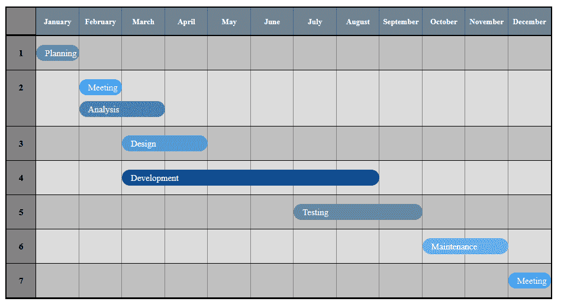
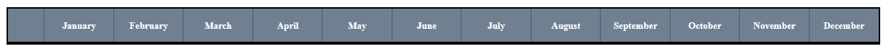
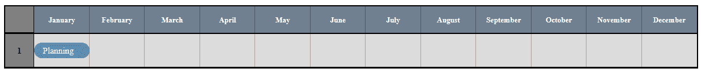

# 如何使用 CSS 网格创建简单的甘特图

> 原文：<https://www.freecodecamp.org/news/create-gantt-chart-using-css-grid/>

甘特图是一种方便的条形图，在项目管理中用于展示任务的时间表。此图表将项目活动可视化为级联的水平条，宽度描述项目的持续时间。

作为前端 web 设计人员或开发人员，您可以利用甘特图来管理项目并提高团队的工作效率。

在本文中，我将向您展示如何使用 CSS 网格布局系统创建一个简单的甘特图——没有外部库或其他无用的东西，只有纯 CSS。

可以参考[本教程](https://www.freecodecamp.org/learn/responsive-web-design/css-grid/)了解如何使用布局系统应用 CSS 规则。

该图表将显示一个典型的软件开发生命周期过程，从 1 月到 12 月。

下面是本教程结束时甘特图的屏幕截图:



我们开始吧！

## 步骤 1:创建一个容器 div

让我们首先为甘特图创建一个容器 **div** 元素:

```
<div class="container">

</div>
```

让我们给它添加一些 CSS 样式:

```
.container {  
	max-width: 1200px; 
	min-width: 650px;  
	margin: 0 auto; 
	padding: 50px;
}
```

## 步骤 2:创建图表 div

让我们在总体容器中创建一个 div，并将其命名为 chart。这是所有剩余动作将要发生的地方。

```
<div class="chart">

</div>
```

让我们给它添加一些 CSS 样式:

```
.chart { 
	display: grid;  
	border: 2px solid #000;  
	position: relative;  
	overflow: hidden; 
} 
```

注意，我已经将该类的**显示**属性设置为**网格。**因此，它的所有直接子节点将自动成为*网格项目*。

## 步骤 3:创建图表的行

让我们从创建第一行开始，这将是甘特图的标题。

```
<div class="chart-row chart-period">
<div class="chart-row-item">
    </div><span>January</span><span>February</span>span>March</span>
    <span>April</span><span>May</span><span>June</span><span>July</span>
    <span>August</span><span>September</span><span>October</span>
    <span>November</span><span>December</span>
</div>
```

请注意，我已经提供了 12 个 **span** 元素，它们将横跨整个行，显示项目持续时间的月份——从 1 月到 12 月。

这是它的 CSS:

```
.chart-row {  
	display: grid; 
	grid-template-columns: 50px 1fr; 
	background-color: #DCDCDC;
}
```

```
.chart-period { 
	color:  #fff;  
	background-color:  #708090 !important;  
	border-bottom: 2px solid #000;  
	grid-template-columns: 50px repeat(12, 1fr);

}

.chart-period > span {
	text-align: center;  
	font-size: 13px;  
	align-self: center;  
	font-weight: bold;  
	padding: 15px 0;   
}
```

注意，我使用了 **grid-template-columns** 属性来指定网格布局中的宽度和列数。

到目前为止，让我们看看它在浏览器中的样子:


接下来，让我们添加线条，这些线条将以类似方框的样式贯穿整个图表，这有助于展示每个项目的持续时间。

我还使用了 12 个跨度元素来创建线条。

```
<div class="chart-row chart-lines"> 
    <span></span><span></span><span></span>
    <span></span><span></span><span></span>
    <span></span><span></span><span></span>
    <span></span><span></span>	<span></span>    
</div>
```

这是它的 CSS:

```
.chart-lines { 
	position: absolute;  
	height: 100%;  
	width: 100%;  
	background-color: transparent;  
	grid-template-columns: 50px repeat(12, 1fr);}

.chart-lines > span {  
	display: block;  border-right: 1px solid rgba(0, 0, 0, 0.3);
}
```

让我们在浏览器中查看输出:



## 第 4 步:添加条目

最后，让我们添加说明创建一些软件的长达一年的过程的项目。

例如，我是这样添加第一个条目的:

```
<div class="chart-row">  
	<div class="chart-row-item">1</div> 
	<ul class="chart-row-bars">    
		<li class="chart-li-one">Planning</li>
	</ul>
</div>
```

让我描述一下上面的代码中发生了什么:

*   首先，包含的 **div** 元素有一个**图表行**的类，我在前面已经说明过了。
*   类别为**的 **div** 用于对甘特图上的条目进行编号。这是它的 CSS:**

```
.chart-row-item { 
	background-color: #808080;  
	border: 1px solid #000;  
	border-top: 0;  border-left: 0;  
	padding: 20px 0;  font-size: 15px;  
	font-weight: bold;  
	text-align: center;
}
```

*   为了在甘特图上显示任务，我创建了一个无序列表，并将其样式化为显示一个水平条，其长度显示任务的持续时间。

下面是**图表行条**类的 CSS 样式:

```
.chart-row-bars { 
	list-style: none; 
	display: grid;  padding: 15px 0;  
	margin: 0;  
	grid-template-columns: repeat(12, 1fr); 
	grid-gap: 10px 0;  
	border-bottom: 1px solid #000;
}
```

*   条目项在 **li** 标签中定义。下面是它的 CSS 样式:

```
li {  
    font-weight: 450;  
    text-align: left;  
    font-size: 15px;  min-height: 15px;  
    background-color: #708090;  
    padding: 5px 15px;  color: #fff;  
    overflow: hidden;  
    position: relative;  
    cursor: pointer;  
    border-radius: 15px;
 } 

 ul .chart-li-one { 
 	grid-column: 1/2;  
        background-color: #588BAE;
 }
```

注意，我已经使用了 **grid-column** 属性来指定项目的持续时间。

比如 **grid-column 的一个属性:3/9；**像“开发”条目一样，从三月到八月跨越整个网格的任务。

以下是第一个条目在浏览器中的外观:



按照与第一个条目相同的过程，我在图表上添加了其他条目。最终，它产生了一个好看的甘特图，就像我之前展示的图片一样。

## 包扎

就是这样！你可以在 CodePen 上查看本教程的全部代码:

[https://codepen.io/jasoya/embed/preview/GRKWXvr?height=300&slug-hash=GRKWXvr&default-tabs=css,result&host=https://codepen.io](https://codepen.io/jasoya/embed/preview/GRKWXvr?height=300&slug-hash=GRKWXvr&default-tabs=css,result&host=https://codepen.io)

如您所见，使用 CSS Grid 创建甘特图并不复杂。使用这种类型的图表，您可以有效地管理您的 web 开发项目，并确保每个人都朝着规定的目标前进。

此外，甘特图还可以用于其他行业来管理项目。例如，如果你正在销售[堆肥厕所](https://www.waterless-toilet.com/top-6-best-composting-toilets-to-choose/)，你可以使用甘特图来展示一段时间内的销售额。

当然，我只是触及了甘特图的皮毛。

您还可以对甘特图进行其他一些调整，以满足您的特定要求和项目目标。例如，您可以使用它们来显示各种任务之间的关系以及一项任务的完成如何依赖于另一项任务，显示如何为项目的成功分配资源，以及显示明确的项目要求以确保每个人都在同一页上。

你有任何问题或意见吗？

请通过下面的 Twitter 联系，我会尽全力回复。