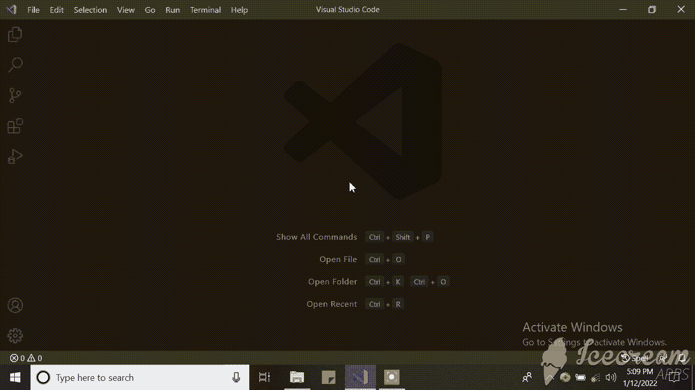
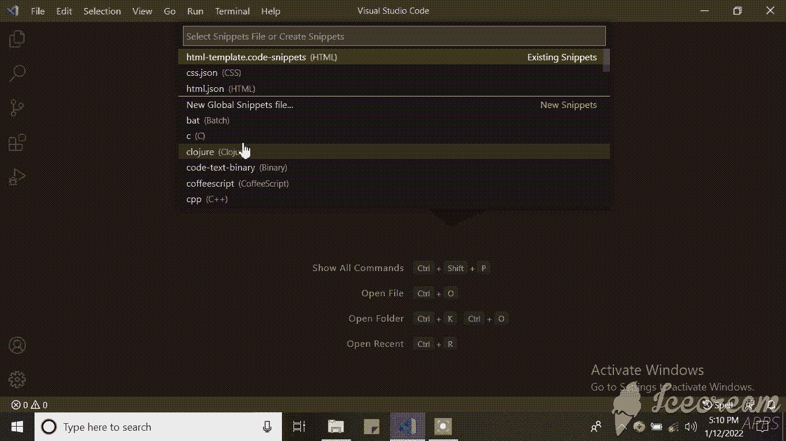
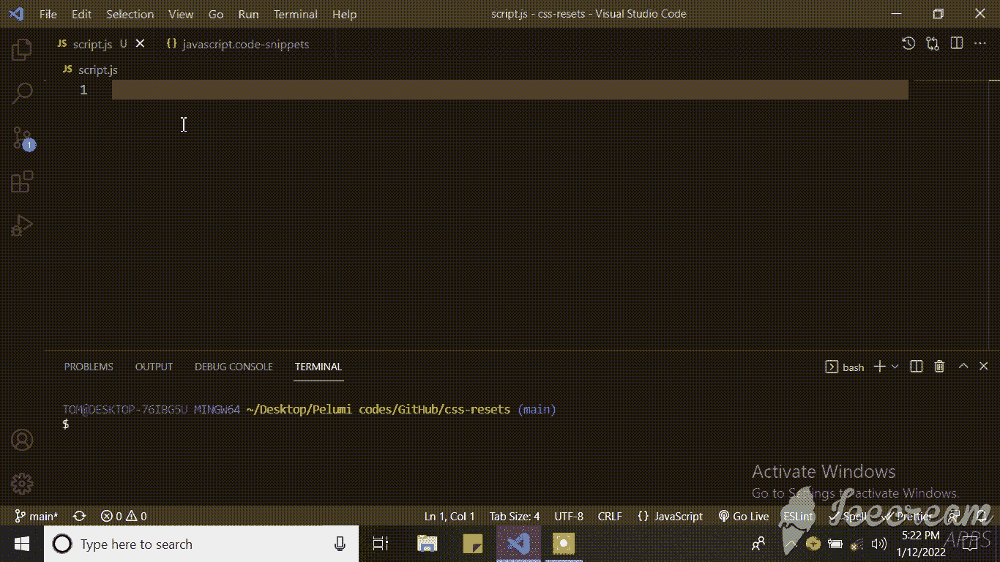
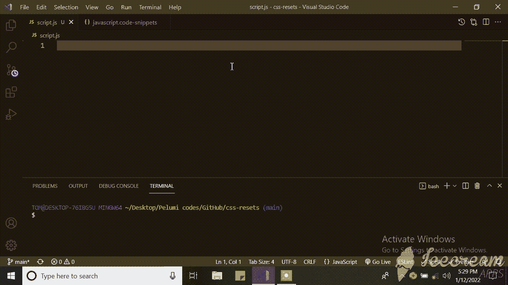
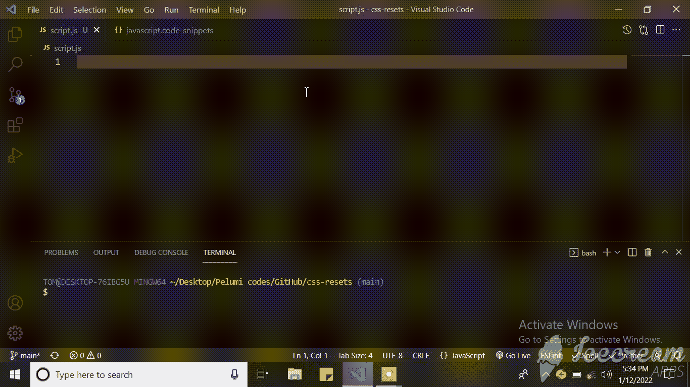
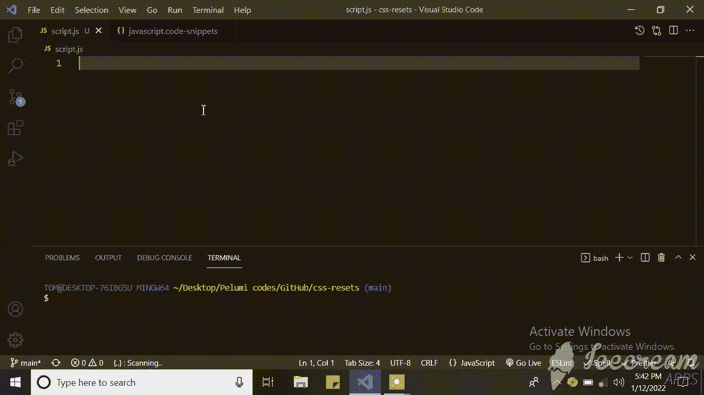
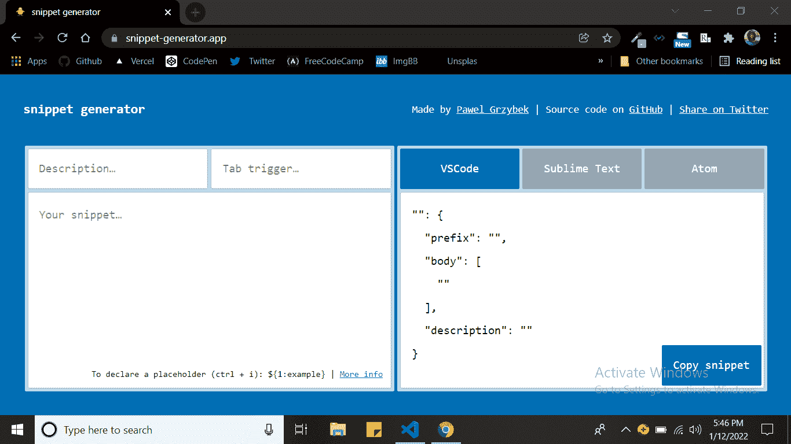
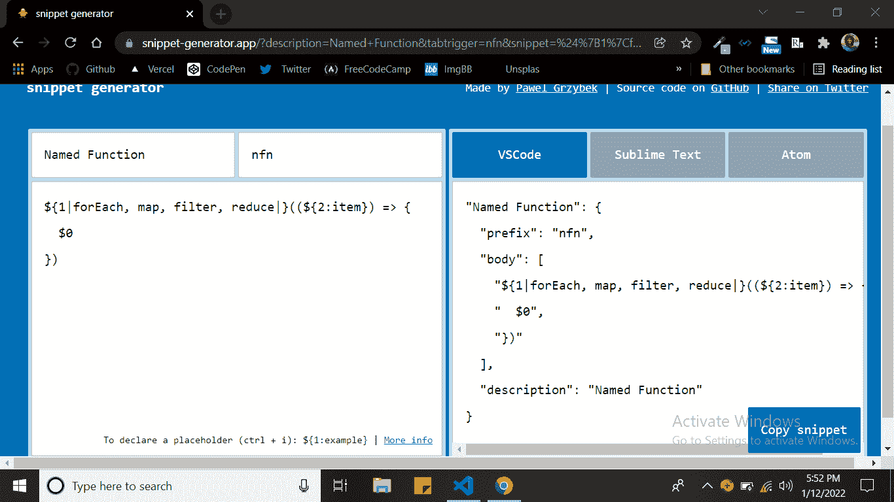

# 如何在代码编辑器中创建自己的自定义代码片段

> 原文：<https://www.freecodecamp.org/news/create-your-own-custom-code-snippets/>

代码片段是一个编程术语，指一小部分可重用的源代码、机器码或文本。

代码片段帮助程序员减少编码时输入重复信息的时间。代码片段是大多数文本编辑器、代码编辑器和 ide 的一个特性。

在本教程中，我们将学习如何编写我们自己的自定义代码片段。

## 先决条件

对于本教程，我将假设您可以用想要创建代码片段的语言编写大量代码。

这一点得到了证实...


## 为什么代码片段很有用

当我刚开始学习如何编码时，我用过的第一个代码片段是 **Ctrl +！并输入**得到一个 HTML5 文档模板。(我怀疑没有人知道如何把这句话记在心里。)这很酷，我觉得自己像个代码忍者。

(PS:如果你不想看后面的故事，只想直接进入教程，那么[直接进入](#creating-custom-code-snippets)。)

当我开始深入研究编码时，我了解到 VSCode 扩展使得编码更快——特别是代码片段——然后我就开始疯狂下载。

在我开始频繁地在项目中使用框架和库之前，一切都很顺利。这包括我试图记住如何将我的文档链接到它们的包，以及如何使用个性化的 CSS 重置和变量。

另外，我总是忘记将我的样式表链接到我的 HTML 页面，这让我花费了大量的时间试图找出为什么我的页面没有被正确设计。(我还是时不时会忘记这么做。)

这让我想到了拥有自己的个性化 HTML 和 CSS 模板，其中包含我在项目中经常使用的所有基本代码。

起初，我只是创建模板并保存在我的系统上，这样我就可以在任何时候开始新项目时复制代码。但这也越来越有压力，我想只是键入几个字母，按下回车键，然后我的模板就会出现在我的屏幕上。那是我了解 VsCode 代码片段的时候。

当时我不知道它叫代码片段，所以我花了 2 个多星期试图找到一个工具，可以帮助我做到这一点，我几乎放弃了。直到有一天晚上，我在 YouTube 的街上闲逛时，偶然发现了布拉德·特拉维斯特(Brad Travesty)的视频，却没有主动搜索。

这是一个救命稻草，每隔一段时间，我都会在我的收藏中添加新的自定义片段。你可以在这里查看我的个性化 HTML 和 CSS 模板。

您可能经常希望有一段您一直在使用的特定代码的自定义片段，但不知道如何创建或找到它。好了，不要再期望了，因为我将向你展示如何轻松地创建你自己的。

## 如何创建自定义代码段

创建您自己的自定义代码片段非常容易。在另一个叫做**片段生成器**的工具的帮助下(我将很快向您展示如何使用它)，它变得更加容易。

### 步骤 1:检查你的编辑器是否允许你创建自定义的代码片段

您可以在代码编辑器上查看文档，了解该特性是否可用以及如何访问它。

我在本教程中使用的是 VsCode。你可以在这里下载[。](https://code.visualstudio.com/download)

要访问该设置，您可以点击侧边栏上的**设置图标**，然后点击**用户片段**，或者使用 Windows 上的 Cntr + shift + p 或 Mac 上的 CMD + shift + p 打开命令面板，键入“snippet”并点击**首选项:配置用户片段**。

这将给你一个下拉菜单，有不同的语言可供选择。



### 步骤 2:决定代码片段的范围

您可以创建可以跨所有语言使用的全局代码段，也可以创建特定语言范围的本地代码段。

所以从下拉菜单中，你可以看到**新的全局代码片段文件**，然后是一堆按字母顺序排列的语言。

滚动到您想要编写代码片段的语言并点击它(或者选择**新全局代码片段文件**如果您想要在多种语言中使用您的代码片段)。

如果您选择了特定的语言，例如 HTML，文件将自动打开。但是，如果您选择了“全局代码片段”,在它打开之前，系统会提示您键入代码片段文件的名称。

对于这一个，我将使用一个全局代码片段。



### 第三步:理解语法

代码片段的语法实际上很简单。它是以 JSON 格式编写的，每个文件可以包含无限数量的代码片段。

```
{
// Code Snippet 1
  "Snippet name": {
    "scope": "language1, language2" 
    "prefix": "trigger word 1",
    "body": ["your code snippet"],
    "description": "description of the code"
  },
// Code Snippet 2
  "Snippet name": {
    "scope": "language1, language2" 
    "prefix": ["trigger word 1, trigger word 2"],
    "body": ["your code snippet"],
    "description": "description of the code"
  }
} 
```

让我们看看这段代码中发生了什么:

#### 代码段名称

代码段名称是代码段的名称。如果没有提供说明，这也是通过 IntelliSense 显示的内容。

#### 范围

这决定了允许哪些语言使用代码片段。输入语言名称，用逗号分隔。如果将其留空或省略，任何语言都可以访问该代码片段。此部分仅包含在全局代码段中，因为本地代码段文件已经在本地范围内。

#### 前缀

这描述了将提示 IntelliSense 显示代码段的一个或多个触发词。

#### 身体

如果是单行代码，它可以是一个字符串；如果是多行代码，它可以是一个字符串数组。

#### 描述

这描述了代码片段及其用途。如果省略，将使用代码片段的名称。

片段示例 1:

```
{
// log to console
  "Print to console": {
    "scope": "javascript, typescript",
    "prefix": "log",
    "body": "console.log();",
    "description": "Log output to console"
  }
} 
```

从上面的例子来看，我们的代码片段名是 **Print to console** ，它只能在一个 **JavaScript 和 TypeScript 文件**中使用。如果你要在一个 JavaScript 或 TypeScript 文件中键入**日志**，智能感知会显示它以及描述**日志输出到控制台**。一旦您选择它并点击 enter，您将在屏幕上看到 **console.log()** 。



### 步骤 4:添加制表位

制表符允许您在代码段内移动编辑器光标。$1, $2, ...，$n 指定当您按 tab 键时光标应该移动到的位置。$0 表示光标应该停止的最终位置。

片段示例 2:

```
// named function
{
  "Named Function": {
    "scope": "javascript, typescript",
    "prefix": "nfn",
    "body": [
      "function $1($2){",
      "  $0",
      "}"
    ],
    "description": ""
  }
} 
```

在这个例子中，当您键入 **nfn** 时，我们命名的函数片段就会出现。一旦你选择了它，你会在屏幕上看到你的代码片段。您还会看到光标现在位于括号之前，而不是代码的末尾。

键入函数的名称，例如“GetUsers”，然后点击 tab 键。您会注意到光标现在已经移动到括号中。

你可以输入参数，如果它有一个或，然后再次按 tab 键将光标移动到下一个制表位，它在我们的函数体将要去的花括号之间。



注意:在编写多行代码时，不能在 JSON 语法中使用制表符来缩进代码。你只能使用 2 个空格来缩进你的代码，或者使用任意数量的空格来缩进你的代码。

### 第五步:使用占位符

这些是带有值的制表位。它们帮助用户容易地识别或理解他们应该在特定的制表位键入什么。

占位符将自动突出显示，以便您可以立即键入要替换的内容。

片段示例 3:

```
// named function
{
  "Named Function": {
    "scope": "javascript, typescript",
    "prefix": "nfn",
    "body": [
      "function ${1:functionName}(${2:parameter}){",
      "  ${0:functionBody}",
      "}"
    ],
    "description": ""
  }
} 
```



### 第六步:创造选择

占位符可以选择值。这意味着您可以从下拉列表中选择，而不是键入您的值。

要创建一个值，您需要在两个管道字符之间用逗号分隔这些值，例如＄{ 1 | one，two，three|}。

片段示例 4:

```
// array method
{
"Array Method": {
    "scope": "javascript, typescript",
    "prefix": "arrmth",
    "body": [
      "${1|forEach, map, filter, reduce|}((${2:item}) => {",
      "  $0",
      "})"
    ],
    "description": ""
  }
} 
```



在这里，一旦你输入了`arrmth`，从 IntelliSense 中选择它并按下回车键。第一个制表位将是可供选择的数组选项的下拉列表。下一个制表位是参数，最后一个制表位是功能代码。

## 代码片段生成器

随着代码段的行数和大小开始增加，在代码编辑器中键入和创建代码段变得越来越困难。这就是代码片段生成器的用武之地。

代码片段生成器将接受您的常规代码，并将其转换为代码片段。

在本教程中，我将使用[代码片段生成器](https://snippet-generator.app/)。使用这个特定的代码片段生成器，您可以为 VsCode、Sublime Text 和 Atom 编写代码片段。



### 如何使用代码片段生成器

在**描述**输入中，输入代码片段的名称，该名称将用作代码片段的名称和描述。

在**标签触发**输入中，输入你的代码片段的前缀。

在**你的片段中..** input，以自然形式输入您的代码，而不是将其写成字符串数组。

在这之后，您可以添加制表符、占位符和选项，如上所述。

片段示例 5:

```
//named function
function ${1:functionName}(${2: parameter}) {
  ${0:functionBody}
} 
```


片段示例 6:

```
//array method
${1|forEach, map, filter, reduce,|}((${2:item}) => {
 $0
)} 
```



## 最终代码片段

```
{
  // log to console
  "Print to console": {
    "scope": "javascript, typescript",
    "prefix": "log",
    "body": "console.log();",
    "description": "Log output to console"
  },
  // named function
  "Named Function": {
    "scope": "javascript, typescript",
    "prefix": "nfn",
    "body": [
      "function ${1:functionName}(${2:parameter}){",
      "  ${0:functionBody}",
      "}"
    ],
    "description": ""
  },
  // array method
  "Array Method": {
    "scope": "javascript, typescript",
    "prefix": "arrmth",
    "body": [
      "${1|forEach, map, filter, reduce|}((${2:item}) => {",
      "  $0",
      "})"
    ],
    "description": ""
  }
} 
```

仅此而已。简易柠檬榨汁机。

## 概述

让我们来回顾一下。我们了解到:

*   代码片段是可重复使用的源代码、机器码或文本的一小部分，有助于程序员减少编程时输入重复代码的时间。
*   代码段文件可以包含无限数量的代码段。
*   您可以在一个语言文件中使用局部范围的代码段，也可以在两个或更多语言文件中使用全局范围的代码段。
*   代码片段是用 JSON 语法编写的。
*   您可以在代码段中添加制表位、占位符和选项。
*   您也可以使用代码片段生成器来生成代码片段。

感谢您阅读我的文章。你可以通过 [Twitter](https://twitter.com/timonwa_) 、 [LinkedIn](https://linkedIn.com/in/pelumi-akintokun) 或[我的博客](https://blog.timonwa.com)与我联系。

我很想知道你是否会创建自己的自定义片段，以及它们可能是什么。请不要客气，与其他可能觉得这篇文章有用的人分享这篇文章。拜拜！


## 资源

*   [布拉德的定制片段视频](https://youtu.be/JIqk9UxgKEc)
*   [vs 代码片段文档](https://code.visualstudio.com/docs/editor/userdefinedsnippets)
*   [代码片段生成器](https://snippet-generator.app/)
*   [查看我的自定义 HTML 和 CSS 模板](https://github.com/timonwa/my-templates.git)