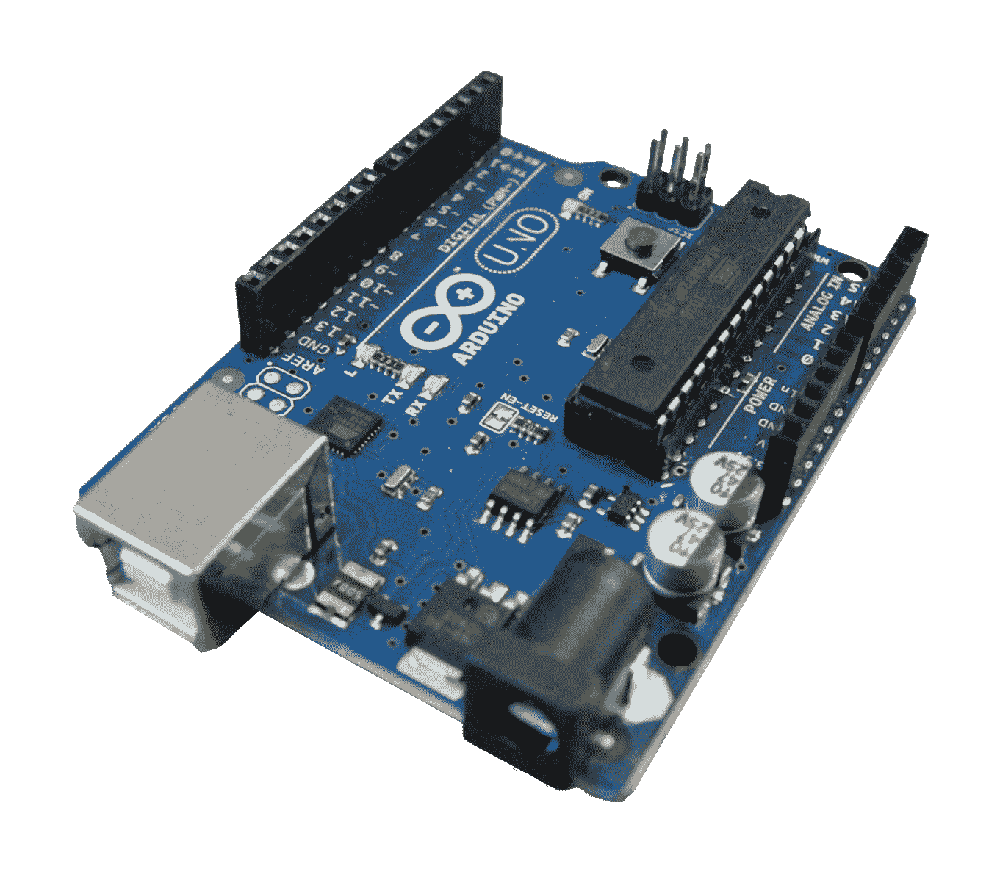

# 使用 Arduino 创建您自己的电子产品-完整课程

> 原文：<https://www.freecodecamp.org/news/create-your-own-electronics-with-arduino-full-course/>

Arduino 是一个基于易于使用的硬件和软件的开源电子平台。

Arduino 板能够读取输入——传感器上的光、按钮上的手指或 Twitter 消息——并将其转化为输出——激活电机、打开 LED、在线发布内容。你可以通过向板上的微控制器发送一组指令来告诉你的板做什么。

我们刚刚在 freeCodeCamp.org YouTube 频道上发布了一个完整的课程，将教你如何使用 Arduino 硬件和软件。

阿希什·班萨尔开发了这个课程。他会教你开始用 Arduino 创建自己的电子产品所需的一切。你甚至不需要任何硬件来跟随。

以下是本综合课程涵盖的所有主题:

### 第一部分:课程目标

*   课程介绍

### 第二部分:电子学基础

*   电流
*   静电
*   电流
*   电压
*   目前的
*   抵抗
*   欧姆定律
*   欧姆定律例子
*   串联和并联电阻
*   电阻颜色编码

### 第 3 部分:Arduino 板介绍

*   什么是微控制器和微处理器
*   Arduino 属于哪一类？
*   不同类型的 Arduino 板
*   关于 Arduino
*   Arduino Uno 的部分
*   Arduino Uno 的技术规格

### 第 4 部分:Arduino IDE 简介

*   IDE 是什么？
*   下载并安装官方 IDE
*   准备您的计算机
*   测试 Arduino。
*   没有 Arduino 板怎么办？

### 第 5 部分:在我们继续前进之前

*   什么是试验板？
*   如何在 breadboard 中建立连接？
*   一些安全说明和注意事项
*   输入和输出
*   模拟和数字
*   比特和字节

### 第 6 节:Arduino 编程

*   介绍
*   编程的第一步
*   Arduino 程序的最小结构
*   评论
*   空白和区分大小写
*   pinMode
*   数字写入和延迟
*   骆驼肠衣

### 第 6.1 节变量和数据类型介绍

*   什么是变量和数据类型
*   Int 数据类型
*   算术运算符
*   增加和减少我们的变量
*   浮点数据类型
*   Bool/Boolean data type
*   字节数据类型
*   字符数据类型
*   结论

### 第 6.2 节变量范围和限定符

*   什么是范围？全局和局部变量
*   什么是限定符，从 const 限定符开始
*   常量限定符的替代:#define
*   静态限定符

### 第 6.2 节比较和逻辑运算符

*   什么是比较运算符？
*   什么是逻辑运算符？

### 第 6.3 节控制结构

*   如果语句
*   else 语句
*   一个笑话:P
*   if - else 模拟
*   循环控制结构介绍
*   For 循环
*   While 循环
*   do…while 循环
*   破裂
*   继续
*   返回
*   转换..情况

### 第 6.4 节剩余数据类型

*   数组
*   用线串

### 第 6.5 节功能

*   什么是功能？
*   创建您自己的函数

### 第 6.6 节 Arduino 内置功能和相关概念

*   数字阅读和数字写作
*   模数转换器(ADC)
*   模拟写入和脉宽调制(PWM)

### 第 6.7 节库

*   什么是图书馆？
*   如何在 Arduino IDE 中添加库
*   下一步是什么？

观看 freeCodeCamp.org YouTube 频道的全部课程(4 小时观看)。

[https://www.youtube.com/embed/zJ-LqeX_fLU?feature=oembed](https://www.youtube.com/embed/zJ-LqeX_fLU?feature=oembed)