# 如何用 JavaScript 和 HTML 构建一个随机报价生成器，适合绝对初学者

> 原文：<https://www.freecodecamp.org/news/creating-a-bare-bones-quote-generator-with-javascript-and-html-for-absolute-beginners-5264e1725f08/>

作者 Sophanarith Sok

# 如何用 JavaScript 和 HTML 构建一个随机报价生成器，适合绝对初学者

本教程面向想要学习如何使用 JavaScript 创建一个简单的 web 应用程序的初学者。它将帮助您理解 JavaScript 和 HTML 文档之间的交互，以及它们如何协同工作以在 web 浏览器上显示内容供人们查看。

如果你对 HTML 和 JavaScript 完全没有经验，不用担心。我将带你浏览每一行代码，并详细解释每一件事。当你学完这一课时，你应该对 JavaScript 如何与 HTML 协同工作以使网页具有交互性有了更好的理解。

在这个项目中，我们将构建一个随机报价生成器，在用户每次按下按钮时向用户显示随机报价。要开始，您需要三个几乎总是用于每个 web 项目的基本要素:

*   网络浏览器
*   文本编辑器
*   建造东西的欲望

在本教程中，我将使用谷歌 Chrome 网络浏览器、 [Sublime Text 3 编辑器](https://www.sublimetext.com/3)，当然，还有我自己构建和教学的愿望。你可以使用任何你觉得舒服的工具。

### 我们开始吧！

我们要做的第一件事是创建一个文件夹，其中包含构成项目的所有文件。 ****在桌面上创建一个空文件夹**** ，命名为“报价生成器”。 ****打开崇高文本********拖动文件进入崇高**** 。现在我们应该可以通过侧边栏访问这个文件夹了。

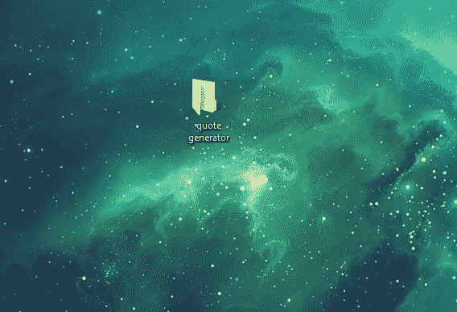

Create a blank folder on your desktop

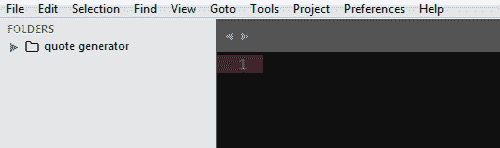

Drag the folder into Sublime Text. Now it shows up on the sidebar menu.

大多数 web 项目至少包含一个 HTML、JavaScript 和一个 CSS 文件。让我们在“报价生成器”文件夹中创建这些文件。

在 Sublime Text 中，右击侧边栏上的“报价生成器”文件夹，点击 ****创建新文件**** 。底部会弹出一个输入栏来命名文件。键入“index.html”并按回车键。现在您已经创建了 index.html 文件。 ****重复这个步骤两次以上**** ，但是创建一个名为“javascript.js”和“style.css”的文件(不带引号) ****。当你给一个文件命名时，一定要确保字母总是小写，以防止任何复杂情况，这一点很重要。****

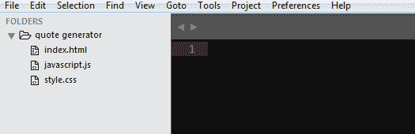

Your files should now look like this.

现在我们已经设置好了所有的文件，让我们创建 HTML 文件，它将作为我们 web 项目的基础。在添加任何内容之前，我们将从 index.html 文件中的基本 HTML 代码开始。

下面是我们的 HTML 文件，里面什么也没有。你可以把它想象成我们的 HTML 框架，它将包含所有的内容，我们将在后面添加。

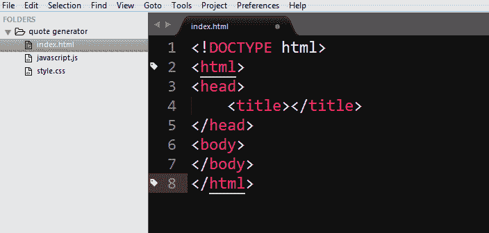

现在，我们必须将 JavaScript 文件链接到 HTML 文档，以便 JavaScript 代码能够与 HTML 文档交互。我们还将在 ****<标题>**** 标签内添加文本，添加一个 ****< h1 >**** 元素，创建一个 ****< div >**** 元素，其 ****id**** 名称为“quoteDisplay”，以及一个 ****<按钮>**** 元素，其名称为<

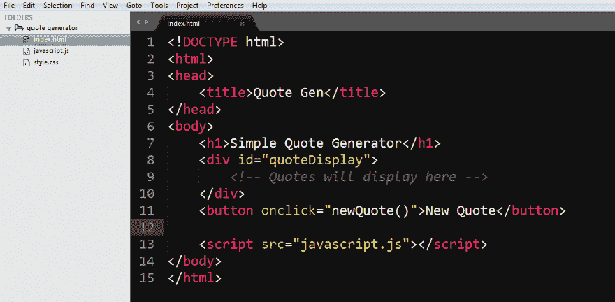

### 打破它

如果你对 HTML 代码的每一部分是如何实现其目的感到困惑，那么我将在这里向你解释。如果您确切地知道每个元素的作用以及它在那里的原因，那么您可以跳到下一节继续。

首先，我们在 ****<标题>** 标签之间添加了“报艮”。title 标签将文本夹在中间，并在 web 浏览器打开时显示在它的选项卡上。**

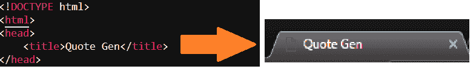

Contents between <title> tags will show up on the projects tab when opened in a browser.

在第一步中，我们还需要确保将 HTML 文档底部的 javascript.js 文件链接到关闭的 ****<主体>**** 标签之前。

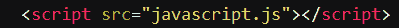

Link to the javascript.js file

其次，我们创建了一个****<【h1】>****元素，其中包含“简单报价生成器”。这将用于在我们的网页中显示一个标题。

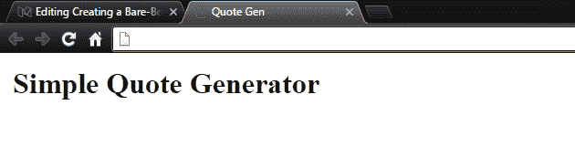

The <h1> tag will display large text

然后，我们创建了一个 ****< div >**** 元素，其 ****id**** 属性设置为“quoteDisplay”。一个 ****< div >**** 元素作为 HTML 文档的分隔符。****
****元素帮助组织网页内的内容。 ****id**** 属性作为一个标识符工作，以便 JavaScript 可以轻松地获取和操作它。在这种情况下，我们将使用 JavaScript 抓取 id 为**“quote display”的元素，将引号放在****
****元素中。**

**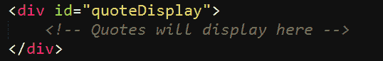

Quotes will be displayed within this 
 element via our JavaScript file** 

**之后，我们创建一个 ****<按钮>**** 元素，它带有一个带有“newQuote()”作为参数传入的 ****onclick**** 属性。 ****<按钮>**** 元素正如你所猜测的，是一个当你点击它时会做一些事情的按钮。 ****onclick**** 属性用于给按钮设置一个函数，这样每次点击按钮时，就会运行传入 ****<按钮>**** 的 ****onclick**** 属性的函数。**

**在这种情况下，每次你点击按钮，它都会运行函数 newQuote()，当然，我们还没有定义 newQuote()函数。如果您在浏览器中打开项目并按下按钮，它将在控制台中抛出一个错误，因为该功能当前不存在。**

**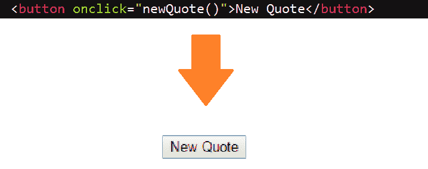

Our <button> element will produce this button** 

**最后，这里是一个复习，以显示我们的完整的 index.html 文件目前看起来像什么，它在 web 浏览器中产生什么。要打开项目，请使用 web 浏览器打开 index.html 文件。**

**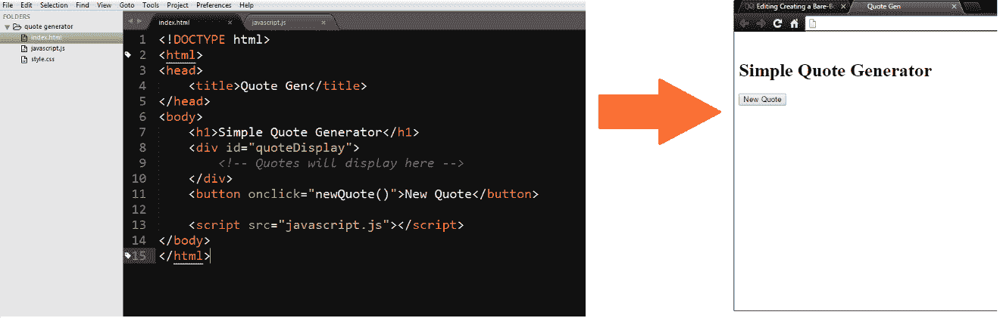

What we have so far** 

### **使用代码进行逻辑思考**

**终于到了开始处理 javascript.js 文件中的 JavaScript 的时候了，这样我们就可以开发自己的报价生成功能了。**

**现在，在我们开始编码之前，让我们从逻辑上考虑一下如何用代码创建一个报价生成机器。我们不能不先思考就开始编码。**

**我们需要弄清楚我们想要什么，什么时候想要。对于这个项目，我们想要报价！我们什么时候想要它？我们现在就要！哦，嗯…我的意思是无论用户什么时候按下按钮，我们都需要它。**

**既然我们解决了第一个问题，我们需要问第二个问题。什么是引号？我是说真的，它们是什么？**

**

“Quotes are strings.”** 

**谢谢杰登。是啊！引号由字母组成，字母组成单词。在编程世界中，单词被归类为字符串，因此，我们的引号将需要是 [****字符串****](http://www.w3schools.com/jsref/jsref_obj_string.asp) ！**

**因为我们知道我们会有多个引号，并且每个引号都会被随机挑选出来，所以最好的选择是在一个 [****数组****](http://www.w3schools.com/js/js_arrays.asp) 中存储多个字符串。**

**如果您还不知道，数组中的元素是通过调用它的 [****数组索引号****](http://www.w3schools.com/js/js_arrays.asp) 来检索的。技术细节超出了本教程的范围，但简单来说，数组中的每个元素都由一个按时间顺序排列的整数表示。数组的第一个元素的索引号为 0，之后的每个元素都加 1。**

**为了从一个数组中检索一个随机的报价，我们现在知道我们需要在用户每次点击按钮时产生一个随机数。然后，我们将使用该随机数从数组中检索一个报价，并将该报价放到 HTML 文档中，然后在浏览器上向用户显示该报价。**

**就是这样！我们通过代码中的逻辑思维解决了如何创建一个随机报价生成器！以下是我们为项目提出的逻辑总结:**

1.  **引号是需要存储在数组中的多个字符串。**
2.  **每次按下按钮时，都需要生成一个随机整数。**
3.  **该数字将用作报价数组的数组索引号的表示。**
4.  **一旦我们使用随机生成的整数从数组中检索到随机选取的报价，我们将把它放到 HTML 文档中。**

### **编码时间！**

**哇！我们已经走到这一步，还没有开始编程！欢迎来到编程的世界！**

**开玩笑的。**

**不完全是。**

**你将在这个职业(或爱好)中花费大量时间编写代码。但我的观点是，你将会花更多的时间去思考编程逻辑和如何解决问题。编程不是在键盘上敲 20 分钟，每分钟 100 个单词。那是不会发生的。**

 **[https://giphy.com/embed/HoffxyN8ghVuw](https://giphy.com/embed/HoffxyN8ghVuw)

既然我们已经解决了所有的逻辑问题。开始编码吧。我们现在将在 ****javascript.js**** 文件中工作。

我们需要创建自己的报价，或者从网上复制报价。

我在谷歌上搜索“最佳语录”，从一个网站**上复制了前 10 条，然后*把它们放在一个用逗号分隔的数组中。确保你用单引号或双引号来引用。如果您的引号由撇号、单引号或双引号组成，您可能需要使用反斜杠来对这些字符 [****进行转义****](http://www.w3schools.com/js/js_strings.asp) ，以便 JavaScript 知道这些符号是字符串的一部分，而不是编码语法的一部分。*

*正如你在下面的图片上看到的，我定义了一个名为“quotes”的变量，并将其设置为一个数组，该数组中包含了我从[互联网](https://i.ytimg.com/vi/cNycdfFEgBc/maxresdefault.jpg)上选择的所有引号。*

*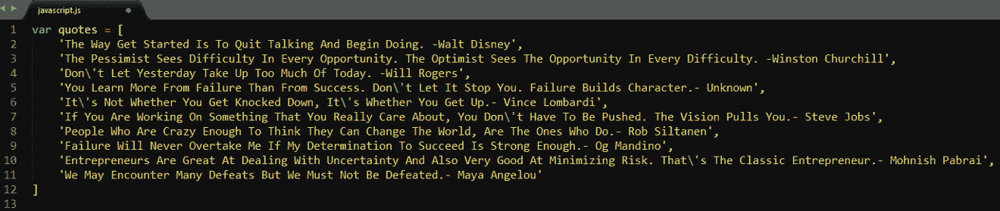

My quote array.* 

*现在我们需要创建我们的 newQuote()函数，我在本教程的 HTML 部分提到过。对于我们的 newQuote()函数，我们需要生成一个从 0 到报价数组 长度的随机整数。我将在下面进一步解释。*

*首先，我们调用 Math.floor()函数。Math.floor()函数接受一个参数，并将数字向下舍入到最接近的整数。例如，如果我们调用 Math.floor(5.7)，它将返回 5。*

*其次，我们将把 Math.random()作为参数传入 Math.floor()。Math.random()函数将生成一个介于 0 和 1 之间的随机十进制数。*

*假设我们有这个:*

*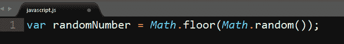

Calling Math.floor() with Math.random() passes as a parameter* 

*如果我们在这个状态下控制台记录我们的 randomNumber，它将总是返回 0。这是因为 Math.random()将始终是一个介于 0 和 1 之间的小数，如 0.4、0.721、0.98 等。因为我们将 Math.random()作为参数传递给 Math.floor()，所以 Math.floor()总是向下舍入到最接近的小数，因此，0 和 1 之间的每个小数将总是还原为 0。*

*那么这样做有什么意义呢？为了创建数组索引号，我们需要整数，但是我们需要随机整数。要生成随机整数并摆脱只返回 0 的情况，我们需要将我们的随机小数乘以一个整数。*

*现在让我们试试这样的东西:*

*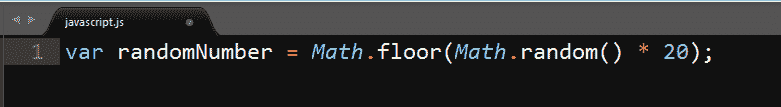

A randomly generated decimal multiplied by 20, then rounded down to the nearest whole number* 

*如果我们控制台记录 randomNumber，结果将在 1 到 19 之间。现在，我可以使用 randomNumber 的当前状态从 quotes 数组中提取一个引号，但是只有当数组索引号存在于数组中时，它才起作用，否则，将会抛出一个错误。*

*例如:*

*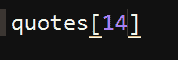

This will return undefined* 

*我的 quotes 数组中目前只有 10 个字符串，所以任何大于 9 的数字都将返回 ****未定义的**** ，因为它不在数组中。*

*为了解决这个问题，我们只需要将 Math.random()乘以引号数组的长度。通过这样做，我们可以在数组中添加或删除任意多的字符串，并且我们的 randomNumber 变量将始终返回一个有效的数字，因为我们使用 quotes.length 方法来始终获取数组的当前长度。*

*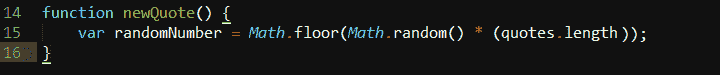

randomNumber will always generate a valid array index number for our quotes array* 

*现在我们需要一种方法来使用 randomNumber 的值从 quotes 数组中随机检索一个报价，并将报价放入我们的 HTML 文档中并显示给我们的用户。*

*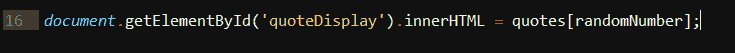

Placing the quote into the HTML quoteDisplay element* 

*还记得我提到过我们使用 HTML ID 来让 JavaScript 轻松获取和操作 HTML 元素吗？这就是我们现在对之前创建的 HTML****quote display****ID 所做的事情。*

*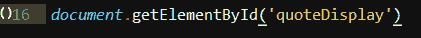

Grabbing the HTML element with id of quoteDisplay* 

*使用 document.getElementById()我们可以传入任何字符串，JavaScript 将检查我们的 HTML 文档并检索它以用于我们想对它做的任何事情。我们将把“quoteDisplay”作为参数传入，以检索 id 为“quoteDisplay”的 HTML 元素。*

*现在我们将使用。innerHTML 方法来传递从数组中随机检索的报价，作为将添加到 HTML quoteDisplay 元素中的值。*

*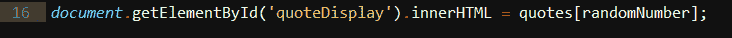

Passing in our random quote as the inner value of the quoteDisplay element* 

*我们将 innerHTML 设置为 quotes 数组，并将 randomNumber 变量作为数组索引号传递。现在我们的 newQuote()函数完成了！*

*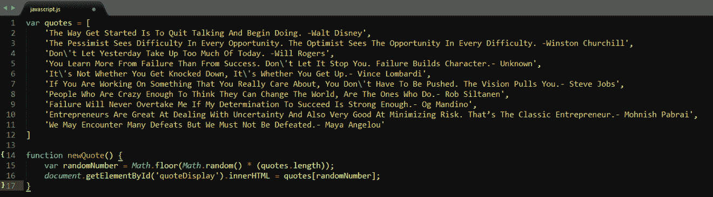

Your javascript.js file should look similar to this* 

### *任务完成！*

*如果你已经完成了教程的这一部分，你就完成了这个项目！恭喜你！您实际上已经完成了构建随机报价生成器的工作。*

*现在你需要做的就是在你的浏览器中打开这个项目，看看它是否工作！将 index.html 文件拖到浏览器窗口中即可。*

*按下按钮，它应该会在您的屏幕上显示一个随机报价。你想按多少次按钮就按多少次。每次，一个新的报价应该取代屏幕上的当前报价。*

*您可以向引号数组中添加任意数量的引号。*

*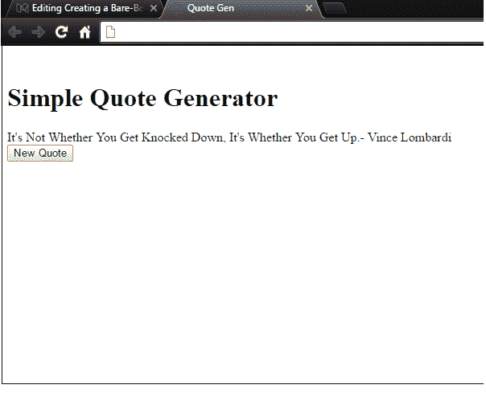

Finished Product* 

*看一看我们整个项目文件的概述，这些文件构成了这个随机报价生成器。*

*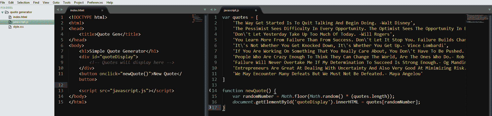

Our Project’s Source Code* 

### *现在怎么办？*

*您已经创建了一个全功能的随机报价生成器，您可能想知道从这里您将何去何从。*

*您可能认为这个随机报价生成器看起来很无聊，没有人会使用它。你完全正确。这个项目看起来很简单，这取决于你来改变它。*

*您可以通过添加您自己的功能和样式来改进这个项目。*

*在本教程的开始，我们创建了一个没有使用的 style.css 文件。[****CSS****](http://www.w3schools.com/css/css_intro.asp)****用来使网页漂亮多彩。**** 如果你愿意，可以添加到 CSS 文件中进行样式化。*

*你可以搜索一些 CSS 教程来获得一些额外的指导。发挥你的想象力，让这个项目成为你的！想干嘛干嘛！编码是魔法，而你是巫师，哈利！*

*如果你很想知道 CSS 和几行 JavaScript 代码能给一个项目带来多大的变化，请查看我自己版本的随机报价生成器，我在这里命名为*"顿悟时钟"****。****

* * *

****如果你喜欢这个教程，请点击心形按钮，并分享它！欢迎留下任何评论、问题或反馈。谢谢大家，编码快乐！******