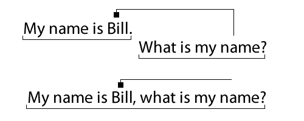
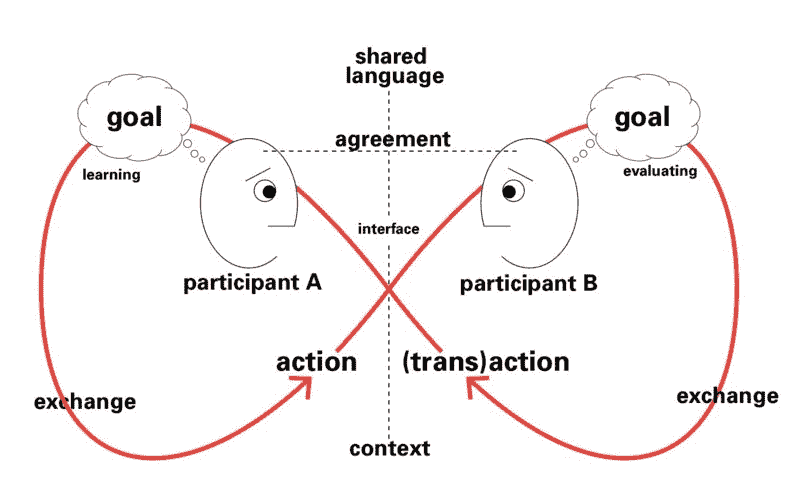

# 创建聊天机器人

> 原文：<https://www.freecodecamp.org/news/creating-a-chat-bot-42861e6a2acd/>

作者:罗布·埃利斯


Image: VLADGRIN/Shutterstock

# 创建聊天机器人

人类的互动一直让我着迷:社交尴尬，交流方式，知识如何转移，如何围绕信任建立关系，讲故事和知识交流。

如果机器引发了情感反应呢？

#### 首先是背景故事

我想写一个我一直在做的项目，以及它如何吞噬了我过去几年的生活，但最终，这篇文章是关于创造一个真正的聊天机器人。

迄今为止的工作一直是在 NLP(自然语言处理)中所做工作的扩展，NLP 是目前形成了[节点/自然](https://github.com/NaturalNode/natural)基础的工具集合。

我最初的目标是构建一个 IBM Watson 类型的克隆体；可以解析某种形式的输入并从数据源中挑选出候选项的东西。最初我看了 [DBPedia](http://dbpedia.org/About) 和 [YAGO](http://en.wikipedia.org/wiki/YAGO_(database)) 。

我很快意识到创造一个沃森只是次要目标。我想创造一些看起来更真实的东西——一个人们可以在更人性化的层面上与之互动的系统。从技术上来说，图灵完成了 T1。

2013 年，我做了一些关于语言和交流如何受到五种性格特征影响的研究。例如，疲倦或内向的人在交谈时倾向于给出简短的回答。我花了相当多的时间思考这将如何在聊天机器人中发挥作用。

我还创建了一个项目，将创建一个完整的虚拟人物的背景故事，包括；

*   日常活动
*   就读的学校
*   朋友
*   假日
*   他们工作、生活和旅行的地方。

以上是在社交媒体上生成虚假账户的理想信息，但它错过了人性的一面——写作中的举止、语气、个性。这促使我思考是什么让两个人变得不同，是什么在谈话中激励我们，以及如何将其编程为聊天机器人。

#### 最先进的技术在哪里？

有许多类型的聊天机器人，都有不同程度的复杂性和欺骗人类的策略，他们不是在和计算机说话。

作为第一个也是最著名的创作于 1966 年的 ELIZA，她将扮演一个医生的角色，并通过试图更深入地挖掘问题的根源来询问之前的回答会给人什么感觉，从而继续将对话推回给用户。这很聪明，也很简单。

CleverBot 于 1997 年上线。它被设计来回复来自过去某个时间点的输入。今天，在许多主题和领域有几百万个回复。输入内容有时切题且相关，而其他时候则完全跑题。这种方法很像搜索结果，如果不知道首先问这个问题的原因，很难提供准确的结果。

几个月前，尤金·古斯特曼因“图灵完成”而成为新闻，这引起了争议。这个机器人采用了几个技巧，例如假装一个 13 岁的男孩，他的英语是他的第二语言。

在回顾了当前的情况后，它让我相信欺骗人类去相信一个机器人是真实的，并不是因为这个机器人很棒，而是它使用了愚蠢的策略，比如故意使用蹩脚的英语、打字错误和偏差。

#### 创建聊天机器人

2014 年，我开始关注罗布纳奖(Loebner Prize ),这是一项人工智能年度竞赛，向评委认为最像人类的聊天机器人颁奖。

我觉得这个比赛是正确的，抓住了我想创造的软件的精神。但与过去的一些参赛者不同，我不想作假，机器人必须是真实的。不耍花招。

为了有资格获得罗布纳奖，我需要轻松地通过筛选问题。以下是供参考的:

```
My name is Bill. What is your name?How many letters are there in the name Bill?How many letters are there in my name?Which is larger, an apple or a watermelon?How much is 3 + 2?How much is three plus two?What is my name?If John is taller than Mary, who is the shorter?If it were 3:15 AM now, what time would it be in 60 minutes?My friend John likes to fish for trout. What does John like to fish for?What number comes after seventeen?What is the name of my friend who fishes for trout?What whould I use to put a nail into a wall?What is the 3rd letter in the alphabet?What time is it now?
```

聊天机器人必须擅长回答问题，这通常是他们受到挑战的方式，IBM 的沃森可能是最好的问答系统。然而，与沃森不同的是，在回答问题时，我们不需要 100%准确。这是因为我们的机器人是一个情绪化的、可信的角色，而不是一个冷酷的、完美准确的机器。我们可以大大减少驱动机器人的知识库，毕竟，没有人喜欢无所不能。


我们的聊天机器人也需要有一个健全的对话系统——当我们不能逻辑地推理一个回复时，它可以处理固定的回复。对话系统还将处理其他功能，如主题解析和信息流。

### 高层建筑

当系统收到输入时，它会试图理解它。如果可以推理，将会生成一个回复，但是如果有一个脚本化的回复，我也将依赖于最终输出。

我喜欢想象机器人将输入内化，给时间去思考，就像人类一样。它可能有一些聪明的话要说，但选择咬自己的舌头，并采取照本宣科的答复，而不是合理的答复。

对于一个完全自然的聊天机器人，目标是将脚本对话的数量减少到几百个条目。这给推理系统带来了更多的责任。让我们进一步分解这些组件。

### 输入分辨力

当你与机器人交流时，无论它是应用程序、游戏对话引擎的一部分，还是仅仅通过命令行，句子都会被解析。每个消息都被分块并分解成单独的消息对象，以便机器人进行解释。最初，句子部分被分解成单独的消息对象。


聊天机器人在一个回复中回复缓冲和流式传输的内容。我还将回复传递给生成消息对象的同一个系统，并将数据保存到内存中供以后使用。

#### 消息对象

这是对所有输入进行清理、规范化、解析和分析的地方。系统为各种子系统保留了几种输入表示。

```
>> My name is Bill.
```

```
I burst the punctuation, and it becomes...raw: "My name is Bill ."
```

```
Then break it down into individual words...words: ['My' 'name' 'is' 'Bill']
```

```
Then tag each word with a Parts of Speech tagger.taggedWords:   [    ['My','PRP

```
I also extract named entities, dates and numbers.names: ['Bill']date: nullnumbers: []
```

```
I check to see if it is a question, and what type.isQuestion: false
```

```
And the message sentiment, is it positive, negative or neutral?sentiment: 0 // neutral
```

message 对象剖析输入并以多种方式解析它，这由其他库如 pos.js、Normalizer 和 Qtypes 来辅助。

#### 标准化者

当接收到来自用户的输入时，需要对其进行清理和预处理，并通过一个名为[规格化器](https://github.com/silentrob/normalizer)的库运行。这个库可以将英国和加拿大拼写的单词转换成美国英语，还可以扩展缩写和缩略词，并修复 4000 多个拼写错误的单词。

例如，我们扩展缩写:

```
Nov 1st I weighed 90 kgs. total November 1st I weighed 90 kilograms total
```

我们扩大收缩:

```
I’ll listen to y’allI will listen to you all
```

我们将 1700 个加拿大/英国单词转换为美国单词:

```
armour axe coloured goldarmor ax colored gold
```

我们可以修复多达 4000 个常见的拼写错误的单词:

```
are we sceduled thrsday for teh restrauntare we scheduled Thursday for the restaurant
```

正是在这个阶段，额外的间距和数字被编辑并呈现在输入和其他突发相关的工件中。

一旦输入被清除，它就被传递到另一个库中，以便更深入地了解问题类型。

#### QTypes

在输入被规范化之后，我们检查它是否包含一个问题。这已经被提取到它自己的名为 [qtypes](https://github.com/silentrob/qtypes) 的库中。这个图书馆的灵感来自于一个团队在 [TREC QA 会议](http://trec.nist.gov/data/qa.html)上所做的工作。这个问题有 40 多个分类。这里是[的完整列表](http://cogcomp.cs.illinois.edu/Data/QA/QC/definition.html)供参考。

qType 告诉我们用户期望什么样的回答，qSubType 告诉我们问题的格式，这是 CH，WH，YN 和 TG 中的一个:

*   CH:选择或替代问题。这个问题是让你在两个或更多的事物中做出选择。比如:水**是热的**还是**是冷的**？
*   WH:问题是最常见的，它们的形式有**谁**、**什么**、**哪里**、**什么时候**或**为什么**。
*   YN:是/否问题相当自我解释。比如:你有铅笔吗？
*   TG:附加问题并不是真正的问题，而是一种提问的方式来保持对话的开放性。它们通常以代词结尾，并添加一个肯定或否定的结尾，例如:很美，不是吗？或者莎莉去了商店，不是吗？

让我们看另一个带问题的消息对象。

```
>> What time did the train leave London?
```

```
isQuestion: trueqtype: 'NUM:date'qSubType: 'WH'
```

### 推理系统

#### 信息检索和历史查询。

一旦我们有了一个消息对象，我们就试着从问题开始思考回复。它运行所有 40 个问题类型，并尝试回答问题。

鉴于:

```
>> My name is Bill, what is my name?
```

qType 是“HUM:ind ”,意思是人类个体，qSubType 是“WH”。



然而，在每个例子中，不知道答案是在当前的消息对象中，还是来自过去。如果现有对象中没有名字，我们可以遍历用户历史中的最后 20 条消息，找到一个可能的候选对象。这种方法适用于所有 40 种问题类型。

#### 基于逻辑的推理

以前的罗布纳竞赛提供的一些样本问题依赖于逻辑和基于表达式的推理。我们的聊天机器人应该能够轻松处理这些问题。

例如，消息对象能够自动解析数值表达式或半表达式。

```
>> What is 5 + 10? — Full expression.<< I think it is 15.>> Plus 15 more? — Half expression.<< It is now 30.
```

如果前一个答案是一个表达式，我总是缓存它。

聊天机器人还可以处理罗马数字、二进制和十六进制转换，以及线性和算术或几何序列的模式识别。

我们还能够比较简单和复杂的表达式:

```
>> Which is larger, an apple or a watermelon?&gt;> John is older than Mary, and Mary is older than Sarah. Which of them is the youngest?
```

这些类型的问题需要了解真实世界的物品和物体，以及相反和相反的术语，这将我们带到下一节…

#### 常识知识

我摆弄过许多事实数据库，仍然在努力寻找正确的平衡。我们是想在手机上离线运行这个软件，还是插入谷歌的 Freebase API？我们应该使用图形数据库还是更传统的 RDBMS？

到目前为止，这个聊天机器人使用 ConceptNet4 DB 的[修改版本，支持超过 610，000 个事实和大约 168MB。这使我们能够轻松解决以下事实:](https://github.com/silentrob/conceptnet)

```
>> What color is the red sea?<< It is blue.
```

除了 ConceptNet，我们还使用分层的脚本事实元组来增加特定领域的深度，当我们需要查看两个词是否相反时，就会调用该数据，如“x 比 y 大，谁最年轻”。

#### 自然学习

聊天机器人将像人一样学习——通过建立信任关系。当面对一个它不知道答案的问题时，它会向它信任的人寻求真相，就像孩子问父母一样。这种对话通常会被保存，并与其他受信任的用户一起返回到对话循环中。

#### 自动对帐

当聊天机器人被问到一些有形的东西时，它可能知道一些，也可能不知道。然而，它不是从知识开始，而是试图理解这个项目，看看它是否需要它。鉴于:

```
>> Do you have a bike?
```

聊天机器人将检查它的内存中是否有任何关于 bike 的引用，如果没有，它将在回答之前询问自己是否应该获取一个。如果机器人获得了一辆自行车，它也可能会想出一个背景故事，或者是什么激励了这个决定。

```
<< I do have a bike, I use it to get to work.
```

#### 关系管理

理想情况下，我希望与用户的关系随着时间的推移而成熟。例如:

```
>> What are you up to tonight?<< Why do you want to know?
```

一段时间过去了…

```
>> What are you up to tonight?<< I have dinner plans with my parents.
```

这将像带有关系分数或定义用户/机器人共享的当前状态的某种度量的加权回复一样实现。

### 脚本引擎

脚本引擎处理所有不合理的对话，也就是所谓的固定回答。如果输入看起来像 x，回复 y。该引擎还处理变化的主题、其他通信流和知识交换。



Conversation Model — [http://vimeo.com/43677920](http://vimeo.com/43677920)

在其核心，对话引擎负责定义允许机器人谈论的话题，并在某些领域内保持一定的对话导向。虽然推理系统可以处理大多数类型的问题，但对话引擎将管理一般语句。

当对话陷入停顿时，聊天机器人将能够检测到并重新参与进来。知道某人什么时候选择不回答某个问题，或者花特别长的时间来回答这个问题，这本身就是一个挑战。

对话引擎是一些现有开源库、primary RiveScript 和 ChatScript 之间的混搭。这里的目标是能够创建表达性触发器——匹配输入的短语，并提供有意义的回复。

例如

```
+ i like you- aww, I like you as well.
```

这只匹配这三个单词的顺序。“我喜欢你”。为了更有表现力，你可以添加一些可选的单词。

```
+ i (like|love) you- I think the world of you too.
```

我们也可以将他们选择的单词返回给用户。

```
+ i (like|love) you- I <cap> you too!
```

现在我们用他们选择的同一个词来回答。我们称之为捕获的输入，我们可以通过使用 WordNet 同义词来扩展这一点。

```
i ~like youI <cap> you too. 
```

WordNet 解析~喜欢到(棉花|偏爱|关心|爱|请)。通过使用这种语法，您可以构建更复杂的表达式，并减少有效传达信息所需的脚本总量。

如果你对其他类型的语法感兴趣，这里有一个链接。

#### 插件

这个聊天机器人不是单一用途的。它可以为不同的场景定制，在插件的帮助下，你可以直接访问消息对象和用户对象。这里有一个例子:

```
+ i ~like you+ ^doILikeUser(<cap>)
```

在我们的插件文件夹中有一个名为“doILikeUser”的插件。

```
exports.doILikeUser = function(cap, cb) {  var reply = (this.UserObj.name !== "bill") ?     "Well I don't" + cap + "you!" : "Yes I" + cap + "you too!";  cb(null, reply);}
```

在这个有趣的例子中，我们回答“是的，我也爱你！”仅当用户名为 Bill 时。否则回答是“我不爱你！”

这真的是插件可以做什么的提示。

### 结论

从 Google Now、Siri 等服务，到数字开关板和视频游戏中的非玩家角色，以人为本的软件交互正变得越来越主流。很快人们将无法区分人和机器。

#### 罗布纳奖呢？

不幸的是，我错过了 2014 年的截止日期，因为我需要编写一个独立的 windows 客户端来提交评审。鉴于时间限制和脚本引擎的当前状态，这是不可能发生的。相反，世界得到了这个可爱的职位。

我已经开始开源一些项目部分，并将在接下来的几个月继续开放更多。请随时在这里留下反馈， [Twitter](http://twitter.com/@rob_ellis) ， [HN](https://news.ycombinator.com/item?id=8454270) 。

#### 上述项目的快速链接。

*   [Github 上的规格化器](https://github.com/silentrob/normalizer)
*   [Github 上的 QTypes](https://github.com/silentrob/qtypes)
*   [Github 上的 ConceptNet 接口](https://github.com/silentrob/conceptnet)], // Personal pronoun    ['name','NN'], // Noun    ['is','VBZ'],  // Verb present    ['Bill','NNP]  // Proper noun  ]I actually pull out the individual parts and keep them separate as well.nouns: ['name','bill']verbs: ['be']pronouns: ['my']adjectives: []adverbs: []
```

[PRE5]

[PRE6]

[PRE7]

message 对象剖析输入并以多种方式解析它，这由其他库如 pos.js、Normalizer 和 Qtypes 来辅助。

#### 标准化者

当接收到来自用户的输入时，需要对其进行清理和预处理，并通过一个名为[规格化器](https://github.com/silentrob/normalizer)的库运行。这个库可以将英国和加拿大拼写的单词转换成美国英语，还可以扩展缩写和缩略词，并修复 4000 多个拼写错误的单词。

例如，我们扩展缩写:

[PRE8]

我们扩大收缩:

[PRE9]

我们将 1700 个加拿大/英国单词转换为美国单词:

[PRE10]

我们可以修复多达 4000 个常见的拼写错误的单词:

[PRE11]

正是在这个阶段，额外的间距和数字被编辑并呈现在输入和其他突发相关的工件中。

一旦输入被清除，它就被传递到另一个库中，以便更深入地了解问题类型。

#### QTypes

在输入被规范化之后，我们检查它是否包含一个问题。这已经被提取到它自己的名为 [qtypes](https://github.com/silentrob/qtypes) 的库中。这个图书馆的灵感来自于一个团队在 [TREC QA 会议](http://trec.nist.gov/data/qa.html)上所做的工作。这个问题有 40 多个分类。这里是[的完整列表](http://cogcomp.cs.illinois.edu/Data/QA/QC/definition.html)供参考。

qType 告诉我们用户期望什么样的回答，qSubType 告诉我们问题的格式，这是 CH，WH，YN 和 TG 中的一个:

*   CH:选择或替代问题。这个问题是让你在两个或更多的事物中做出选择。比如:水**是热的**还是**是冷的**？
*   WH:问题是最常见的，它们的形式有**谁**、**什么**、**哪里**、**什么时候**或**为什么**。
*   YN:是/否问题相当自我解释。比如:你有铅笔吗？
*   TG:附加问题并不是真正的问题，而是一种提问的方式来保持对话的开放性。它们通常以代词结尾，并添加一个肯定或否定的结尾，例如:很美，不是吗？或者莎莉去了商店，不是吗？

让我们看另一个带问题的消息对象。

[PRE12]

[PRE13]

### 推理系统

#### 信息检索和历史查询。

一旦我们有了一个消息对象，我们就试着从问题开始思考回复。它运行所有 40 个问题类型，并尝试回答问题。

鉴于:

[PRE14]

qType 是“HUM:ind ”,意思是人类个体，qSubType 是“WH”。


然而，在每个例子中，不知道答案是在当前的消息对象中，还是来自过去。如果现有对象中没有名字，我们可以遍历用户历史中的最后 20 条消息，找到一个可能的候选对象。这种方法适用于所有 40 种问题类型。

#### 基于逻辑的推理

以前的罗布纳竞赛提供的一些样本问题依赖于逻辑和基于表达式的推理。我们的聊天机器人应该能够轻松处理这些问题。

例如，消息对象能够自动解析数值表达式或半表达式。

[PRE15]

如果前一个答案是一个表达式，我总是缓存它。

聊天机器人还可以处理罗马数字、二进制和十六进制转换，以及线性和算术或几何序列的模式识别。

我们还能够比较简单和复杂的表达式:

[PRE16]

这些类型的问题需要了解真实世界的物品和物体，以及相反和相反的术语，这将我们带到下一节…

#### 常识知识

我摆弄过许多事实数据库，仍然在努力寻找正确的平衡。我们是想在手机上离线运行这个软件，还是插入谷歌的 Freebase API？我们应该使用图形数据库还是更传统的 RDBMS？

到目前为止，这个聊天机器人使用 ConceptNet4 DB 的[修改版本，支持超过 610，000 个事实和大约 168MB。这使我们能够轻松解决以下事实:](https://github.com/silentrob/conceptnet)

[PRE17]

除了 ConceptNet，我们还使用分层的脚本事实元组来增加特定领域的深度，当我们需要查看两个词是否相反时，就会调用该数据，如“x 比 y 大，谁最年轻”。

#### 自然学习

聊天机器人将像人一样学习——通过建立信任关系。当面对一个它不知道答案的问题时，它会向它信任的人寻求真相，就像孩子问父母一样。这种对话通常会被保存，并与其他受信任的用户一起返回到对话循环中。

#### 自动对帐

当聊天机器人被问到一些有形的东西时，它可能知道一些，也可能不知道。然而，它不是从知识开始，而是试图理解这个项目，看看它是否需要它。鉴于:

[PRE18]

聊天机器人将检查它的内存中是否有任何关于 bike 的引用，如果没有，它将在回答之前询问自己是否应该获取一个。如果机器人获得了一辆自行车，它也可能会想出一个背景故事，或者是什么激励了这个决定。

[PRE19]

#### 关系管理

理想情况下，我希望与用户的关系随着时间的推移而成熟。例如:

[PRE20]

一段时间过去了…

[PRE21]

这将像带有关系分数或定义用户/机器人共享的当前状态的某种度量的加权回复一样实现。

### 脚本引擎

脚本引擎处理所有不合理的对话，也就是所谓的固定回答。如果输入看起来像 x，回复 y。该引擎还处理变化的主题、其他通信流和知识交换。


Conversation Model — [http://vimeo.com/43677920](http://vimeo.com/43677920)

在其核心，对话引擎负责定义允许机器人谈论的话题，并在某些领域内保持一定的对话导向。虽然推理系统可以处理大多数类型的问题，但对话引擎将管理一般语句。

当对话陷入停顿时，聊天机器人将能够检测到并重新参与进来。知道某人什么时候选择不回答某个问题，或者花特别长的时间来回答这个问题，这本身就是一个挑战。

对话引擎是一些现有开源库、primary RiveScript 和 ChatScript 之间的混搭。这里的目标是能够创建表达性触发器——匹配输入的短语，并提供有意义的回复。

例如

[PRE22]

这只匹配这三个单词的顺序。“我喜欢你”。为了更有表现力，你可以添加一些可选的单词。

[PRE23]

我们也可以将他们选择的单词返回给用户。

[PRE24]

现在我们用他们选择的同一个词来回答。我们称之为捕获的输入，我们可以通过使用 WordNet 同义词来扩展这一点。

[PRE25]

WordNet 解析~喜欢到(棉花|偏爱|关心|爱|请)。通过使用这种语法，您可以构建更复杂的表达式，并减少有效传达信息所需的脚本总量。

如果你对其他类型的语法感兴趣，这里有一个链接。

#### 插件

这个聊天机器人不是单一用途的。它可以为不同的场景定制，在插件的帮助下，你可以直接访问消息对象和用户对象。这里有一个例子:

[PRE26]

在我们的插件文件夹中有一个名为“doILikeUser”的插件。

[PRE27]

在这个有趣的例子中，我们回答“是的，我也爱你！”仅当用户名为 Bill 时。否则回答是“我不爱你！”

这真的是插件可以做什么的提示。

### 结论

从 Google Now、Siri 等服务，到数字开关板和视频游戏中的非玩家角色，以人为本的软件交互正变得越来越主流。很快人们将无法区分人和机器。

#### 罗布纳奖呢？

不幸的是，我错过了 2014 年的截止日期，因为我需要编写一个独立的 windows 客户端来提交评审。鉴于时间限制和脚本引擎的当前状态，这是不可能发生的。相反，世界得到了这个可爱的职位。

我已经开始开源一些项目部分，并将在接下来的几个月继续开放更多。请随时在这里留下反馈， [Twitter](http://twitter.com/@rob_ellis) ， [HN](https://news.ycombinator.com/item?id=8454270) 。

#### 上述项目的快速链接。

*   [Github 上的规格化器](https://github.com/silentrob/normalizer)
*   [Github 上的 QTypes](https://github.com/silentrob/qtypes)
*   [Github 上的 ConceptNet 接口](https://github.com/silentrob/conceptnet)