# 如何使用 Ionic 3 创建一个 CRUD 待办事项应用程序

> 原文：<https://www.freecodecamp.org/news/creating-a-crud-to-do-app-using-ionic-4/>

嘿大家好！这是一个关于新兴技术话题的帖子——离子！在这篇文章结束时，你将学会如何创建一个简单的 CRUD(创建、读取、更新和删除)待办事项应用程序，它也连接到 Firebase。

# 混合移动应用——它们是什么？

简单来说，它们是由更容易学习的语言创建的移动应用程序；HTML、CSS 和 JavaScript。开发混合移动应用程序的美妙之处在于，它们可以被编译成适用于任何平台。如果你很懒，就像你一样，你会发现使用一个代码来构建许多应用程序比为每个平台开发单独的应用程序更容易。

Ionic 是制作你自己的混合移动应用的流行框架之一。它可以内置在 Android、iOS、Windows phone、渐进式网络或桌面应用程序中。测试这款应用变得更加容易，因为它可以被实时重新加载到你的浏览器上。

## 步骤 1 —设置好一切

最初，注册一个 Ionic Pro 账户，[这里](https://ionicframework.com/pro?source=post_page---------------------------)。这将使应用程序的构建和发布变得更加容易。在项目创建过程中，您可能需要登录。

要开始编写你的第一个 Ionic 应用程序，你需要一堆东西；

1.  Node.js —这非常简单。只需到 Node.js [网站](https://nodejs.org/en/?source=post_page---------------------------)下载适合你的理想安装程序。我们需要节点包管理器，恰当地命名为 npm，来安装您希望在应用程序中使用的许多模块的所有依赖项。如果你在 Mac 上开发并安装了 Homebrew，只需在控制台上输入命令`brew install npm`。
2.  TypeScript — TypeScript 是 JavaScript 的超集，用于大部分代码，而不是 JS。安装 Node.js 后，在控制台上，键入`npm install -g typescript`。
3.  Cordova——Cordova 是一个将 HTML、CSS 和 JS/TS 代码构建到应用程序中的框架。要安装，请键入`npm install -g cordova`
4.  最后，输入离子型`npm install -g ionic`。

额外收获——你也可以用这个命令一次下载所有三个！`npm install -g typescript cordova ionic`。

现在你已经布置好了环境，让我们开始派对吧！！？？

### 创建您的第一个应用程序

在控制台中，移动到要存储应用程序的文件夹。我个人的偏好是在我的文档中有一个专门的文件夹来存放我所有的 Ionic 项目。

然后，输入`ionic start`。然后，控制台提示您输入项目的名称，比如`Project name: Tasks`。

然后它会提示您指定应用程序的类型。

```
? Starter template: (Use arrow keys)
  tabs     | A starting project with a simple tabbed interface
> blank    | A blank starter project
  sidemenu | A starting project with a side menu with navigation in the content area
  super    | A starting project complete with pre-built pages, providers and best practices for Ionic development.
  tutorial | A tutorial based project that goes along with the Ionic documentation
  aws      | AWS Mobile Hub Starter
```

现在，让我们将它作为一个空白项目，一个在一页上包含所有 CRUD 函数的待办事项列表。然后它会提示你添加 Android 和 iOS 平台的许可。

```
? Integrate your new app with Cordova to target native iOS and Android? (y/N) y
```

它将继续下载额外的依赖项，允许您在模拟器和设备中实时重新加载应用程序。一旦本地 SDK 下载完毕，系统会提示您添加 Ionic Pro SDK，如果您愿意的话。

```
? Install the free Ionic Pro SDK and connect your app? y
```

如果你选择是，控制台会提示你输入你的 Ionic Pro 邮箱和密码，在这篇文章的开头就设置好了。

```
? Email: 
? Password:
```

此后，您可以选择将此应用程序链接到现有应用程序，或者创建一个全新的应用程序。

```
? What would you like to do? (Use arrow keys)
  Link an existing app on Ionic Pro
> Create a new app on Ionic Pro
```

然后控制台继续询问您的首选 git 主机，以存储您的存储库。我更喜欢 GitHub，因为它是我更熟悉的东西。

```
? Which git host would you like to use? (Use arrow keys)
> GitHub
  Ionic Pro
```

根据你上面的选择，如果你像我一样选择了 GitHub，你可能需要打开你的浏览器给你的凭证并登录。完成后，返回控制台。然后，您需要将此应用程序链接到存储库或创建一个新的应用程序。如果你没有一个资源库，现在就回到 GitHub 创建一个。一旦创建了新的存储库，回到控制台并键入`y`。

```
? Does the repository exist on GitHub? y
```

然后，从控制台上显示的列表中选择正确的存储库。我现在将只使用主分支，并将使用前一个选项。

```
? Which would you like to do? (Use arrow keys)
> Link to master branch only
  Link to specific branches
```

最后，我们完成了应用程序的创建！！？？

但是，如果您选择 Ionic Pro 作为 git 主机，请选择生成 SSH 密钥对的选项。

```
? How would you like to connect to Ionic Pro? (Use arrow keys)
> Automatically setup new a SSH key pair for Ionic Pro
  Use an existing SSH key pair
  Skip for now
  Ignore this prompt forever
```

我们也结束了。现在来看看这个应用程序

在浏览器上查看应用程序有两种不同的命令。

1.  `ionic serve`
2.  `ionic serve -l`

`ionic serve` 在 web 应用程序视图中显示应用程序。


Web Application View

`ionic serve -l` 显示众多移动设备平台中的应用程序。当出现提示时，您需要从控制台中下载它，以获得此视图。

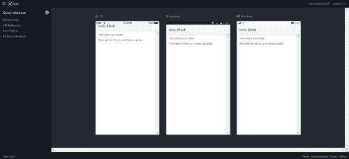

Mobile Platforms View

今天到此结束！我们成功地创建并链接了一个 Ionic 4 应用程序到一个版本控制主机。

### 项目结构

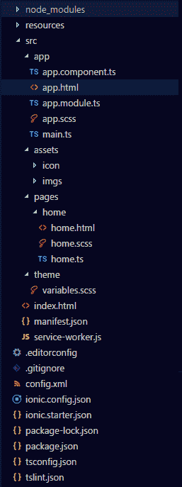

Folder directory

1.  app.module.ts —应用程序的入口点。任何和所有组件、页面、模块和提供者都需要添加到这个文件中，因为它跟踪和控制应用程序使用的许多资源。
2.  app.components.ts —应用程序开始运行时加载的第一个页面，包含您希望首先执行的所有代码。您可能希望用户首先查看的页面，如登录屏幕，放在这个组件中。
3.  app.html——应用程序的模板，其他 UI 页面将装载到该模板上。
4.  app.scss 保存所有 Sass 变量和样式的页面，这些变量和样式将在应用程序中全局使用。

让我们来看看我们将为这个应用程序修改的主要组件，home。

如上所示，home 组件有三个页面；

1.  home.html——页面的视图/用户界面在这里用 HTML 编码。
2.  home.scss —任何特定于页面的样式都将添加到这里，同时还会添加页面中使用的 Sass 变量。
3.  home . ts——操作逻辑，在我们向列表添加新任务的例子中，在这里用 TypeScript 编码。

## 步骤 2 -实现 CRUD 操作

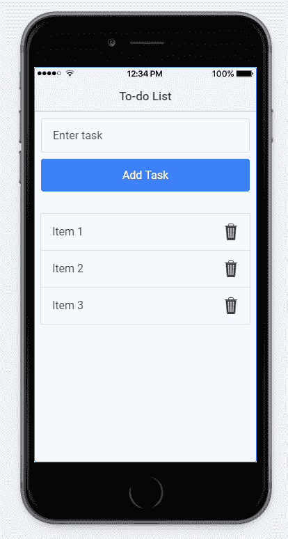

Wireframe of the app

我希望实现如上所述，是一个非常简单的设计；键入任务的文本输入，将任务添加到列表的按钮，查看项目的列表视图，以及最后从列表中删除项目的删除按钮。我以后可能会修改设计。

继续打开你的编辑器。让我们快速浏览一下当前目录中的所有页面和组件。

### 为 C 和 R 创建用户界面

首先，让我们先处理 UI。当你打开 home.html 时，这是页面中的当前代码。

```
<ion-header>
	<ion-navbar>
		<ion-title>Ionic Blank</ion-title>
	</ion-navbar>
</ion-header>
<ion-content padding>
	The world is your oyster.
	<p>If you get lost, the
		<a href="http://ionicframework.com/docs/v2">docs</a>
	will be your guide.
	</p>
</ion-content>
```

然后您可以删除`<ion-content>`标签中的所有内容。这是页面的主体，可以看到这些标签中的元素。

现在在主体中添加一个 input 标签，这样我们就可以在任务中输入，后跟一个按钮，来调用一个方法将任务添加到列表中。

```
<ion-content padding>
	<input type="text" placeholder="Enter task">
	<button>Add Task</button>
</ion-content>
```

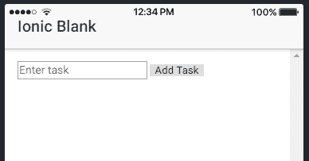

Boring and basic

不好看，对吧？现在让我们添加一些造型！

Ionic 有一个特殊的输入标签`<ion-input>`，里面有一些样式编码，所以继续把无聊的旧标签`<input>`换成`<ion-input>`！

爱奥尼亚也有一些特殊的职业，比如`ion-button`。我还想让按钮位于输入的末尾，而不是正下方。最终的变化是这样的:

```
<ion-content padding>
	<ion-item>
		<ion-input type="text" placeholder="Enter task" [(ngModel)]="taskName"/>
		<div class="item-note" item-end>
			<button ion-button>Add Task</button>
		</div>
	</ion-item>
</ion-content>
```

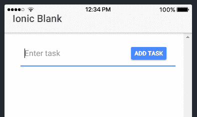

Seamless and sleek

这样好多了，对！？而这一切都不用写任何 CSS！让我们再看一下上面的代码。

`<ion-item>`标签通常与`<ion-list>`元素一起使用。但是，在这里使用它，在这个元素中使用输入，在焦点或使用上给它增加了一种风格。对 div 元素使用类`item-note`允许按钮与输入标签保持一致。这样做，与第一个相比，给出了更无缝和圆滑的设计。由于 Angular 也被集成到 Ionic 中，我们可以使用 ngModel 轻松地将视图中的值链接到 TypeScript 文件中的值。

Ionic 还带有一个内置的图标包，Ionicons。它使用起来非常简单，一个简单的例子就是用`<ion-icon name="add"></ion-icon>`替换添加任务文本。在这里找到更多关于 Ionicons 的信息。

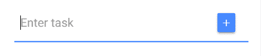

Final input tag

最后的结果！我对它现在的样子很满意，但是你可以自由地在颜色和样式上做更多的尝试。

### 实现创建和读取功能

现在 UI 已经做好了，让我们继续给它一个功能。是时候看看 home.ts 了，你从这样的代码开始；

```
import { Component } from '@angular/core';
import { NavController } from 'ionic-angular';

@Component({
    selector: 'page-home',
    templateUrl: 'home.html'
})

export class HomePage {
    constructor(public navCtrl: NavController) {  }
}
```

让我们快速看一下这里有什么。您可以导入可能需要在页面顶部使用的任何组件或外部模块。接下来的几行描述了您可能编写的许多函数所属的模板，并对其进行操作。最后，您可以编写的所有逻辑。您希望在查看页面或与页面交互之前执行的任何代码都必须写在构造函数中。

因为我们每次都会添加新的待办事项，所以我们需要一个地方来存放它。最简单的方法是初始化一个数组。如果你以前有过 JavaScript 的经验，用 TypeScript 编码将是小菜一碟！

让我们把我们的列表称为 taskList，但是因为我们需要从代码的多个方法中访问这个列表，我们需要在构造函数`taskList = [];`之外初始化它。现在编写代码来处理添加任务按钮 click，姑且称之为`addTask`。我们所要做的就是捕获输入中的文本，并将其推送到数组中。因为我们使用了`ngModel`作为输入标签，所以通过使用`this.taskName`，我们可以很容易地获得标签中的值。向数组中添加值就像`taskList.push(task)`一样简单。我们还需要确保没有空字符串被添加到列表中，所以将上面的语句放在 if 条件中，检查 taskName 是否确实存在。最终的 home.ts 代码；

```
import { Component } from '@angular/core';
import { NavController } from 'ionic-angular';

@Component({
    selector: 'page-home',
    templateUrl: 'home.html'
})

export class HomePage {
    taskList = [];

    constructor(public navCtrl: NavController) {}

    addTask() {
        if (this.taskName.length > 0) {
            let task = this.taskName;
            this.taskList.push(task);
            this.taskName = "";
        }
    }
}
```

> 注意:在 TypeScript 中使用关键字`let`等同于在变量声明中使用`var`。

现在我们可以开始添加新任务了！

但是我们怎么知道正在添加什么呢？？？

简单，好吗？Squeezy！这就是 CRUD 中的 R 的作用！

### 运行代码看看吧

是时候为我们创造一种阅读方式了！(看到我在那里做了什么吗？)?

让我们滚回 home.html。到目前为止，我们已经放置了一个输入标签和一个按钮来添加任务；现在放一个列表来查看它。我们现在需要将方法`addTask()`链接到属性`(click)`中的按钮，这样每次点击都会将一个列表项添加到数组中。

`<ion-list>`是列表视图的特殊离子元素。在其中使用了`<ion-item>`标签来生成所述列表中的每个项目。`*ngFor`是一种显示列表中所有元素的简单方法，通过为每个列表项设置一个标准视图。

最终的 home.html 电码；

```
<ion-header>
	<ion-navbar>
		<ion-title>To-do List</ion-title>
	</ion-navbar>
</ion-header>
<ion-content padding>
	<ion-item>
		<ion-input type="text" [(ngModel)]="taskName" placeholder="Enter task"/>
		<div class="item-note" item-end>
			<button ion-button (click)="addTask()"><ion-icon name="add"></ion-icon></button>
		</div>
	</ion-item>
	<div padding>
		<ion-list>
			<ion-item *ngFor="let todo of taskList">
				{{todo}}
			</ion-item>
		</ion-list>
	</div>
</ion-content>
```

变量`todo`是列表`taskList`中 for 循环(ngFor)的当前索引中元素的临时存储，如 home.ts 中所声明的。

准备好看我们目前的应用了吗？

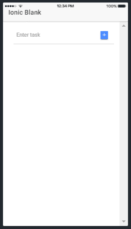

我们做到了！！有用！！？？？？

但那只是创建和读取。仍然需要实现更新和删除。

我们将首先从改变 GUI 开始，以便它能够适应更新和删除功能。此后，转到 TypeScript 代码，以展示其功能。

### 更改外观以包含 U 和 D 的处理程序

哎呦！小健忘 ole 我！首页的 app 名字没改…？？？

你想怎么叫就怎么叫吧(我会用‘待办事项清单’做基础)。

要在 home.html 中完成的第一步是在每个列表项的左侧添加删除按钮。那很简单！重用我用来在`<ion-item>`中的输入旁边包含`addTask`按钮的相同代码，用类 item-note 将该按钮嵌套在 div 中，但是将+改为？️icon(现在不想搞混了，对吧？).因为这是一个按钮，所以将事件处理程序命名为`deleteTask()`。按钮还会有另一个样式类`clear`，给它一个清晰的背景。由于该按钮将位于`<ion-list>`中的`<ion-item>`内，因此将为列表中的所有项目生成该按钮。

我们需要在列表中添加另一个按钮来编辑每个任务。幸运的是更多的代码拷贝！复制整个按钮标签，但是替换图标？️到✏️，点击处理器到`updateTask()`。

每个`<ion-item>`标签的代码现在看起来像这样

```
<ion-item *ngFor="let todo of taskList; let i = index">
	{{todo}}
	<div class="item-note" item-end>
		<button ion-button clear (click)="updateTask(i)">
			<ion-icon name="create"></ion-icon>
		</button>
		<button ion-button clear (click)="deleteTask(i)">
			<ion-icon name="trash"></ion-icon>
		</button>
	</div>
</ion-item>
```

语句`let i = index`获取列表中特定元素的索引，这样我们可以将它传递给方法，这样只有要删除的元素会受到影响。

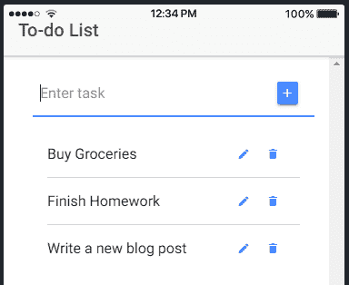

很整洁，是吧？？

我很喜欢它，它看起来比我最初设计的线框好多了。

### 实现更新和删除功能

现在添加功能到我们的？️和✏️.

我们需要在 home.ts 中创建一个名为`deleteTask()`的新方法，如上面的 home.ts 所述。我们从`ngFor`循环中传递数组的索引，因此我们知道要删除的任务的确切位置。跳到 home.html，在`deleteTask`方法中传递参数`i`，它是数组中元素的索引，就像这样`deleteTask(i)`。当您已经将索引传递给 home.ts 时，您只需在数组上使用`splice()`方法来删除所需的任务，将要删除的项目的索引作为参数传递，就像这样`this.taskList.splice(index, 1);`。

`deleteTask`方法的代码是:

```
deleteTask(index){
    this.taskList.splice(index, 1);
}
```

又短又甜！？这就是我们删除任务所需的全部编码！

现在更新，这将需要更多的输入(耐心等待)！

我的计划是打开一个警告，要求用户输入任务的更新文本。为此，我们需要导入`AlertController`，一个在`ionic-angular`中找到的模块。您使用这行代码导入它。

```
import { NavController, AlertController } from 'ionic-angular';
```

然后你需要在构造函数中初始化它，就像这样；

```
constructor(public navCtrl: NavController, public alertCtrl: AlertController)
```

然后，您需要在`updateTask`方法中创建一个警报来捕获新的任务名称。为此，您需要将以下内容传递到 AlertController 的 create 方法中；

1.  标题—消息的标题。
2.  消息—更长的消息(如果需要)。
3.  输入—输入字段及其名称和占位符(如果有)。
4.  按钮—按钮及其角色或处理程序(如果有)。

随后可以用简单的`alert.present()`命令显示警报。我将有两个按钮，一个是取消按钮，第二个是编辑按钮，处理程序代码将简单地接受输入的任务，并用数组中的前一个值进行切换。`updateTask()`方法的代码；

```
updateTask(index) {
    let alert = this.alertCtrl.create({
        title: 'Update Task?',
        message: 'Type in your new task to update.',
        inputs: [{ name: 'editTask', placeholder: 'Task' }],
        buttons: [{ text: 'Cancel', role: 'cancel' },
                  { text: 'Update', handler: data => {
                      this.taskList[index] = data.editTask; }
                  }
                 ]
    });
    alert.present();
}
```

现在应该一切正常了！

想看看最终的 CRUD 应用吗？

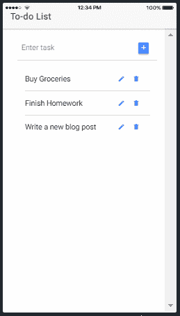

现在你知道了！？？

一个完全可操作的 CRUD 待办事项列表，代码最少！离子就是这么简单。

我仍然相信我们可以让它变得更加用户友好。向下滚动查看更多附加功能。

### 奖金！！—自动对焦

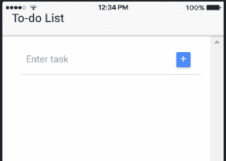

Input without autofocus

你知道我讨厌什么吗？每次我想添加一个新任务时，我都需要点击输入，即使是在开始的时候。为什么不在点击按钮后自动聚焦输入？

这正是我们要做的！

Ionic 上的自动聚焦不像在经典的 HTML/JavaScript 交互中那么容易。您需要导入一个名为`ViewChild`的额外组件。然后，您可以轻松地将视图(home.ts)的输入连接到控制器(home.ts)，并对其进行操作。你导入它，像这样；

```
import { Component, ViewChild } from '@angular/core';
```

然后，您可以使用下面这行代码，在构造函数外部将输入标记连接到组件，

```
@ViewChild('taskInput') input;
```

`taskInput`是 home.html 页面上输入标签的 id。继续将`#taskInput`添加到输入标签中。现在可以从 TypeScript 文件中直接处理输入标记。

Ionic 附带了一些方法，可以在某些应用程序事件上调用，比如当页面加载到视图上、卸载等等。这些被称为生命周期事件，更多信息可以在[这里](https://ionicframework.com/docs/api/navigation/NavController/?source=post_page---------------------------)找到。通过设置超时，我们可以让应用程序自动聚焦于来自`ionViewDidLoad()`的输入。代码应该是:

```
ionViewDidLoad(){
    setTimeout(() => {
        this.input.setFocus();
    },350);
}
```

在您将行`this.input.setFocus();`添加为`addTask()`处理程序中的最后一条语句后，自动聚焦才能工作。让我们去看看我们所做的改变吧！


Input with autofocus

现在这就是你所谓的天衣无缝…？

## 步骤 3 -集成 Firebase 身份验证

Firebase 拥有一切，从授权到数据库到文件存储，这是它成为移动应用程序的好选择的众多原因之一。在这篇文章中，我们将探索 Firebase，创建一个项目，并在应用程序中为 Firebase 创建一个处理程序组件。

### 设置 Firebase 控制台

但是首先，你需要在 Firebase 控制台上创建一个项目。你只需要一个谷歌账号就可以访问 Firebase。所以，从这里的开始吧。添加一个新项目并给它起个名字(我刚刚把我的项目叫做“任务”)，同意他们的所有要求，然后点击“创建项目”。

现在来设置项目以满足我们的需求。

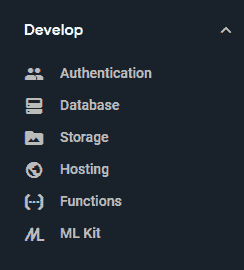

我们将访问的所有 Firebase 区域都将在“开发”下找到。

即；

1.  证明
2.  和数据库。

让我们来看看认证。

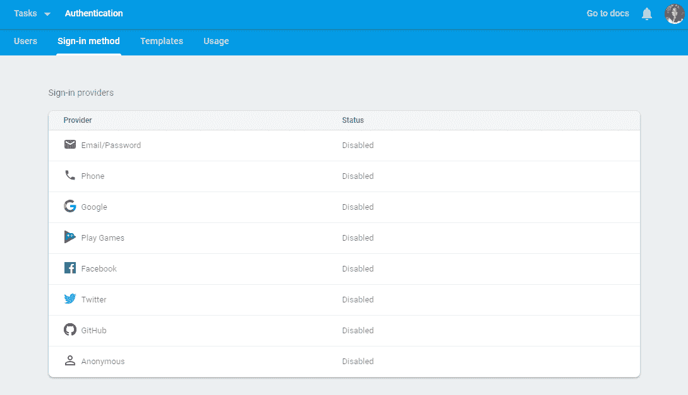

如您所见，所有身份验证方法都已被禁用。现在启用最基本的类型，电子邮件/密码，所以我们可以开始使用它来注册一个帐户。

在模板下，可以找到许多用于验证电子邮件地址以忘记密码的电子邮件模板。如果您愿意，您可以更改一些细节，比如要显示的项目名称和发送者的姓名。

现在，前进到数据库部分。Firebase 有两种类型的数据库；

1.  实时数据库——一个 NoSQL 数据库，看起来像一个大的 JSON 对象。
2.  cloud Firestore——文档的集合，本质上是 JSON 对象。

Firestore 是更好的选择，因为与普通的实时数据库相比，它具有更好的结构。在实时数据库中，任何人都可以在任何地方写数据，如果他们有对数据库的引用的话，这会极大地影响所有存储的数据。因此，我选择 Firestore 并在测试模式下创建数据库，这样我们就可以评估数据库。

测试模式下的 Firestore 确实允许任何人对其进行读取和写入，所以让我们规定只有注册了该应用程序的用户才能访问数据库。为此，将`allow read, write: if false;`切换为`allow read, write:if request.auth.uid!=null;`。只有注册用户才有唯一的 uid，用来区分他们。通常，uid 被用作用户对象的 id。我将为这个项目实施同样的。

一旦规则改变，我们需要创建一个集合，这样我们所有的用户文档都可以放入其中。因为我们不能拥有一个没有至少一个文档的集合，所以创建一个伪用户。您可以稍后从仪表板中删除它。

既然我们已经设置了 Firebase 仪表板，那么让我们继续将 Firebase 集成到应用程序中。

### 将 Firebase 链接到应用程序

你可以下载一个特殊的模块`AngularFire`,使用 npm 将 Firebase 整合到 Ionic 应用程序中。要下载，输入`npm install firebase angularfire2 --save`。

要使用这个模块，您需要将其导入 app.module.ts 页面，如下所示

```
import { AngularFireModule } from 'angularfire2';
import { AngularFireAuthModule } from 'angularfire2/auth';
import { AngularFirestoreModule } from 'angularfire2/firestore';
```

我们还需要为应用程序添加必要的配置数据，以访问和使用正确的数据库。这可以在项目概述部分找到，“将 Firebase 添加到您的 web 应用程序中”。您需要调用 JSON 对象 firebaseConfig，并在导入后初始化它。

```
export const firebaseConfig = {
    apiKey: "#######################################",
    authDomain: "###########.firebaseapp.com",
    databaseURL: "https://###########.firebaseio.com",
    projectId: "###########",
    storageBucket: "###########.appspot.com",
    messagingSenderId: "############"
};
```

最后一步！您需要将上面导入的模块包含到包含应用程序中使用的所有组件的`@NgModule`的导入数组中，初始化 AngularFireModule 以及上面的 config 对象。

```
@NgModule({
    ...
    imports: [
        ...
        AngularFireModule.initializeApp(firebaseConfig), 
        AngularFireAuthModule, 
        AngularFirestoreModule
    ]
})
```

AngularFireAuthModule 附带了许多关于授权的方法，如注册、登录、忘记密码等。我们将使用的所有方法都可以在 AngularFireAuth 的 auth 属性中找到。正在使用的方法有:

1.  `signInWithEmailAndPassword()` —登录
2.  `createUserWithEmailAndPassword()` —注册
3.  `sendPasswordResetEmail()` —重置密码
4.  `signOut()` —注销

### 实现所有身份验证逻辑

我们需要添加一个监听器，检查用户是否已经登录，并显示正确的响应。我们需要在 app.component.ts 中添加侦听器，因为它是加载的应用程序的第一页。

```
const authObserver = afAuth.authState.subscribe(user => {
    if (user) {
        this.rootPage = HomePage;
        authObserver.unsubscribe();
    } else {
        this.rootPage = LoginPage;
        authObserver.unsubscribe();
    }
});
```

导入必要的其他模块，如 HomePage、LoginPage 和 AngularFireAuth。

让我们首先开始编写注册页面的代码。

首先，向应用程序添加一个新页面。有两种方法可以做到这一点；

1.  在 src 的 pages 文件夹中创建一个新文件夹，并创建单独的。scss，。ts 和。html 文件。
2.  或者，懒(像我？)并在控制台中键入`ionic g page <name of page>`。这三个文件都是自动生成的！

由于我们需要对登录、注册和忘记密码页面中输入的数据进行许多验证，我们需要利用一个表单组来跟踪表单中的所有字段，并为每个字段添加任何和所有验证，例如检查电子邮件是否看起来像实际的电子邮件、密码长度等。我们将首先设计页面的视图。在 register.html，表单标签看起来像这样；

```
<form [formGroup]="signupForm" (submit)="signupUser()" novalidate>
```

`novalidate`被用作正在被添加的实际验证。ts 文件到表单组`signupForm`。

然后复制我们一直用来在主页中添加任务名称的条目标签(但是这次删除按钮、id 和`[(ngModule)]`)!).为用户的全名、电子邮件、密码和确认密码添加标签。后两者的输入标签类型是电子邮件标签的密码和电子邮件。您还需要为每个输入标签添加一个`formControlName`。添加一个 submit 类型的按钮来提交表单。您的注册页面的主体现在必须看起来像这样；

```
<form [formGroup]="signupForm" (submit)="signupUser()" novalidate>
  <ion-item>
    <ion-input formControlName="firstName" type="text" placeholder="First Name"></ion-input>
  </ion-item>
  <ion-item>
    <ion-input formControlName="lastName" type="text" placeholder="Last Name"></ion-input>
  </ion-item>  
  <ion-item>
    <ion-input formControlName="email" type="email" placeholder="Email"></ion-input>
  </ion-item>
  <ion-item>
    <ion-input formControlName="password" type="password" placeholder="Password"></ion-input>
  </ion-item>
  <ion-item>
    <ion-input formControlName="retype" type="password" placeholder="Confirm Password"></ion-input>
  </ion-item>
  <ion-grid>
    <ion-row>
      <ion-col style="text-align: center">
        <button ion-button center-all type="submit" [disabled]="!signupForm.valid">Create an Account</button>
      </ion-col>
    </ion-row>
  </ion-grid>
<form>
```

Register 按钮是禁用的，直到现在让我们在 register.ts 页面中为每个输入添加验证器。我们需要将以下模块导入页面顶部，

```
import { FormBuilder, FormGroup, Validators } from '@angular/forms';
```

在构造函数之外初始化窗体组，这样就可以从组件中的任何地方访问它；`public signupForm: FormGroup`并初始化表单构建器里面传递给构造器的参数，就像这样；

```
constructor(public navCtrl: NavController, public navParams: NavParams, public formBuilder: FormBuilder){}
```

验证器将被添加到构造函数内的表单中，如下所示；

```
this.signupForm = formBuilder.group({
  email: ['', Validators.compose([Validators.required])],
  password: ['', Validators.compose([Validators.minLength(6), Validators.required])],
  retype: ['', Validators.compose([Validators.minLength(6), Validators.required])],
  firstName: ['', Validators.compose([Validators.maxLength(30), Validators.pattern('[a-zA-Z ]*'), Validators.required])],
  lastName: ['', Validators.compose([Validators.maxLength(30), Validators.pattern('[a-zA-Z ]*'), Validators.required])]
});
```

`Validators.compose`根据参数中传递的验证，为值创建验证检查。这些验证器中的大多数都是不言自明的。模式验证器检查该值是否符合特定的正则表达式。但还有一个问题，如何验证一封电子邮件看起来是否像电子邮件？显然，我们需要做一个…

但是不用担心！这很简单，唯一的逻辑是看它是否符合某个正则表达式。

我们需要在 src 文件夹中创建一个新文件夹‘validators’并在其中创建一个文件'`email.ts`'。我们将声明一个静态方法来检查电子邮件。在验证电子邮件时，我们将`formControl`发送给验证器，因此在这种情况下，我们需要导入`FormControl`。一旦根据正则表达式测试了电子邮件，我们需要返回一个值来传达电子邮件是否有效。电子邮件验证程序的最终代码是:

```
import { FormControl } from '@angular/forms';

export class EmailValidator {  
  static isValid(control: FormControl) {
    const re = /^([a-zA-Z0-9_\-\.]+)@([a-zA-Z0-9_\-\.]+)\.([a-zA-Z]{2,5})$/.test(control.value);
    if (re) {
      return null;
    }
    return {
      "invalidEmail": true
    };
  }
}
```

现在将`EmailValidator`导入到 register.ts 中，并将其添加到用于电子邮件输入的`Validators.compose`方法的数组中。

```
this.signupForm = formBuilder.group({
    email: ['', Validators.compose([Validators.required, EmailValidator.isValid])],
    ...
});
```

这就是验证方面的内容。

您可以做的另一个添加的特性是在输入的正下方显示一条错误消息，或者如果验证返回 false，甚至让输入标签变成红色。错误消息的代码；

```
<ion-item class="error-message" *ngIf="!signupForm.controls.email.valid  && signupForm.controls.email.dirty">
    <p>Please enter a valid email.</p>
</ion-item>
```

`*ngIf`允许您仅在验证为假时显示错误。错误应该放在每个标签的正下方，相应地改变消息和输入名称(在上面的例子中是“email”)。

验证错误时红色输入的代码；

```
[class.invalid]="!signupForm.controls.email.valid && signupForm.controls.email.dirty"
```

将它添加到每个输入中，再次相应地更改输入的名称。

现在来处理按钮点击！

创建方法`signupUser()`。我们将使用 AngularFireAuth 模块的方法`createUserWithEmailAndPassword()`。这将返回一个承诺，我们需要捕获该承诺，并根据结果处理用户的登录或显示错误消息。为了使它更加用户友好，在注册的时候也向用户显示一个装载转盘。

由于该按钮仅在整个表单有效时才启用，因此我们不需要重新检查该事实。我们将首先检查密码和重新输入的密码是否相同，如果相同，则创建新用户并将他们的信息添加到 Firestore。如果两者不同，则在警报中显示一条错误消息，说明它们不同。

```
signupUser() {
  if (this.signupForm.value.password == this.signupForm.value.retype) {
    this.afAuth.auth.createUserWithEmailAndPassword(this.signupForm.value.email, this.signupForm.value.password)
      .then(() => {
        let userId = this.afAuth.auth.currentUser.uid;
        let userDoc = this.firestore.doc<any>('users/' + userId);
        userDoc.set({
          firstName: this.signupForm.value.firstName,
          lastName: this.signupForm.value.lastName,
          email: this.signupForm.value.email
        });
        this.navCtrl.setRoot(HomePage);
      }, (error) => {
        this.loading.dismiss().then(() => {
          let alert = this.alertCtrl.create({
            message: error.message,
            buttons: [{ text: "Ok", role: 'cancel' }]
          });
          alert.present();
        });
      });

    this.loading = this.loadingCtrl.create({
      dismissOnPageChange: true,
      content: "Signing up.."
    });
    this.loading.present();
  } else {
    let alert = this.alertCtrl.create({
      message: "The passwords do not match.",
      buttons: [{ text: "Ok", role: 'cancel' }]
    });
    alert.present();
  }
}
```

您需要额外导入`AlertController`、`Loading`、`LoadingController`、`AngularFirestore`和`HomePage`。

`loading`需要在构造函数之外声明，这样它就可以被所有的方法访问。`AlertController`、`LoadingController` 和`AngularFirestore`需要在构造函数参数中初始化。

(最后)注册页面完成了！


咻！？？这是我写过的最长的帖子。还有更多的事情要做…..

但是不用担心！剩下的都只是复制+粘贴。

下一个要处理的页面是登录页面。将整个注册页面的表格复制到 login.html，因为是时候做一些修改来适应登录了。删除名字、姓氏和重新输入的密码的输入标签和错误消息。在表单标签上，将`signupForm`的所有实例更改为`loginForm`。

将提交按钮的文本改为“登录”，将`onSubmit`方法改为`loginUser()`。在表单外部添加两个按钮，导航到注册和重置密码页面。`login.html`的最终主体；

```
<form [formGroup]="loginForm" (submit)="loginUser()" novalidate>
  <ion-item>
    <ion-input formControlName="email" type="email" placeholder="Email" [class.invalid]="!loginForm.controls.email.valid && loginForm.controls.email.dirty"></ion-input>
  </ion-item>
  <ion-item class="error-message" *ngIf="!loginForm.controls.email.valid  && loginForm.controls.email.dirty">
    <p>Please enter a valid email.</p>
  </ion-item>
  <ion-item>
    <ion-input formControlName="password" type="password" placeholder="Password" [class.invalid]="!loginForm.controls.password.valid && loginForm.controls.password.dirty"></ion-input>
  </ion-item>
  <ion-item class="error-message" *ngIf="!loginForm.controls.password.valid  && loginForm.controls.password.dirty">
    <p>Your password must be more than 6 characters long</p>
  </ion-item>
  <ion-grid>
    <ion-row>
      <ion-col style="text-align: center">
        <button ion-button center-all type="submit" [disabled]="!loginForm.valid">Login</button>
      </ion-col>
    </ion-row>
  </ion-grid>
</form>
<button ion-button block clear color="danger" (click)="resetPwd()">
  I forgot my password
</button>
<button ion-button block clear (click)="createAccount()">
  Create a new account
</button>
```

你有它！UI 做好了。

`loginForm` 对于电子邮件和密码字段有相同的验证器。因此，继续复制相同的`formBuilder`，省略名字、姓氏和重新输入的密码字段。

```
this.loginForm = formBuilder.group({
    email: ['', Validators.compose([Validators.required, EmailValidator.isValid])],
    password: ['', Validators.compose([Validators.minLength(6), Validators.required])]
});
```

`loginUser()`方法的代码类似于`signupUser`方法的代码。所以也把它复制到 login.ts 上。要做的更改是删除密码比较和访问数据库。

```
loginUser() {
 this.afAuth.auth.signInWithEmailAndPassword(this.loginForm.value.email, this.loginForm.value.password).then(() => {
   this.navCtrl.setRoot(HomePage);
 }, (error) => {
   this.loading.dismiss().then(() => {
     let alert = this.alertCtrl.create({
       message: error.message,
       buttons: [{ text: "Ok", role: 'cancel' }]
     });
     alert.present();
   });
 });
 this.loading = this.loadingCtrl.create({
   dismissOnPageChange: true,
   content: "Logging in.."
 });
 this.loading.present();
}
```

除了 AngularFirestore 之外，您还需要将额外的模块导入 login.ts，因为您现在不能访问数据库。

现在来处理重置密码和注册页面的按钮；

```
resetPwd() {
    this.navCtrl.push(ResetPasswordPage);
}

createAccount() {
    this.navCtrl.push(RegisterPage);
}
```

这些页面像一个堆栈一样工作；您将下一页推到堆栈的顶部，并从顶部弹出。

请原谅，我们还有一页要写。耶！更多复制+粘贴！

对于重置密码，我们只需要电子邮件字段，但仍然需要一个表单来验证输入的电子邮件。与登录页面非常相似，复制整个 login.html 表单，删除除电子邮件输入标记和错误消息之外的所有字段，将所有的`loginForm` 实例改为 resetPwdForm。你只剩下；

```
<form [formGroup]="resetPwdForm" (submit)="resetUserPwd()" novalidate>
  <ion-item>
    <ion-input formControlName="email" type="email" placeholder="Email" [class.invalid]="!resetPwdForm.controls.email.valid && resetPwdForm.controls.email.dirty"></ion-input>
  </ion-item>
  <ion-item class="error-message" *ngIf="!resetPwdForm.controls.email.valid  && resetPwdForm.controls.email.dirty">
    <p>Please enter a valid email.</p>
  </ion-item>
  <ion-grid>
    <ion-row>
      <ion-col style="text-align: center">
        <button ion-button center-all type="submit" color="danger" [disabled]="!resetPwdForm.valid">Reset Password</button>
      </ion-col>
    </ion-row>
  </ion-grid>
</form>
```

对 reset-password.ts 文件执行同样的操作。表单生成器如下所示:

```
this.resetPwdForm = formBuilder.group({
    email: ['', Validators.compose([Validators.required, EmailValidator.isValid])]
});
```

而`resetUserPwd()`方法看起来是这样的；

```
resetUserPwd() {
 this.afAuth.auth.sendPasswordResetEmail(this.resetPwdForm.value.email).then((user) => {
   let alert = this.alertCtrl.create({
     message: "We just sent a link to reset your password to your email.",
     buttons: [{ text: "Ok", role: 'cancel',
       handler: () => {
         this.navCtrl.pop();
       }}]
   });
   alert.present();
 }, (error) => {
   let errorAlert = this.alertCtrl.create({
     message: error.message,
     buttons: [{ text: "Ok", role: 'cancel' }]
   });
   errorAlert.present();
 });
}
```

一旦发送了链接请求，上面的处理程序代码就会弹出重置密码页面来显示登录页面。

最后一部分(真对不起！我也很累)…？？

注销按钮，最简单最小的代码！

你需要在首页的页眉末尾放一个按钮，如下图所示；

```
<ion-header>
	<ion-navbar>
		<ion-title>To-do List</ion-title>
		<ion-buttons end>
			<button ion-button (click)="logout()">Logout</button>
		</ion-buttons>
	</ion-navbar>
</ion-header>
```

在 home.ts 中处理注销的代码；

```
logout() {
    return this.afAuth.auth.signOut().then(authData => {
        this.app.getRootNav().setRoot(LoginPage);
    });
}
```

“then”后面的代码将用户带回到登录页面。

就是这样！终于！？？

为了允许应用程序使用这些页面，您需要将它们包含在 app.module.ts 页面中，包含在声明和`entryComponents` 数组中，如下所示；

```
@NgModule({
    ...
    declarations: [
        ...
        LoginPage, 
        RegisterPage, 
        ResetPasswordPage
    ],
    ...
    entryComponents: [
        ...
        LoginPage, 
        RegisterPage, 
        ResetPasswordPage
    ]
})
```

让我们看看迄今为止我们所取得的成就。

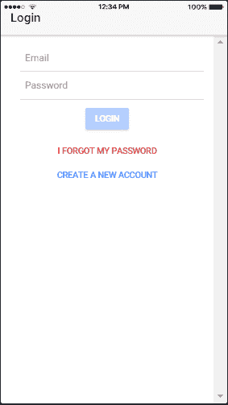

App with Authentication

现在你知道了！？？对眼睛来说不那么容易，但绝对是功能性的。

如您所见，当特定字段的验证返回 false 时，输入变为红色，同时显示错误消息。按钮保持禁用状态，直到表单的所有字段都有效！

下面，用户对象也存储在 Firestore 中，当前用户的 uid 作为文档的键。一切正常！

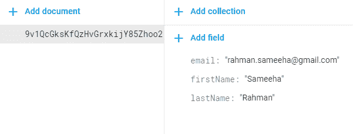

Firestore Document

既然已经实现了身份验证和扩展用户对象，我们现在继续将 CRUD 操作与 Firebase Cloud Firestore 同步。

## 步骤 4 -将 CRUD 操作与云 Firestore 同步

编码将非常简单，因为我们已经将 AngularFire 集成到我们的应用程序中。主要的修改将只针对 home.ts 文件中的后端逻辑，以及对 home.ts 的一个简单添加，以处理我们从 Firestore 获得的列表。

### CRUD to Firestore 中的 C

我们将首先从向`addTask()`方法添加功能开始。但首先我们需要将 AngularFirestore 导入 home.ts，并在构造函数中初始化它，就像这样；

```
constructor(...public firestore: AngularFirestore) {}
```

正如上一篇文章中提到的，Firestore 不像它的前身，它不是一个大的 JSON 结构。相反，它使用一种叫做文档的东西。每个文档都是一个唯一的 JSON 对象，它只保存一种类型的数据，例如，user 对象只保存用户数据，比如他们的姓名、出生日期和其他个人信息，而不保存任何其他数据。

许多相同类型的文档构成一个集合。有时一个对象内部可以有不同对象的集合，这就是我们今天所做的；为每个用户创建一个任务对象集合。

如果您还记得，在上一篇文章中，我们获取了用户的 uid，这是 Firebase 分配给所有注册用户的唯一 id，作为用户 JSON 对象的 ID。我们今天也将非常需要它，所以首先要做的是从 AngularFireAuth 捕获 uid。因为许多方法将使用这个值，所以最好在构造函数外部声明这个变量，然后在`ionViewDidLoad`内部初始化它。

我们把它放在`ionViewdidLoad()`中，因为有时来自 AngularFireAuth 的用户细节没有被构造函数准备好。因为我们将只访问用户对象中的那个集合，所以也要获取它，类似于注册页面。所有这些都添加到获取 userId 的调用中。

```
this.afAuth.authState.subscribe(user => {
    if (user) {
        this.userId = user.uid;
        this.fireStoreTaskList = this.firestore.doc<any>('users/' + this.userId).collection('tasks').valueChanges();
        this.fireStoreList = this.firestore.doc<any>('users/' + this.userId).collection('tasks');
    }
});
```

我们有两个列表的原因是,`fireStoreTaskList`保存我们查看的列表，而`fireStoreList`是我们直接添加新任务的集合的引用。方法`valueChanges()`返回一个可观察的列表，我们可以在视图中显示它。

我们现在可以在页面的任何地方使用这个引用。用它在`addTask`方法中添加一个任务非常简单。每个任务都需要有一个特定的 ID，因为我们在尝试更新 taskName 时会用到它，所以我们需要生成 ID 并使用 firestore 集合的`set()`方法，在 if 条件中创建一个新的任务对象，替换之前将任务名推入`taskList`的代码。

```
let id = this.firestore.createId();
this.fireStoreList.doc(id).set({
    id: id,
    taskName: task
});
```

### 应用程序中 CRUD 中的 R

现在来设置查看 firestore 列表。主要的部分，获得集合已经完成了。因此，现在需要对 home.html 进行更改以查看`fireStoreTaskList`。

第一个变化是在列表的名称`*ngFor`中。因为这个列表是 firebase 返回的响应，所以它是异步的。正常的`*ngFor`，会引起错误。我们还需要添加一个异步管道，就像这样；

```
<ion-item *ngFor="let todo of fireStoreTaskList | async">
```

我们不再需要跟踪索引，因为我们将使用任务 ID 来删除或更新它的值。第二个变化是我们将查看的值，因为 todo 现在将是一个对象，我们需要显示 todo.taskName，因为这是我们在任务对象中命名的任务变量。

```
{{todo.taskName}}
```

就是这样！现在让我们看看应用程序和 Firestore，看看它是否被保存。

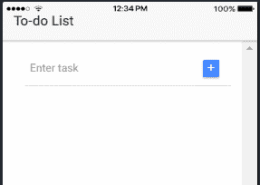

Create and Read tasks

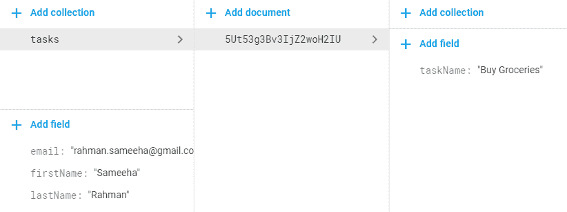

Newly created task

它得救了！

对于 CRUD 中的 C 和 R 来说没什么大不了的。现在更新然后删除。

### 从 crud 到 firestorm 的 u

幸运的是，AngularFirestore 有自己的更新功能，给定文档的 ID 和要更新的值，只需一行就可以完成。但是首先，在 home.html 的文件中有一个小的变化，允许这种情况发生。如前所述，您不需要列表中任务的索引来更新或删除，而是需要文档 id，我们只是将它存储在任务对象的变量 ID 中。

我们的第一个任务是将任务的 id 从按钮发送到方法，就像这样；

```
<button ion-button clear (click)="updateTask(todo.id)">
```

移至 home.ts 并将警报处理程序中的代码替换为；

```
this.fireStoreList.doc(index).update({ taskName: data.editTask });
```

我们首先使用`doc()`方法创建对用户希望更新的特定对象的引用，然后将我们希望更新的相关数据发送到`update()`方法中。

现在来看看这项功能的实际应用吧！

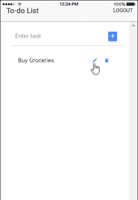

Update task name

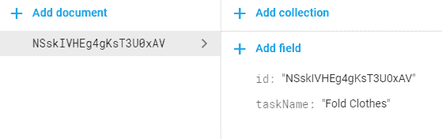

Updated task name

这个也行！

现在到最后一个变化，删除。

### crud 到 firestorm 中的 d

删除和更新一样简单(或者更简单)。

您将再次需要将任务的 ID 传递到删除按钮上；

```
<button ion-button clear (click)=”deleteTask(todo.id)”>
```

同样像更新一样，AngularFirestore 有一个函数`delete()`，它运行在要删除的文档的引用上，就像这样；

```
this.fireStoreList.doc(index).delete();
```

现在来看最后一个功能…

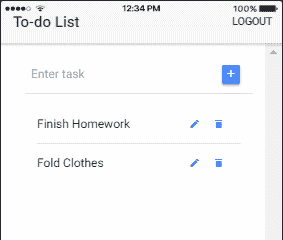

Delete task

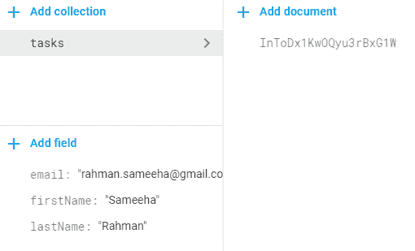

Task deleted in Firestore

这个也很实用！

如您所见，ID 为“NSskIVHEg4gKsT3U0xAV”的“折叠衣服”任务不再存在，因为它已被成功删除

你有它！Firebase 集成到所有 CRUD 操作中。

## 步骤 5 -奖励内容样式

这是一个简短的清单，列出了之前帖子中没有提到的基本内容；

1.  自定义样式？
2.  影像呢？️
3.  自定义字体？

### 美化用户界面

浏览我的应用程序，我能够看到一些我想改变的东西。

还记得登录、注册和重置密码页面中输入字段下面的那些小消息吗？

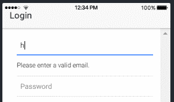

Error message with underline

我刚刚意识到，由于它们本质上是`<ion-item>`，它们在底部有一条线。没那么好。

谢天谢地，这是一个简单的修复！有一个名为`no-lines`的全局属性，您需要像这样将它添加到`<ion-item>`中；

```
<ion-item ... no-lines>
```

因此，继续将它添加到所有的错误消息`<ion-item>`标签中。


Error message without underline

您的错误消息现在看起来像这样。

让我们继续颜色！

如果您仔细查看了项目结构，您会看到一个名为 theme 的文件夹。中的 variables.scss 文件有一个颜色变量，它有 5 组颜色。保持颜色的明暗，因为他们是，以及危险，因为我们使用它的重置密码按钮和页面。我将只改变主要和次要的颜色。我通常使用[coolors.co](https://coolors.co/1d1e18-6b8f71-aad2ba-d9fff5-b9f5d8?source=post_page---------------------------)为我做过的所有项目寻找补色。

> **免责声明:不要给对象添加超过 5 种颜色，因为这将导致为每种颜色制作多个组件副本。这最终会给项目增加不必要的体积，因为不是所有颜色的组件都被使用。如果需要使用更多的颜色，可以添加一个新的变量来保存颜色。**

我将使用的颜色是:

```
$colors: (
	primary:    #32B596,
	secondary:  #fff350,
	danger:     #f53d3d,
	light:      #f4f4f4,
	dark:       #222
);
```

第一个溅一些颜色的地方是顶部的导航条。

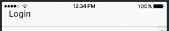

Boring…

看起来很平淡，对吗？？

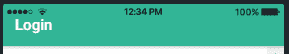

Ooh la la!

不再是了。？？

您所需要做的就是将原色添加到 ion-navbar 标记中，就像这样；

```
<ion-navbar color='primary'>
```

您可以像添加其他组件一样添加颜色属性。比如，给删除图标以危险中存储的颜色，或者给添加和注销按钮以次要颜色；

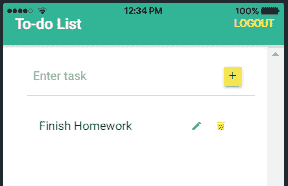

Adding colors everywhere!

我仍然讨厌注销按钮的样子…要使它成为一个合适的按钮，只需将属性 solid 添加到标签中，就像这样；

```
<button ion-button solid color='secondary' (click)="logout()">Logout</button>
```

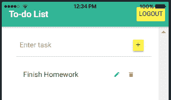

Buttons must look like buttons!

我之前看到的另一个很酷的 UI 设计，在登录、注册和重置密码页面的每个输入标签前都有图标，所以我决定也试一试！这是一个非常简单的代码，你需要把它添加到`<ion-item>`标签中，但是在`<ion-input>`标签之前，就像这样；

```
<ion-item>
	<div class="item-note" item-start>
		<ion-icon name="at" color='primary'></ion-icon>
	</div>
	<ion-input formControlName="email" ...></ion-input>
</ion-item>
```

没有尖叫密码的图标，所以我决定用？就像我看的 UI 设计一样；然后呢。对于用户名

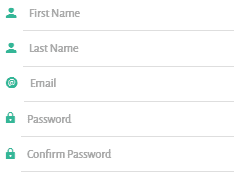

Input icons of the register page

### 添加图像

一张图胜过千言万语…但是我们不需要这样的图片…？不管了！

添加图片不一定很难，但有时路径可能会有点混乱。假设您需要添加从页面到图像文件夹的实际路径，即`../../assets/imgs/imagename.png`。您真正需要添加的路径是从 app.html 到图像文件夹中的图像的路径，该路径看起来像`assets/imgs/imagename.png`。

您希望使用的所有图像都需要添加到文件夹`src/assets/imgs`中。然后，您可以像使用 HTML 一样使用该图像；

```

```

我想添加一个图像，有点像一个标志，登录，注册和重置密码页面。

为了使图像不超出页面，我们还需要编写一些样式，由于该图像将出现在多个页面中，我们需要在 app.scss 页面中编写样式，如下所示；

```
.imageTop {
    height: 200px;
    padding: 20px;
    margin: auto;
    display: block;
}
```

现在您需要做的只是将该类添加到`img`标签`class='imageTop'`中。

另一个(或两个)你可能想改变的图像是启动页面和应用程序图标。要使用该功能，您首先需要添加 Android 和 iOS 平台中的一个(或两个)。添加平台的命令是

```
ionic cordova platform add android
```

或者`ios`，如果那是你喜欢的☕.

当你在终端中运行命令`ionic cordova resources`时，Ionic 可以根据不同的手机轻松生成不同大小的闪屏页面和图标。为此，你需要互联网，因为 ionic 上传了两张图片进行分析，以生成其他 splash 页面和图标。

在此之前，您需要将两个名为`splash.png`和`icon.png`的图像添加到 resources 文件夹中。这两个图像的大小应该分别为 2732*2732 和 1024*1024，以便生成许多 splash 页面和应用程序图标。

以上都是图片！

### 排版 Rox(cks)！

首先，找到一种适合你的字体。最新的趋势是坚持使用非常容易阅读的无衬线字体。尽管许多手写的流畅字体很漂亮，但它们只是等待着失败的发生，就像这个…


I love ?too!

或者这个，


Hope has never looked so bleak!

？？？

玩笑归玩笑，我为这个应用选择了“Alegreya Sans”字体。可以发现，[此处](https://www.fontsquirrel.com/fonts/alegreya-sans?source=post_page---------------------------)。

将所有字体解压到文件夹`assets/fonts`。

现在您需要做的就是将下面的代码添加到`src/theme`文件夹中的 variables.scss 中。

```
@font-face {
	font-family: 'Alegreya Sans Regular';
	src: url("../assets/fonts/AlegreyaSans-Regular.otf");
}
$font-family-base: 'Alegreya Sans Regular';
$font-family-ios-base: 'Alegreya Sans Regular';
$font-family-md-base: 'Alegreya Sans Regular';
$font-family-wp-base: 'Alegreya Sans Regular';
```

`@font-face`导入你的字体并给它一个名字，这样它就可以在整个应用程序中使用。

变量`$font-family-base`指定默认字体。

这个应用程序现在看起来像这样；

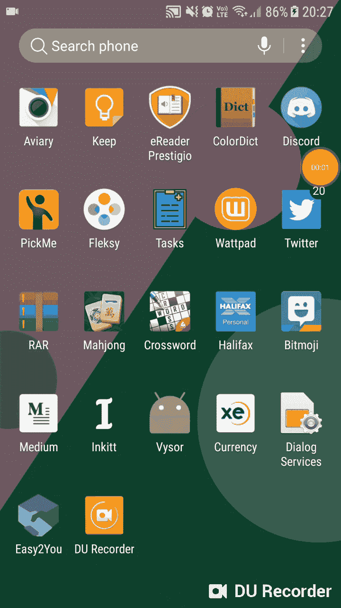

No one needs to see that password!

因为你只能在真实的设备上查看页面和图标，所以我把我可信赖的手机也放了进来(遗憾的是，它并不适合其他的 gif/pics)。

这个系列就到此为止！！！！！？？

找到这个帖子的回购，[这里](https://github.com/samsam-026/Tasks/commit/f54bf2d7e534d31a9ae4962a173053a0044e235e?source=post_page---------------------------)。

我希望你们都玩得开心，并和我一起在这个旅程中学到了很多！

感谢您的阅读，并很快看到你！？？