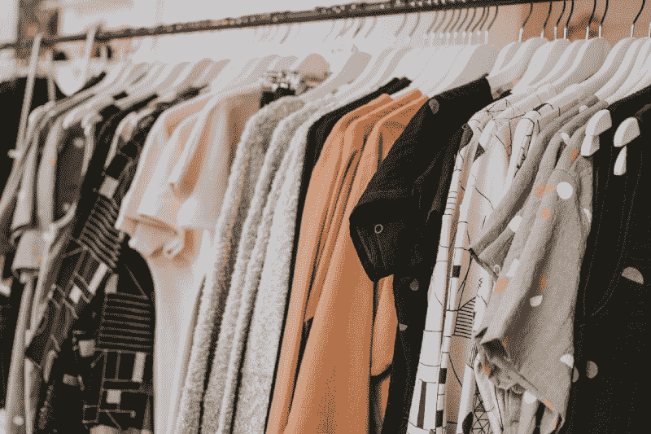
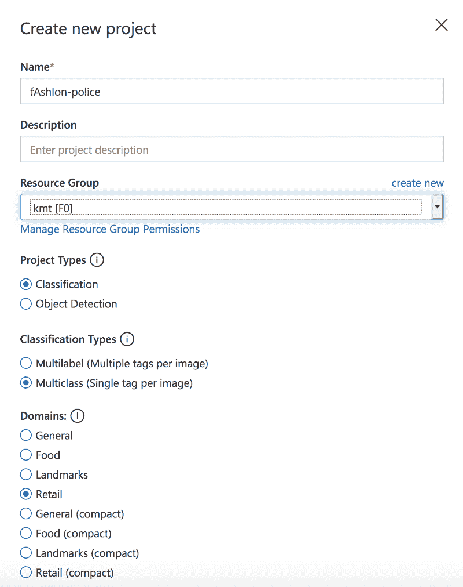
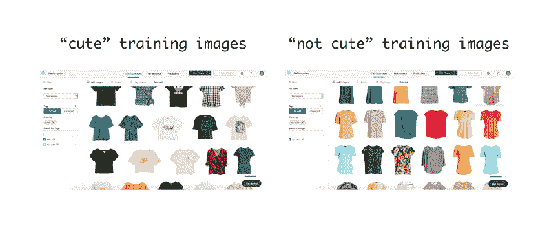
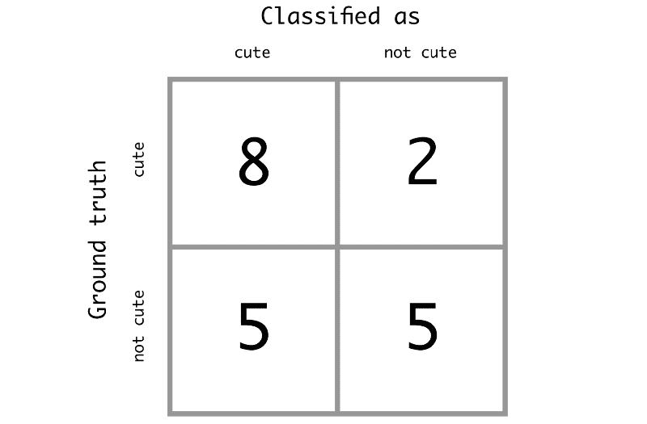
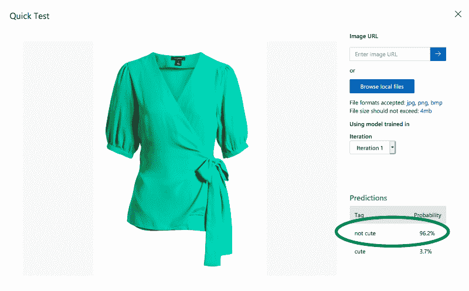
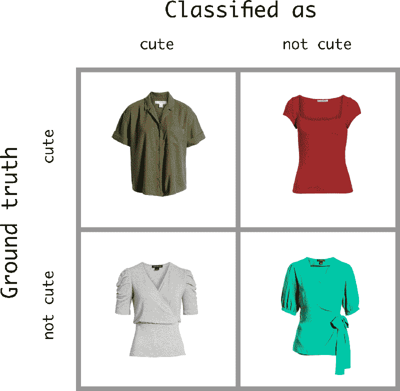
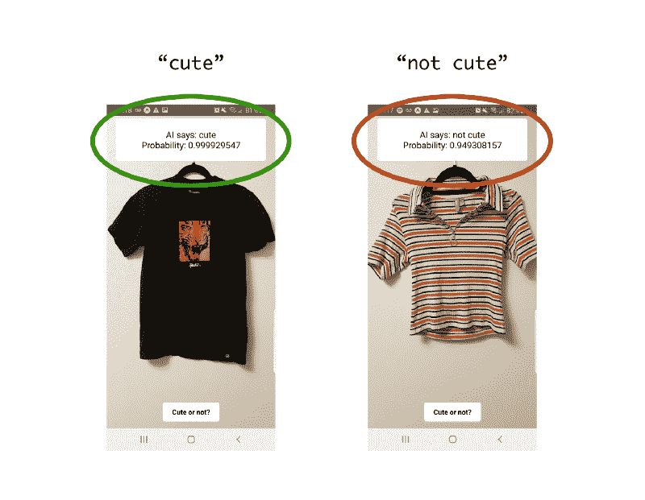

# 如何用 React 原生和现成的 AI 创建“时尚警察”

> 原文：<https://www.freecodecamp.org/news/creating-a-fashion-police-with-react-native-and-off-the-shelf-ai-78b606002aa1/>

凯尔西·王

# 如何用 React 原生和现成的 AI 创建“时尚警察”

想象一下，你刚刚在当地商场偶然走进一家诺德斯特龙超市，迷失在苗条身材的人体模型和高价外套的货架中。或者，更现实地说，你在网上浏览是因为你懒得去商店。你想给你的朋友买一份生日礼物，但是你不知道他们会喜欢什么。他们的风格是怎样的？他们想要一件破洞的黑色衬衫还是一件绿白条纹的毛衣？你应该知道这些，但你不知道。

没必要害怕，因为可定制的人工智能时尚警察就在这里。我们将利用微软的“现成”[定制视觉](https://www.customvision.ai/)服务，根据你提供的数据将衣服分为“可爱”或“不可爱”。如果你在网上购物，你可以在浏览器中测试，但我们也将制作一个简单的 React 原生应用程序，在你可能在店内拍摄的照片上使用人工智能模型。

Do clothing racks intimidate you?? Read on!

当然，品味是主观的，所以最好的部分是你会通过上传他们喜欢和不喜欢的服装图片来定制应用程序，以适应你的朋友(或你的 so，或你自己)的时尚品味。

同样，为了相对容易和快速地做到这一点，我们将使用微软的自定义视觉预测 API。还有其他类似的服务，比如谷歌的 [AutoML Vision](https://cloud.google.com/vision/) 服务。这使得机器学习或计算机视觉经验有限的人可以创建和训练定制模型，例如，对带有不常见标签的图像进行分类。它们相对快速且易于使用，非常适合这类项目。

### 入门指南

要启动这个项目，你必须创建一个 Azure 帐户，并创建一个新项目，等等。Azure 提供免费试用，我只是按照这里的说明[进行操作](https://docs.microsoft.com/en-us/azure/cognitive-services/custom-vision-service/getting-started-build-a-classifier)。

注意事项:确保你“切换目录”到你创建的 Azure 账户——否则它不会让你创建一个新的自定义 vision 项目。此外，当你[制作项目](https://www.customvision.ai/projects)时，请注意我们使用的是多类分类器(更具体地说，是二进制分类器)，因为每张图片只需要标注“可爱”或“不可爱”。

Creating the new project

一旦你决定了你想要创建一个人工智能模拟谁的风格(让我们把这个人称为*被预测者*)，你将需要收集关于被预测者风格的信息。越多越好。因为我们很难看到预测模型是如何训练的，也不能调整它的任何部分，所以我们必须把它当作一个黑盒。然而，与大多数数据驱动的人工智能系统一样，你给它提供的高质量、多样化的数据越多，它的表现就越好。

### 帮朋友网购？不需要 app！

首先，我测试了人工智能的网上购物能力。这很容易，因为我只是截屏了我喜欢和不喜欢的衣服的图片，并将其提供给模特。没有必要为此建立一个应用程序——你只需要训练它，并在[浏览器](https://www.customvision.ai)中使用它。

#### 训练人工智能

Nordstrom 在这方面做得非常好，因为他们出售的每件商品都有没有人穿的照片，这些照片是在非常相似的光线条件和背景下拍摄的。我的假设是，该模型在这些一致的条件下会工作得更好，因此它可能能够挑出图案和颜色的细微差别，而不是背景颜色或人的身高或肤色。

实际上，我一开始只穿短袖衬衫——我保存了 40 张我喜欢的和 40 张我不喜欢的照片。我随机挑选了 30 个给微软的模型进行训练，并保存了 10 个来测试模型。是的，我知道这是一个疯狂的小数据集，但除了截屏 Nordstrom pics，我还有自己的生活:/

Labeled training data I inputted into the Custom Vision web interface

#### 测试人工智能

训练后，我通过使用“快速测试”功能，将该模型应用于我的 10 件“可爱”和 10 件“不可爱”标签衬衫的测试集。我得到了以下结果:

被正确归类为可爱的衣服的回忆是 8/10，或者 0.80。被归类为可爱但实际上很可爱的衣服的*精度*是 8/13，大约 0.62。 [F1 分数](https://en.wikipedia.org/wiki/F1_score)四舍五入到 0.70。对于一个现成的模型来说，我要说，不惊人，也不可怕。你想怎么做就怎么做，但我认为这绝对比一个毫无头绪的朋友帮我挑衣服要好。

当我查看每张图像的分类时，我发现人工智能倾向于根据颜色对图像进行分类。如果你看看上面的训练数据，你会发现我更喜欢白色、黑色和蓝色等素色，而鲜艳的衬衫大多被贴上“不可爱”的标签。

The classifier was correct on this one.

不过，这种对我品味的简单看法并不总是奏效。让我们再看一些例子。

人工智能并不真正理解衬衫的“风格”，只理解颜色。我给很多有“褶皱”的衬衫贴上了“不可爱”的标签(就像上面灰色衬衫的肩部)，然而人工智能仍然把灰色衬衫归类为可爱。上面的红色衬衫可能太亮了，不能被归类为“可爱”，因此被错误地归类了。所以，是的，人工智能做得不太差，因为毕竟，颜色是影响我自己风格的一个重要因素，但它似乎也未能在我的品味中捕捉到更多的细微差别。

### 去商店吗？你需要一个应用程序。

我还想在野外测试人工智能的能力——比如给商店里的衣服拍照，并以此来决定是否购买某件衣服。

为自己创建应用程序比以往任何时候都更容易，所以不要担心，我们不会全力部署到应用程序商店。不管怎样，那太费时间了。我使用 [React Native](http://www.reactnative.com/) 快速组装了一个具有我所需功能的跨平台(适用于 iPhones 和 Androids)应用。

功能？嗯，这将是拍摄一件衣服的照片，并让人工智能立即预测被预测者是否会认为它“可爱”的能力。因此**我们需要能够使用手机的摄像头，能够拍照，对我们实时拍摄的照片使用微软预测 API，并将结果反馈给用户。通过[博览会的](https://expo.io/)服务，这很容易做到，如果你想深入了解细节，我所有的代码都可以在 [Github](https://github.com/kelseyywang/fAshIon-police) 上找到。**

#### 关于预测 API 的补充说明

最令人困惑的部分是试图通过 API 端点直接发送从手机摄像头拍摄的图像文件。你应该以“八位字节流”的形式发送数据，而在微软这边，这方面的支持和文档很少。我试着发送一个二进制编码的图像，我试着发送一个表单数据格式的图像文件，我试着调整图像的大小，然后做以上的组合——但是我都没有成功。

老实说，我花了很长时间试图找出为什么没有给我一个好的回应。最终，我问了一个朋友的朋友，他以前确实遇到过这个问题，他说他最终放弃了尝试直接发送图像文件，而是使用另一个 API 先上传图像，然后发送图像的 web url。

听到这些，我承认失败并采用了那个解决方案:我使用 [Imgur API](https://apidocs.imgur.com/) 上传从手机上拍摄的图片，然后[在图片网址](https://docs.microsoft.com/en-us/azure/cognitive-services/custom-vision-service/use-prediction-api)中发送。

#### 无论如何…

在这之后，应用程序工作了！人工智能的工作方式与它在 Nordstrom 测试集上的表现惊人地相似。它仍然是在 Nordstrom.com 图片上训练的，所以看看我已经拥有的一些随机服装的以下结果:

你可以看到 AI 在将黑色衬衫归类为“可爱”和将条纹衬衫归类为“不可爱”时有多么自信。这是好的，因为它表明人工智能没有被新的照明条件严重扭曲，这也是坏的(但在意料之中)，因为它似乎仍然延续了“暗色可爱亮色不可爱”的简单观点。但是总的来说——你可以在现实生活中使用这个“时尚警察”,这很酷！

### 最后的想法

嗯，这很有趣！我最终添加了一些令人兴奋但简单的东西，比如随机改变从人工智能返回的语言，比如说“我喜欢！!"或者“不要浪费你的钱……”而不是简单地贴上“可爱”和“不可爱”的标签。这款应用的伟大之处在于它完全开放且适应性强——你可以改变用户体验或对任何东西进行训练，这样它就可以预测地标、街道标志，甚至是热狗或不热狗。

我还制作了一个小视频，介绍如何在现实生活中使用它来引领我的书呆子 YouTube 频道。如果你想看应用程序做出真正的时尚选择(并看着我在镜头前尴尬)，你可以在这里查看！

感谢阅读:)