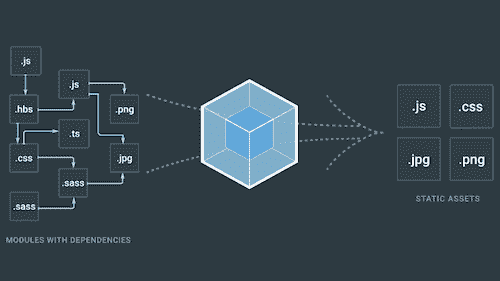
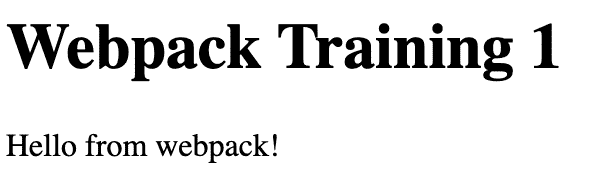
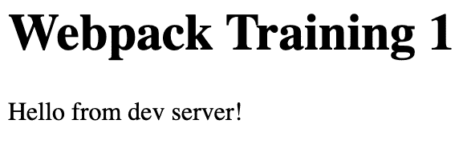
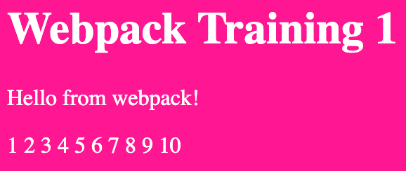
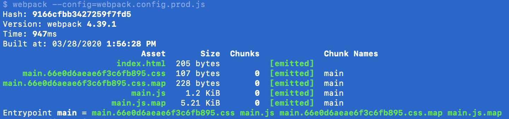
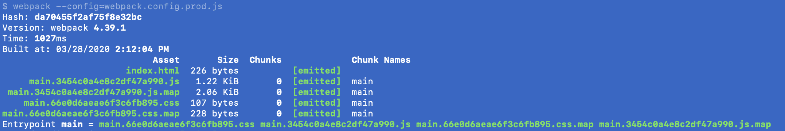

# 如何从头开始创建生产就绪的 Webpack 4 配置

> 原文：<https://www.freecodecamp.org/news/creating-a-production-ready-webpack-4-config-from-scratch/>

Webpack 是一个强大的捆绑器和依赖管理器，被许多企业级公司用作前端代码的工具。

通常，webpack 是在项目第一次建立时配置的，然后根据需要不时地对配置文件进行小的调整。正因为如此，许多开发人员没有很多使用 webpack 的经验。

在本实践教程中，我们将介绍使用 webpack 4 设置您自己的生产就绪 webpack 配置的基础知识。我们将讨论输出管理、资产管理、开发和生产配置、通天塔、缩小、缓存破坏等等。



Webpack bundles your code

我们开始吧！

## 演示应用程序

出于本演示的目的，我们将使用 webpack 4 从头开始设置 webpack 配置。我们的应用程序将只使用普通的 JavaScript，这样我们就不会陷入任何特定于框架的细节中。实际的应用程序代码将非常小，这样我们就可以更多地关注 webpack。

如果您想继续学习，本文中的所有代码都可以在 GitHub 中找到。在这里找到[起点，在这里](https://github.com/thawkin3/webpack-training-1/tree/demo/start)找到[完成结果。](https://github.com/thawkin3/webpack-training-1)

## 出发点

首先，我们将从项目目录中的几个文件开始。目录结构如下所示:

```
webpack-demo
 |_ src
    |_ index.js
 |_ .gitignore
 |_ index.html
 |_ package.json
 |_ README.md
 |_ yarn.lock
```

`index.html`文件漂亮而简单，只有一个页面标题和一个`script`标签:

```
<!doctype html>
<html>
  <head>
    <title>Webpack Training 1</title>
  </head>
  <body>
    <h1>Webpack Training 1</h1>
    <script src="./src/index.js"></script>
  </body>
</html>
```

`script`标签引用了我们的`./src/index.js`文件，其中只有几行输出文本“Hello from webpack！”：

```
const p = document.createElement('p')
p.textContent = 'Hello from webpack!'
document.body.append(p) 
```

如果您将`index.html`文件拖到浏览器中，您应该能够查看我们的简单网页:


Demo app output 1 - hello from webpack

* * *

## 安装依赖项

我已经将`webpack`和`webpack-cli`作为`devDependencies`包含在`package.json`文件中。

要安装它们，请运行:

```
yarn install
```

## Webpack 测试运行

Webpack 4 被设置为“零配置”工具，这意味着您可以在不做任何初始配置的情况下立即运行它。现在，对于任何真正的项目，你*将*需要做一些配置，但是很好的是，你至少可以做一个快速的健全性检查，以确保 webpack 能够运行，而不必经历一堆初始配置步骤。

那么，我们来看看吧。运行:

```
yarn webpack
```

现在您应该看到在您的项目目录中创建了一个`dist`目录。在它里面你应该会看到一个`main.js`文件，这是我们的简化代码。

太好了！Webpack 似乎正在工作。

## 引用输出代码

好了，现在我们在`dist`目录中有了 JavaScript 代码，让我们的`index.html`文件引用它。而不是像这样的`script`标签:

```
<script src="./src/index.js"></script>
```

让我们把它改成这样:

```
<script src="./dist/main.js"></script>
```

现在，在您的浏览器中刷新页面，您仍然应该看到完全相同的输出，只是这次是“Hello from webpack！”文本现在由`./dist/main.js`文件生成。



Demo app output 2 - no changes

## 创建 Webpack 配置文件

现在我们已经安装了 webpack，并且已经完成了快速的健全性检查，让我们创建一个实际的 webpack 配置文件。创建一个名为`webpack.config.js`的文件，并将以下代码放入其中:

```
const path = require('path')

module.exports = {
  entry: './src/index.js',
  output: {
    filename: 'main.js',
    path: path.resolve(__dirname, 'dist')
  }
}
```

属性告诉 webpack 我们的源代码在哪里。它是我们应用程序的“入口”。

属性告诉 webpack 如何调用输出文件以及将它放在哪个目录中。

很简单，对吧？

现在让我们在`package.json`文件中创建一个 npm 脚本:

```
"scripts": {
  "build": "webpack --config=webpack.config.js"
}
```

现在我们可以用命令`yarn build`运行我们的构建过程。继续运行该命令，验证您已经正确设置了所有内容。您甚至可以在运行`yarn build`命令来验证目录正在生成之前删除您的`dist`目录。

## 更改输出文件名

现在，为了好玩，让我们更改输出文件名。要做到这一点，我们将打开我们的`webpack.config.js`文件，并从下面更改`output`属性:

```
output: {
  filename: 'main.js',
  path: path.resolve(__dirname, 'dist')
}
```

对此:

```
output: {
  filename: 'tacos.js',
  path: path.resolve(__dirname, 'dist')
}
```

现在再次运行`yarn build`来生成输出。现在你应该在你的`dist`目录中看到一个`tacos.js`文件。

但是等等！我们还可以在我们的`dist`目录中看到旧的`main.js`文件！如果 webpack 可以在我们每次进行新的构建时删除旧的不需要的输出，这不是很好吗？

肯定有一个插件可以做到这一点。

## Webpack 插件


Photo by [Feelfarbig Magazine](https://unsplash.com/@feelfarbig?utm_source=ghost&utm_medium=referral&utm_campaign=api-credit) / [Unsplash](https://unsplash.com/?utm_source=ghost&utm_medium=referral&utm_campaign=api-credit)

Webpack 有一个丰富的模块生态系统，称为“[插件](https://webpack.js.org/concepts/#plugins)”，这些插件是可以修改和增强 webpack 构建过程的库。在本文的其余部分，我们将继续改进我们的 webpack 配置，并探索一些有用的插件。

## CleanWebpackPlugin


Photo by [The Honest Company](https://unsplash.com/@honest?utm_source=ghost&utm_medium=referral&utm_campaign=api-credit) / [Unsplash](https://unsplash.com/?utm_source=ghost&utm_medium=referral&utm_campaign=api-credit)

好，回到我们的问题。如果我们能在每次新构建之前清理掉`dist`目录就好了。有一个插件可以做到这一点！

我们可以使用 [CleanWebpackPlugin](https://github.com/johnagan/clean-webpack-plugin) 来帮助我们。首先，我们需要在我们的项目中安装它:

```
yarn add --dev clean-webpack-plugin
```

要使用它，我们只需在我们的`webpack.config.js`文件中`require`这个插件，然后在我们的配置设置中将它包含在`plugins`数组中:

```
const path = require('path')
const { CleanWebpackPlugin } = require('clean-webpack-plugin')

module.exports = {
  entry: './src/index.js',
  output: {
    filename: 'main.js',
    path: path.resolve(__dirname, 'dist')
  },
  plugins: [
    new CleanWebpackPlugin()
  ]
}
```

现在再次运行`yarn build`，您应该在您的`dist`目录中只看到一个输出文件。问题解决了！

## HTMLWebpackPlugin


Photo by [Florian Olivo](https://unsplash.com/@rxspawn?utm_source=ghost&utm_medium=referral&utm_campaign=api-credit) / [Unsplash](https://unsplash.com/?utm_source=ghost&utm_medium=referral&utm_campaign=api-credit)

另一件让我们的设置有点烦人的事情是，每当我们改变`webpack.config.js`文件中的`output`文件名时，我们也必须改变我们在`index.html`文件中的`script`标签中引用的文件名。如果 webpack 能帮我们做到这一点，那不是很好吗？

有一个插件可以做到这一点！我们可以使用 [HTMLWebpackPlugin](https://webpack.js.org/plugins/html-webpack-plugin/) 来帮助我们管理 HTML 文件。现在让我们将它安装到我们的项目中:

```
yarn add --dev html-webpack-plugin
```

现在让我们把我们的`index.html`文件移到我们的`src`目录中，这样它就是`index.js`文件的兄弟。

```
webpack-demo
 |_ src
    |_ index.html
    |_ index.js
 |_ .gitignore
 |_ package.json
 |_ README.md
 |_ yarn.lock
```

我们还可以删除`index.html`文件中的`script`标签，因为我们将让 webpack 句柄为我们插入适当的`script`标签。删除那一行，使您的`index.html`文件看起来像这样:

```
<!doctype html>
<html>
  <head>
    <title>Webpack Training 1</title>
  </head>
  <body>
    <h1>Webpack Training 1</h1>
  </body>
</html>
```

现在让我们把这个插件放到我们的`webpack.config.js`文件中，然后把它放到我们的配置设置中的`plugins`数组中，就像我们对第一个插件所做的那样:

```
const path = require('path')
const { CleanWebpackPlugin } = require('clean-webpack-plugin')
const HtmlWebpackPlugin = require('html-webpack-plugin')

module.exports = {
  entry: './src/index.js',
  output: {
    filename: 'main.js',
    path: path.resolve(__dirname, 'dist')
  },
  plugins: [
    new CleanWebpackPlugin(),
    new HtmlWebpackPlugin({
      filename: 'index.html',
      inject: true,
      template: path.resolve(__dirname, 'src', 'index.html'),
    }),
  ]
}
```

在那些用于`HtmlWebpackPlugin`的选项中，我们指定了我们希望输出文件被调用的`filename`。

我们通过将值设置为`true`来为`inject`指定我们希望将 JavaScript 文件注入到`body`标签中。

最后，对于`template`，我们提供了`index.html`文件在`src`目录中的位置。

## 健全性检查


Photo by [Glenn Carstens-Peters](https://unsplash.com/@glenncarstenspeters?utm_source=ghost&utm_medium=referral&utm_campaign=api-credit) / [Unsplash](https://unsplash.com/?utm_source=ghost&utm_medium=referral&utm_campaign=api-credit)

好的，让我们确保一切仍然正常工作。运行`yarn build`，并确认您在`dist`目录中看到两个文件:`index.html`和`main.js`。

如果您仔细查看您的`index.html`文件，您会看到引用的`main.js`文件。

现在，在浏览器中打开`./dist/index.html`文件，验证页面加载是否正确。如果您正确地遵循了这些步骤，您的页面应该仍然可以工作:


Demo app output 3 - no changes

## 创建开发服务器


Photo by [Taylor Vick](https://unsplash.com/@tvick?utm_source=ghost&utm_medium=referral&utm_campaign=api-credit) / [Unsplash](https://unsplash.com/?utm_source=ghost&utm_medium=referral&utm_campaign=api-credit)

到目前为止，我们已经使用`CleanWebpackPlugin`和`HtmlWebpackPlugin`做了一些很好的改进。由于我们已经做出了这些改变，我们不得不每次手动运行`yarn build`命令来查看我们的应用程序中的新变化。我们也只是在浏览器中查看文件，而不是查看从本地运行的服务器提供的内容。让我们通过创建一个开发服务器来改进我们的流程。

为此，我们将使用`webpack-dev-server`。首先，我们需要安装它:

```
yarn add --dev webpack-dev-server
```

现在，让我们将单个`webpack.config.js`文件分成两个独立的配置文件，一个用于生产，一个用于开发。我们将生产文件称为`webpack.config.prod.js`，开发文件称为`webpack.config.dev.js`。

## 开发 Webpack 配置

这是我们的开发配置文件:

```
const path = require('path')
const { CleanWebpackPlugin } = require('clean-webpack-plugin')
const HtmlWebpackPlugin = require('html-webpack-plugin')

module.exports = {
  mode: 'development',
  devtool: 'inline-source-map',
  devServer: {
    contentBase: './dist',
  },
  entry: './src/index.js',
  output: {
    filename: 'main.js',
    path: path.resolve(__dirname, 'dist')
  },
  plugins: [
    new CleanWebpackPlugin(),
    new HtmlWebpackPlugin({
      filename: 'index.html',
      inject: true,
      template: path.resolve(__dirname, 'src', 'index.html'),
    }),
  ]
}
```

注意，我们现在已经将`mode`指定为`development`，并且我们已经指定我们的 JavaScript 文件需要一个`inline-source-map`，这意味着每个 JavaScript 文件的末尾都包含一个源映射。对于我们的开发服务器，我们已经指定我们的内容将在`dist`目录中找到。

所有其余的开发配置保持不变。

## 生产 web 包配置

现在，这是我们的生产配置文件:

```
const path = require('path')
const { CleanWebpackPlugin } = require('clean-webpack-plugin')
const HtmlWebpackPlugin = require('html-webpack-plugin')

module.exports = {
  mode: 'production',
  devtool: 'source-map',
  entry: './src/index.js',
  output: {
    filename: 'main.js',
    path: path.resolve(__dirname, 'dist')
  },
  plugins: [
    new CleanWebpackPlugin(),
    new HtmlWebpackPlugin({
      filename: 'index.html',
      inject: true,
      template: path.resolve(__dirname, 'src', 'index.html'),
    }),
  ]
}
```

这个文件看起来也非常类似于我们的原始配置文件。这里我们已经指定了`mode`是`production`，并且我们希望为源映射使用`source-map`选项，它为精简代码提供了单独的源映射文件。

## 生产和开发 NPM 脚本

最后，让我们在`package.json`文件中再添加几个 npm 脚本，这样我们就可以使用我们的开发和生产 webpack 配置了:

```
"scripts": {
  "build": "webpack --config=webpack.config.prod.js",
  "build-dev": "webpack --config=webpack.config.dev.js",
  "start": "webpack-dev-server --config=webpack.config.dev.js --open"
}
```

现在，让我们尝试一下这些脚本。

运行`yarn build`查看生产构建输出。您应该看到您的`dist`目录中的`main.js`文件被缩小了，并且它有一个附带的`main.js.map`源文件。

现在运行`yarn build-dev`来查看开发构建输出。你应该在你的`dist`目录中看到`main.js`文件，但是现在注意到它是**而不是**缩小的。

最后，运行`yarn start`来启动开发服务器。这将打开`http://localhost:8080/`上的应用程序。不再需要直接查看文件，只需将它们拖入浏览器即可！我们现在有了一个真正的实时开发服务器！

您看到的输出看起来应该和往常一样:


Demo app output 4 - no changes

## 在开发过程中进行更改

现在我们有了一个工作的开发服务器，让我们尝试对我们的`./src/index.js`文件做一些简单的修改。而不是输出“你好，来自 webpack！”，让我们把它改成“你好，来自开发服务器！”。

保存文件，然后看到您的开发服务器上的页面自动为您重新加载和更新！这将大大提高开发人员的工作效率。



Demo app output 5 - hello from dev server

## 不要重复自己(干)


Photo by [Tobias Jelskov](https://unsplash.com/@tobey_j?utm_source=ghost&utm_medium=referral&utm_campaign=api-credit) / [Unsplash](https://unsplash.com/?utm_source=ghost&utm_medium=referral&utm_campaign=api-credit)

现在我们有了两个独立的 webpack 配置文件，一个用于开发，一个用于生产，您可能已经注意到我们在两个文件之间有许多重复的代码。

从第一天开始，每个开发人员都有一个枯燥的原则:不要重复自己。如果您发现自己在多个地方编写相同的代码，那么将这些代码转换成可以在一个地方编写，然后在多个地方使用的共享代码可能是一个好主意。这样，当您需要进行更改时，您只需在一个地方实施这些更改。

那么，我们如何清除 webpack 配置文件中的重复呢？有一个插件可以做到这一点！

## WebpackMerge


Merge

我们可以使用 [webpack-merge](https://github.com/survivejs/webpack-merge) 插件来管理多个配置文件所依赖的共享代码。为此，我们将首先安装软件包:

```
yarn add --dev webpack-merge
```

现在我们将创建第三个名为`webpack.config.common.js`的 webpack 配置文件。这是我们保存共享代码的地方。现在，我们的开发和生产配置文件共享相同的入口点、输出和插件。这两个文件的不同之处在于模式、源映射和开发服务器。

因此，我们的`webpack.config.common.js`文件的内容将是:

```
const path = require('path')
const { CleanWebpackPlugin } = require('clean-webpack-plugin')
const HtmlWebpackPlugin = require('html-webpack-plugin')

module.exports = {
  entry: './src/index.js',
  output: {
    filename: 'main.js',
    path: path.resolve(__dirname, 'dist')
  },
  plugins: [
    new CleanWebpackPlugin(),
    new HtmlWebpackPlugin({
      filename: 'index.html',
      inject: true,
      template: path.resolve(__dirname, 'src', 'index.html'),
    }),
  ]
}
```

现在，我们可以将这个共享配置对象合并到我们的开发配置中，如下所示:

```
const merge = require('webpack-merge')
const commonConfig = require('./webpack.config.common')

module.exports = merge(commonConfig, {
  mode: 'development',
  devtool: 'inline-source-map',
  devServer: {
    contentBase: './dist',
  },
})
```

我们可以将共享配置对象合并到我们的生产配置中，如下所示:

```
const merge = require('webpack-merge')
const commonConfig = require('./webpack.config.common')

module.exports = merge(commonConfig, {
  mode: 'production',
  devtool: 'source-map',
})
```

看看这两个文件看起来有多短多干净！漂亮！

## 设计我们的应用


Photo by [Vadim Sherbakov](https://unsplash.com/@madebyvadim?utm_source=ghost&utm_medium=referral&utm_campaign=api-credit) / [Unsplash](https://unsplash.com/?utm_source=ghost&utm_medium=referral&utm_campaign=api-credit)

到目前为止，我们的 webpack 配置看起来相当不错。我们有一个工作的开发服务器，我们已经将代码分成开发、生产和共享配置文件。

现在让我们开始编写实际的应用程序代码。普通的黑白页面看起来有点无聊。让我们打扮一下吧！

在我们的`src`目录中，让我们创建一个`index.css`文件，并将下面几行 CSS 放入其中:

```
body {
  background: deeppink;
  color: white;
}
```

然后，在我们的`./src/index.js`文件中，让我们导入 CSS 文件:

```
import './index.css'
```

现在，运行`yarn start`让我们的开发服务器再次运行。

哦不！我们得到一个错误！

```
ERROR in ./src/index.css 1:5
Module parse failed: Unexpected token (1:5)
You may need an appropriate loader to handle this file type, currently no loaders are configured to process this file. See https://webpack.js.org/concepts#loaders
> body {
|   background: deeppink;
|   color: white;
 @ ./src/index.js 1:0-20
```

它所说的这些“装载机”是什么？

## Webpack 加载程序


Photo by [Kevin Butz](https://unsplash.com/@kevin_butz?utm_source=ghost&utm_medium=referral&utm_campaign=api-credit) / [Unsplash](https://unsplash.com/?utm_source=ghost&utm_medium=referral&utm_campaign=api-credit)

前面，我们讨论了 webpack 插件，它允许您扩展 webpack 构建过程。还有一个 webpack " [loaders](https://webpack.js.org/loaders/) "的生态系统，帮助 webpack 知道如何理解和加载不同的文件类型。开箱即用，webpack 理解如何处理我们的 JavaScript 文件，但它还不知道如何处理 CSS 文件。让我们解决这个问题。

## StyleLoader 和 CSSLoader

这里有两个特别有用的加载器:[风格加载器](https://webpack.js.org/loaders/style-loader/)和 [css 加载器](https://webpack.js.org/loaders/css-loader/)。让我们把它们包含在我们的项目中，然后讨论它们是如何工作的。

首先，和往常一样，我们需要安装这两个依赖项:

```
yarn add --dev style-loader css-loader
```

然后我们可以将它们添加到底部模块规则部分的`webpack.config.common.js`文件中:

```
const path = require('path')
const { CleanWebpackPlugin } = require('clean-webpack-plugin')
const HtmlWebpackPlugin = require('html-webpack-plugin')

module.exports = {
  entry: './src/index.js',
  output: {
    filename: 'main.js',
    path: path.resolve(__dirname, 'dist')
  },
  plugins: [
    new CleanWebpackPlugin(),
    new HtmlWebpackPlugin({
      filename: 'index.html',
      inject: true,
      template: path.resolve(__dirname, 'src', 'index.html'),
    }),
  ],
  module: {
    rules: [
      {
        test: /\.css$/,
        use: ['style-loader', 'css-loader']
      }
    ]
  }
}
```

本节为 webpack 设置规则，以便它知道如何处理遇到的每个文件。`test`属性是 webpack 根据文件名检查的正则表达式。在这种情况下，我们希望处理扩展名为`.css`的文件。

然后，`use`属性告诉 webpack 使用哪个或哪些加载器来处理符合标准的文件。注意这里的顺序很重要！

Webpack 加载程序从右向左读取。因此，首先将应用`css-loader`，然后应用`style-loader`。

现在，这些装载机实际上为我们做了什么？

`css-loader`解释并解析您在 JavaScript 中引用的导入 CSS 文件。所以在这种情况下，`css-loader`有助于使这条线工作:

```
import './index.css'
```

接下来，`style-loader`将 CSS 注入 DOM。默认情况下，`style-loader`获取它遇到的 CSS 并将它添加到 DOM 中的一个`style`标签中。

让我们通过终止当前进程(如果您还让它运行)来重启我们的开发服务器，然后用`yarn start`再次启动它。现在，在网络浏览器中，您应该会在`https://localhost:8080/`上看到:


Demo app output 6 - adds pink and white colors

哦，如此丰富多彩！

## 关于其他 Webpack 加载器的说明

在本文中，我们不会讨论其他文件类型的加载器，但是请注意，有一个加载器可以加载任何可以想象的东西！您可以使用[文件加载器](https://webpack.js.org/loaders/file-loader/)或 [url 加载器](https://webpack.js.org/loaders/url-loader/)来加载图像和其他资产。您可以使用 [sass-loader](https://webpack.js.org/loaders/sass-loader/) 来处理将 Sass/SCSS 文件转换为 CSS，然后将输出通过管道传输到`css-loader`和`style-loader`。如果你喜欢的话，Webpack 可以用 [less-loader](https://webpack.js.org/loaders/less-loader/) 处理更少的文件。

这个故事的寓意是:对于任何给定的文件类型，都有一个加载器可以处理它。

## BabelLoader

好了，回到我们的演示应用程序。到目前为止，我们只写了几行 JavaScript。如果我们可以使用目前还不是每个浏览器都支持的新特性来编写 JavaScript，那就太好了。 [Babel](https://babeljs.io/) 是一个 JavaScript 编译器，可以把 ES6+代码变成 ES5 代码。

而且(你猜对了)，有一个加载器: [babel-loader](https://babeljs.io/setup#installation) 。

要设置`babel-loader`，我们将按照上面链接的安装指南中的说明进行操作。

首先，我们将安装我们的依赖项:

```
yarn add --dev babel-loader @babel/core
```

接下来，我们将向我们的`webpack.config.common.js`文件中的模块规则数组添加一个新规则:

```
const path = require('path')
const { CleanWebpackPlugin } = require('clean-webpack-plugin')
const HtmlWebpackPlugin = require('html-webpack-plugin')

module.exports = {
  entry: './src/index.js',
  output: {
    filename: 'main.js',
    path: path.resolve(__dirname, 'dist')
  },
  plugins: [
    new CleanWebpackPlugin(),
    new HtmlWebpackPlugin({
      filename: 'index.html',
      inject: true,
      template: path.resolve(__dirname, 'src', 'index.html'),
    }),
  ],
  module: {
    rules: [
      {
        test: /\.css$/,
        use: ['style-loader', 'css-loader']
      },
      {
        test: /\.(js|jsx)$/,
        exclude: /[\\/]node_modules[\\/]/,
        use: {
          loader: 'babel-loader',
        },
      },
    ]
  }
}
```

这将告诉 webpack，当它遇到`.js`或`.jsx`文件时使用 Babel 来转换代码。我们使用`exclude`属性来确保 Babel 不会试图转换我们的`node_modules`目录中的 JavaScript 文件。那些是第三方依赖，它们的创建者应该已经处理好了。

接下来，我们将为 Babel 预设添加一个附加项:

```
yarn add --dev @babel/preset-env
```

然后我们将创建一个`.babelrc`文件，在这里我们可以根据需要进行其他的 Babel 配置。我们将保持我们的文件非常简单，只指定我们想要使用的巴别塔预设:

```
{
  "presets": ["@babel/preset-env"]
}
```

最后，让我们在`./src/index.js`文件中编写一些 ES6 代码:

```
import './index.css'

const p = document.createElement('p')
p.textContent = 'Hello from webpack!'
document.body.appendChild(p)

const p2 = document.createElement('p')
const numbers1 = [1, 2, 3, 4, 5, 6]
const numbers2 = [7, 8, 9, 10]
const numbers3 = [...numbers1, ...numbers2]
p2.textContent = numbers3.join(' ')
document.body.appendChild(p2)
```

这是一个非常简单的例子，但是我们在这里使用了[扩展操作符](https://developer.mozilla.org/en-US/docs/Web/JavaScript/Reference/Operators/Spread_syntax)来连接两个数组。

现在，如果我们终止正在运行的进程并再次运行`yarn start`，我们应该会在浏览器中看到:



Demo app output 7 - adds numbers

太好了！一切都很好。

## 暂时缺失的样式

如果您禁用浏览器中的缓存，并为我们的演示应用程序重新加载页面，您可能会注意到一个轻微的问题，页面只显示未设置样式的 HTML，然后随着样式的应用，页面背景变成粉红色，文本变成白色。

这种行为源于`style-loader`的工作方式。如上所述，`style-loader`获取 CSS 并将其放在 HTML 的`style`标签中。因此，有一小段时间`style`标签还没有被添加！

现在，这对于开发环境是可以的，但是我们绝对不希望这种行为发生在生产环境中。让我们解决这个问题。

## MiniCssExtractPlugin

我们可以使用[minicsextractplugin](https://webpack.js.org/plugins/mini-css-extract-plugin/)为自己生成单独的 CSS 文件，而不是将 CSS 作为`style`标签注入 HTML。我们将在生产配置中使用它，而在开发配置中仍然只使用`style-loader`。

首先，让我们在项目中安装依赖项:

```
yarn add --dev mini-css-extract-plugin
```

现在，在我们的`webpack.config.common.js`文件中，让我们删除 CSS 规则，因为我们将在开发和生产中以不同的方式处理它。我们的共享配置中只剩下这个:

```
const path = require('path')
const { CleanWebpackPlugin } = require('clean-webpack-plugin')
const HtmlWebpackPlugin = require('html-webpack-plugin')

module.exports = {
  entry: './src/index.js',
  output: {
    filename: 'main.js',
    path: path.resolve(__dirname, 'dist')
  },
  plugins: [
    new CleanWebpackPlugin(),
    new HtmlWebpackPlugin({
      filename: 'index.html',
      inject: true,
      template: path.resolve(__dirname, 'src', 'index.html'),
    }),
  ],
  module: {
    rules: [
      {
        test: /\.(js|jsx)$/,
        exclude: /[\\/]node_modules[\\/]/,
        use: {
          loader: 'babel-loader',
        },
      },
    ]
  }
}
```

现在，在我们的`webpack.config.dev.js`文件中，让我们添加回刚刚从共享配置中删除的`style-loader`和`css-loader`:

```
const merge = require('webpack-merge')
const commonConfig = require('./webpack.config.common')

module.exports = merge(commonConfig, {
  mode: 'development',
  devtool: 'inline-source-map',
  devServer: {
    contentBase: './dist',
  },
  module: {
    rules: [
      {
        test: /\.css$/,
        use: ['style-loader', 'css-loader']
      },
    ]
  }
})
```

最后，在我们的`webpack.config.prod.js`文件中，让我们添加新的`mini-css-extract-plugin`:

```
const merge = require('webpack-merge')
const MiniCssExtractPlugin = require('mini-css-extract-plugin');
const commonConfig = require('./webpack.config.common')

module.exports = merge(commonConfig, {
  mode: 'production',
  devtool: 'source-map',
  module: {
    rules: [
      {
        test: /\.css$/,
        use: [
          MiniCssExtractPlugin.loader,
          'css-loader',
        ],
      },
    ],
  },
  plugins: [
    new MiniCssExtractPlugin({
      filename: '[name].[contenthash].css',
    }),
  ]
})
```

这个有点不同，因为它实际上既是插件*又是加载器*，所以它在模块规则和插件部分。

还要注意，我们在文件名中使用方括号来动态地将`name`设置为原始源文件的名称，并且还包含了`contenthash`，这是一个表示文件内容的散列(一个字母数字字符串)。

现在，如果您这次运行`yarn build`来生成生产版本，您应该在终端中得到如下所示的输出:



Webpack production build output

注意，它现在实际上生成了一个 CSS 文件，内容哈希包含在文件名中。

好了，问题解决了！由于我们将样式作为一个`link`标签包含到一个实际的 CSS 文件中，所以当页面在生产中加载时不会再出现问题。

## 缓存破坏

由于我们已经在生成的 CSS 文件中包含了内容散列，现在是讨论缓存破坏的好时机。您可能会问，为什么我们希望在文件名中包含内容散列？帮助浏览器理解文件何时发生了变化！

你的浏览器试图通过缓存以前看过的文件来提供帮助。例如，如果您访问了一个网站，并且您的浏览器必须下载 JavaScript、CSS 或图像文件等资源，您的浏览器可能会缓存这些文件，这样它就不必再次向服务器请求它们。

这意味着，如果您再次访问该网站，您的浏览器可以使用缓存的文件，而不是再次请求它们，因此您可以获得更快的页面加载时间和更好的体验。

那么，这里的问题是什么？想象一下，如果我们的应用程序中使用了一个名为`main.js`的文件。然后，用户访问您的应用程序，他们的浏览器缓存了`main.js`文件。

现在，在以后的某个时间点，你已经为你的应用程序发布了新的代码。`main.js`文件的内容已经改变。但是，当同一个用户再次访问你的应用程序时，浏览器发现它需要一个`main.js`文件，注意到它有一个缓存的`main.js`文件，并且只使用缓存的版本。用户没有得到你的新代码！

为了解决这个问题，通常的做法是在每个文件名中包含内容哈希。如前所述，内容散列是文件内容的字符串表示。如果文件的内容没有改变，内容哈希也不会改变。但是，如果文件的内容*确实*改变了，那么内容散列*也会*改变。

因为文件名现在会随着代码的改变而改变，所以浏览器会下载新文件，因为它的缓存中没有那个特定的文件名。

## 包括内容散列

为了在 JavaScript 文件名中包含内容散列，我们将只修改`webpack.config.common.js`文件中的一行代码。这一行:

```
filename: 'main.js'
```

将改为这一行:

```
filename: '[name].[contenthash].js'
```

因此整个文件看起来像这样:

```
const path = require('path')
const { CleanWebpackPlugin } = require('clean-webpack-plugin')
const HtmlWebpackPlugin = require('html-webpack-plugin')

module.exports = {
  entry: './src/index.js',
  output: {
    filename: '[name].[contenthash].js', // this line is the only difference
    path: path.resolve(__dirname, 'dist')
  },
  plugins: [
    new CleanWebpackPlugin(),
    new HtmlWebpackPlugin({
      filename: 'index.html',
      inject: true,
      template: path.resolve(__dirname, 'src', 'index.html'),
    }),
  ],
  module: {
    rules: [
      {
        test: /\.(js|jsx)$/,
        exclude: /[\\/]node_modules[\\/]/,
        use: {
          loader: 'babel-loader',
        },
      },
    ]
  }
}
```

现在如果你运行`yarn build`，你会看到你的 JavaScript 和 CSS 都包含了内容散列:



Webpack production build output with content hashes included

如果您再次运行`yarn build`并将您的新输出与旧输出进行比较，您会注意到两次的内容散列完全相同。

但是，如果您以任何方式编辑您的`./src/index.js`文件，然后再次运行`yarn build`，您将获得一个新的内容散列，因为内容已经改变！试试看！

## 缩小 CSS

最后但同样重要的是，我们可能想要缩小我们的 CSS。我们已经为生产版本缩小了 JavaScript，但是我们还没有缩小 CSS。就这么办吧。

我们可以通过使用[optimize-CSS-assets-web pack-plugin](https://github.com/NMFR/optimize-css-assets-webpack-plugin)来最小化我们的 CSS。现在让我们安装依赖项:

```
yarn add --dev optimize-css-assets-webpack-plugin
```

现在我们可以将它添加到我们的`webpack.config.prod.js`文件的优化部分:

```
const merge = require('webpack-merge')
const MiniCssExtractPlugin = require('mini-css-extract-plugin')
const OptimizeCssAssetsPlugin = require('optimize-css-assets-webpack-plugin')
const commonConfig = require('./webpack.config.common')

module.exports = merge(commonConfig, {
  mode: 'production',
  devtool: 'source-map',
  module: {
    rules: [
      {
        test: /\.css$/,
        use: [
          MiniCssExtractPlugin.loader,
          'css-loader',
        ],
      },
    ],
  },
  plugins: [
    new MiniCssExtractPlugin({
      filename: '[name].[contenthash].css',
    }),
  ],
  optimization: {
    minimizer: [
      new OptimizeCssAssetsPlugin({
        cssProcessorOptions: {
          map: {
            inline: false,
            annotation: true,
          },
        },
      }),
    ],
  },
})
```

现在，如果我们运行`yarn build`，然后检查我们的`dist`目录的内容，我们可以看到生成的 CSS 被缩小了。不错！

```
body{background:#ff1493;color:#fff}
/*# sourceMappingURL=main.66e0d6aeae6f3c6fb895.css.map */
```

但是等等！如果我们看看我们生成的 JavaScript 文件，它没有缩小！嗯。之前*被*缩小了，那么这里发生了什么？

问题是我们现在手动配置我们的 webpack 配置的优化最小化部分。当该部分不在 webpack 配置文件中时，webpack 默认使用自己的 minimizer 首选项，其中包括当`mode`设置为`production`时缩小 JavaScript。

因为我们现在通过添加缩小 CSS 资产的首选项来覆盖这些默认设置，所以我们还需要明确地包含我们希望 webpack 如何缩小 JavaScript 资产的说明。

## TerserWebpackPlugin

我们可以使用 [TerserWebpackPlugin](https://webpack.js.org/plugins/terser-webpack-plugin/) 来缩小我们的 JavaScript 文件。让我们从安装依赖项开始:

```
yarn add --dev terser-webpack-plugin
```

然后，在我们的`webpack.config.prod.js`文件中，让我们将`terser-webpack-plugin`添加到文件底部的优化最小化设置中:

```
const merge = require('webpack-merge')
const MiniCssExtractPlugin = require('mini-css-extract-plugin')
const OptimizeCssAssetsPlugin = require('optimize-css-assets-webpack-plugin')
const TerserPlugin = require('terser-webpack-plugin')
const commonConfig = require('./webpack.config.common')

module.exports = merge(commonConfig, {
  mode: 'production',
  devtool: 'source-map',
  module: {
    rules: [
      {
        test: /\.css$/,
        use: [
          MiniCssExtractPlugin.loader,
          'css-loader',
        ],
      },
    ],
  },
  plugins: [
    new MiniCssExtractPlugin({
      filename: '[name].[contenthash].css',
    }),
  ],
  optimization: {
    minimizer: [
      new OptimizeCssAssetsPlugin({
        cssProcessorOptions: {
          map: {
            inline: false,
            annotation: true,
          },
        },
      }),
      new TerserPlugin({
        // Use multi-process parallel running to improve the build speed
        // Default number of concurrent runs: os.cpus().length - 1
        parallel: true,
        // Enable file caching
        cache: true,
        sourceMap: true,
      }),
    ],
  },
})
```

现在，如果我们运行`yarn build`并查看`dist`目录中的输出，我们应该看到我们的 CSS 文件和 JavaScript 文件都被缩小了。我们走吧！

## 包扎

如果你已经走了这么远，我推荐你！


Photo by [Katya Austin](https://unsplash.com/@katya?utm_source=ghost&utm_medium=referral&utm_campaign=api-credit) / [Unsplash](https://unsplash.com/?utm_source=ghost&utm_medium=referral&utm_campaign=api-credit)

让我们回顾一下到目前为止我们所学的内容:

*   Webpack 是一个用于资产捆绑和依赖性管理的构建工具。
*   Webpack 可以通过配置文件进行配置。
*   插件修改和扩展了 webpack 的构建过程。
*   加载器指导 webpack 如何处理不同的文件类型。
*   `clean-webpack-plugin`可以用来从`dist`目录中移除旧的构建工件。
*   `html-webpack-plugin`帮助管理 HTML 文件，包括通过`script`标签将 JavaScript 注入文件。
*   创建一个开发服务器，使本地开发更容易。
*   为开发和生产提供单独的 webpack 配置很有帮助。您可以使用`webpack-merge`插件共享和合并配置文件。
*   我们可以通过包含像`css-loader`、`style-loader`、`sass-loader`、`less-loader`和`mini-css-extract-plugin`(既作为插件又作为加载器)这样的加载器来处理应用程序的样式。
*   我们可以通过使用 Babel 和`babel-loader`来包含新的 JavaScript 语法和特性。
*   我们可以在文件名中包含内容哈希，以帮助缓存破坏和管理我们发布的代码的新版本。
*   我们可以用`optimize-css-assets-webpack-plugin`来缩小我们的 CSS。
*   我们可以用`terser-webpack-plugin`来缩小我们的 JavaScript。

## 下一步是什么？


Photo by [Tom Parkes](https://unsplash.com/@tomparkes?utm_source=ghost&utm_medium=referral&utm_campaign=api-credit) / [Unsplash](https://unsplash.com/?utm_source=ghost&utm_medium=referral&utm_campaign=api-credit)

在本文中，我们已经创建了一个相当不错的 webpack 配置。我们讨论的所有这些技术都是行业标准，在企业级项目中普遍使用。

但是还有更多！其他高级 webpack 主题包括[代码拆分](https://webpack.js.org/guides/code-splitting/)、[懒加载](https://webpack.js.org/guides/lazy-loading/)、[树摇](https://webpack.js.org/guides/tree-shaking/)等等！

如果你对自己探索 webpack 感兴趣，我强烈推荐你阅读官方的 webpack 指南。

同样，我们在本教程中学习的所有代码都可以在 GitHub 中找到。在这里找到[起点，在这里](https://github.com/thawkin3/webpack-training-1/tree/demo/start)找到[完成结果。](https://github.com/thawkin3/webpack-training-1)

感谢您的阅读，祝您编码愉快！