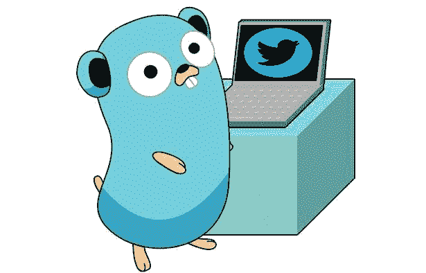
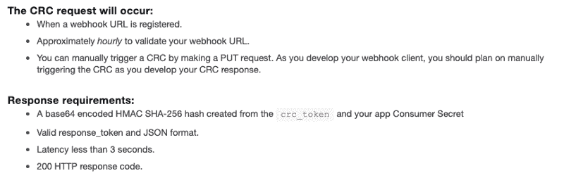
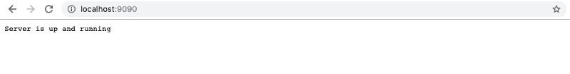
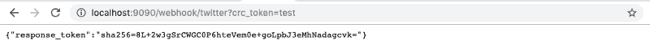
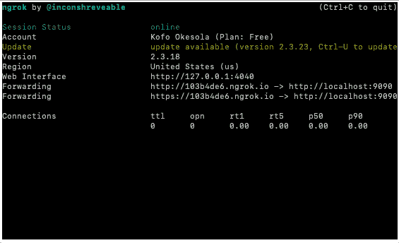

# 如何用 Golang 从头开始创建一个 Twitter 机器人

> 原文：<https://www.freecodecamp.org/news/creating-a-twitter-bot-from-scratch-with-golang-e1f37a66741/>

作者 Kofo Okesola

# 如何用 Golang 从头开始创建一个 Twitter 机器人



简单介绍一下背景:我最近选择了 Golang，并决定创建一个 Twitter 机器人作为辅助项目。然后问题来了。在 Golang 中使用 Twitter API 的文档很少，甚至没有。(特别是其中的 oauth1 和 CRC 加密部分)。所以经过几天的尝试和错误，最终完成了它，我想分享这个过程。希望这能帮助到外面的人。

### 我们要建造什么？

我们将构建一个从本地机器提供服务的 Twitter 机器人。它会回复任何带有“hello world”标签的推文。

下面简单解释一下这个围棋程序会做什么。它将:

*   倾听并回应 webhook [CRC 验证](https://developer.twitter.com/en/docs/accounts-and-users/subscribe-account-activity/guides/securing-webhooks)。
*   注册一个指向它的 webhook URL。
*   听推特，回复“你好，世界”。

### 你需要什么？

*   Golang 的一些基础知识
*   一个被认可的 Twitter 开发者账户。[如何申请](https://developer.twitter.com/en/apply-for-access.html)。
*   您应该已经建立了一个帐户活动 API 开发环境——这个项目称之为`dev`
*   带有生成的消费者密钥和访问令牌(读写访问)的 Twitter 应用程序
*   Golang [在你的开发机器上安装了](https://golang.org/doc/install)。
*   一些决心。

### 准备好了吗？我们走吧

重要的事情先来。在您的`$GOPATH/src/`中创建项目文件夹。我们将这个项目和我们的文件夹命名为`hellobot`。在里面创建介绍文件`/hellobot.go`

我们需要做的第一件事是为我们的应用程序创建一个端点来侦听 CRC 校验并做出响应。Twitter 很好地总结了检查的要求。



#### 设置服务器

我们做的第一件事是加载`.env`文件。为此，我们使用了 [godotenv](https://github.com/joho/godotenv) 插件。的。env 文件通常是这样的格式:

```
CONSUMER_KEY=CONSUMER_SECRET=ACCESS_TOKEN_KEY=ACCESS_TOKEN_SECRET=WEBHOOK_ENV=devAPP_URL=
```

> 注意:考虑到我们的项目很小，我们将使用 basic `go get`来安装我们所有的依赖项

然后我们使用 [mux](https://github.com/gorilla/mux) 作为我们的处理器来设置我们的服务器，并监听基本路由和`webhook/twitter`。如果您使用`go install`安装并运行`hellobot`，当您运行它并导航到您的 localhost:9090 时，您应该会看到消息



#### CRC 验证

现在对于 CRC，用下面的代码更新您的`CrcCheck()`函数:

这里我们在函数中做的是:

*   将标题设置为“应用程序/json”
*   获取 crc_token URL 参数
*   使用 Hmac sha256 加密并编码
*   将其打印给回复作者

确保将`CONSUMER_SECRET`替换为您应用程序的实际消费者密钥。现在，如果您导航到`localhost:9090/webhook/twitter?crc_token=test`，您应该会得到类似如下的响应:



现在我们有了一个有效的 CRC 路由，是时候注册我们的 webhook 了。这里有几件事需要注意。Twitter 不会接受基于`localhost`的 URL，也不会接受带有端口号的 URL 或非 https URL 作为 webhook。开发过程中的一个解决方法是使用像 [ngrok](https://ngrok.com/) 这样的服务。简单地[安装](https://ngrok.com/download)它并启动一个开发服务器指向你的 9090 端口:

```
ngrok http 9090 
```

您应该会看到类似如下的响应:



现在，如果您转到 <id>.ngrok.io URL，您应该会看到与 localhost:9090 相同的响应。不要忘记将 URL 添加到您的。环境 `file A` PP_ENV</id>

#### 注册 webhook

在本教程中，我们将检查参数列表中是否存在一个`register`标志。您可以将它添加到代码中:

这里，我们的机器人正在检查参数列表中是否存在`-register` 。然后它作为 goroutine 运行`registerWebhook()`。我们在一个`client.go`文件中定义了`registerWebhook()`函数，我们将用它来处理所有的 Twitter 请求。现在，对于函数体:

新代码的分解。第一件事是创建一个`CreateClient()`函数。这个函数返回一个指向 OAuth `http.Client`的指针，我们可以用它来代表我们的 bot 帐户发出所有 Twitter 请求。记得运行项目文件夹中的`go get`,这样它就可以获取我们用于所有 OAuth 请求的 [neat go 库](https://github.com/dghubble/oauth1)。在`registerWebhook`功能中，我们:

*   招徕客户
*   使用`url.Values`将我们的 webhook 的 URL 作为参数传递
*   对 [register webhook 端点](https://developer.twitter.com/en/docs/accounts-and-users/subscribe-account-activity/api-reference/aaa-premium#post-account-activity-all-env-name-webhooks)进行 post 响应，然后解组(解码)并读取响应

接下来，我们需要我们的代码[为我们的 webhook 订阅事件](https://developer.twitter.com/en/docs/accounts-and-users/subscribe-account-activity/api-reference/aaa-premium#post-account-activity-all-env-name-subscriptions)。

> 注意:你可以使用 Twitter 创建的[账户-活动-仪表板](https://github.com/twitterdev/account-activity-dashboard)应用程序在开发期间管理 webhooks

如下所示更新您的`client.go`文件:

上面的代码非常简单。注册后，订阅事件并检查状态代码`204`。现在，如果你在你的代码上运行`go install`，并且以`hellobot -register`的身份运行代码，你应该得到如下的响应:

```
Starting ServerRegistering webhook...Webhook id of <hook_id> has been registeredSubscribing webapp...Subscribed successfully
```

#### 监听事件

现在我们需要 webhook 在 URL 被调用时监听事件。如下所示更新您的文件:

我们在`hellobot.dev`中所做的是监听对我们的路由的 post 请求，并将它们传递给适当的函数。而在`client.go`中，我们正在添加适当的结构，我们将使用这些结构来[解析 JSON](https://www.sohamkamani.com/blog/2017/10/18/parsing-json-in-golang/) 负载到我们的 bot 中。

现在更新您的代码，以便它发送标签上的 tweet。

我们添加到源文件中的更新只是为了响应 webhook 事件。检查它是否是一个 [tweet_create_event](https://developer.twitter.com/en/docs/accounts-and-users/subscribe-account-activity/guides/account-activity-data-objects#tweet_create_events) ，并使用我们的`client.go`文件中的`SendTweet()`方法发送一个响应作为回复。

> 注意:任何作为回复发送的 tweet 都需要包含回复用户的句柄作为回复的初始内容

现在，如果您使用适当的凭证运行此程序，您的机器人应该会响应标签并回复“Hello World”。

### 结论

现在已经完成了，由于这是一个非常基础的机器人版本，您可以尝试添加一些东西:

*   检查并忽略转发事件
*   向响应中添加名称
*   在应用程序的任何地方出现错误的情况下，对推文做出响应。

*这个演练的代码在 [Github 这里](https://github.com/kofoworola/hellobot)。请随意使用它*

干杯！