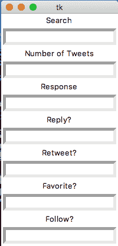

# 使用 Tweepy 在 Python 中创建一个 Twitter 机器人

> 原文：<https://www.freecodecamp.org/news/creating-a-twitter-bot-in-python-with-tweepy-ac524157a607/>

卢卡斯·科霍斯特

# 使用 Tweepy 在 Python 中创建一个 Twitter 机器人

Twitter 大约有 15%是由机器人组成的，我想尝试一下。我在谷歌上搜索如何创建一个 Twitter 机器人，然后被带到一个布局简洁的 web 应用程序。它允许你创建一个机器人，可以根据关键词喜欢、关注或转发一条推文。问题是你只能为一个功能创建一个机器人。

所以我决定用 Python 和 Tweepy 库自己编写一个机器人。

### 设置

首先，我下载了 Tweepy。您可以使用 pip 软件包管理器来完成这项工作。

```
pip install tweepy
```

如果没有安装 pip，也可以克隆 GitHub 存储库。

```
git clone https://github.com/tweepy/tweepy.gitcd tweepypython setup.py install
```

您需要导入 Tweepy 和 Tkinter(用于 GUI 界面)。

```
import tweepyimport Tkinter
```

### 资格证书

接下来，我们需要将 Twitter 帐户链接到 Python 脚本。前往[apps.twitter.com](https://apps.twitter.com/)并使用您的帐户登录。创建一个 Twitter 应用程序，并生成消费者密钥、消费者秘密、访问令牌和访问令牌秘密。现在你可以开始了！

在 import 语句下，将您的凭据存储在变量中，然后使用第二段代码通过 tweepy 验证您的帐户。

```
consumer_key = 'consumer key'consumer_secret = 'consumer secrets'access_token = 'access token'access_token_secret = 'access token secret'
```

```
auth = tweepy.OAuthHandler(consumer_key, consumer_secret)auth.set_access_token(access_token, access_token_secret)api = tweepy.API(auth)
```

为了检查你的程序是否工作，你可以添加:

```
user = api.me()print (user.name)
```

这应该会在控制台中返回您的 Twitter 帐户的名称。

### 建造机器人

这个机器人的目的是:

1.  跟随所有跟随你的人。
2.  基于关键词收藏和转发一条推文。
3.  根据关键字回复用户。

第一步是最简单的，你只需**在你的追随者中循环**，然后跟随每一个人。

```
for follower in tweepy.Cursor(api.followers).items():    follower.follow()    print ("Followed everyone that is following " + user.name)
```

此时，为了确保你的代码正常工作，你应该登录 Twitter，观察你关注的人的增加。

从这一点开始，除了在 GUI 中设置和打包标签，我还在函数`mainFunction()`下编写了所有的。

```
def mainFunction():    #The code
```

你可能会明白这是怎么回事。为了收藏或转发一条推文，我们可以使用 for 循环和 try 语句，如下所示:

```
search = "Keyword"
```

```
numberOfTweets = "Number of tweets you wish to interact with"
```

```
for tweet in tweepy.Cursor(api.search, search).items(numberOfTweets):    try:        tweet.retweet()        print('Retweeted the tweet')
```

```
 except tweepy.TweepError as e:        print(e.reason)
```

```
 except StopIteration:        break
```

为了收藏一条推文，你可以简单地替换

```
tweet.retweet()
```

随着

```
tweet.favorite()
```

为了根据关键字回复用户，我们需要存储用户的用户名和 twitter ID。

```
tweetId = tweet.user.idusername = tweet.user.screen_name
```

然后，我们可以循环查看推文，并更新每个用户的状态(推文)。

```
phrase = "What you would like your response tweet to say"
```

```
for tweet in tweepy.Cursor(api.search, search).items(numberOfTweets):            try:                tweetId = tweet.user.id                username = tweet.user.screen_name                api.update_status("@" + username + " " + phrase, in_reply_to_status_id = tweetId)                print ("Replied with " + phrase)                       except tweepy.TweepError as e:                print(e.reason)
```

```
 except StopIteration:                break
```

如果您只想通过终端使用脚本，并在每次运行时更新代码，那么您已经完成了 bot。

### 创建 GUI

我们可以创建一个 GUI 应用程序，它将接受我们输入的您想要搜索的关键字，以及您是否想要收藏一条推文。

我们首先需要初始化 Tkinter 并设置布局。

为了创建我们的用户界面，我们将有七个标签用于搜索、推文数量和回复。加上要不要回复、收藏、转发推文、关注用户等问题。

记住下面的代码是外面的**和**上面的**我们的`mainFunction()`。**

```
root = Tk()
```

```
label1 = Label( root, text="Search")E1 = Entry(root, bd =5)
```

```
label2 = Label( root, text="Number of Tweets")E2 = Entry(root, bd =5)
```

```
label3 = Label( root, text="Response")E3 = Entry(root, bd =5)
```

```
label4 = Label( root, text="Reply?")E4 = Entry(root, bd =5)
```

```
label5 = Label( root, text="Retweet?")E5 = Entry(root, bd =5)
```

```
label6 = Label( root, text="Favorite?")E6 = Entry(root, bd =5)
```

```
label7 = Label( root, text="Follow?")E7 = Entry(root, bd =5)
```

我们还需要**打包**每个标签，以便它们显示出来，然后在循环中调用根函数，以便它保留在屏幕上，不会立即关闭。

以下是**包装**第一个标签的样子。我把所有的标签都打包在`mainFunction()`下面。

```
label1.pack()E1.pack()
```

```
root.mainloop()
```

如果您只运行 GUI 代码，它应该看起来像这样:



但是，在标签中输入文本或单击 submit 按钮在这一点上没有任何作用。因为接口还没有连接到代码。

为了在标签中存储用户输入，我们需要使用`.get()`函数。我为每个标签使用了单独的函数。

```
def getE1():    return E1.get()
```

然后在我的`mainFunction()`中，我调用函数`getE1()`并将输入存储到一个变量中。对 E1 来说是这样的:

```
getE1()search = getE1()
```

您必须对每个标签都这样做。对于`numberOfTweets`标签，确保将输入转换成整数。

```
getE2()numberOfTweets = getE2()numberOfTweets = int(numberOfTweets)
```

对于最后四个标签(回复、收藏、转发和关注)，我们需要检查用户的输入是“是”还是“否”，以便运行给定的功能。这可以通过 **if** 语句来完成。

这将是**回复**功能的代码:

```
if reply == "yes":
```

```
 for tweet in tweepy.Cursor(api.search,     search).items(numberOfTweets):            try:                tweetId = tweet.user.id                username = tweet.user.screen_name                api.update_status("@" + username + " " + phrase, in_reply_to_status_id = tweetId)                print ("Replied with " + phrase)                       except tweepy.TweepError as e:                print(e.reason)
```

```
except StopIteration:                break
```

对于收藏、转发和关注功能，只需将**回复**替换为“转发”、“收藏”和“关注”。然后复制并粘贴你上面为每一个写的代码到 **if** 语句下面。

现在我们只需要添加**提交**按钮，并告诉它调用`mainFunction()`并为我们的 Twitter 机器人执行代码。还是那句话，别忘了打包！

```
submit = Button(root, text ="Submit", command = mainFunction)
```

就是这样！运行 bot 脚本后，应该会运行一个 GUI 应用程序，您将能够回复、转发、收藏和关注用户。

有了这个 Twitter 机器人，我创建了一个名为 [FreeWtr](https://twitter.com/FreeWtr) 的账户，倡导使用过滤自来水而不是瓶装水。下面是简介截图。


下面是 Github 上的[完整源代码](https://github.com/Fidel-Willis/TwitterBot)。