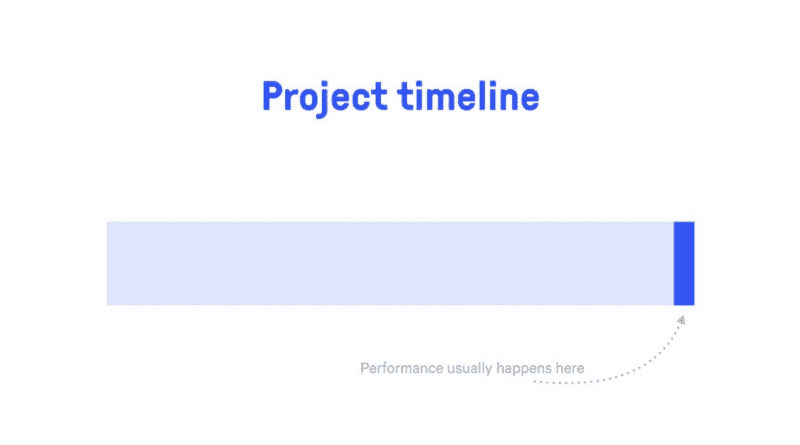
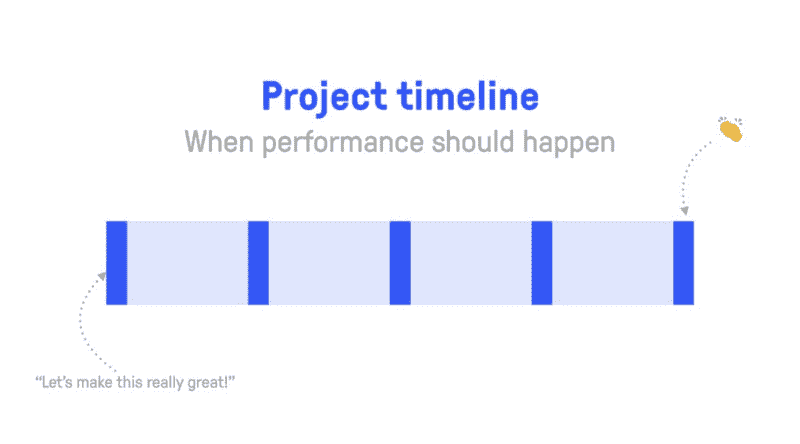
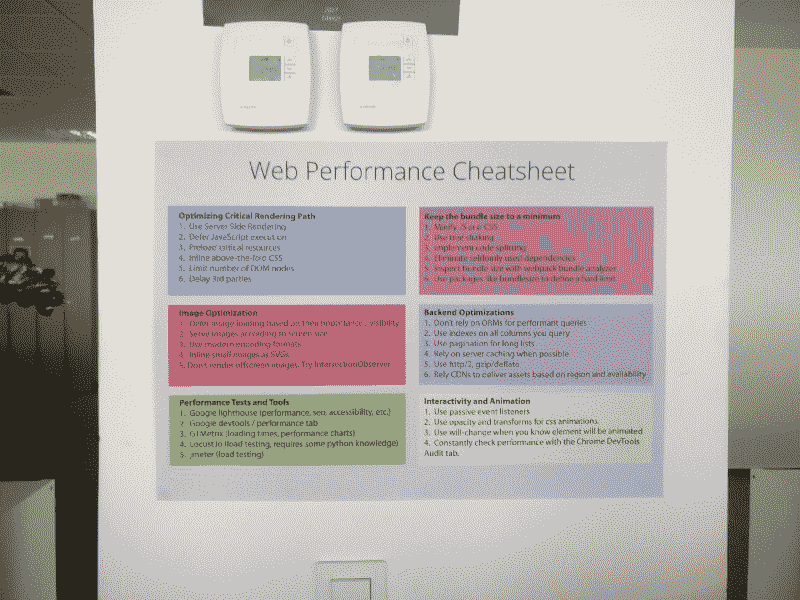

# 如何在你的团队中创造网络绩效文化

> 原文：<https://www.freecodecamp.org/news/creating-a-web-performance-culture-inside-your-team-f00c0d79765f/>

和我一起工作的人都知道，我总是痴迷于表现。像“关键渲染路径”、“包大小”和“每秒帧数”这样的词在办公室里很常见。但这都是有原因的。

性能应该是软件工程中的**一等公民**。

在你的团队中拥有强大的**绩效文化**可以确保你提前减轻与糟糕绩效相关的任何风险。

但是为什么它如此重要呢？这些风险是什么？

## 为什么性能很重要

请记住，作为 web 开发人员，我们的目标是为用户创造最好的体验。

### 性能关乎可用性。

有许多研究([【1】](https://www.doubleclickbygoogle.com/articles/mobile-speed-matters/)[【2】](https://wp-rocket.me/blog/speed-up-your-website-make-the-first-few-seconds-count/)[【3】](https://www.fastcompany.com/1825005/how-one-second-could-cost-amazon-16-billion-sales))显示了商业目标和网站可用性之间的直接关联。

当涉及到与用户的关系时，一个快速而简洁的网站可以决定成功与失败。

如果你的网站被认为是缓慢和落后的，你华丽的 UI 框架和架构将毫无用处。更不用说用户因为在旋转器或白屏后面等待而离开的场景了。

[如果你不显示任何内容，53%的用户会在 3 秒钟内关闭你的网站](https://developer.akamai.com/blog/2016/09/14/mobile-load-time-user-abandonment)。

此外，根据谷歌的说法，性能也是移动页面排名的一个指标。

### 性能是关于可访问性的。

再来说说全球市场。说到数据成本，性能预算也很重要。用户花多少钱访问你的网站？

你可以使用[这个网站](https://whatdoesmysitecost.com/#usdCost)了解一下。然后你可以问自己:“我愿意花 x 美分去访问我的网站吗？”你可能会对自己的回答感到惊讶。

此外，在有些国家，绝大部分互联网时间是通过手机度过的。因此，您必须采取移动优先的方法来优化性能。

忽略这一点，你的产品会让很多人看不到！

### 性能是关于同理心

我们倾向于严格通过自己的眼睛来看待我们的工作。这是危险的，因为这会导致对用户需求的肤浅理解。

更不用说我们总是需要做一些很酷的事情(新技术、艺术框架等等)，而忽略了无聊和乏味的工作。

性能很重要，你必须努力优化它，牢记**同理心**和**无私**。但不幸的是，这些品质并不是在所有的工作环境中都是天生的。

## 做最坏的打算

几周前，一位同事向我展示了一个有趣的场景。有一个家居装饰网站在幕后使用 CMS 系统来管理数据。有人上传了这张图片:

screenshot from Chrome Dev Tools

在超高速 Wi-Fi 连接和 MacBook Pro 上加载 9.3 兆字节(T1)的数据大约需要 7 秒(T3)的时间(T2)。你能想象这在移动设备上要花多少时间吗？答案是**无穷大**！因为打开网站时手机浏览器变得没有反应。

如果你很好奇，这里有一个网站，但请小心操作，因为它可能会阻止你的浏览器！

我们不应该责怪用户。他们想展示一个组件的非常详细的图像。

回到**理解**我们的用户的想法，当涉及到用户创建的内容时，我们应该总是为最坏的情况做准备。

作为一名开发人员，你对你的用户与你的软件交互的方式完全负责。

## 何时优化

有两种方法可以优化性能。[本·施瓦兹](https://twitter.com/benschwarz?s=17)总结了他的套牌中的两种方法，[关键要求](https://speakerdeck.com/benschwarz/the-critical-request)。

**Reactive** (top) vs **Proactive** (bottom) approach to optimizing performance

在一端，我们有传统的:“休斯顿，我们有一个问题！”接近。这是一种高度被动的处理性能问题的方式。我也喜欢称之为:“哦，糟了！把咨询师叫进来！”问题。

这不仅对你的企业来说是昂贵的，而且对团队来说也是一个巨大的打击。当人们与性能优化的目标不相关时，它甚至会导致冲突。

另一方面，我们有**主动**方法。您将性能优化融入到软件开发过程中。

如果你需要说服业务部门尝试积极主动的方法，请查看 [WPO 统计](https://wpostats.com/)。这是一个很好的资源，其中的案例研究展示了性能优化的好处。

一旦方法到位，提前解决问题的是团队和文化，而不是来挽救局面的顾问。如果做得好，这对团队来说是一个巨大的动力。

但是绩效意识不是一夜之间就能形成的。你必须创造合适的环境，让人们意识到他们所做的事情的影响。

## 衡量和行动

你知道有多少用户通过移动设备登陆你的网站吗？您多久在恶劣的网络条件下进行一次测试？你多久会拿出一台中档设备，比如 [Moto G4](https://www.gsmarena.com/motorola_moto_g4-8103.php) ，开始玩你的应用程序？

这些都是您的用户每天可能会遇到的相关场景！

了解你的用户群，了解你的设备和浏览器的用法。如果你想实现一种绩效文化，好的和相关的**指标**就是一切。

一旦有了指标，就该建立**绩效预算**了。

终于，行动的时候到了！以下是一些你可以引入日常工作环境的工具和实践:

### 步骤 1:衡量绩效指标

*   [Lighthouse](https://developers.google.com/web/tools/lighthouse/) 是一个令人惊叹的项目，可以在 Chrome 开发工具中获得。它将让您深入了解潜在的性能改进。它还会给你一些关于 SEO、可访问性和最佳实践的好建议。
*   Webpagetest 对于跟踪指标和比较部署前后的瀑布图非常有用。我也可以推荐 [gtmetrix](https://gtmetrix.com/) ，一个不太出名的工具，有一个非常容易使用的界面。

### 第二步:自动化

*   将与性能相关的构建步骤添加到配置项中。如果你想为你的包定义一些硬限制，bundlesize 是一个很棒的包。
*   构建自动化测试，如果加载时间或其他相关指标超过特定阈值，这些测试将会失败。木偶师可以直接访问 Chrome API，所以你可以在测试中利用它。

### 第三步:视觉化

*   团队中的每个人都应该意识到他们编写的代码的影响。Webpack bundle analyzer 是一种可视化输出包内部内容的好方法。人们在使用一个总体大小增加 10%的库之前可能会三思。
*   VSCode 的 import cost 将向您显示通过使用某些依赖项，您向项目添加了多少代码。同样，这是为了确保每个人都充分意识到他们所做的事情的影响。

### 步骤 4:实施和授权

*   你必须准备好在组织内执行严格的规则。在我们的案例中，我们创建了一个[性能清单](https://github.com/FortechRomania/js-team-showcase/blob/master/how-we-work/performance/checklist.md)用于每个项目。
*   确保团队中的每个人都开始执行性能优化任务。你不希望有一个人这样做，因为你再次进入顾问的场景。通过分解任务，每个人都熟悉了环境和预防问题的不同方法。

建立以绩效为导向的文化是一个循序渐进的过程。这是一个**理解**问题和**采取行动**的过程。

整个过程中不变的一点是需要教育人们。

性能优化技术并不复杂。但是他们需要一些技术背景和对网络如何工作的良好理解。

建立在坚实的基础之上可以帮助您的团队掌握最先进的技术来加速您的应用程序。

在我们的案例中，我们确保 web 性能是所有工程师学习途径的一部分。我们不只是强制执行一个清单。我们确保人们有一个良好的环境来学习技术背后的原因。

[Performance cheatsheet poster](https://github.com/FortechRomania/js-team-showcase/blob/master/how-we-work/performance/performance-cheatsheet.png) in our office at Fortech

## 性能是软件质量的一部分

最终，处理性能与处理 UX、安全性或可访问性是一样的。它是你提供的**软件** **质量**的一部分。

有时，这看起来像是为一些不需要你做的事情付出了额外的努力。毕竟，性能可能不是您的非功能性需求的一部分。

但是回到责任的概念，我们有责任提供最好的质量。而性能是软件质量的支柱之一。

如果要我总结通向绩效文化的道路，以下是关键要点:

*   提高意识，并对用户产生共鸣
*   支持积极主动的方法，提前处理问题
*   在连续的循环中测量和行动
*   传播知识，让整个团队都参与进来
*   让它成为你软件质量的一部分，作为最终目标

## 参考

由于很多人都需要关于 web 性能的资料，这里有几个地方可供你参考:

*   Google 开发者门户网站有很多关于性能优化技术的文章
*   [perf-tooling.today](https://www.perf-tooling.today/) 提供了很多关于 web 性能的资源
*   Chrome DevTeam 的出版物探讨了许多关于提高流行网站性能的伟大想法和案例研究。
*   在 github 上查看我们的[性能清单，并贡献您的想法！](https://github.com/FortechRomania/js-team-showcase/blob/master/how-we-work/performance/checklist.md)
*   还看了一下 Smashing 杂志 2018 [前端性能清单](https://www.smashingmagazine.com/2018/01/front-end-performance-checklist-2018-pdf-pages/)，真是印象深刻！

我超级好奇想听听大家对此的想法。你的团队是否信奉绩效文化？什么对你有用？什么不会？如果你喜欢这篇文章，请留下评论并分享吧！