# 如何在 Figma 中创建逼真的 3D 对象

> 原文：<https://www.freecodecamp.org/news/creating-realistic-3d-objects-in-figma-carton-box-example-f674c21c3452/>

作者:Gbolahan Taoheed Fawale

在使用 Figma 之前，我使用 Adobe Illustrator 进行大部分设计(如徽标、模型、插图等)。但自从我加入“Figma 帮”后，我就放弃了 illustrator，这样我就可以专注于 Figma 并尽可能多地了解它。

我想用软件发现更多的技巧，这样我就可以得到不“典型的图形”的最终结果这源于这样一个事实，即我希望做出的设计不一定是开发该软件的目的。

Figma 更像是一个 UI/UX 设计工具，而不是像 Adobe Illustrator 那样的视觉设计或绘图工具。

这篇文章是关于我在 UI/UX 之外探索 Figma，以发现使用它的新方法和我在使用它作为我的完整设计工具时可以发现的新事物。最后，我想做什么样的设计或者冒险去做什么样的设计并不重要。

所以，我将带你经历我是如何想出上面这张图片的过程。

### **第一步:创建一个类似的盒子**

我创建的第一个东西是一个看起来类似于上图中棕色的盒子。这是使用形状(仅矩形)创建的。我知道有些人是钢笔工具的粉丝。但是在上面的例子中，钢笔工具没有给我们提供创建阴影、添加渐变或对单个形状或盒子部分进行任何对象操作的灵活性。

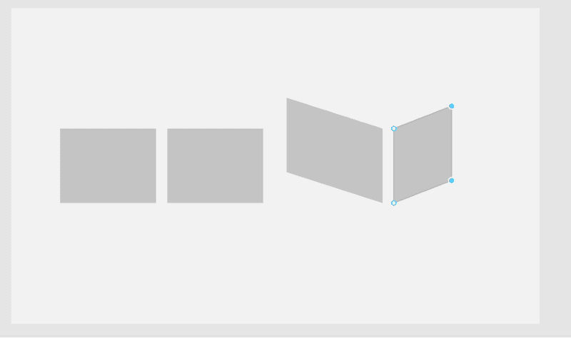

step one ?

在上面的插图中，我使用了编辑对象工具来调整矩形的大小，并制作出一个类似菱形的形状。我做的下一件事是重新创建相同的矩形，并把它们向后转，以构成盒子的第三和第四边。

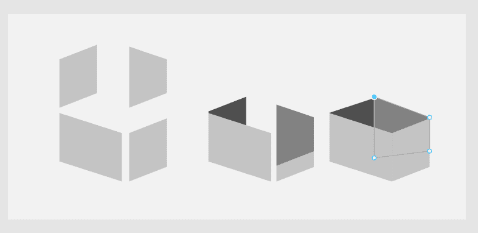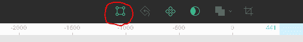

edit object tool

### **第二步:添加阴影**

我添加了颜色来区分盒子的每一面，同时也给出了如何应用阴影、对比度和渐变填充的想法。这为盒子的各个侧面可以独立工作打下了基础。我还创造了盒盖。

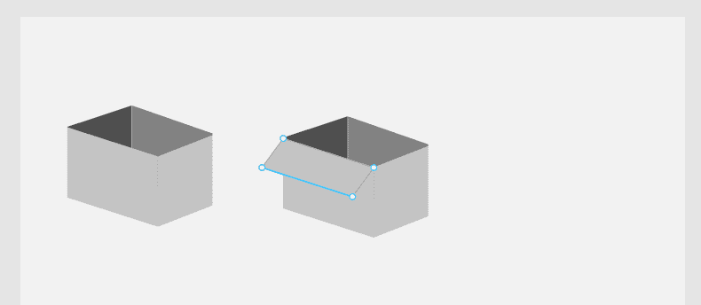

creating covers

### **第三步:让它更真实**

我给可见的盒盖(f1 & f2)添加了渐变填充，让它看起来更加真实和平整。注意 f2 上渐变分层的方式？我对 f1 做了同样的操作，然后调整渐变填充的程度以匹配盒子上的光线方向。

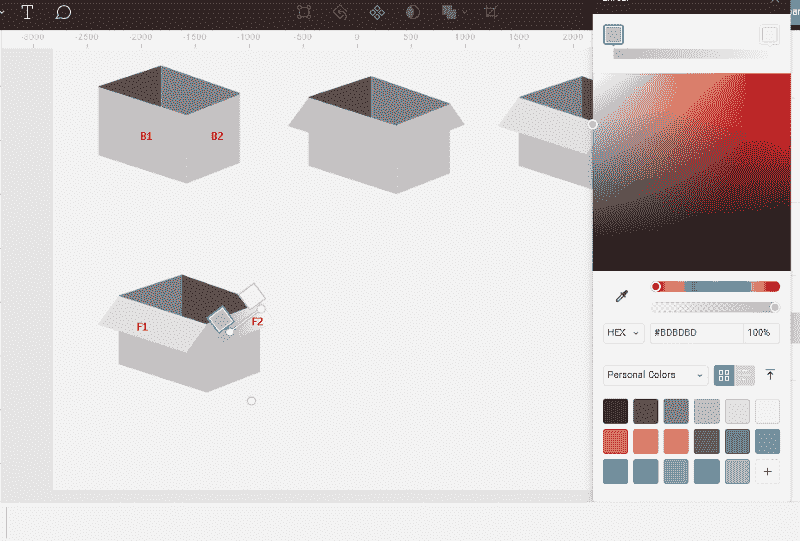

添加渐变后，我添加了阴影。当光线落在物体上时，相对于光线和物体的方向会自动形成阴影。

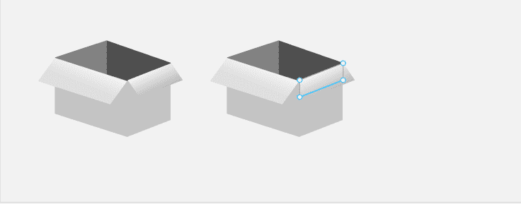

creating shadow layer by copying existing layer and editing it

注意:上面突出显示的层实际上在可见的下面。这就是将被调整大小以形成阴影的部分。

### **步骤 4:调整盖子**

为了添加阴影，我简单地复制了 f1 并粘贴在同一个图层上。然后，我选择 f1 的原始/初始副本(在新复制的“f1”下方)，单击编辑对象工具，并调整其大小，使其在“f1 副本”下方突出一点。这样做只是为了完美地创造阴影效果。默认的 Figma 阴影效果特性不会给我在图片中创建棕色框的灵活性。

所以我给它加了一个深色，模糊值为 20。您可能还会注意到，原始 f1 不像其他层那样清晰。模糊它给它很酷的现实阴影效果，并减少了黑色的饱和度。然后我对 f2 重复了同样的过程。

在 Figma 中，您可以使用 ctrl + alt + c 复制样式/效果，并在您想要应用类似效果或样式的图层上使用 ctrl + alt + v，轻松地将样式/效果从一个图层复制并粘贴到另一个图层。

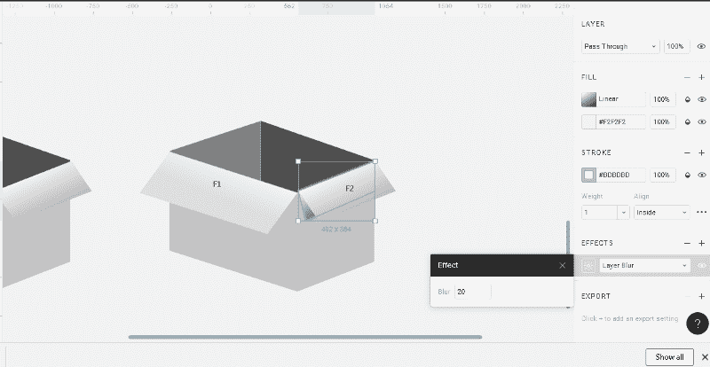

### 第五步:处理尸体

现在，我们已经完成了纸盒盒盖，让我们来看看盒体。我们希望反射反射在它上面的光线和阴影，使盒子具有对比鲜明和逼真的外观。

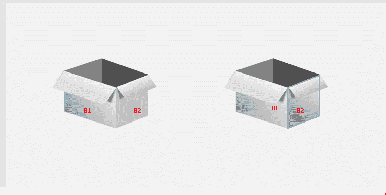

First image: B1 with gradient applied. Second image : B1 and B2 with gradient applied

我们所需要的 b1 和 b2 是渐变填充，如上图所示。

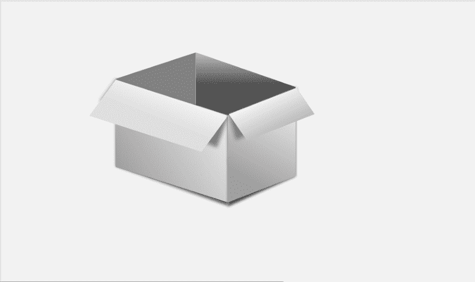

b1 and b2

你注意到这个盒子开始看起来更真实了吗？当一个渐变被添加到 b1 而没有被添加到 b2 时，你能发现区别吗？或者两边都用渐变填充的时候？

我们继续吧。

### **第六步:室内的挑战**

在盒子内部工作(b3 和 b4)有点挑战性。我不得不暂停几分钟，研究内部不同角落的阴影和饱和度，然后想办法复制它——同时仍然使用阴影和渐变。

用和以前一样的方法，我在 b4 上用更深的颜色应用了一层渐变填充——因为它是盒子最暗的部分——以达到我想要的饱和度。请参见下图:

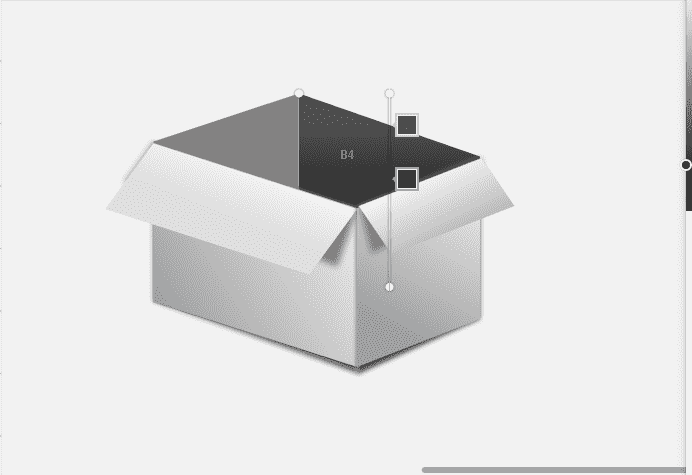

注意到渐变是垂直排列的吗？渐变线条上的一个颜色框靠近另一个。这个想法是让阴影看起来像是从盒子里面长出来的。虽然我们看不到盒子的内部，但我们知道随着盒子越来越深，光线会减少，这使得最里面的部分自动变暗。

### 最后一部分:盒子下面的阴影

在这里，我们将采取我在上面使用的相同的想法来为上面的盒子盖创建阴影(复制层，调整大小，并应用一些深色和效果)，并重复它。虽然我已经在上面的图片中应用了它，下面的是解决方法？

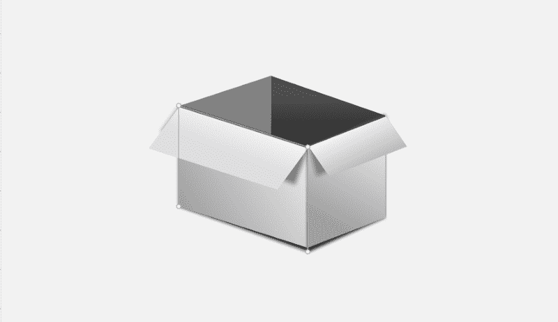

resizing the original b1 layer, extending the height towards the base and adding a darker gradient

我额外复制了 b1 和 b2，选择了原始图层。然后，我把它向下拖了一点，添加了一个更深的颜色，模糊了一点，还调整了它的大小，以获得透视视图。在艺术和建筑中创造真实的图像是关于透视的。

现在我们已经创建了一个逼真的 3D 盒子——它并不完美，但足够逼真。☺️

our realistic 3d carton box

### 最终调整

在这个阶段，我停下来比较我所做的和我从网上得到的原始棕色盒子。我并不满意，所以我决定进一步尝试，让这个盒子在高对比度下看起来非常真实。

那我是怎么做到的呢？

我创建了 b3 和 b4 的额外副本，并在它们的原始副本上应用了渐变图层(下图中面向我们的暗部)。

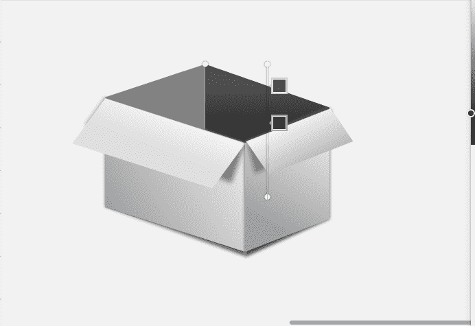

applying gradient to b4 to increase contrast

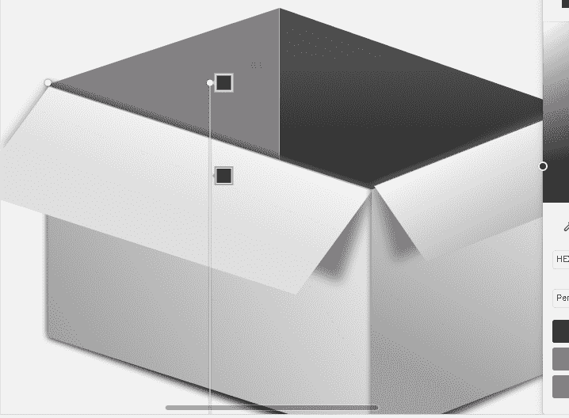

仔细观察，你会注意到 b1 和 b2 的边缘看起来确实有自己的阴影分别朝向 b4 和 b3。这是因为光线从侧面照射到它们身上，将它们的阴影投射到最近的可用层或对象上。

还记得我之前做的额外的 b1 和 b2 副本来形成盒子下面的阴影吗？首先，我调整了这两个图层(原始的 b1 和 b2)的大小，使其突出于复制的版本(b1 和 b2)之上。你可以把它们看作光线照射到的盒子的当前外侧。然后我添加了另一个更暗的渐变层。

下面是盒子现在的样子。

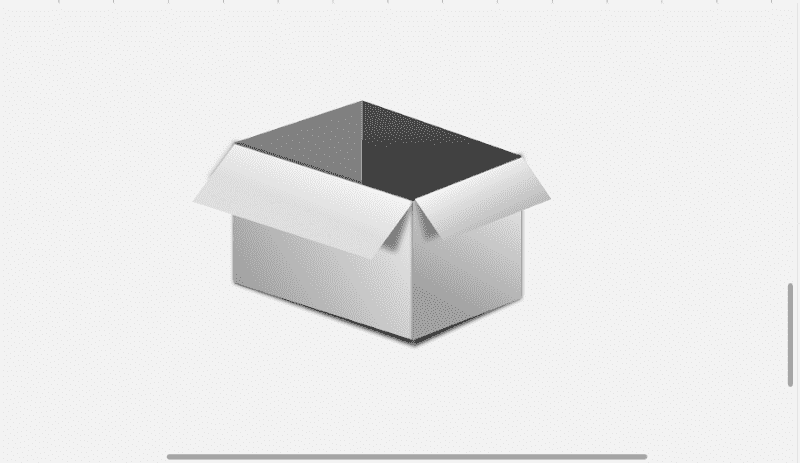

final version

注意:上面的图片与本文介绍部分的图片有些不同，因为我不得不创建另一个图片来解释我在第一个设计中所做的一些事情。真的是很快的一次？

为了获得更多的细节和理解我所做的一切，这里的****是我创建的原始版本和示例版本的链接。****

****感谢阅读！****

****请随时在 twitter 上联系我们****