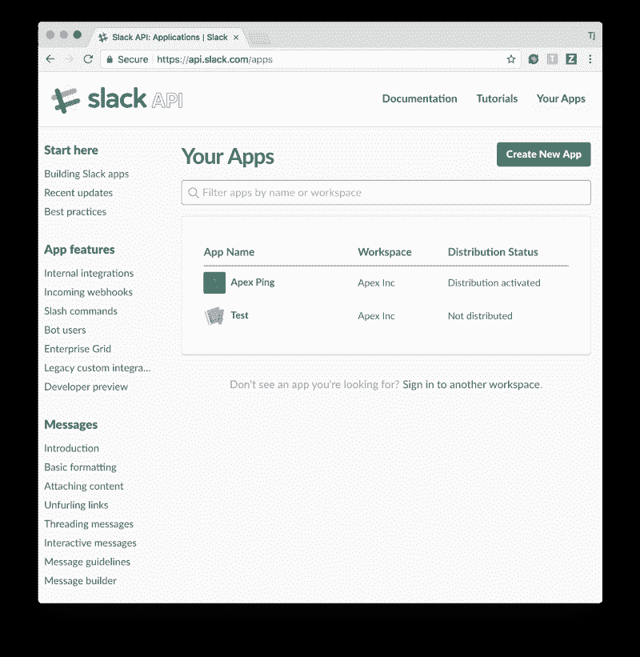
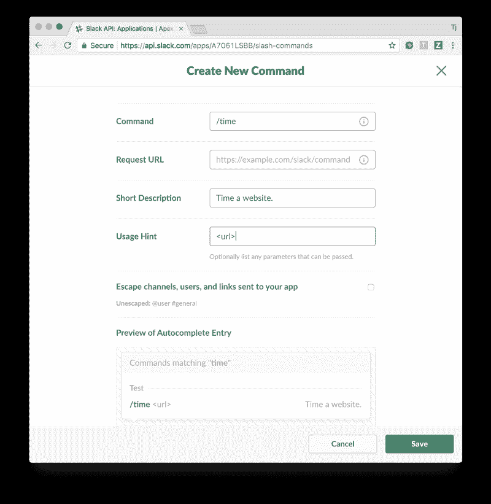
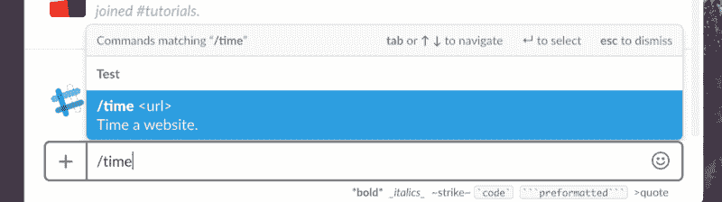
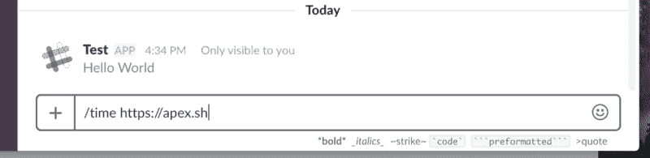

# 使用 Go & Up 在几分钟内创建无服务器 Slack 命令

> 原文：<https://www.freecodecamp.org/news/creating-serverless-slack-commands-in-minutes-with-up-f04ce0cfd52c/>

作者 TJ·霍洛韦丘克

# 使用 Go & Up 在几分钟内创建无服务器 Slack 命令


这篇文章介绍了用 Golang 编写的无服务器 Slack 命令的创建过程，并在几秒钟内通过 [Up](https://github.com/apex/up) 部署到 AWS Lambda。

您将创建一个`/time <url>`命令，用于检查网站需要多长时间做出响应。Up 使用自己的 AWS 账户。您可以免费托管大量定制应用，同时仍可利用 AWS 免费层(100 万次请求/m)。</url>

如果您是新手，也可以查看一下[安装说明](https://up.docs.apex.sh/)。

### 注册松弛命令

第一步是创建一个 Slack 应用程序，允许你注册命令等等。



创建完成后，点击左侧菜单中的“斜杠命令”,注册`/time`命令。你需要让这个页面打开一分钟，因为我们需要一个**请求 URL** ，这样 Slack 就知道向哪里发送请求。



#### 创建时差命令

在您的项目目录中创建一个名为`up.json`的文件。确保将`PROFILE`替换为您的 AWS 配置文件名称([阅读更多信息](https://apex.github.io/up/#aws_credentials))。

```
{  "name": "slack-cmd-test",  "profile": "PROFILE"}
```

现在我们需要一个小的 HTTP 服务器来处理 Slack 命令发布请求。使用以下 net/http 服务器创建一个`main.go`文件。

用`up`部署。

> **注意**:第一次部署可能需要大约 60 秒来设置资源。


现在您需要获取 URL 并将其粘贴到 Slack 命令页面中，这样 Slack 就知道将请求发送到哪里。使用以下命令将命令的 URL 复制到剪贴板:

```
$ up url -cCopied to the clipboard!
```

将它粘贴到**请求 URL** 字段中，然后就可以进行测试运行了:



运气好的话，你会看到一个 Hello World 响应！



#### 执行请求

Slack 发送一个带有表单输入的 POST 请求，也称为`application/x-www-form-urlencoded`(一种可悲的 mime 类型，变成了标准类型)。

要访问表单值，请使用 ParseForm()方法解析表单。在这种情况下，我们只需要来自 r.Form 的“文本”字段，即解析后的表单。

现在请求部分已经完成，导入`time`包并用`time.Now()`和`time.Since()`包装请求以记录请求持续时间。

使用`up`再次部署，部署完成后，您就可以测试真实版本了:


两个文件和几个命令之后，您就完成了！根据需要重复执行任意多的松弛命令。

### 本地测试

Up 的优势之一是部署传统的“普通”HTTP 服务器。这意味着在你的机器上测试时没有什么新东西要学，像往常一样开发应用程序。

下面是一个通过`curl`测试的应用示例:

```
$ PORT=3000 go run main.go$ curl -d 'text=https://apex.sh' http://localhost:3000/
```

```
https://apex.sh took 19.33542m
```

希望这对你有帮助！查看[文档](https://apex.github.io/up/)获取更多帮助，关注[推特](https://twitter.com/tjholowaychuk)获取更新和各种软件评论。