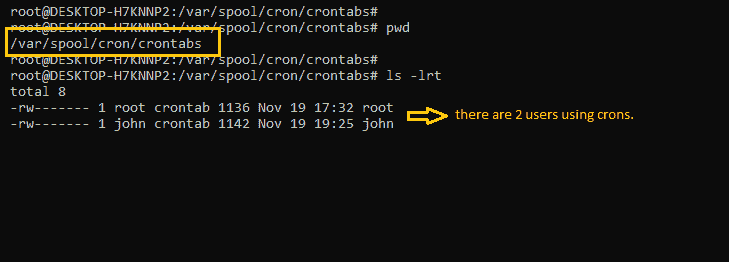
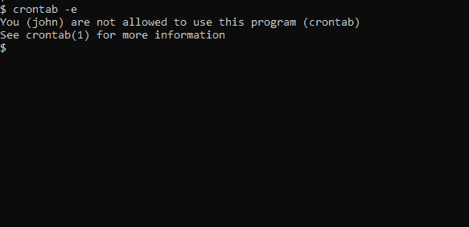
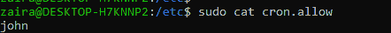
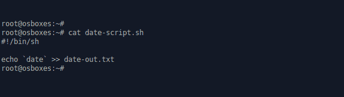
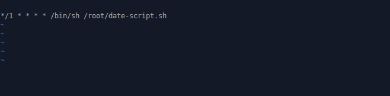
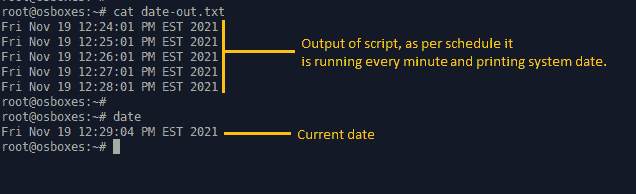
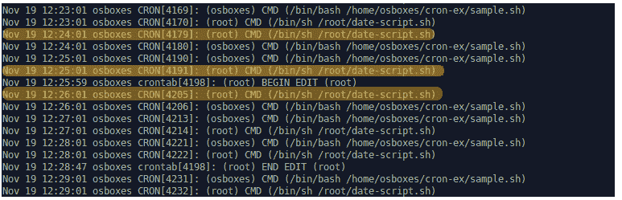

# 如何在 Linux 中用 cron 作业自动化任务

> 原文：<https://www.freecodecamp.org/news/cron-jobs-in-linux/>

如果您在 IT 部门工作，您可能需要安排各种重复的任务作为自动化流程的一部分。

例如，您可以安排特定的作业在一天中的特定时间定期执行。这有助于执行每日备份、每月日志归档、每周文件删除以创建空间等等。

如果您使用 Linux 作为您的操作系统，您将使用一个叫做 cron 的作业来实现这一点。

## 什么是克朗？

Cron 是存在于类 Unix 系统中的作业调度实用程序。crond 守护进程支持 cron 功能，并在后台运行。cron 读取 **crontab** (cron 表)来运行预定义的脚本。

通过使用特定的语法，您可以配置 cron 作业来安排脚本或其他命令自动运行。

对于个人用户，cron 服务检查以下文件:****/var/spool/cron**/crontabs**



Contents of /var/spool/cron/crontabs

### Linux 中有哪些 cron 作业？

通过 crons 调度的任何任务都称为 cron 作业。Cron 作业帮助我们自动化日常任务，无论是每小时、每天、每月还是每年。

现在，让我们看看 cron 作业是如何工作的。

## 如何控制对 crons 的访问

为了使用 cron 作业，管理员需要允许在“/etc/cron.allow”文件中为用户添加 cron 作业。

如果你得到这样的提示，说明你没有使用 cron 的权限。



Cron job addition denied for user John.

要允许 John 使用 crons，请在“/etc/cron.allow”中包含他的名字。这将允许 John 创建和编辑 cron 作业。



Allowing John in file cron.allow

还可以通过在文件“/etc/cron.d/cron.deny”中输入用户名来拒绝用户访问 cron 作业。

## 如何在 Linux 中添加 cron 作业

首先，要使用 cron 作业，您需要检查 cron 服务的状态。如果没有安装 cron，可以通过包管理器轻松下载。只是用这个来检查:

```
# Check cron service on Linux system
sudo systemctl status cron.service
```

### Cron 作业语法

Crontabs 使用以下标志来添加和列出 cron 作业。

*   `****crontab -e****`:编辑 crontab 条目，以添加、删除或编辑 cron 作业。
*   `****crontab -l****`:列出当前用户的所有 cron 作业。
*   `**crontab -u username -l**` : 列出另一个用户的 crons。
*   `**crontab -u username -e**` : 编辑另一个用户的 crons。

当您列出 crons 时，您会看到类似这样的内容:

```
# Cron job example
* * * * * sh /path/to/script.sh
```

在上面的例子中，

*   * * * * *分别代表分钟小时日月工作日。

|  | 价值 | 描述 |
| --- | --- | --- |
| 分钟 | 0-59 | 命令将在特定的分钟执行。 |
| 小时 | 0-23 | 命令将在特定的时间执行。 |
| 天 | 1-31 | 命令会在每月的这几天执行。 |
| 月份 | 1-12 | 需要执行任务的月份。 |
| 平日 | 0-6 | 命令将在一周中的哪几天运行。这里，0 是星期天。 |

*   `sh`表示该脚本是一个 bash 脚本，应该从`/bin/bash`开始运行。
*   `/path/to/script.sh`指定脚本的路径。

下面是 cron 作业语法的摘要。

```
*   *   *   *   *  sh /path/to/script/script.sh
|   |   |   |   |              |
|   |   |   |   |      Command or Script to Execute        
|   |   |   |   |
|   |   |   |   |
|   |   |   |   |
|   |   |   | Day of the Week(0-6)
|   |   |   |
|   |   | Month of the Year(1-12)
|   |   |
|   | Day of the Month(1-31)  
|   |
| Hour(0-23)  
|
Min(0-59)
```

## Cron 工作示例

下面是一些调度 cron 作业的例子。

| 日程安排 | 预定值 |
| --- | --- |
| 5 0 * 8 * | 八月 00:05。 |
| 5 4 * * 6 | 周日凌晨 4 点 05 分。 |
| 0 22 * * 1-5 | 周一至周五每天 22:00。 |

如果你不能一下子掌握这一切，也没关系。您可以与 crontab 专家一起练习并生成 cron 计划。

### 如何设置 cron 作业

在这一节中，我们将看一个如何用 cron 作业调度一个简单脚本的例子。

1.  创建一个名为`date-script.sh`的脚本，它打印系统日期和时间，并将其附加到一个文件中。该脚本如下所示:



Script for printing date.

2.通过授予脚本执行权限，使其可执行。

```
chmod 775 date-script.sh
```

3.使用`crontab -e`在 crontab 中添加脚本。

在这里，我们安排它每分钟运行一次。



Adding a cron job in crontab every minute.

4.检查文件`date-out.txt`的输出。根据脚本，系统日期应该每分钟都打印到这个文件中。



Output of our cron job.

## 如何排除 crons 故障

Crons 确实很有帮助，但是它们可能并不总是像预期的那样工作。幸运的是，您可以使用一些有效的方法来解决这些问题。

1.  查看时间表。

首先，您可以尝试验证为 cron 设置的时间表。您可以使用上一节中看到的语法做到这一点。

2.检查 cron 日志。

首先，您需要检查 cron 是否已经在预定的时间运行。您可以从位于`var/log/cron`的 cron 日志中验证这一点。在某些发行版中，可以在`/var/log/syslog`找到日志

如果在正确的时间这些日志中有一个条目，这意味着 cron 已经按照您设置的时间表运行。

下面是我们 cron 作业示例的日志。注意显示时间戳的第一列。行尾还提到了脚本的路径。



Cron job logs.

**3。将 cron 输出重定向到一个文件。**

您可以将 cron 的输出重定向到一个文件，并检查该文件是否有任何可能的错误。

```
# Redirect cron output to a file
* * * * * sh /path/to/script.sh &> log_file.log
```

## 包扎

自动化任务，比如 cron 作业，减少了您需要做的重复性工作。它还能让机器自动修复，在没有人工干预的情况下全天候工作。

Linux 中的自动化严重依赖于 cron 作业，因此您绝对应该学习 cron 并使用它们进行实验。

谢谢你一直读到最后。随时欢迎反馈。

如果你觉得这篇文章有帮助，请与你的朋友分享。

我们在[推特](https://twitter.com/hira_zaira)上连线吧！