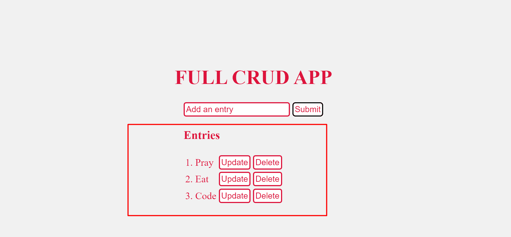
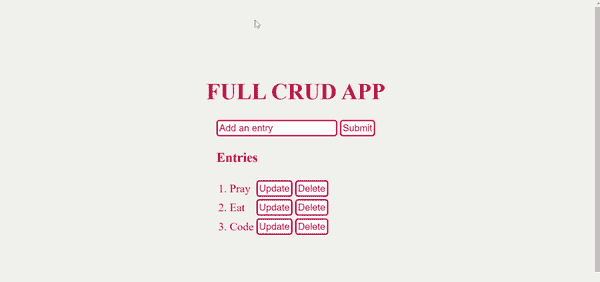

# CRUD 操作–什么是 CRUD？

> 原文：<https://www.freecodecamp.org/news/crud-operations-explained/>

尽管通常读作`/krʌd/`，CRUD 并不是一个词。这是一个缩写，代表创建、读取、更新、删除或销毁。

在本文中，我将向您展示 CRUD 的含义，以及各个术语的含义和作用。我还将向您展示创建、读取、更新和删除操作在现实世界中是如何工作的。

## 我们将涵盖的内容

*   [什么是 CRUD？](#whatiscrud)
*   [什么是`CREATE`操作，如何操作？](#whatisthecreateoperationandhowdoesitwork)
*   [什么是`READ`操作，如何操作？](#whatisthereadoperationandhowdoesitwork)
*   [什么是`UPDATE`操作，如何操作？](#whatisupdateoperationandhowdoesitwork)
*   [什么是`DELETE`操作，如何操作？](#whatisthedeleteoperationandhowdoesitwork)
*   [结论](#conclusion)

## 什么是 CRUD？

CRUD 指的是一个软件应用程序应该能够执行的四个基本操作——创建、读取、更新和删除。

在这样的应用中，用户必须能够**创建数据**，通过**读取**数据、**更新**或**编辑**数据、**删除**数据来访问 UI 中的数据。

在成熟的应用程序中，CRUD 应用程序由 3 部分组成:API(或服务器)、数据库和用户界面(UI)。

API 包含代码和方法，数据库存储并帮助用户检索信息，而用户界面帮助用户与应用程序交互。

你可以用任何一种编程语言制作一个 CRUD 应用程序。这个应用不一定是全栈的——你可以用客户端 JavaScript 做一个 CRUD 应用。

事实上，我将向您展示如何创建、读取、更新和删除操作的应用程序是用客户端 JavaScript 编写的。

CRUD 缩写中的每个字母都有一个对应的 HTTP 请求方法。

| **积垢操作** | **HTTP 请求方法** |
| --- | --- |
| 创造 | 邮政 |
| 阅读 | 得到 |
| 更新 | 放置或修补 |
| 删除 | 删除 |

## 什么是`CREATE`操作，它是如何工作的？

在 CRUD 中，创建操作顾名思义。这意味着创建一个条目。这个条目可以是帐户、用户信息、帖子或任务。

正如我前面指出的，实现`CREATE`操作的 HTTP 协议是 POST 方法。

在 SQL 数据库中，创建是为了`INSERT`。在像 MongoDB 这样的 NoSQL 数据库中，使用`insert()`方法创建。

在用户界面中，下面这张 GIF 展示了`CREATE`操作是如何工作的:

## 什么是`READ`操作，它是如何工作的？

`READ`操作意味着访问 UI 中的输入或条目。也就是看到了。同样，条目可以是任何内容，从用户信息到社交媒体帖子，等等。

这种访问可能意味着用户在创建或搜索条目之后就可以访问它们。执行搜索是为了让用户过滤掉他们不需要的条目。

实现`READ`操作的 HTTP 协议是 GET 方法。

在 SQL 数据库中，读取就是`SELECT`一个条目。在像 MongoDB 这样的 NoSQL 数据库中，您使用`find()`或`findById()`方法进行读取。

## 什么是`UPDATE`操作，它是如何工作的？

`UPDATE`是允许你修改已有数据的操作。也就是编辑数据。

与`READ`不同，`UPDATE`操作通过对现有数据进行更改来改变它。

PUT 和 PATCH 是 HTTP 协议，根据您的需要，您可以使用它们实现一个`UPDATE`操作。

当您想要更新整个条目时，应使用`PUT`,如果您不想修改整个条目，则使用 PATCH。

在 SQL 数据库中，使用`UPDATE`来更新条目。在像 MongoDB 这样的 NoSQL 数据库中，可以用`findByIdAndUpdate()`方法实现更新特性。

在用户界面中，下面这张 GIF 展示了`UPDATE`操作是如何工作的:

## 什么是`DELETE`操作，它是如何工作的？

删除就是从用户界面和数据库中删除一个条目。

`DELETE`是用于实现`DELETE`操作的 HTTP 协议。

在 SQL 数据库中，`DELETE`用于删除一个条目。在像 MongoDB 这样的 NoSQL 数据库中，可以用`findByIdAndDelete()`方法实现删除。

## 结论

本文向您展示了 CRUD 的含义以及 CRUD 应用程序中每个操作的作用。

您可以这样考虑 CRUD:

*   你创建一个社交账户并填写你的信息- `CREATE`
*   您可以访问您输入的信息，人们可以搜索到您–`READ`
*   你在谷歌找到了一份新工作，并将你的雇佣状态更改为“已雇佣”—`UPDATE`
*   你厌倦了社交媒体的毒性，删除了你的账号- `DELETE`

要了解如何制作自己的 CRUD 应用程序，请查看 freeCodeCamp 的 Joy Shaheb 的教程。

继续编码👋