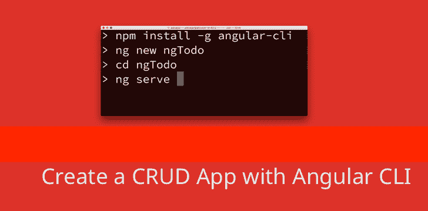
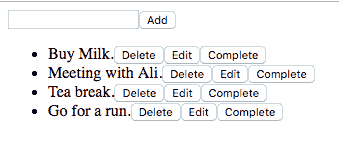
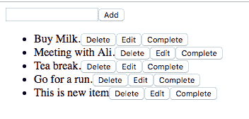
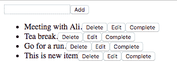
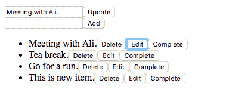
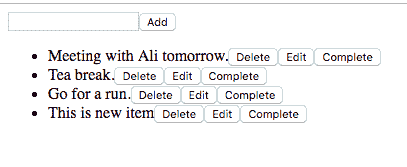
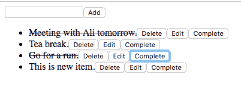

# 如何在 Angular 中执行 CRUD 操作

> 原文：<https://www.freecodecamp.org/news/crud-operations-in-angular-536e1c03a715/>

作者:扎法尔·萨利姆

# 如何在 Angular 中执行 CRUD 操作

正如你在我的前一篇博客中看到的，用普通的 JavaScript 进行 CRUD 操作是可能的。然而，选择普通 JavaScript 可能是一个艰难的决定，因为它在某些时候会变得更加混乱。此外，如我们所见，向动态添加的 DOM 元素添加事件侦听器是一件痛苦的事情。对于大规模项目来说，情况变得更加复杂。



一种解决方案是使用 Angular、React 等现代框架。这篇博文基于与上一个例子相同的概念，但是使用了 Angular。

这篇博客假设你已经在你的机器上安装了 Angular-cli。一旦你有了它，然后使用下面的命令创建一个新的应用程序。

```
ng new ngTodo
```

创建项目后，等待几秒钟，然后 cd 进入该项目。我们首先需要使用下面的命令创建一个新组件。

```
ng generate component todo
```

这将在 src/app 文件夹中创建一个名为 todo 的文件夹。该文件夹由 todo.component.ts、todo.component.ts、todo.component.css 和 todo.component.spec.ts 文件组成。

所有的 JavaScript 都将在。ts 文件。实际上，TypeScript 模板代码(这就是文件扩展名为。ts)转到 todo.component.css 文件，todo.component.css 和 todo.component.spec.ts 的样式用于测试。

首先，需要做的是将该组件添加到“app.component.html”文件中，如下所示:

```
<app-todo></app-todo>
```

现在，当您运行“ng serve”并在浏览器中加载应用程序时，todo 组件将被加载。

现在是时候转到 todo.component.ts 文件了。

应该有一些由 angular-cli 编写的样板代码。我们所有的代码都在 TodoComponent 类中。

```
import { Component, OnInit } from '@angular/core';
```

```
@Component({
```

```
 selector: 'app-todo',
```

```
 templateUrl: './todo.component.html',
```

```
 styleUrls: ['./todo.component.css']
```

```
})
```

```
export class TodoComponent implements OnInit {
```

```
 constructor() { }
```

```
 ngOnInit() { }
```

```
}
```

我们先来解释一下上面的样板代码。首先，我们从 Angular 核心导入组件装饰器和 OnInit 接口。下面是装饰者的定义。

> Decorator 将一个类标记为 Angular 组件，并允许我们设置配置元数据，以确定在运行时应该如何处理、实例化和使用组件。

然而

> 接口是一个生命周期挂钩，在 Angular 初始化了一个指令的所有数据绑定属性之后调用。定义一个`ngOnInit()`方法来处理任何额外的初始化任务。

然后我们导出 TodoComponent 类，使它可以在项目的其余部分导入。对于这个例子，我们只需要将这个组件导入到 *app.module.ts* 中来启动这个组件。

因为我们使用 angular-cli 创建了这个组件，所以这个部分已经被处理好了。如果查看 *app.module.ts* 文件，您将看到 TodoComponent 类被导入并添加到声明数组中。现在让我们添加一些代码。

就像我们之前的例子一样，给类添加一个 *mockData* 属性，如下所示。

```
import { Component, OnInit } from '@angular/core';
```

```
@Component({  selector: 'app-todo',  templateUrl: './todo.component.html',  styleUrls: ['./todo.component.css']})export class TodoComponent implements OnInit {
```

```
 // mockData array the includes list of objects with items  mockData: any = [    {      id: '1',      title: 'Buy Milk.',      done: false,      date: new Date()    }, {      id: '2',      title: 'Meeting with Ali.',      done: false,      date: new Date()    }, {      id: '3',      title: 'Tea break.',      done: false,      date: new Date()    }, {      id: '4',      title: 'Go for a run.',      done: false,      date: new Date()    }  ];
```

```
 constructor() { }
```

```
 ngOnInit() { }
```

```
}
```

如您所见，我们还向 *mockData* 添加了“any”类型。TypeScript 为 JavaScript 带来了严格的类型功能，但在这种情况下，这真的无关紧要。如果你把那部分去掉，应该还是没问题的。

让我们给这个类添加更多的属性，稍后会用到。

```
import { Component, OnInit } from '@angular/core';
```

```
@Component({  selector: 'app-todo',  templateUrl: './todo.component.html',  styleUrls: ['./todo.component.css']})export class TodoComponent implements OnInit {
```

```
 mockData: any = [    {      id: '1',      title: 'Buy Milk.',      done: false,      date: new Date()    }, {      id: '2',      title: 'Meeting with Ali.',      done: false,      date: new Date()    }, {      id: '3',      title: 'Tea break.',      done: false,      date: new Date()    }, {      id: '4',      title: 'Go for a run.',      done: false,      date: new Date()    }  ];
```

```
 // properties to show hide edit form, set updated value and id.  show: boolean = false;  value: string;  id: number;
```

```
 constructor() {}
```

```
 ngOnInit() { }
```

```
}
```

*show* 属性用于显示 editForm， *value* 属性用于设置编辑标题的值，而 *id* 用于分配当前编辑项的 id。我们稍后会看到这一点。

在进一步讨论之前，让我们添加一个将要使用的 html 模板。

```
<div class="sections">  <div class="edit-popup" *ngIf="show">    <input type="text" name="" class="edit-item" value="{{value}}" #item>    <button class="btn-update" (click)="update(item.value)">Update</button>  </div>
```

```
<input type="text" name="" class="item" #item>  <button class="btn-add-item" (click)="create(item.value)">Add</button>
```

```
<ul>    <li *ngFor="let item of mockData">      <span [ngClass]="{'done': item.done}">{{item.title}}</span>      <button (click)="remove(item.id)">Delete</button>      <button (click)="edit(item.id, item.title)">Edit</button>      <button (click)="setTaskComplete(item.id)">Complete</button>    </li>  </ul></div>
```

这就是一堆不同之处。首先值得注意的是“编辑-弹出”。它有一个 **ngIf* 条件*指令*，根据“show”的值显示或隐藏这段 html 代码，该值为真或假。这是来自我们之前设置的 TodoComponent 的属性。

然后只需在输入文本字段中使用{{}}大括号输入值(标题)。最后添加一个 click 事件，该事件将调用 update 函数并将输入字段的值作为参数传递。

然后是显示所有项目的 ul 列表。如您所见，li 元素有 **ngFor* ，这是一个*中继器指令*。它循环通过 *mockData* ，在里面我们访问当前对象并显示其标题。

[ngClass]指令根据 done 的值和项目的属性将 done 类添加到 li 项目中。如果为真，则添加 *done* 类，该类将*线槽*放在 li 项上，以表示该任务已经完成。

它还有删除、编辑和完成按钮。它们中的每一个都有 click 事件，这些事件调用各自的函数并传递当前项目的 id。在 id 旁边的编辑函数中，标题也作为参数传递。

模板就这样了。让我们回到 TodoComponent。这里我们不需要任何渲染函数，而我们在普通的 JavaScript 中已经有了。 *mockData* 列表和 **ngFor* *指令*完成渲染工作。所以 CRUD 的 R 部分完成了。使用“ng serve”运行 angular 服务器，并在浏览器中加载应用程序。您应该会得到类似如下的结果:



现在让我们创建一个函数，它是 CRUD 中的 C。

```
import { Component, OnInit } from '@angular/core';
```

```
@Component({  selector: 'app-todo',  templateUrl: './todo.component.html',  styleUrls: ['./todo.component.css']})export class TodoComponent implements OnInit {
```

```
mockData: any = [    {      id: '1',      title: 'Buy Milk.',      done: false,      date: new Date()    }, {      id: '2',      title: 'Meeting with Ali.',      done: false,      date: new Date()    }, {      id: '3',      title: 'Tea break.',      done: false,      date: new Date()    }, {      id: '4',      title: 'Go for a run.',      done: false,      date: new Date()    }];
```

```
 show: boolean = false;  value: string;  id: number;
```

```
 constructor() {}
```

```
 // Create function to create new item.  create(item) {    this.mockData.push({      id: Date.now(),      title: item,      done: false,      date: new Date()    });  }
```

```
 ngOnInit() { }
```

```
}
```

当从模板中点击*添加*按钮时，创建功能被触发。这非常容易理解和遵循。首先，它使用 *this* 关键字访问 *mockData* 数组，并推送一个具有适当属性的新对象(如 id、title、done 和 date 等)。这就够了。



刷新你的浏览器，输入“这是一个新项目”,然后点击“添加”按钮——你会得到与上面类似的结果。

现在让我们继续讨论作为 CRUD 的 D 部分的*移除/删除*函数。

```
import { Component, OnInit } from '@angular/core';
```

```
@Component({  selector: 'app-todo',  templateUrl: './todo.component.html',  styleUrls: ['./todo.component.css']})export class TodoComponent implements OnInit {
```

```
 mockData: any = [    {      id: '1',      title: 'Buy Milk.',      done: false,      date: new Date()    }, {      id: '2',      title: 'Meeting with Ali.',      done: false,      date: new Date()    }, {      id: '3',      title: 'Tea break.',      done: false,      date: new Date()    }, {      id: '4',      title: 'Go for a run.',      done: false,      date: new Date()    }  ];
```

```
 show: boolean = false;  value: string;  id: number;
```

```
 constructor() {}
```

```
 create(item) {    this.mockData.push({      id: Date.now(),      title: item,      done: false,      date: new Date()    });  }
```

```
 // delete/remove function goes here.  remove(id) {    this.mockData = this.mockData.filter(item => {      if (item.id !== id) {        return item;      }    });  }
```

```
 ngOnInit() { }
```

```
}
```

同样非常简单。通过 *mockData* 进行过滤，并使用要删除的项目的 id 和来自 *mockData* 的当前元素的 id 来查找当前元素。并返回除匹配该元素的项目之外的所有项目。

刷新浏览器并从列表中删除第一个项目。它应该从屏幕上删除，如下所示:



对于 update，同样是与普通 JavaScript 示例相同的[:编辑是两个步骤的一部分。首先显示编辑表单，然后更新项目。首先，让我们展示“编辑-弹出”的编辑表单:](https://medium.com/@zafarsaleem/crud-operations-using-vanilla-javascript-cd6ee2feff67)

```
import { Component, OnInit } from '@angular/core';
```

```
@Component({  selector: 'app-todo',  templateUrl: './todo.component.html',  styleUrls: ['./todo.component.css']})export class TodoComponent implements OnInit {
```

```
 mockData: any = [    {      id: '1',      title: 'Buy Milk.',      done: false,      date: new Date()    }, {      id: '2',      title: 'Meeting with Ali.',      done: false,      date: new Date()    }, {      id: '3',      title: 'Tea break.',      done: false,      date: new Date()    }, {      id: '4',      title: 'Go for a run.',      done: false,      date: new Date()    }  ];
```

```
 show: boolean = false;  value: string;  id: number;
```

```
 constructor() {}
```

```
 create(item) {    this.mockData.push({      id: Date.now(),      title: item,      done: false,      date: new Date()    });  }
```

```
 remove(id) {    this.mockData = this.mockData.filter(item => {      if (item.id !== id) {        return item;      }    });  }
```

```
 // this function does the same as renderEditForm in previous blog.  edit(id, title) {    this.show = true;    this.value = title;    this.id = id;  }
```

```
 ngOnInit() { }
```

```
}
```

上面的函数简单地设置了一些 *TodoComponent* 属性——也就是说，将 *this.show* 设置为 true 来显示表单。将 *this.value* 的值设置为要更新的项目的标题，并将 *this.id* 设置为项目的 id。然后可以在模板中访问所有这些属性，我们可以相应地使用它们。

现在，按下第一项的编辑按钮，您应该能够看到编辑表单出现在页面的顶部:



现在是时候编写实际执行更新操作的更新函数了——这是 CRUD 的 U 部分。

```
import { Component, OnInit } from '@angular/core';
```

```
@Component({  selector: 'app-todo',  templateUrl: './todo.component.html',  styleUrls: ['./todo.component.css']})export class TodoComponent implements OnInit {
```

```
 mockData: any = [    {      id: '1',      title: 'Buy Milk.',      done: false,      date: new Date()    }, {      id: '2',      title: 'Meeting with Ali.',      done: false,      date: new Date()    }, {      id: '3',      title: 'Tea break.',      done: false,      date: new Date()    }, {      id: '4',      title: 'Go for a run.',      done: false,      date: new Date()    }  ];
```

```
 show: boolean = false;  value: string;  id: number;
```

```
 constructor() {}
```

```
 create(item) {    this.mockData.push({      id: Date.now(),      title: item,      done: false,      date: new Date()    });  }
```

```
 remove(id) {    this.mockData = this.mockData.filter(item => {      if (item.id !== id) {        return item;      }    });  }
```

```
 edit(id, title) {    this.show = true;    this.value = title;    this.id = id;  }
```

```
 // function that performs update   update(title) {    this.mockData.map(item => {      if (item.id === this.id) {        item['title'] = title;      }    });
```

```
 this.show = false;  }
```

```
 ngOnInit() { }
```

```
}
```

该函数获取标题，即更新后的输入文本字段的值，作为参数。然后通过 *mockData* 进行映射，并根据其 id 进行检查以找到需要更新的项目。一旦找到，用编辑过的属性替换 title 属性，并将【T2 this . show】设置为 false 以隐藏编辑表单。

对于此部分，当您按下更新按钮时，在输入更新的标题后，您应该会看到更新的标题，如下所示:



最后一部分是将任务标记为完成，函数如下。

```
import { Component, OnInit } from '@angular/core';
```

```
@Component({  selector: 'app-todo',  templateUrl: './todo.component.html',  styleUrls: ['./todo.component.css']})export class TodoComponent implements OnInit {
```

```
 mockData: any = [    {      id: '1',      title: 'Buy Milk.',      done: false,      date: new Date()    }, {      id: '2',      title: 'Meeting with Ali.',      done: false,      date: new Date()    }, {      id: '3',      title: 'Tea break.',      done: false,      date: new Date()    }, {      id: '4',      title: 'Go for a run.',      done: false,      date: new Date()    }  ];
```

```
 show: boolean = false;  value: string;  id: number;
```

```
 constructor() {}
```

```
 create(item) {    this.mockData.push({      id: Date.now(),      title: item,      done: false,      date: new Date()    });  }
```

```
 remove(id) {    this.mockData = this.mockData.filter(item => {      if (item.id !== id) {        return item;      }    });  }
```

```
 edit(id, title) {    this.show = true;    this.value = title;    this.id = id;  }
```

```
 update(title) {    this.mockData.map(item => {      if (item.id === this.id) {        item['title'] = title;      }    });
```

```
 this.show = false;  }
```

```
 setTaskComplete(id) {    this.mockData.map(item => {      if (item.id === id) {        item['done'] = true;      }    });  }
```

```
 ngOnInit() {  }
```

```
}
```

这做了几乎相同的事情:映射通过 *mockData* 并基于 id 找到要设置为 done 的项目，并将其 done 属性设置为 true。

最后，在下面的 todo.component.css 文件中添加一些 CSS。

```
.done {  text-decoration: line-through;}
```

上面的 CSS 向任何具有 done 类的元素添加了一条线，在本例中是已完成的任务。

之后，按几个完整的按钮，您应该会看到类似这样的内容:



您可以看到这个例子和上一个使用普通 JavaScript 的例子之间的区别。Angular 允许我们编写一种易于理解、维护和扩展的方法。这在大规模应用中是有益的。普通的 JavaScript 可以完成这项工作，但是一旦应用程序增长，就会变得非常复杂。

要获得本例中编写的所有代码，继续克隆下面的存储库。

[https://github.com/zafar-saleem/ngTodo](https://github.com/zafar-saleem/ngTodo)